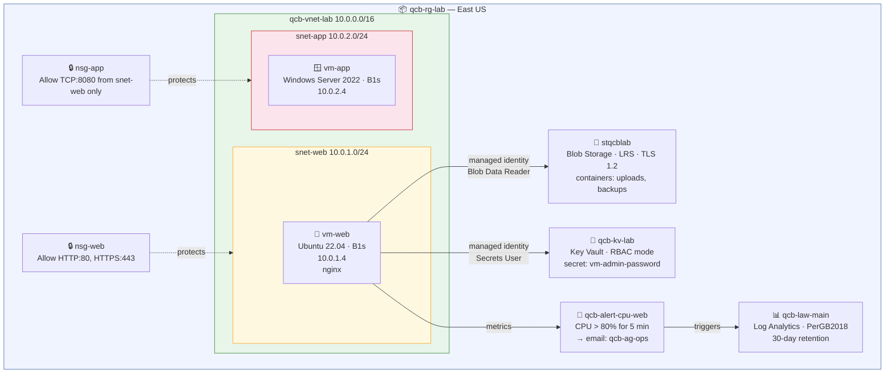

# Azure Cloud Infrastructure — AZ-104 Hands-On Study Project

> *Building real Azure infrastructure to close real knowledge gaps — documented so others can follow along.*

---

## What This Is

This project documents my hands-on journey through every domain of the **AZ-104: Microsoft Azure Administrator** exam. Rather than working through isolated exercises, I designed a connected infrastructure scenario and built it from scratch — so each phase builds on the last and produces something that actually works.

By the end, a single script (`scripts/deploy-all.sh`) rebuilds the entire environment in 15–20 minutes. A teardown script removes everything cleanly to stop costs. The whole thing runs on a free Azure account.

Everything is documented three ways — Azure Portal, Azure CLI, and PowerShell — so you can follow along regardless of how you prefer to work.

---

## The Scenario

The infrastructure is built for **QCB Technologies** — a fictional small IT managed services company. The scenario is made up, but the Azure resources, commands, and architectural decisions are all real and directly applicable to production environments.

Using a scenario makes the project more coherent than a list of disconnected exercises. It gives every decision a reason: *why no public IPs on the VMs? Because in an MSP environment, VMs sit behind a load balancer and should never be directly internet-exposed.*

---

## A Note on How This Was Built

The architectural decisions, the scenario design, and the understanding behind each phase are mine. The individual Azure CLI and PowerShell commands come mostly from Microsoft Learn and official documentation — I worked through them hands-on and documented what I found, including the gotchas.

The automation scripts (`deploy-all.sh`, `destroy-all.sh`) were written with AI assistance. I understood what needed to happen in each phase, but orchestrating eight phases into a single idempotent script with correct dependency ordering is not something well covered by Microsoft's own documentation. AI helped bridge that gap. I reviewed, tested, and fixed the output — the scripts are verified working as of March 2026.

I think being honest about how you use tools is more useful to anyone reading this than pretending everything was written from scratch.

---

## What Gets Built

A connected Azure environment spanning all five AZ-104 exam domains:

| Phase | What Gets Built | AZ-104 Domain |
|-------|----------------|---------------|
| [00 — Prerequisites](docs/00-prerequisites.md) | Tooling, authentication, conventions | — |
| [01 — Resource Groups](docs/01-resource-groups.md) | `qcb-rg-lab` with tags | Identities & Governance |
| [02 — Networking](docs/02-networking.md) | VNet, two subnets, NSGs with inbound rules | Virtual Networking |
| [03 — Compute](docs/03-compute.md) | Linux VM (nginx) + Windows VM, no public IPs | Compute Resources |
| [04 — Storage](docs/04-storage.md) | Storage account, blob containers, TLS 1.2 | Storage |
| [05 — Identity](docs/05-identity.md) | Managed identity, RBAC role assignment | Identities & Governance |
| [06 — Key Vault](docs/06-keyvault.md) | Key Vault (RBAC mode), secrets, identity-based access | Monitor & Maintain |
| [07 — Monitoring](docs/07-monitoring.md) | Log Analytics, action group, CPU metric alert | Monitor & Maintain |
| [08 — Automation](docs/08-automation.md) | Deploy + teardown scripts, idempotency | All domains |

---

## AZ-104 Domain Coverage

The AZ-104 exam covers five domains. Here is what this project touches in each:

| Domain | Weight | Covered By |
|--------|--------|------------|
| Manage Azure Identities and Governance | 20–25% | Resource groups, tags, RBAC, managed identities |
| Implement and Manage Storage | 15–20% | Storage accounts, blob containers, identity-based access |
| Deploy and Manage Azure Compute Resources | 20–25% | VMs, NICs, no-public-IP pattern, run-command |
| Implement and Manage Virtual Networking | 15–20% | VNets, subnets, NSGs, stateful firewall rules |
| Monitor and Maintain Azure Resources | 10–15% | Key Vault, Log Analytics, Azure Monitor, metric alerts |

---

## Architecture



> No public IPs on any VM. All VM access is via `az vm run-command` through the Azure control plane. VMs communicate over private IPs only.

---

## Key Design Decisions

| Decision | Reasoning |
|----------|-----------|
| No public IPs on VMs | Enterprise pattern — VMs not directly internet-exposed. Eliminates both attack surface and hourly IP cost. Access via Azure control plane only. |
| RBAC on Key Vault | Microsoft's recommended model for new deployments. Consistent with how all other access is managed in this project. |
| Storage containers via `--auth-mode login` | Uses Entra ID identity rather than storage account keys — the secure, recommended approach. |
| Standard_B1s for both VMs | Cheapest burstable tier, covered by Azure free account (750 hrs/month each for Linux and Windows). |
| Standard_LRS storage | Three local copies — sufficient for a lab. Keeps costs at zero. |
| No load balancer | Out of scope for this lab. In a production design, a load balancer would hold the public IP and sit in front of `vm-web`. The NSG rules for 80/443 are already in place. |

---

## Running It Yourself

Everything in this project is free to run. All resources fall within Azure's free tier allowances, and the teardown script removes everything cleanly when you're done.

### Prerequisites

| Tool | Install |
|------|---------|
| Azure CLI | [docs.microsoft.com/cli/azure](https://docs.microsoft.com/en-us/cli/azure/install-azure-cli) |
| PowerShell 7+ | [aka.ms/powershell](https://aka.ms/powershell) |
| Az PowerShell module | `Install-Module -Name Az` |
| Git | [git-scm.com](https://git-scm.com) |

### Deploy

```bash
git clone <repo-url>
cd aca-project
chmod +x scripts/deploy-all.sh
./scripts/deploy-all.sh
```

Builds the full environment across all phases in 15–20 minutes.

### Teardown

```bash
chmod +x teardown/destroy-all.sh
./teardown/destroy-all.sh
```

Purges the Key Vault (bypassing 90-day soft-delete) and deletes the resource group. Everything gone in 3–5 minutes.

---

## Free Tier Coverage

Every resource in this project falls within Azure's free tier:

| Resource | Free Allowance |
|----------|----------------|
| vm-web — Linux B1s | ✅ 750 hrs/month |
| vm-app — Windows B1s | ✅ 750 hrs/month |
| OS disks — Standard HDD | ✅ 2 × 64 GB managed disks |
| stqcblab — Blob Hot LRS | ✅ First 5 GB/month |
| qcb-kv-lab — Key Vault | ✅ First 10,000 operations/month |
| qcb-law-main — Log Analytics | ✅ First 5 GB/day ingestion |
| Metric alert rules | ✅ First 10 rules free |
| VNet, NSGs, NICs | ✅ Always free |
| Public IPs | ✅ $0 — none created |

---

## Repository Structure

```
aca-project/
├── README.md
├── docs/
│   ├── 00-prerequisites.md
│   ├── 01-resource-groups.md
│   ├── 02-networking.md
│   ├── 03-compute.md
│   ├── 04-storage.md
│   ├── 05-identity.md
│   ├── 06-keyvault.md
│   ├── 07-monitoring.md
│   └── 08-automation.md
├── scripts/
│   └── deploy-all.sh
└── teardown/
    └── destroy-all.sh
```

---

➡️ **Start here:** [docs/00-prerequisites.md](docs/00-prerequisites.md)

---

*Part of my engineering portfolio. No real client data or credentials included.*
