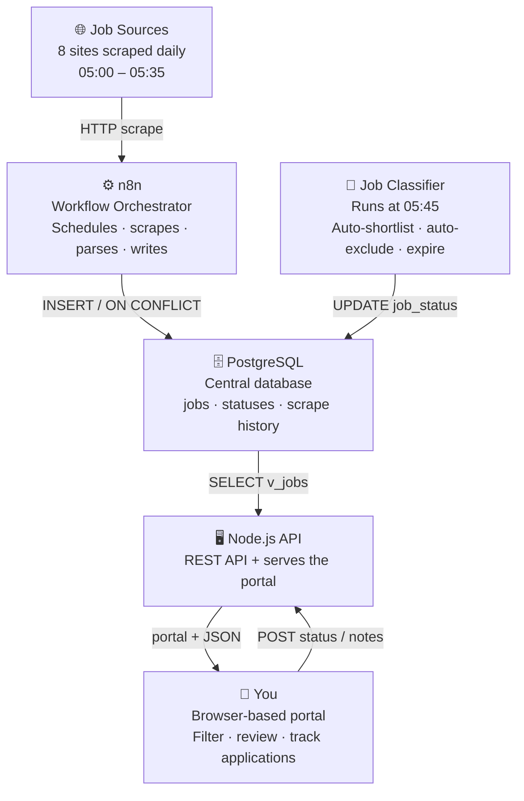

# Job Intelligence Pipeline

**A self-hosted, AI-assisted data pipeline that automates job hunting — built on homelab infrastructure by a sysadmin with no prior development experience.**

> Part of the [AI Projects](/ai-projects/README.md) portfolio series — documenting how AI can act as a co-engineer to help IT professionals build things they couldn't build alone.

---

## Introduction

Job hunting across countless boards, agencies, and duplicate listings is tedious and inefficient.

That frustration sparked a simple question: What if every job posting flowed into a single database, deduplicated, filtered for relevance, and tailored to me?

With a homelab already in place for self‑hosting and experimentation, and a long‑standing curiosity about AI‑assisted development (despite not being a developer), I decided to explore whether this idea was actually possible.

**The core questions were straightforward:**
- Could the entire process be automated?
- Could I build a self‑hosted system that pulls in job listings, detects duplicates, filters irrelevant roles, and tracks applications—without relying on paid cloud services?

This project is the result. Built over several days, it involved real problems, real fixes, and outcomes that genuinely surprised me.

---

## What It Does

Eight job sources are scraped automatically every morning. Every listing lands in a PostgreSQL database. A classifier runs afterwards and automatically marks irrelevant roles, flags expired listings, and shortlists jobs matching an IT infrastructure background. A browser-based portal lets you review everything, track applications, and add personal notes — from any device on the home network.



---

## Important Disclaimer

> ⚠️ **Web scraping and legality**
>
> This project involved automated retrieval of publicly accessible job listing data. I am not a lawyer and make no claim that web scraping is legal, appropriate, or permitted by any specific website. This project was built for personal, private, non-commercial use only and is **not exposed to the internet**. The names of all websites scraped have been deliberately omitted from this documentation. Anyone considering a similar project should independently review the terms of service of any site they interact with and seek appropriate legal advice.

---

## Stack at a Glance

| Service | Purpose |
|---|---|
| **Proxmox VE** | Hypervisor — runs the LXC container hosting everything |
| **Debian 12 LXC** | Lightweight isolated container — all Docker services live here |
| **Docker Compose** | Single file manages the entire stack |
| **n8n** | Workflow orchestrator — runs all scrapers and the classifier |
| **PostgreSQL 16** | Central database — jobs, statuses, scrape history |
| **Redis** | Queue backend for n8n |
| **Node.js 18** | Lightweight API server + portal |
| **Prometheus + Grafana** | Metrics and dashboards |
| **Portainer** | Docker management UI |
| **Gitea** | Self-hosted Git, mirrored to GitHub |

All containers run on a single Docker bridge network inside one LXC container on one physical server. **Zero cloud dependency. Zero ongoing cost.**

---

## Daily Schedule

```
05:00  Scraper 1   ─┐
05:05  Scraper 2    │
05:10  Scraper 3    │  Eight sources scraped
05:15  Scraper 4    │  staggered 5 min apart
05:20  Scraper 5    │
05:25  Scraper 6    │
05:30  Scraper 7    │
05:35  Scraper 8   ─┘
05:45  Classifier  ──  Auto-categorises all new jobs
```

---

## Documentation

| Doc | What it covers | Audience |
|---|---|---|
| [docs/infrastructure.md](docs/infrastructure.md) | Hardware, LXC container, Docker stack, all services | Technical |
| [docs/database.md](docs/database.md) | Schema, tables, view, useful queries | Technical |
| [docs/scrapers.md](docs/scrapers.md) | How scraping works, the 8 source types, lessons learned | Both |
| [docs/classifier.md](docs/classifier.md) | Auto-classification logic, keyword strategy, SQL explained | Both |
| [docs/portal.md](docs/portal.md) | The web portal, API endpoints, how to use it | Both |
| [docs/setup-guide.md](docs/setup-guide.md) | Full rebuild from scratch | Technical |
| [docs/troubleshooting.md](docs/troubleshooting.md) | Real problems encountered and how they were fixed | Technical |


---

## The Honest Answers to the Big Questions

### Can AI build a full-stack interactive system hosted in a homelab?

**Yes — but the human has to stay in charge.**

AI designed the architecture, wrote the code, explained every decision, and debugged real errors. What it couldn't do was know my specific environment, my goals, or what actually mattered to me. I provided the direction and context. AI provided the technical execution. Neither works well without the other.

The working model that emerged: **AI handles the implementation. You handle the vision, the decisions, and the judgement.**

### What are the real risks?

Four risks are worth being honest about:

| Risk | Reality |
|---|---|
| **Legal** | Terms of service vary. Review the terms of service of any site and seek appropriate legal advice. |
| **Scraper fragility** | HTML scrapers break when sites redesign. This is inherent, not solvable — it requires monitoring and maintenance. |
| **Homelab reliability** | A home server is not a data centre. Power cuts happen. For a job hunting tool this is acceptable. For anything critical it would not be. |
| **AI over-reliance** | AI produces confident-sounding code that can be subtly wrong. Understanding what you're running — not just copying it — is essential. |

---

## What I Learned

This project was deliberately chosen because it combined things I already knew (infrastructure, systems, networking) with things I didn't (application code, database design, workflow automation). The goal was to test whether AI could genuinely bridge that gap — and to learn the tools properly by using them on a real problem.

**What AI was good at:** Architecture design. Writing code. Explaining decisions. Debugging specific errors. Keeping the build systematic.

**What AI was not good at:** Knowing my environment. Handling edge cases in real data without being shown examples. Maintaining context across a multi-week project — that required deliberate effort on my part.

**The biggest lesson:** AI works best when you treat it like a highly capable colleague who needs clear direction and honest context. Vague inputs produce vague outputs. Specific, well-framed questions produce genuinely useful results.

---

*This project is part of a portfolio series exploring how IT engineers can use AI as a co-engineer to build infrastructure and tooling end-to-end. All website names have been omitted. The system runs privately on homelab hardware and is not accessible from the internet.*
