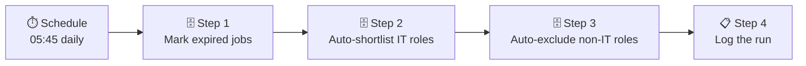

# Job Classifier

> ← [Back to README](../README.md)

This document covers the Job Classifier — the automated workflow that categorises every new job listing each morning after the scrapers finish.

**Non-technical summary:** After all the jobs are collected, a second process runs and sorts them automatically. Jobs with past closing dates are marked expired. Jobs matching your target skills are shortlisted. Everything else that's clearly not relevant gets marked as not suitable. Anything borderline stays as "new" for you to review yourself.

---

## What It Does

The classifier runs at 05:45 — 10 minutes after the last scraper finishes at 05:35. It processes every job currently marked as `new` and assigns one of three automated statuses:

| Result | Condition |
|---|---|
| `expired` | The job's closing date is in the past |
| `shortlisted` | Title or description matches IT-relevant keywords |
| `not_suitable` | Title or description matches non-IT role keywords |

**Jobs you have manually set to any status are never touched.** The classifier only processes `new` jobs — preserving every decision you've made yourself.

---

## Workflow



**Order matters.** Expiry runs first — a job that has already expired won't then be shortlisted even if it matches IT keywords, which would be misleading. Each step only processes jobs still marked `new` after the previous step.

---

## The Steps in Detail

### Step 1 — Mark Expired

Finds jobs with a past closing date that are still marked `new` and updates them to `expired`.

```sql
INSERT INTO job_status (job_id, status, updated_at)
SELECT j.id, 'expired', NOW()
FROM jobs j
LEFT JOIN job_status js ON js.job_id = j.id
WHERE
  j.end_date IS NOT NULL
  AND (
    CASE
      WHEN j.end_date ~ '^\d{4}-\d{2}-\d{2}$' THEN j.end_date::date
      WHEN j.end_date ~ '^\d{2} \w+ \d{4}$'   THEN TO_DATE(j.end_date, 'DD Month YYYY')
      ELSE NULL
    END
  ) < CURRENT_DATE
  AND (js.status IS NULL OR js.status = 'new')
ON CONFLICT (job_id) DO UPDATE
  SET status = 'expired', updated_at = NOW()
  WHERE job_status.status = 'new';
```

**Why the `CASE` statement?** This is a real-world data quality problem that no tutorial prepares you for. Different sources publish closing dates in different formats — one uses `2026-03-16` (ISO format), another uses `16 March 2026` (natural language). PostgreSQL cannot cast both with a single conversion call.

The `CASE` statement detects the format by regular expression and applies the correct conversion for each. Dates that match neither pattern return `NULL` and are safely skipped — better to leave a job as `new` than to crash the classifier on a malformed date.

This was one of the most instructive problems in the entire project. It appeared as a cryptic SQL error (`invalid input syntax for type date: "null"`) that had nothing obviously to do with date formats. AI helped diagnose it, explain it, and produce the fix.

---

### Step 2 — Auto-Shortlist

Matches jobs against IT-relevant keywords in the title and description combined. Only processes jobs still `new` after the expiry step.

```sql
INSERT INTO job_status (job_id, status, updated_at)
SELECT j.id, 'shortlisted', NOW()
FROM jobs j
LEFT JOIN job_status js ON js.job_id = j.id
WHERE
  (js.status IS NULL OR js.status = 'new')
  AND (
    LOWER(COALESCE(j.title, '') || ' ' || COALESCE(j.description, ''))
    ~* 'netapp|ontap|nas|san|storage|backup|migration|data centre|datacenter|
        azure|microsoft 365|sharepoint|entra|exchange|intune|active directory|
        windows server|vmware|esxi|proxmox|virtualisation|virtualization|hyper-v|
        linux|docker|kubernetes|devops|ansible|terraform|powershell|bash|
        scripting|automation|grafana|prometheus|monitoring|
        engineer|support|server|cloud|hybrid|network|firewall'
  )
ON CONFLICT (job_id) DO UPDATE
  SET status = 'shortlisted', updated_at = NOW()
  WHERE job_status.status = 'new';
```

The `~*` operator is PostgreSQL's case-insensitive regex match. Keywords are separated by `|` (OR). The match runs across title and description combined — a job that doesn't mention Azure in the title but describes Azure work in the description will still be caught.

---

### Step 3 — Auto-Exclude

Matches jobs against non-IT role keywords. Only processes jobs still `new` after the shortlist step — so IT roles are never accidentally excluded.

The exclusion list covers: medical roles, legal roles, trades, hospitality and retail, transport and logistics, education, property and financial advice.

---

### Step 4 — Log the Run

Records the classifier run in `scrape_log` for monitoring:

```sql
INSERT INTO scrape_log (source, started_at, finished_at, status)
VALUES ('job_classifier', NOW(), NOW(), 'success');
```

---

## Keyword Strategy

### IT Keywords (shortlist)

The shortlist keywords reflect an IT infrastructure background. They're grouped by category:

| Category | Examples |
|---|---|
| Storage | `netapp`, `ontap`, `nas`, `san`, `storage`, `backup` |
| Cloud & Microsoft | `azure`, `microsoft 365`, `sharepoint`, `entra`, `exchange`, `intune` |
| Identity & Windows | `active directory`, `windows server` |
| Virtualisation | `vmware`, `esxi`, `proxmox`, `virtualisation`, `hyper-v` |
| Containers & DevOps | `linux`, `docker`, `kubernetes`, `devops`, `ansible`, `terraform` |
| Scripting | `powershell`, `bash`, `scripting`, `automation` |
| Monitoring | `grafana`, `prometheus`, `monitoring` |
| General IT | `engineer`, `support`, `server`, `cloud`, `network`, `firewall` |

> **Note on broad terms:** `engineer`, `support`, and `server` will match most IT roles — but they'll also match some non-IT ones. They're kept in for coverage but are the first candidates to remove if too many irrelevant jobs are being shortlisted.

### Exclusion Keywords (not suitable)

The exclusion list is deliberately conservative. If a role is borderline, it's better to leave it as `new` for human review than to auto-exclude something legitimate.

`insurance` is a good example of a tricky keyword — it would catch IT roles at insurance companies. It's included but worth monitoring.

---

## Updating Keywords

Keywords are edited directly in the n8n workflow — find the shortlist or exclusion node and update the regex pattern. To add a keyword: append `|newkeyword` to the pattern.

After updating, run the classifier manually to re-process any jobs currently sitting as `new`:

1. Open the Job Classifier workflow in n8n
2. Click **Test workflow**
3. Check results:

```sql
SELECT status, COUNT(*) FROM job_status GROUP BY status ORDER BY status;
```

To re-classify everything from scratch (this wipes all manual decisions — use with care):

```sql
-- ⚠️ Deletes ALL status decisions including ones you set manually
DELETE FROM job_status;
```

Then run the classifier manually.

---

## Monitoring

```sql
-- Status breakdown after a classifier run
SELECT status, COUNT(*)
FROM job_status
GROUP BY status
ORDER BY status;

-- Recent classifier runs
SELECT started_at, status, error_msg
FROM scrape_log
WHERE source = 'job_classifier'
ORDER BY started_at DESC
LIMIT 10;

-- Jobs still sitting as new (should be low after classifier runs)
SELECT COUNT(*) FROM v_jobs WHERE status = 'new';
```

---

*← [Back to README](../README.md)*
