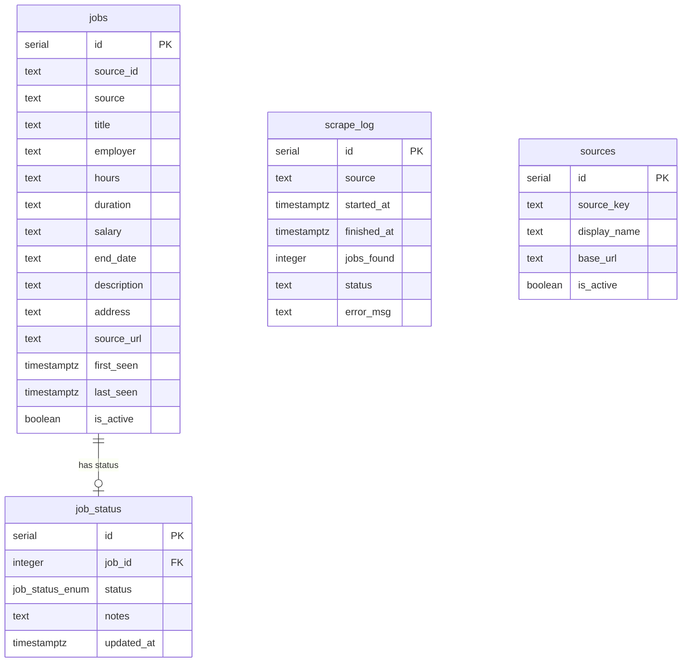

# Database

> ← [Back to README](../README.md)

This document covers the `jobhunt` database — how it's structured, why it's designed the way it is, and how to work with it.

**Non-technical summary:** The database is where everything lives. Every job scraped, every decision you make about a job, and every scraper run is recorded here. The design deliberately keeps scraped data and your personal decisions in separate places, so one can never accidentally overwrite the other.

---

## Two Databases, One Server

The single PostgreSQL container hosts two databases:

| Database | Owner | Purpose |
|---|---|---|
| `automation` | n8n | n8n's internal data — workflows, execution history. Do not modify. |
| `jobhunt` | This project | All job pipeline data — listings, statuses, scrape history. |

Everything in this document relates to `jobhunt`.

---

## Schema Overview



---

## Tables Explained

### `jobs` — The listings themselves

One row per unique job listing. Scrapers write here. The deduplication key is `(source_id, source)` — the same job from the same site can never be inserted twice.

Key columns:

| Column | What it stores |
|---|---|
| `source_id` | The ID from the source site (e.g. `218465`) |
| `source` | Which scraper wrote this row (e.g. `site_one`) |
| `source_url` | Direct link to the original listing |
| `end_date` | Closing date — stored as **text** because different sites use different date formats |
| `first_seen` | When the scraper first found this job |
| `last_seen` | Last time the scraper confirmed it still exists |

**Why is `end_date` stored as text?** Different sources publish dates in different formats — `2026-03-16`, `16 March 2026`, or nothing at all. Trying to force a consistent format during scraping causes failures when a source changes its format. Storing as text is safer. The classifier handles date comparison correctly using a format-detection pattern — see [classifier.md](classifier.md).

---

### `job_status` — Your personal decisions

One row per job, storing your decision about that listing. This table is kept **deliberately separate from `jobs`**.

| Column | What it stores |
|---|---|
| `job_id` | Links to `jobs.id` |
| `status` | One of: `new`, `shortlisted`, `applied`, `not_suitable`, `duplicate`, `expired` |
| `notes` | Your free-text notes — application references, interview dates, anything |
| `updated_at` | When you last changed the status or notes |

**Why a separate table?** This is the most important design decision in the schema. If status were a column on the `jobs` table, every scraper update (`ON CONFLICT DO UPDATE`) could accidentally overwrite a status you'd set manually. Keeping them in separate tables means scraper writes and your decisions can never interfere with each other. This was suggested by AI during the initial schema design — and it proved correct when the scrapers ran for the first time.

Status values:

| Status | Set by | Meaning |
|---|---|---|
| `new` | Default | Not yet reviewed |
| `shortlisted` | You or classifier | Worth applying for |
| `applied` | You | Application sent |
| `not_suitable` | You or classifier | Not relevant |
| `duplicate` | You | Same job on multiple sources |
| `expired` | Classifier | Past the closing date |

---

### `scrape_log` — Run history

One row per scraper run. Used to check whether scrapers are running successfully and how many jobs they're finding each day.

```sql
-- Check recent scraper activity
SELECT source, started_at, jobs_found, status
FROM scrape_log
ORDER BY started_at DESC
LIMIT 20;
```

---

### `sources` — Source registry

A reference table listing all scrape sources with their keys and display names. Used by the portal to show per-source labels.

---

## The `v_jobs` View

The portal never queries `jobs` and `job_status` separately. It queries `v_jobs` — a database view that joins both tables so every query returns a complete picture of each job including its current status.

```sql
-- What v_jobs does under the hood (simplified)
SELECT
    j.*,
    COALESCE(js.status, 'new') AS status,
    js.notes,
    js.updated_at
FROM jobs j
LEFT JOIN job_status js ON js.job_id = j.id
WHERE j.is_active = true
ORDER BY j.first_seen DESC;
```

If a job has no entry in `job_status` yet, `v_jobs` returns `new` as the default status via `COALESCE`. This means the API always gets a consistent result without needing to handle nulls.

---

## Useful Queries

```sql
-- Connect to the database
docker exec -it postgres psql -U automation -d jobhunt

-- Job counts by status
SELECT status, COUNT(*)
FROM v_jobs
GROUP BY status
ORDER BY status;

-- Jobs shortlisted but not yet applied
SELECT title, employer, salary, source, source_url
FROM v_jobs
WHERE status = 'shortlisted'
ORDER BY first_seen DESC;

-- Jobs from a specific source
SELECT title, employer, salary, status
FROM v_jobs
WHERE source = 'site_one'
ORDER BY first_seen DESC;

-- Recent scrape history
SELECT source, started_at, jobs_found, status
FROM scrape_log
ORDER BY started_at DESC
LIMIT 20;

-- Full text search across title and description
SELECT title, employer, source
FROM jobs
WHERE to_tsvector('english', COALESCE(title,'') || ' ' || COALESCE(description,''))
@@ plainto_tsquery('english', 'azure migration');

-- Check column names before writing a new query
SELECT column_name
FROM information_schema.columns
WHERE table_name = 'jobs'
ORDER BY ordinal_position;
```

---

## Rebuilding the Schema

The schema SQL is kept at `/opt/automation/jobhunt-api/schema.sql`. To apply it to a fresh database:

```bash
docker cp schema.sql postgres:/tmp/schema.sql
docker exec -it postgres psql -U automation -d jobhunt -f /tmp/schema.sql
```

After applying, verify:

```bash
# Should show 5 tables
docker exec -it postgres psql -U automation -d jobhunt -c "\dt"

# Should show 1 view (v_jobs)
docker exec -it postgres psql -U automation -d jobhunt -c "\dv"
```

---

## Known Quirks

**`end_date` has two formats.** Any query casting `end_date` to a date type must handle both `2026-03-16` and `16 March 2026`. The pattern to follow is in [classifier.md](classifier.md).

**`jobs_new` in `scrape_log` is not accurate.** Currently `jobs_new` is set equal to `jobs_found` on every run. It doesn't yet track the true delta (new rows inserted vs rows that already existed). A known limitation for a future update.

---

*← [Back to README](../README.md)*
