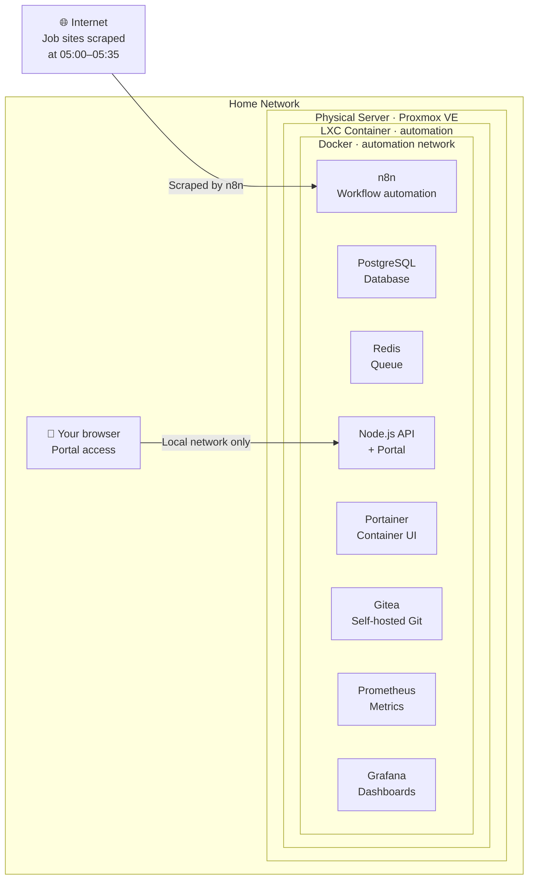
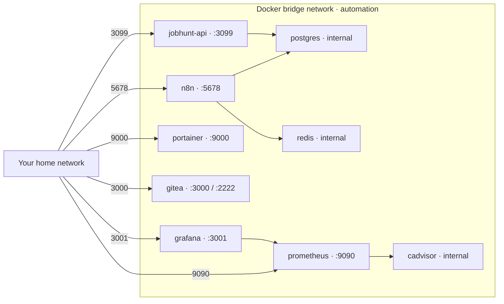

# Infrastructure

> ← [Back to README](../README.md)

This document covers the physical hardware, the LXC container, and every Docker service in the stack — what each one is, why it's there, and how it's configured.

If you're non-technical, the short version is: **everything runs on a single home server, inside a lightweight isolated environment, with no cloud services involved.**

---

## The Big Picture



Everything that runs, runs on the left side of that diagram. Nothing is exposed to the internet. The browser on the right is you, on your home network, accessing the portal.

---

## Physical Hardware

### Primary Server

| Property | Value |
|---|---|
| Hypervisor | Proxmox VE |
| CPU | Intel Core i5-7500T @ 2.70 GHz (4 cores) |
| RAM | 16 GB DDR4 |
| Primary disk | 238.5 GB NVMe |
| Backup disk | 111.8 GB SATA SSD |
| Sync disk | 238.5 GB USB (Syncthing) |

This is modest, older consumer hardware — not a purpose-built server. It handles this workload with resources to spare. The point is that you don't need expensive hardware to run a production-grade pipeline.

### Secondary Server

A second Proxmox node (Intel Celeron N2830, 8 GB RAM, 128 GB SSD) runs other containers unrelated to this project.

---

## The LXC Container

All Docker services for this project run inside a single **unprivileged Debian 12 LXC container** on the primary Proxmox host.

| Setting | Value |
|---|---|
| OS | Debian 12 (Bookworm) |
| vCPU | 2 |
| RAM | 3072 MiB |
| Swap | 1024 MiB |
| Disk | 40 GB |
| Features | `nesting=1`, `keyctl=1` |
| Unprivileged | Yes |

**Why LXC instead of a VM?**
LXC containers are lighter than full virtual machines — they share the host kernel rather than virtualising it. For a stack like this (web server, database, scheduler) that doesn't need its own kernel, LXC gives VM-like isolation at a fraction of the overhead.

**Why `nesting=1`?**
Running Docker inside an LXC container requires the `nesting` feature to be enabled in Proxmox. This allows containerisation within a container. Without it, Docker simply won't start. `keyctl=1` is needed for some Docker operations. Keeping the container unprivileged is a security best practice — even if something inside the container were compromised, it cannot escape to the host.

> 💡 **This was one of the first real problems encountered.** Proxmox's defaults don't enable nesting. The container started fine, Docker was installed successfully, but `docker compose up` silently failed. The fix — adding `nesting=1,keyctl=1` to the container features — is documented in [troubleshooting.md](troubleshooting.md).

---

## Docker Network

All containers communicate over a private bridge network named `automation`. Internal services are not reachable from outside this network. Only ports explicitly mapped in `docker-compose.yml` are accessible from the local network.



PostgreSQL and Redis are intentionally not exposed outside the Docker network — they are only reachable by other containers. This limits the attack surface even within the home network.

---

## Docker Services

### PostgreSQL
The primary database. Stores all job data and n8n's own operational data. Uses PostgreSQL 16 — production-grade from day one, supporting concurrent access from n8n and the API simultaneously.

**Why PostgreSQL and not SQLite?** SQLite would lock under concurrent writes from multiple scraper workflows running close together. PostgreSQL handles this correctly without any configuration.

Two databases on one instance:
- `automation` — owned by n8n for its internal data. Don't touch this.
- `jobhunt` — all the job pipeline data. This is the one we work with.

---

### Redis
In-memory queue used exclusively by n8n. When n8n runs in queue mode, Redis preserves workflow state — so if n8n restarts mid-workflow, the queue isn't lost.

---

### n8n
The workflow orchestrator. Runs all 8 scraper workflows and the Job Classifier on a fixed morning schedule. Also stores workflow definitions in the `automation` PostgreSQL database.

Key configuration:

| Variable | Purpose |
|---|---|
| `N8N_SECURE_COOKIE=false` | Required for HTTP access without TLS |
| `DB_TYPE=postgresdb` | Use PostgreSQL, not SQLite |
| `GENERIC_TIMEZONE=Europe/Isle_of_Man` | Schedules fire at the correct local time |
| `QUEUE_BULL_REDIS_HOST=redis` | Points n8n's queue at the Redis container |

---

### jobhunt-api
A lightweight Node.js server — 150 lines of code, one dependency (`pg` for PostgreSQL). Serves the portal HTML and handles all API calls for status updates and notes.

**Why Node.js and not n8n webhooks?** n8n is a workflow orchestrator, not a web server. Using it to serve a UI would be fragile and non-standard. A dedicated Node.js container is the correct separation of concerns — and it's minimal enough that there's almost nothing to maintain.

---

### Portainer
A web UI for managing Docker containers — viewing logs, restarting services, inspecting volumes — without needing a terminal.

---

### Gitea
Self-hosted Git server. All project files are version-controlled here first, then mirrored to GitHub. This keeps private working files (like workflow iterations) separate from what's published publicly.

---

### Prometheus + Grafana + cAdvisor
Metrics collection and dashboarding. cAdvisor exposes container resource metrics (CPU, memory, network), Prometheus scrapes them every 15 seconds, and Grafana visualises them.

> 📋 Grafana dashboards are planned but not yet configured. Prometheus is running and collecting data — the dashboards just need to be built.

---

## Secrets and Environment Variables

All secrets live in `/opt/automation/.env` on the server and are **never committed to Git**. A `.env.example` file with placeholder values is committed instead.

Variables stored in `.env`:

| Variable | Purpose |
|---|---|
| `POSTGRES_PASSWORD` | Database password |
| `JOBHUNT_DB_PASSWORD` | Password used by the API to connect |
| `N8N_BASIC_AUTH_PASSWORD` | n8n login password |
| `GRAFANA_ADMIN_PASSWORD` | Grafana admin password |
| `GITEA_ADMIN_PASSWORD` | Gitea admin password |
| `GENERIC_TIMEZONE` | Timezone for n8n schedules |

> ⚠️ **Early in the build, the database password was hardcoded directly in `docker-compose.yml`.** This is a common beginner mistake and a real security risk if the file is ever committed to a public repository. Moving all secrets to `.env` was done as a deliberate hardening step and is documented in [troubleshooting.md](troubleshooting.md).

---

## Directory Structure

```
/opt/automation/
├── docker-compose.yml     ← Single source of truth for the entire stack
├── .env                   ← Secrets (never committed to Git)
├── .env.example           ← Safe template (committed to Git)
├── postgres/              ← PostgreSQL data files
├── n8n/
│   └── data/              ← n8n workflows, credentials, settings
├── prometheus/
│   └── prometheus.yml     ← Metrics scrape config
├── gitea/                 ← Gitea repositories
├── grafana/               ← Grafana config
├── redis/                 ← Redis data
└── jobhunt-api/
    ├── server.js          ← API server
    ├── portal.html        ← Web portal UI
    ├── package.json       ← Node dependencies
    └── schema.sql         ← Database schema reference
```

---

## Useful Commands

```bash
# Enter the LXC from the Proxmox host
pct enter 103

# Check all containers are running
cd /opt/automation && docker compose ps

# View logs for a service
docker compose logs n8n --tail 30
docker compose logs jobhunt-api --tail 30

# Restart a single service
docker compose restart n8n

# Full stack restart
docker compose down && docker compose up -d

# Resource usage
docker stats
```

---

*← [Back to README](../README.md)*
