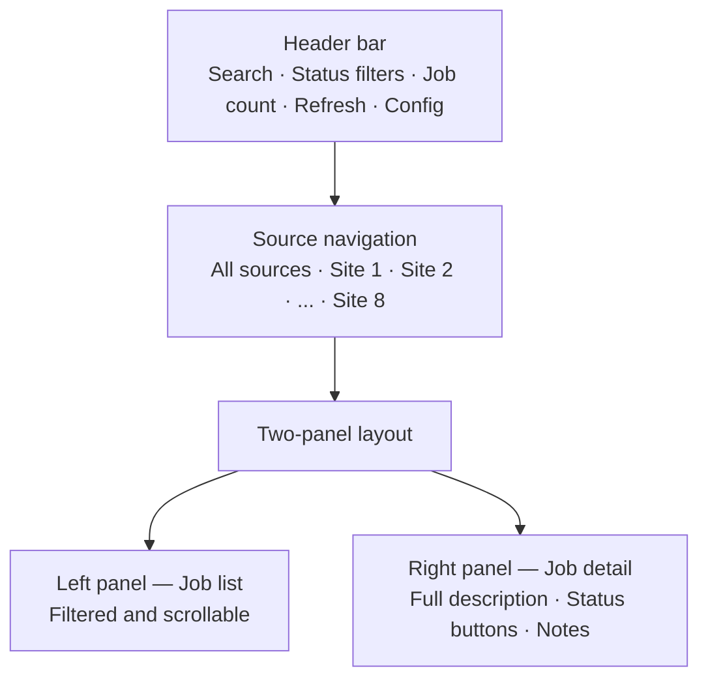

# Portal

> ← [Back to README](../README.md)

This document covers the web portal — the browser-based interface for browsing job listings, tracking applications, and adding personal notes.

**Non-technical summary:** The portal is a webpage you open in your browser on your home network. It shows all the scraped jobs in one place, lets you filter them, mark which ones you're interested in, and keep notes on each one. It looks like a proper web app but runs entirely on your own server at home.

---

## Overview

The portal is served by a lightweight Node.js container (`jobhunt-api`). It connects directly to the PostgreSQL database and provides a clean interface for everything you'd want to do with job listings once they've been scraped and classified.

**Access:** `http://YOUR_HOMELAB_IP:3099`

---

## Interface Layout



---

## Using the Portal

### Finding Jobs

- **Search bar** — filters by title, employer, description, and location in real time as you type
- **Status pills** — filter to: All / New / Shortlisted / Applied / Not Suitable / Duplicate / Expired
- **Source nav bar** — click any source to see only jobs from that site; click **All** to return to the full list
- **Job count** — shows how many jobs match the current filter combination
- **Refresh** — reloads jobs from the API without a full page reload

### Reviewing a Job

Click any job in the left panel to open its detail in the right panel. Fields shown:

| Field | Notes |
|---|---|
| Title | Job title |
| Employer | Company name |
| Source | Which site it came from |
| Hours | Full time / Part time |
| Duration | Permanent / Contract / etc. |
| Salary | As published by the source |
| End Date | Application closing date |
| Location | Address or region |
| Contact | Recruiter name if published |
| Description | Full job description |
| First Seen | When the scraper first found it |
| Last Seen | Last time the scraper confirmed it still exists |

### Setting a Status

Six status buttons appear at the bottom of the detail panel:

| Button | Colour | Meaning |
|---|---|---|
| New | Blue | Reset to unreviewed |
| Shortlisted | Purple | Worth applying |
| Applied | Green | Application sent |
| Not Suitable | Red | Not relevant |
| Duplicate | Grey | Duplicate listing |
| Expired | Amber | Past closing date |

Click once to save — no confirmation needed. Once you set a status manually, the classifier will never override it.

### Notes

A free-text notes field sits below the status buttons. Use it for anything useful — application reference numbers, interview dates, contact names, reasons for decisions. Click **Save** to store.

### Configuration

Click **⚙ Config** in the top right corner. Set the API Base URL to `http://YOUR_HOMELAB_IP:3099`. This is stored in the browser's local storage and persists across sessions on that device.

---

## Why It's Built This Way

**Why Node.js and not n8n webhooks?**
n8n is a workflow orchestrator, not a web server. Using n8n webhooks to serve a UI would mean the portal goes down every time n8n restarts or updates. A dedicated Node.js container gives the portal its own lifecycle — 150 lines of code, one dependency, starts in under a second.

**Why a single HTML file with no framework?**
No build step, no `node_modules` in the frontend, no toolchain to maintain. The portal can be opened directly in a browser during development or served by the API container in production. Easy to edit, easy to understand, nothing to install.

**Why serve HTML and API from the same container and port?**
Fewer moving parts. A separate container to serve one static file adds complexity with no benefit at this scale. If SSL and a proper reverse proxy are added later, that's the right time to revisit the architecture.

---

## API Reference

The Node.js server exposes a simple REST API. All responses are JSON.

| Method | Path | Description |
|---|---|---|
| `GET` | `/` | Serves the portal |
| `GET` | `/health` | Returns server status and total job count |
| `GET` | `/jobs` | Returns all active jobs from `v_jobs`, newest first |
| `GET` | `/jobs/:id` | Returns a single job by ID |
| `POST` | `/jobs/:id/status` | Sets job status |
| `POST` | `/jobs/:id/notes` | Saves personal notes |

### Examples

```bash
# Health check
curl http://YOUR_HOMELAB_IP:3099/health
# {"status":"ok","jobs":126}

# Set a status
curl -X POST http://YOUR_HOMELAB_IP:3099/jobs/42/status \
  -H "Content-Type: application/json" \
  -d '{"status":"applied"}'
# {"ok":true,"id":42,"status":"applied"}

# Save notes
curl -X POST http://YOUR_HOMELAB_IP:3099/jobs/42/notes \
  -H "Content-Type: application/json" \
  -d '{"notes":"Applied via website. Ref: APP-2026-001"}'
# {"ok":true}
```

Valid status values: `new`, `shortlisted`, `applied`, `not_suitable`, `duplicate`, `expired`

---

## Deploying Updates

Portal files are mounted from the host filesystem into the container. File changes take effect immediately — no container rebuild needed.

```bash
# Copy an updated file to the server (from your local machine)
scp portal.html root@YOUR_HOMELAB_IP:/opt/automation/jobhunt-api/portal.html

# portal.html changes are live immediately
# server.js changes require a restart
docker compose restart jobhunt-api
```

---

## Planned Enhancements

| Enhancement | Purpose |
|---|---|
| AI cover letter button | Per-job button → AI API → draft cover letter tailored to the job description |
| Daily digest view | New jobs since yesterday highlighted at the top |
| Expired pill in status filter | Show/hide expired jobs |
| Nginx + SSL | Clean URL (`https://jobs.home`) and HTTPS |
| Export to CSV | Download shortlisted jobs as a spreadsheet |

---

*← [Back to README](../README.md)*
