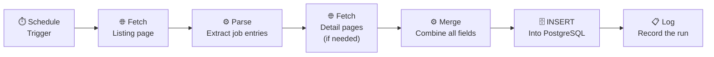

# Scrapers

> ← [Back to README](../README.md)

This document covers how the eight scraping workflows work — the general pattern, the different source types encountered, and the lessons learned building each one.

**Non-technical summary:** Every morning, eight automated workflows visit job listing websites, collect the job details, and save them to the database. Each website is built differently, so each workflow had to be adapted — but they all follow the same logical steps.

---

## How Scraping Works

A "scraper" in this context is an n8n workflow — a series of connected steps that run automatically on a schedule. Each scraper fetches one job source and stores the results in PostgreSQL.

They all follow the same logical pattern:



Some sources don't require detail pages — all the information is on the listing page. Some process jobs one at a time rather than in a batch. The variations are documented below.

---

## Schedule

Scrapers run staggered 5 minutes apart to avoid sending concurrent requests to multiple sites simultaneously.

| Time | Source type |
|---|---|
| 05:00 | Site 1 — HTML listing + detail pages |
| 05:05 | Site 2 — AJAX multi-page |
| 05:10 | Site 3 — HTML cards + detail pages |
| 05:15 | Site 4 — JSON API |
| 05:20 | Site 5 — HTML with detail page loop |
| 05:25 | Site 6 — Parallel listing pages |
| 05:30 | Site 7 — AJAX card fragments |
| 05:35 | Site 8 — Webflow CMS with JSON-LD |
| 05:45 | Job Classifier |

---

## Deduplication — Running Every Day Without Creating Duplicates

Every scraper uses the same INSERT pattern:

```sql
INSERT INTO jobs (source_id, source, title, ...)
VALUES (...)
ON CONFLICT (source_id, source)
DO UPDATE SET last_seen = NOW()
```

If a job is new → it gets inserted.
If a job already exists → only `last_seen` is updated.

Your status decisions and personal notes are never touched by this — they live in the separate `job_status` table. See [database.md](database.md) for why that separation matters.

---

## Anti-Blocking Headers

All HTTP requests include headers that identify as a real browser:

```
User-Agent: Mozilla/5.0 (X11; Linux x86_64) AppleWebKit/537.36 ...
Accept: text/html,application/xhtml+xml,application/xml;q=0.9,*/*;q=0.8
```

Some sources required additional headers — for example, AJAX endpoints often expect a `Referer` header matching the page that would normally trigger the request. One source required a rate-limiting delay between detail page requests to avoid being blocked.

These are standard respectful practices — staying within what a normal browser session would do.

---

## The Eight Source Types

Building eight scrapers taught one clear lesson: **every website is different**. The variety below isn't manufactured for the sake of this document — it's what was actually encountered.

---

### Type 1 — Server-rendered HTML (listing + detail pages)

The most common pattern. The listing page returns an HTML table or list of job entries. Each entry links to a detail page containing the full description, salary, duration, and closing date.

**The challenge:** Parsing HTML is fragile. You're extracting data from a document designed for humans to read, not machines to process. CSS selectors need to target specific elements reliably. If the site redesigns its layout, the parser breaks.

**The approach:** Target the most stable, specific elements available — IDs where they exist, unique class names where they don't. Avoid relying on element position (e.g. "the third `<div>` inside the second `<section>`") since those change.

**Fields typically captured:** title, employer, hours, duration, salary, end date, description, contact details.

---

### Type 2 — AJAX endpoint (multi-page)

The listing page is a shell — job cards are loaded dynamically by JavaScript after the page opens. A standard HTTP request to the listing URL returns an empty page.

**The challenge:** You need to find the actual data endpoint the browser is calling, not the page URL. This requires inspecting network traffic in browser DevTools.

**The approach:** Once the real endpoint is identified, it can be called directly. In this case the endpoint accepted page number parameters, so pages 1–10 were fetched and merged before processing.

**An interesting problem:** Page 1 data needed to be passed through to the step that fetched pages 2–10. n8n doesn't automatically carry data forward through parallel fetch steps — this required embedding page 1 results as a JSON string in the URL items passed to the next node.

---

### Type 3 — HTML cards with detail pages

Similar to Type 1 but using card-based layout (`<article>` or `<div>` blocks) rather than a table. Source IDs were embedded in URL paths rather than in data attributes.

**The approach:** Extract source IDs from URL path segments using regex (`/careers/12345/` → `12345`). Detail pages used consistently labelled HTML elements for key fields.

---

### Type 4 — JSON API (no HTML parsing)

The ideal case. One source used a commercial recruitment CRM platform that exposed a public API. A single HTTP request returned all jobs as clean, structured JSON.

**Why this is the best case:** No HTML parsing means no fragility. Field names are stable. The data is already structured. This scraper was the simplest to build and the most reliable in operation.

**The lesson:** Always check whether a site has an API or RSS feed before writing an HTML parser. Look for network requests in DevTools, check `robots.txt`, look for documentation. A few minutes of investigation can save hours of parser work.

---

### Type 5 — HTML with a detail page loop

Same HTML parsing approach as Types 1 and 3, but using n8n's Loop Over Items node to process each job individually rather than in batch. This was needed because the detail page fetch required per-job context that couldn't be passed cleanly in a batch.

**The n8n-specific challenge:** Loop Over Items requires a feedback connection — the last node in the loop body must connect back to the loop's input. Without this, the loop exits after the first item. This was one of the problems documented in [troubleshooting.md](troubleshooting.md).

---

### Type 6 — Two listing pages fetched in parallel

This source paginated results across two pages. Rather than fetching page 1, waiting for it to finish, then fetching page 2, both pages were fetched simultaneously and merged before parsing.

**Why parallel?** Two sequential HTTP requests take roughly twice as long as two parallel ones. At this scale it doesn't matter much — but it's the correct pattern.

**An extra reliability measure:** This source occasionally rate-limited detail page requests. A `Wait` node was added between the listing parse and the detail page fetch, and the HTTP node was configured to retry on failure with delays.

---

### Type 7 — AJAX card fragments with loop

Similar to Type 2 (AJAX endpoint) but returning HTML fragments rather than JSON. The endpoint required specific headers (`X-Requested-With: XMLHttpRequest`) to identify the request as AJAX rather than a direct browser navigation.

Each job was then processed individually using Loop Over Items to fetch its detail page — combining the AJAX and loop patterns from Types 2 and 5.

**Description extraction trick:** The detail pages for this source embedded a JSON-LD block in the `<head>` of the page. Extracting the description from the structured JSON was more reliable than parsing the rendered HTML body — which used inconsistent formatting depending on how the job was originally entered.

---

### Type 8 — Webflow CMS with JSON-LD structured data

This source was built on Webflow and used client-side filtering. URL parameters that appeared to filter by category had no effect server-side — the server always returned all listings regardless of what filter parameters were passed.

**The consequence:** All jobs from this source are scraped regardless of category. Filtering to relevant roles is left to the Job Classifier rather than the scraper. This is acceptable — the classifier handles it correctly.

**The upside:** Each detail page embedded a complete JSON-LD `JobPosting` block (a W3C standard for machine-readable job data). This provided clean, structured fields — title, employer, employment type, salary, closing date, location — without any HTML parsing.

---

## Common Problems and Fixes

These came up repeatedly across different scrapers:

| Problem | Cause | Fix |
|---|---|---|
| Upstream fields missing — showing as `undefined` | HTTP Request nodes only pass their own output, not data from earlier nodes | Reference the upstream parse node explicitly: `$('Node Name').item.json` |
| `undefined` values written to the database | Expression mode not enabled on the SQL query field | Toggle the `{}` expression mode on the entire field, not just individual values |
| Workflow stops after an empty result | n8n stops at nodes with no output data | Use `ON CONFLICT` INSERT instead of SELECT-then-branch patterns |
| `$1`/`$2` parameter syntax fails | n8n's Postgres node doesn't support parameterised queries | Use inline `{{ $json.field }}` expressions in expression mode instead |
| Site returns 403 or no data | Missing browser-like headers | Add `User-Agent` and `Accept`; add `Referer` for AJAX endpoints |
| Rate limiting on detail pages | Too many rapid requests | Add a `Wait` node; configure retry with delay on the HTTP node |

---

## Adding a New Scraper

The pattern for adding a ninth source:

1. Identify the listing URL and inspect the page structure in browser DevTools
2. Check for an API or RSS feed first — always prefer structured data over HTML
3. Check whether detail pages are needed or if the listing page has everything
4. Copy the closest existing workflow as a starting point
5. Register the new source in the `sources` table:

```sql
INSERT INTO sources (source_key, display_name, base_url)
VALUES ('new_source', 'Display Name', 'https://example.com')
ON CONFLICT (source_key) DO NOTHING;
```

6. Add the source pill to `portal.html` in the source navigation bar
7. Stagger the schedule time to avoid clashing with existing scrapers

---

*← [Back to README](../README.md)*
