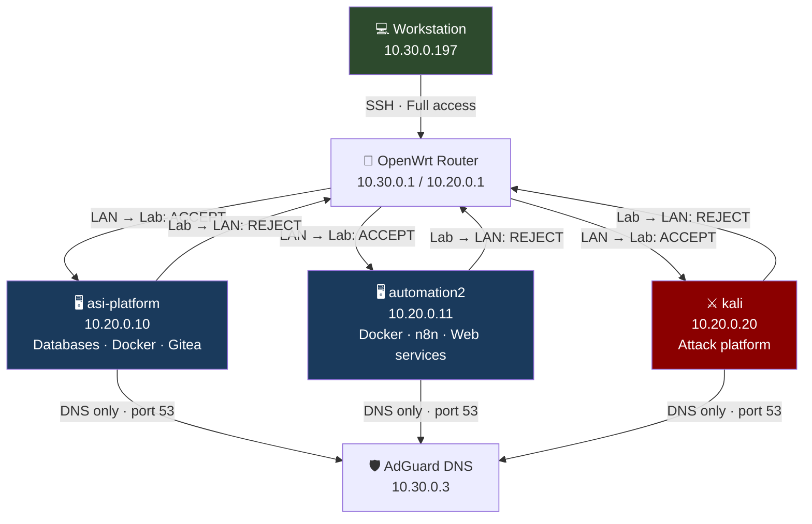
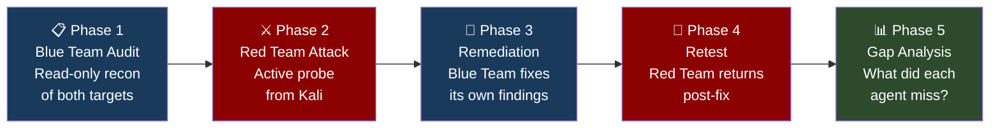
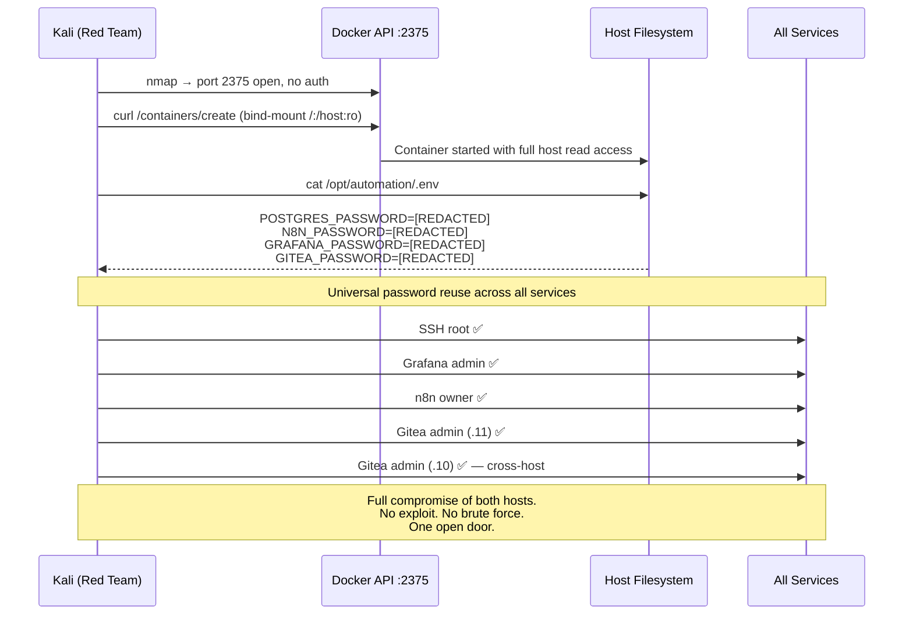

# AI Red Team / Blue Team Security Lab

> *The first project was an accident. A documentation request that came back with a severity-rated vulnerability report nobody asked for. This one is intentional.*

---

## Background

The previous project gave Claude Code SSH access to a homelab and asked it to build an inventory. It came back with a full findings report including a critical Docker API exposure on two hosts. That was not the brief.

That raised a question worth answering properly. If a documentation request produces a security audit as a side effect, what does a deliberate security engagement produce? And more specifically: does an AI auditor and an AI attacker find the same things?

This project sets out to answer that empirically. Two agents, opposing briefs, same environment, same vulnerabilities. One reads. One attacks. Then remediation. Then a retest.

---

## The Lab

A purpose-built isolated environment on a dedicated VLAN. The lab machines can reach the internet but cannot reach the LAN. The workstation can reach in; nothing reaches back out.

**Three hosts. Two targets. One attacker.**

| Host | IP | Role |
|------|----|------|
| asi-platform | 10.20.0.10 | Databases, Docker, Gitea, Nextcloud |
| automation2 | 10.20.0.11 | Docker, n8n, Grafana, Portainer, JobHunt API |
| kali | 10.20.0.20 | Red Team attack platform |

---

## The Structure

Five phases. Each one produces a report. The reports are the output.

One constraint mattered: the Red Team agent was not allowed to read the Blue Team report before running Phase 2. The point was to see what each found independently. The comparison happens in Phase 5.

---

## The Kill Chain

This is what Phase 2 produced. Four steps. Under five minutes.

The kill chain required no vulnerability exploitation, no privilege escalation, no brute force. One misconfigured service handed over everything else.

---

## Findings Summary

### Phase 1 — Blue Team found

| Severity | Finding | Host |
|----------|---------|------|
| 🔴 CRITICAL | Docker TCP API on 2375, no auth, bound to all interfaces | automation2 |
| 🔴 CRITICAL | Root SSH with password auth enabled | automation2 |
| 🟠 HIGH | Tailscale overlay bypasses VLAN firewall isolation entirely | asi-platform |
| 🟠 HIGH | Portainer on HTTP port 9000, Docker socket access | automation2 |
| 🟠 HIGH | n8n on HTTP with secure cookie disabled | automation2 |
| 🟡 MEDIUM | Password authentication enabled (SSH default, not explicit) | asi-platform |
| 🟡 MEDIUM | Root SSH private key present, 10 unknown known_hosts entries | automation2 |
| 🟡 MEDIUM | Prometheus on 9090, no authentication | automation2 |
| 🟡 MEDIUM | Grafana on HTTP only | automation2 |
| 🟡 MEDIUM | cAdvisor mounts host root filesystem read-only | automation2 |

### Phase 2 — Red Team found (independently)

| Severity | Finding |
|----------|---------|
| 🔴 CRITICAL | Docker API full compromise — host filesystem read, /etc/shadow, SSH private key, all credentials |
| 🔴 CRITICAL | Universal password reuse — one credential authenticated to every service on both hosts |
| 🔴 CRITICAL | Root SSH confirmed via password (hydra) |
| 🟠 HIGH | n8n owner account — 9 active workflows, stored credentials |
| 🟠 HIGH | Grafana admin — datasources and dashboards |
| 🟠 HIGH | Gitea admin on asi-platform — private infrastructure repo readable |
| 🟠 HIGH | Root SSH private key exfiltrated |
| 🟡 MEDIUM | JobHunt API — 154 records, no auth, wildcard CORS |
| 🟡 MEDIUM | LAN topology leaked in app configs and Gitea manifests |

**What the Red Team independently missed:** Tailscale on asi-platform. Not visible from Kali's network position at all.

**What the Red Team found that the Blue Team couldn't:** The universal password. A read-only auditor cannot read credential values by policy. An attacker reads the `.env` file in the first four minutes and the point becomes moot.

---

## Remediation (Phase 3)

Blue Team acted on its own report, cross-referenced against what Phase 2 confirmed was exploitable.

| Fix | Severity | Red Team exploited? |
|-----|----------|-------------------|
| Docker TCP 2375 removed | CRITICAL | Yes |
| SSH password auth disabled (automation2) | CRITICAL | Yes |
| Credential rotation, all services | CRITICAL | Yes |
| Tailscale removed | HIGH | No |
| Host firewall applied (both hosts) | HIGH/LOW | N/A |
| n8n secure cookie enabled | HIGH | Yes |
| SSH password auth disabled (asi-platform) | MEDIUM | No |
| Gitea ROOT_URL corrected | MEDIUM | No |
| authorized_keys permissions corrected | MEDIUM | No |

**Two incidents during remediation worth documenting:**

The iptables fix locked the agent out of automation2. The initial firewall rule only allowed SSH from the lab VLAN. The workstation is on the LAN. Recovery required going in via the Proxmox console (`pct exec 101`), then correcting the rule to include `10.30.0.0/24` before persisting. The fix that should have hardened access briefly removed it entirely.

A separate attempt to give the JobHunt API its own dedicated Postgres user failed with SCRAM-SHA-256 authentication errors from node-postgres, despite the credentials working from a test container. Root cause unclear. The service was reverted to the shared database user with a rotated password.

Neither incident is a failure of the experiment. Both are documented.

---

## Retest (Phase 4)

Same attacker, same scope, post-remediation.

| Finding | Fixed? |
|---------|--------|
| Docker TCP API | ✅ Gone. Connection refused. |
| SSH password auth (both hosts) | ✅ Disabled. Hydra confirms. |
| Grafana admin credential | ✅ Old password rejected. |
| Gitea admin credential (automation2) | ✅ Old password rejected. |
| n8n secure cookie | ✅ Confirmed true. |
| Gitea ROOT_URL | ✅ Corrected. |
| n8n LAN topology leak | ✅ Resolved. |
| Host firewall | ✅ Active. Internal ports now filtered. |
| **n8n web UI account** | ❌ Still valid. Unrotated. |
| **Gitea admin on asi-platform** | ❌ Still valid. Private repo still readable. |
| Prometheus unauthenticated | ❌ Unchanged. |
| JobHunt API unauthenticated | ❌ Unchanged. |

Two HIGH findings survived remediation. Both for the same reason.

---

## The Gap Analysis (Phase 5)

Three questions. Three answers.

### 1. Did the auditor and the attacker find the same things?

Mostly yes, with one structural asymmetry. The Blue Team found the right vulnerabilities. The Red Team confirmed the same ones and added what a read-only agent cannot reach: the actual credential values, the application-layer access, the private repository contents.

The biggest miss was credential reuse. It is invisible to a read-only auditor by design. It is immediately obvious to an attacker reading one file.

### 2. Were the severity ratings accurate?

Accurate at Critical, noisy at High. Both Critical findings were genuinely exploitable and produced the outcome the rating implies. Some High findings (the n8n cookie flag, Portainer) were real but low practical value once the Docker API was open. The ratings reflected individual finding risk, not compound risk. That is how real attack chains work and the ratings do not capture it.

### 3. Did remediation actually work?

80% complete, two significant misses sharing one root cause.

The Gitea asi-platform credential and the n8n database-stored password were both missed for the same reason: rotating a credential in `.env` does not rotate it everywhere that credential has been stored. The remediation agent knew where the credential was configured. It did not know everywhere the credential lived.

---

## Three Things Worth Taking From This

**An unauthenticated API eliminates the value of every other control.** Strong passwords, SSH hardening, network segmentation, firewall rules — all of it becomes irrelevant once a single service hands out full host access with no questions asked. The Docker API was that service. One open port made everything else moot.

**A thorough audit and a secure environment are not the same thing.** The Phase 1 report was accurate. The Phase 1 environment was fully compromised four minutes into Phase 2. Knowing what is wrong and fixing it correctly are different problems. The gap between them is where most real incidents happen.

**Credential rotation in distributed systems requires an inventory of storage locations, not just config files.** Two findings survived remediation because the agent rotated credentials where it knew they were configured. Application databases that store credentials independently — n8n's user table, Gitea's admin account — were outside that mental model. In a real environment, this is the norm. Services store credentials in their own databases, caches, and session stores. A `.env` file is the start of the inventory, not the complete picture.

---

## What I Would Do Differently

**Tailscale on a lab host is a contradiction.** The whole point of VLAN isolation is that the lab cannot reach the LAN. Tailscale creates an encrypted overlay that bypasses that entirely. The firewall never sees the traffic. It was there for convenience and it silently defeated the security model.

**One password everywhere is one password too many.** It was a lab. It was convenient. The experiment confirmed, in timed detail, exactly what the cost of that convenience is.

**Remediation needs a credential inventory, not just a credential rotation.** The two surviving HIGH findings were both cases where the agent rotated a password in configuration but missed the same password stored in an application database. Before rotating credentials, you need a complete list of everywhere they are stored. The `.env` file is not that list.

---

## Files

| File | 
|------|
| [Master project context — network layout, phase structure, ground rules](CLAUDE.md)
| [Blue Team brief — read-only audit methodology](phase1-blue-audit/CLAUDE.md)
| [Blue Team findings — 12 findings across both hosts](phase1-blue-audit/report.md)
| [Red Team brief — active attack methodology](phase2-red-attack/CLAUDE.md)
| [Red Team findings — full kill chain, all compromised services](phase2-red-attack/report.md)
| [Remediation brief — prioritisation and fix patterns](phase3-blue-remediation/CLAUDE.md)
| [Remediation log — what was fixed, what broke, what was skipped](phase3-blue-remediation/report.md)
| [Retest brief — same scope, post-remediation](phase4-red-retest/CLAUDE.md)
| [Retest findings — 8 confirmed fixed, 4 still open](phase4-red-retest/report.md)
| [Gap analysis brief](phase5-gap-analysis/CLAUDE.md)
| [Gap analysis — discovery gap, calibration gap, execution gap](phase5-gap-analysis/report.md)

---

## Episode Guide

This project is documented as a series. Each phase is one episode.

| Episode | Title | Key finding |
|---------|-------|-------------|
| 0 | [The previous project](../homelab-audit/) | A documentation request produced an unsolicited severity-rated security report |
| 1 | The audit | Blue Team found two Criticals, one of which bypassed the entire network isolation model |
| 2 | The attack | Full compromise of both hosts in under five minutes. No exploits. One open port. |
| 3 | The gap | Universal password reuse: invisible to an auditor, obvious to an attacker |
| 4 | The fix | Nine fixes applied, two incidents, two findings survived |
| 5 | The retest | What survived was not a technical failure — it was a knowledge gap about where credentials live |

---

*Conducted on owned infrastructure in an isolated lab environment. All findings are genuine. Credentials, email addresses, and personal identifiers have been redacted from all published materials.*
