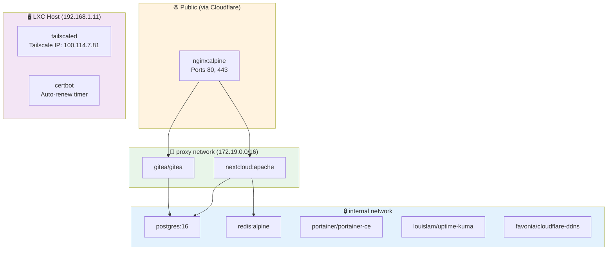

# Automated Self-Hosted Infrastructure

> **Production-grade infrastructure automation on a £0 cloud bill.**
> *A fully self-hosted platform — provisioned from scratch with a single Ansible command.*

---

## What Is This?

This project demonstrates the design, deployment, and automation of a complete self-hosted infrastructure platform — built on consumer hardware, managed entirely as code, and secured to production standards.

Every service, every configuration file, every firewall rule is version-controlled and reproducible. Destroying the entire stack and rebuilding it from scratch takes a single command.

This is not a tutorial follow-along. It is an original infrastructure design — making deliberate architectural decisions, accepting real trade-offs, and documenting the reasoning behind every choice.

---

## Why This Project Exists

Cloud platforms are powerful, but they come with a cost — financial and operational. Large organisations spend enormous budgets on services that could be self-hosted securely and cheaply. This project proves that enterprise-grade practices — Infrastructure as Code, zero-trust networking, automated certificate management, container orchestration, and disaster recovery planning — do not require an enterprise budget.

The entire stack runs on a single low-power mini PC, costs nothing to operate beyond electricity, and is managed with the same tooling used in professional infrastructure teams worldwide.

---

## What This Demonstrates

| Capability | Implementation |
|---|---|
| Infrastructure as Code | Ansible — full stack provisioned from a single command |
| Containerisation | Docker + Docker Compose — all services containerised |
| Secrets Management | Ansible Vault — no plaintext credentials anywhere |
| Zero-Trust Networking | Tailscale — management plane never exposed to internet |
| Reverse Proxy + SSL | Nginx + Let's Encrypt — automated certificate management |
| Dynamic DNS | Cloudflare API — automatic IP updates, domain always resolves |
| Security Hardening | UFW firewall, fail2ban, OS hardening, no open inbound ports |
| Monitoring | Uptime Kuma — service health visibility |
| Disaster Recovery | Documented RTO/RPO, automated backups, tested restore procedure |
| Version Control | Gitea — self-hosted Git, all code lives on the platform itself |

---

## The Stack

```
Internet
    │
    ▼
Cloudflare (DNS + WAF + DDoS protection)
    │
    ▼
Dynamic DNS (auto-updated via Cloudflare API)
    │
    ▼
Nginx Reverse Proxy (SSL termination — Let's Encrypt)
    │
    ├──► Nextcloud (collaboration platform)
    │
    ├──► Gitea (self-hosted Git)
    │
    └──► [Management plane — Tailscale only]
              ├── Portainer
              ├── Uptime Kuma
              └── Proxmox
```

---

## Hardware

| Component | Spec |
|---|---|
| Host | Intel NUC DN2820FYKH |
| CPU | Intel Celeron N2820 @ 2.13GHz (2 cores) |
| RAM | 8GB DDR3 |
| Storage | 128GB SSD (OS) + 238GB (backups) |
| Hypervisor | Proxmox VE |
| Router | Cudy WR3000 (OpenWrt 24.10) |

> *Deliberate constraint: proving enterprise practices do not require enterprise hardware.*

---

## Network & Traffic Flow


---

## Service Architecture



---

## Ansible Deployment Flow


---

## Quick Start (Full Stack Deployment)

```bash
# Clone the repository
git clone https://gitea.qcbhomelab.online/quintin/asi-platform.git
cd asi-platform

# Configure your secrets
cp ansible/group_vars/all/vault.yml.example ansible/group_vars/all/vault.yml
ansible-vault encrypt ansible/group_vars/all/vault.yml

# Deploy everything
ansible-playbook ansible/site.yml -i ansible/inventory/hosts.yml --ask-vault-pass
```

That's it. The entire platform builds itself.

---

## Documentation Index

### Project
- [Architecture Overview](docs/ARCHITECTURE.md)
- [Design Decisions (ADR)](docs/DECISIONS.md)
- [Security Overview](docs/SECURITY.md)

### Services
- [Nextcloud](docs/services/nextcloud.md) — Self-hosted collaboration platform
- [PostgreSQL](docs/services/postgresql.md) — Relational database backend
- [Nginx](docs/services/nginx.md) — Reverse proxy and SSL termination
- [Portainer](docs/services/portainer.md) — Container management UI
- [Uptime Kuma](docs/services/uptime-kuma.md) — Service monitoring
- [Gitea](docs/services/gitea.md) — Self-hosted Git platform
- [Cloudflare DDNS](docs/services/cloudflare-ddns.md) — Dynamic DNS automation

### Tasks
- [Proxmox LXC Setup](docs/tasks/proxmox-lxc.md)
- [Docker Installation](docs/tasks/docker.md)
- [OpenWrt Network Configuration](docs/tasks/openwrt-network.md)
- [Tailscale Setup](docs/tasks/tailscale.md)
- [SSL Certificate Setup](docs/tasks/ssl-certificates.md)
- [Ansible Vault — Secrets Management](docs/tasks/ansible-vault.md)
- [Nginx + Nextcloud Reverse Proxy Gotchas](docs/tasks/nginx-nextcloud-gotchas.md)

### Operations
- [Monitoring](docs/operations/monitoring.md)
- [Backup & Disaster Recovery](docs/operations/backup-dr.md)
- [Runbook](docs/operations/runbook.md)
- [Lessons Learned](docs/operations/lessons-learned.md)

---

## Author

**Quintin** — Infrastructure Engineer
[qcbhomelab.online](https://qcbhomelab.online) · [GitHub](https://github.com/qcb)

---

*All infrastructure provisioned via Ansible. No manual steps beyond initial Proxmox installation and API token generation.*
