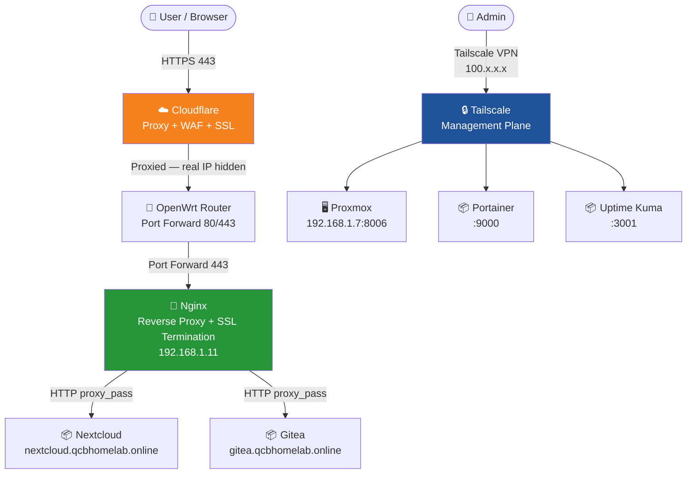
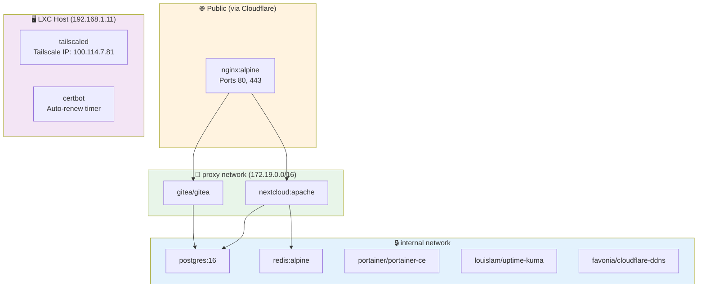
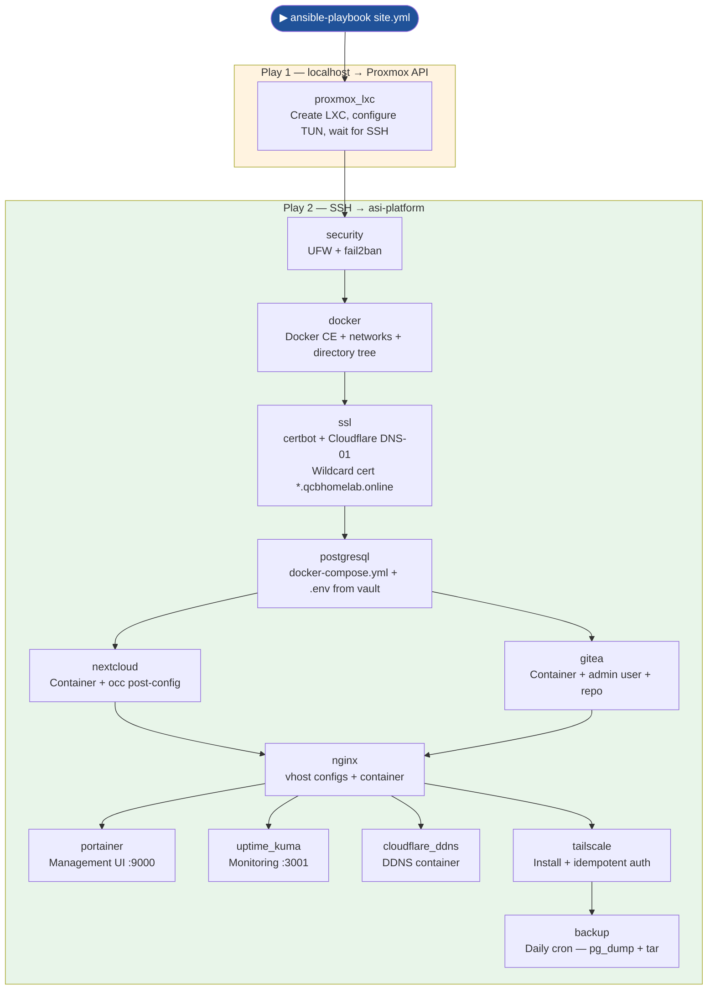

# Automated Self-Hosted Infrastructure

> **Production-grade infrastructure practices. Consumer hardware. Zero cloud bill.**
> *A fully self-hosted platform — provisioned from scratch with a single Ansible command.*

---

## What Is This?

This project demonstrates the design, deployment, and automation of a complete self-hosted infrastructure platform — built on consumer hardware, managed entirely as code, and secured to production standards.

Every service, every configuration file, every firewall rule is version-controlled and reproducible. Destroying the entire stack and rebuilding it from scratch takes a single command.

This is not a tutorial follow-along. It is an original infrastructure design — making deliberate architectural decisions, accepting real trade-offs, and documenting the reasoning behind every choice.

---

## Why This Project Exists

Infrastructure as Code, zero-trust networking, automated certificate management, and secrets management are not corporate privileges — they are disciplines. This project applies them deliberately in a non-corporate environment, on modest hardware, with no team and no budget.

The goal is not to replicate a corporate data centre. The goal is to demonstrate that the *thinking* behind enterprise infrastructure — separation of concerns, reproducibility, security posture, documentation — transfers directly to any environment and any scale.

A hiring manager reviewing this project should see not just what was built, but how decisions were made, what went wrong, and how problems were resolved. That thinking is what transfers to a professional role.

---

## What This Demonstrates

| Capability | Implementation |
|---|---|
| Infrastructure as Code | Ansible — 13 roles, full stack from a single command |
| Containerisation | Docker + Docker Compose — all services containerised |
| Secrets Management | Ansible Vault — no plaintext credentials anywhere in version control |
| Zero-Trust Networking | Tailscale — management plane completely isolated from public internet |
| Reverse Proxy + SSL | Nginx + Let's Encrypt — wildcard cert, automated DNS-01 renewal |
| Dynamic DNS | Cloudflare API — automatic IP updates, no manual intervention on ISP changes |
| Security Hardening | UFW, fail2ban, zero open inbound ports, real IP never exposed |
| Monitoring | Uptime Kuma — service availability visibility appropriate to this scale |
| Disaster Recovery | Documented RTO/RPO, automated backups, restore procedure |
| Version Control | Gitea — self-hosted Git, infrastructure code lives on the platform itself |
| Documentation | Every service, decision, and gotcha documented — including what went wrong |

---

## Honest Scope Statement

This is a homelab project running on a 2-core Celeron with 8GB RAM. It is not a production platform for a real organisation, and it does not pretend to be.

What it is: a demonstration that the *practices* of professional infrastructure work at any scale. The same Ansible role structure, the same secrets management approach, the same network segmentation thinking — these scale up directly. The hardware does not define the discipline.

**On monitoring:** Uptime Kuma provides HTTP availability checks appropriate to this scale. A production deployment on capable hardware would use Prometheus for metrics collection, Grafana for dashboards, and alerting via PagerDuty or similar. That choice was made deliberately here — running a full metrics pipeline on a Celeron N2820 would consume a significant portion of available resources and undermine the primary goal. The important thing is understanding *why* you'd use Prometheus, not just installing it to tick a box.

**On hardware:** The Intel NUC DN2820FYKH is a 2013-era mini PC. The constraint is intentional — if the practices only work on powerful hardware, they are not really understood.

---

## The Stack

```
Internet
    │
    ▼
Cloudflare (DNS + WAF + DDoS protection + proxy)
    │
    ▼
Dynamic DNS (auto-updated via Cloudflare API on IP change)
    │
    ▼
OpenWrt Router (port forward 80/443 only)
    │
    ▼
Nginx Reverse Proxy (SSL termination — Let's Encrypt wildcard)
    │
    ├──► Nextcloud  (nextcloud.qcbhomelab.online)
    ├──► Gitea      (gitea.qcbhomelab.online)
    │
    └──► [Management plane — Tailscale only, never public]
              ├── Proxmox (hypervisor)
              ├── Portainer (container management)
              └── Uptime Kuma (monitoring)
```

Real IP never exposed. Zero open ports beyond 80/443. Management interfaces unreachable from the public internet.

---

## Hardware

| Component | Spec |
|---|---|
| Host | Intel NUC DN2820FYKH (2013) |
| CPU | Intel Celeron N2820 @ 2.13GHz (2 cores) |
| RAM | 8GB DDR3 |
| Storage | 128GB SSD (OS + services) + 238GB (backups) |
| Hypervisor | Proxmox VE |
| Router | Cudy WR3000 running OpenWrt 24.10 |
| Power draw | ~10W idle |

> *The hardware is a deliberate constraint. Enterprise practices are disciplines, not hardware specifications.*

---

## Network & Traffic Flow



---

## Service Architecture



---

## Ansible Deployment Flow



---

## Quick Start (Full Stack Deployment)

```bash
# Clone the repository
git clone https://gitea.qcbhomelab.online/admin/asi-platform.git
cd asi-platform

# Install Ansible collections
ansible-galaxy collection install community.general community.docker community.proxmox

# Configure your secrets
cp ansible/group_vars/all/vault.yml.example ansible/group_vars/all/vault.yml
nano ansible/group_vars/all/vault.yml   # fill in all values
ansible-vault encrypt ansible/group_vars/all/vault.yml

# Dry run first — always
ansible-playbook ansible/site.yml -i ansible/inventory/hosts.yml --ask-vault-pass --check

# Full deployment
ansible-playbook ansible/site.yml -i ansible/inventory/hosts.yml --ask-vault-pass
```

That's it. The entire platform builds itself.

> See [Ansible — Project Structure & Vault](docs/tasks/ansible-vault.md) for full prerequisites and gotchas before running.

---

## Key Design Decisions

Six architectural decisions shaped this project. Each is documented as an Architecture Decision Record (ADR) in [docs/DECISIONS.md](docs/DECISIONS.md). The short version:

- **Single LXC, all services via Docker Compose** — keeps complexity manageable on constrained hardware without sacrificing service isolation
- **Cloudflare proxy for all public services** — real IP never exposed, DDoS protection, WAF, free
- **Tailscale for management** — zero-trust access without a VPN server, works from anywhere, no open ports
- **DNS-01 certificate challenge** — wildcard cert, no port 80 required, works behind Cloudflare proxy
- **PostgreSQL over SQLite** — production-grade database for both Nextcloud and Gitea from day one
- **Ansible Vault for all secrets** — no credentials in version control, ever

---

## Documentation Index

### Project
- [Architecture Overview](docs/ARCHITECTURE.md)
- [Design Decisions (ADR)](docs/DECISIONS.md)
- [Security Overview](docs/SECURITY.md)

### Services
- [Nextcloud](docs/services/nextcloud.md) — Self-hosted collaboration platform
- [PostgreSQL](docs/services/postgresql.md) — Relational database backend
- [Nginx](docs/services/nginx.md) — Reverse proxy and SSL termination
- [Portainer](docs/services/portainer.md) — Container management UI
- [Uptime Kuma](docs/services/uptime-kuma.md) — Service availability monitoring
- [Gitea](docs/services/gitea.md) — Self-hosted Git platform
- [Cloudflare DDNS](docs/services/cloudflare-ddns.md) — Dynamic DNS automation

### Tasks
- [Proxmox LXC Setup](docs/tasks/proxmox-lxc.md)
- [Docker Installation](docs/tasks/docker.md)
- [OpenWrt Network Configuration](docs/tasks/openwrt-network.md)
- [Tailscale Setup](docs/tasks/tailscale.md)
- [SSL Certificate Setup](docs/tasks/ssl-certificates.md)
- [Ansible Vault — Secrets Management](docs/tasks/ansible-vault.md)
- [Nginx + Nextcloud Reverse Proxy Gotchas](docs/tasks/nginx-nextcloud-gotchas.md)

### Operations
- [Monitoring](docs/operations/monitoring.md)
- [Backup & Disaster Recovery](docs/operations/backup-dr.md)
- [Runbook](docs/operations/runbook.md)
- [Lessons Learned](docs/operations/lessons-learned.md)

---

## What I Would Do Differently at Scale

Honest reflection on what this project would look like in a professional environment:

- **Monitoring** — Prometheus + Grafana + Alertmanager replacing Uptime Kuma. Node exporter on the host, cAdvisor for container metrics, PagerDuty or OpsGenie for alerting.
- **Secrets management** — HashiCorp Vault or AWS Secrets Manager replacing Ansible Vault. Dynamic secrets, automatic rotation, audit logging.
- **Container orchestration** — Kubernetes or Nomad replacing Docker Compose for workloads requiring high availability and horizontal scaling.
- **CI/CD** — Gitea Actions or Jenkins pipeline triggering Ansible runs on code push, replacing manual `ansible-playbook` invocations.
- **Backup** — Offsite replication (S3 or similar) alongside local backups. Regular restore testing. RTO/RPO SLAs enforced by monitoring.
- **Networking** — VLAN segmentation at the router level separating management, application, and storage traffic. Currently achieved only at the Docker network layer.

These are not gaps in knowledge — they are deliberate omissions appropriate to the scale and purpose of this project.

---

## Author

**Quintin Boshoff** — Infrastructure / Cloud Engineer
[qcbhomelab.online](https://qcbhomelab.online)

---

*All infrastructure provisioned via Ansible. No manual steps beyond initial Proxmox installation and router configuration.*
