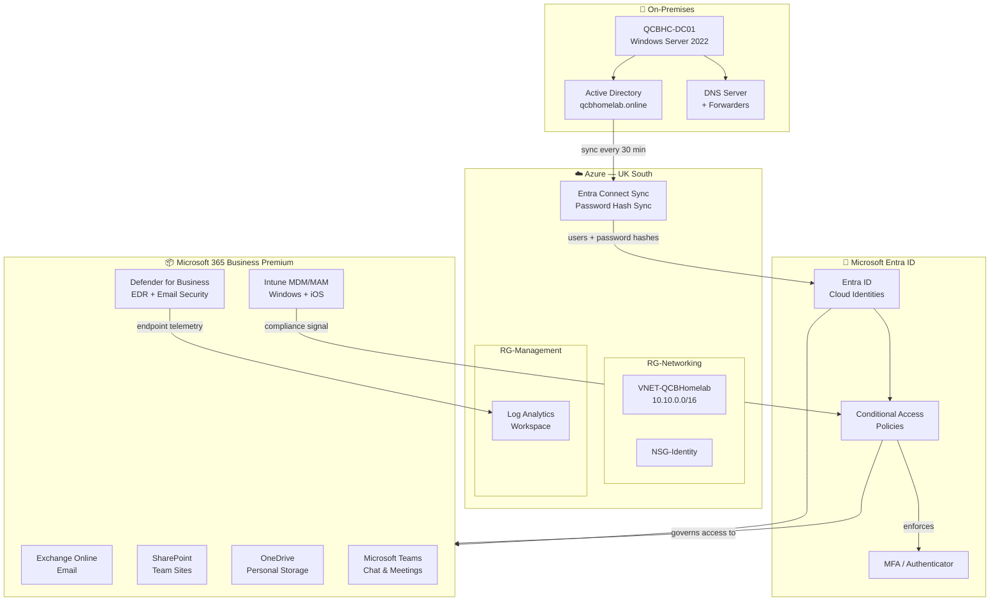

[🏠 README](README.md) &nbsp;|&nbsp; [01 — On-Premises Infrastructure →](01-on-premises-dc.md)

---

# QCB Homelab — Hybrid Microsoft Environment

This project documents the design and implementation of a complete hybrid Microsoft environment, built from scratch for a fictional professional services firm called QCB Homelab Consultants. It was created as a hands-on portfolio piece to demonstrate practical, real-world capability across the Microsoft 365 and Azure technology stack.

The environment reflects how a modern SMB would actually operate — cloud-first, identity-driven, and secure by design — rather than a textbook exercise. Every decision made here has a reason behind it, and where there were alternatives, those trade-offs are explained.

---

## The Organisation

| Detail | Value |
|---|---|
| Company | QCB Homelab Consultants |
| Primary domain | qcbhomelab.online |
| Microsoft 365 licence | Business Premium (25 seats) |
| Infrastructure model | Hybrid identity, cloud-hosted services |
| Locations | London, New York, Hong Kong, Remote |
| Staff | 6 users across three offices |
| Devices | Corporate Windows laptops (MDM) and personal iPhones (MAM) |

---

## Architecture Overview

The diagram below shows how the three layers of this environment connect — on-premises infrastructure, Azure, and Microsoft 365 — with identity synchronisation as the thread that ties them together.

---

## Project Documents

Work through these in order. Each document is self-contained but builds on the one before it.

| # | Document | What it covers |
|---|---|---|
| 01 | [On-Premises Infrastructure](01-on-premises-dc.md) | Windows Server 2022, Active Directory, DNS |
| 02 | [AD Provisioning Scripts](02-ad-scripts.md) | PowerShell scripts to build the full AD structure |
| 03 | [Azure Resource Setup](03-azure-setup.md) | Resource groups, networking, and Azure foundations |
| 04 | [Hybrid Identity](04-hybrid-identity.md) | Entra Connect Sync, Password Hash Sync |
| 05 | [Microsoft 365 & Exchange Online](05-m365-exchange.md) | Tenant setup, domain, email flow, DNS |
| 06 | [SharePoint & OneDrive](06-sharepoint-onedrive.md) | Team sites, personal storage, file migration |
| 07 | [Microsoft Teams](07-teams.md) | Communication layer, governance, structure |
| 08 | [Intune — Windows](08-intune-windows.md) | Device enrolment, compliance, patching |
| 09 | [Intune — iOS MAM](09-intune-ios.md) | BYOD mobile app management |
| 10 | [Conditional Access & MFA](10-conditional-access.md) | Zero Trust access policies |
| 11 | [Defender for Business](11-defender.md) | Endpoint and email security |
| 12 | [User Lifecycle](12-user-lifecycle.md) | Onboarding and offboarding procedures |

---

## Technology Stack

- Windows Server 2022 (Active Directory, DNS)
- Microsoft Entra ID (formerly Azure Active Directory)
- Microsoft Entra Connect Sync
- Microsoft 365 Business Premium (Exchange Online, SharePoint, OneDrive, Teams)
- Microsoft Intune (MDM and MAM)
- Microsoft Defender for Business
- Azure (resource groups, virtual network, Log Analytics)
- PowerShell (provisioning and automation throughout)

---

## Security Posture

The environment is built on Zero Trust principles. Access to company data is never assumed based on network location. Every access decision is evaluated against three signals: who the user is, whether their device is compliant, and whether the sign-in looks normal. Multi-factor authentication is enforced for all users with no exceptions.

---

## A Note on Scope

This is an SMB-scale environment by design. Enterprise features such as Azure AD Domain Services, ADFS, DFS namespaces, and multiple subscriptions are deliberately excluded. The goal is to show clean, practical implementation of the tools most organisations of this size actually use.

---

[🏠 README](README.md) &nbsp;|&nbsp; [01 — On-Premises Infrastructure →](01-on-premises-dc.md)
