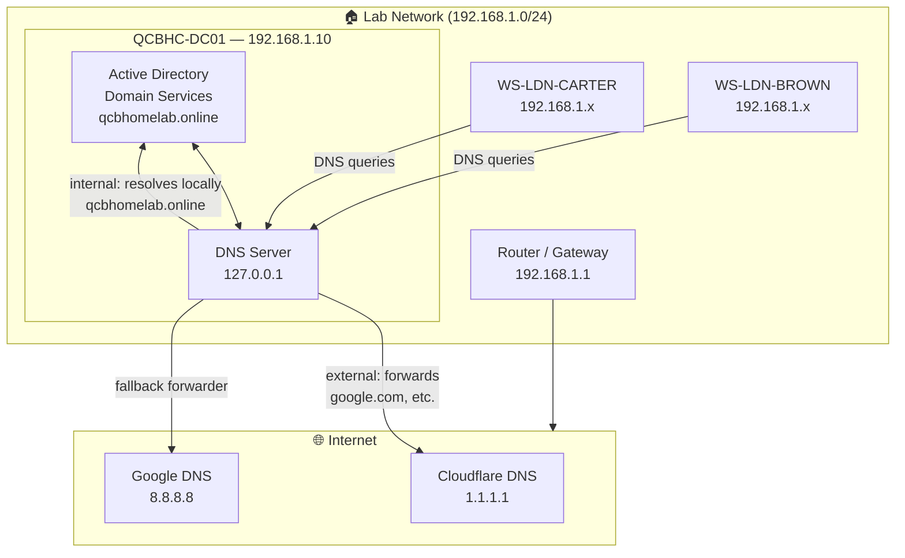
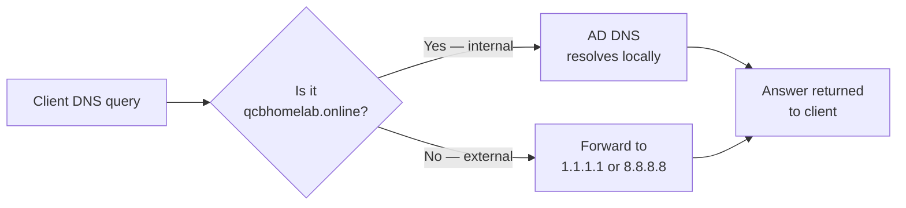

[← README — Project Overview](../README.md) &nbsp;|&nbsp; [🏠 README](../README.md) &nbsp;|&nbsp; [02 — AD Provisioning Scripts →](02-ad-scripts.md)

---

# 01 — On-Premises Infrastructure

## Introduction

Most organisations that use Microsoft 365 in the cloud still have some form of on-premises Windows Server infrastructure. The reason is identity. When a company has years of user accounts, passwords, and permissions stored in Active Directory on a local server, they do not simply abandon that when moving to the cloud. Instead, they connect the two environments together — this is called a hybrid identity model.

Active Directory (AD) is Microsoft's directory service. Think of it as the master list of everyone in the organisation: who they are, what groups they belong to, what computers they use, and what they are allowed to access. It has been the backbone of Windows-based IT environments for over two decades.

In this project, a single Windows Server 2022 domain controller acts as the identity anchor. It runs Active Directory and DNS (the service that translates names like qcbhomelab.online into network addresses). All user accounts are created here first, then synchronised to Microsoft Entra ID in the cloud — covered in document 04.

---

## What We Are Building

| Item                   | Value                                     |
| ---------------------- | ----------------------------------------- |
| Server name            | QCBHC-DC01                                |
| Operating system       | Windows Server 2022 Standard (Evaluation) |
| Roles                  | Active Directory Domain Services, DNS     |
| Forest and domain name | qcbhomelab.online                         |
| NetBIOS name           | QCBHOMELAB                                |

The server runs as a virtual machine — either in Proxmox, Hyper-V, or VirtualBox depending on your lab setup. It does not need to be powerful. 2 vCPUs, 4 GB RAM, and a 60 GB disk is sufficient.

---

## Infrastructure Diagram

The diagram below shows how QCBHC-DC01 fits into the lab network and how DNS resolution works — internal queries are handled locally, all other queries are forwarded upstream.



---

## DNS Resolution Flow



---

## Implementation Steps

### Step 1 — Create the Virtual Machine

Create a new VM with the following minimum specifications:

- 2 vCPUs
- 4 GB RAM
- 60 GB disk
- Network adapter connected to your LAN or a host-only network with internet access

Attach the Windows Server 2022 evaluation ISO and install the OS. Select "Standard with Desktop Experience" when prompted for the edition. Complete the installation and set a strong local Administrator password.

### Step 2 — Configure a Static IP Address

A domain controller must have a static IP address. Open Network and Sharing Centre, go to the network adapter properties, and set the following:

- IP address: choose an appropriate address for your lab network (e.g. 192.168.1.10)
- Subnet mask: 255.255.255.0
- Default gateway: your router address
- Preferred DNS: 127.0.0.1 (the server will become its own DNS server after promotion)

### Step 3 — Rename the Server

Open PowerShell as Administrator and run:

```powershell
Rename-Computer -NewName "QCBHC-DC01" -Restart
```

The server will restart. Log back in as Administrator.

### Step 4 — Install the AD DS Role

```powershell
Install-WindowsFeature -Name AD-Domain-Services -IncludeManagementTools
```

This installs Active Directory Domain Services and all the management tools needed to administer it.

### Step 5 — Promote the Server to Domain Controller

```powershell
Install-ADDSForest `
    -DomainName "qcbhomelab.online" `
    -DomainNetbiosName "QCBHOMELAB" `
    -ForestMode "WinThreshold" `
    -DomainMode "WinThreshold" `
    -InstallDns:$true `
    -SafeModeAdministratorPassword (ConvertTo-SecureString "YourDSRMPassword123!" -AsPlainText -Force) `
    -Force
```

The server will restart automatically once promotion completes. When it comes back up, log in with QCBHOMELAB\Administrator.

> The Safe Mode Administrator Password (DSRM password) is used to recover Active Directory if something goes wrong. Store it securely — it is separate from the normal Administrator password.

### Step 6 — Verify the Installation

Open PowerShell and confirm Active Directory is running correctly:

```powershell
# Confirm the domain exists
Get-ADDomain

# Confirm DNS is working
Resolve-DnsName qcbhomelab.online
```

Both commands should return results without errors. If DNS resolution fails, check that the server's preferred DNS is still set to 127.0.0.1.

### Step 7 — Configure DNS Forwarders

The domain controller handles DNS for the internal domain, but it needs to forward all other DNS queries (internet traffic) to an upstream resolver.

```powershell
# Add Cloudflare and Google as forwarders
Add-DnsServerForwarder -IPAddress 1.1.1.1
Add-DnsServerForwarder -IPAddress 8.8.8.8
```

Test that internet name resolution now works from the server:

```powershell
Resolve-DnsName google.com
```

---

## What to Expect

After completing these steps, QCBHC-DC01 is a fully functioning domain controller for qcbhomelab.online. The next step is to build out the Organisational Unit structure and create all user accounts — covered in document 02.

---

[← README — Project Overview](../README.md) &nbsp;|&nbsp; [🏠 README](../README.md) &nbsp;|&nbsp; [02 — AD Provisioning Scripts →](02-ad-scripts.md)
