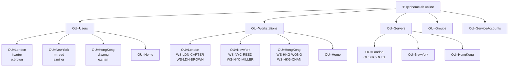
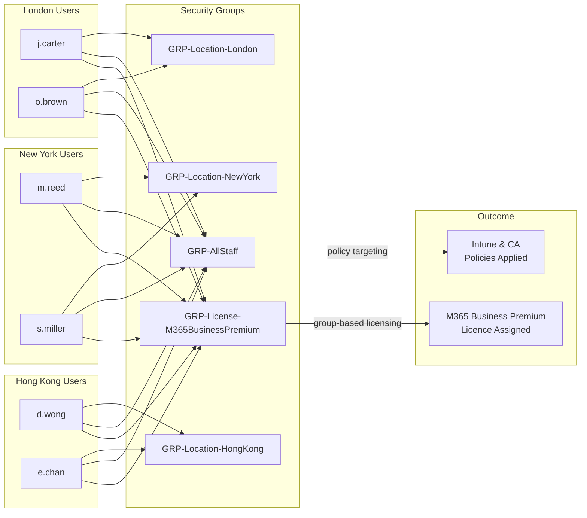

[← 01 — On-Premises Infrastructure](01-on-premises-dc.md) &nbsp;|&nbsp; [🏠 README](../README.md) &nbsp;|&nbsp; [03 — Azure Resource Setup →](03-azure-setup.md)

---

# 02 — Active Directory Provisioning Scripts

## Introduction

Once Active Directory is installed, it is an empty directory with only the built-in default objects. In a real environment, populating it manually would take hours and be error-prone. In a lab, doing it manually would also miss the point — the goal is to demonstrate that you can automate the work a senior engineer would be expected to script.

This document covers the PowerShell scripts that build the complete Active Directory structure for QCB Homelab Consultants: Organisational Units (OUs), user accounts, security groups, workstation objects, and server objects. Running these scripts produces a realistic, populated directory that can then be synchronised to Microsoft Entra ID.

All scripts are idempotent — they can be run more than once without creating duplicates or throwing errors.

---

## What We Are Building

- OU structure reflecting the organisation's locations and object types
- 6 user accounts across three offices
- Location-based and function-based security groups
- Placeholder workstation objects for each user
- Placeholder server objects

---

## Directory Structure

The diagrams below show the full Active Directory layout that the scripts produce — the OU tree, the user accounts within it, and how security groups connect to licences and access control.

### OU Tree



### Group Membership & Licence Assignment



---

## Implementation Steps

### Step 1 — Create the OU Structure

Save the following as `01-Create-OUs.ps1` and run it on QCBHC-DC01 as a Domain Admin.

```powershell
# 01-Create-OUs.ps1
# Creates the full OU structure for QCB Homelab Consultants
# Idempotent — safe to run multiple times

$domain = "DC=qcbhomelab,DC=online"

$ous = @(
    # Top-level OUs
    @{ Name = "Users";       Path = $domain },
    @{ Name = "Workstations"; Path = $domain },
    @{ Name = "Servers";     Path = $domain },
    @{ Name = "Groups";      Path = $domain },
    @{ Name = "ServiceAccounts"; Path = $domain },

    # User sub-OUs
    @{ Name = "London";    Path = "OU=Users,$domain" },
    @{ Name = "NewYork";   Path = "OU=Users,$domain" },
    @{ Name = "HongKong";  Path = "OU=Users,$domain" },
    @{ Name = "Home";      Path = "OU=Users,$domain" },

    # Workstation sub-OUs
    @{ Name = "London";    Path = "OU=Workstations,$domain" },
    @{ Name = "NewYork";   Path = "OU=Workstations,$domain" },
    @{ Name = "HongKong";  Path = "OU=Workstations,$domain" },
    @{ Name = "Home";      Path = "OU=Workstations,$domain" },

    # Server sub-OUs
    @{ Name = "London";    Path = "OU=Servers,$domain" },
    @{ Name = "NewYork";   Path = "OU=Servers,$domain" },
    @{ Name = "HongKong";  Path = "OU=Servers,$domain" }
)

foreach ($ou in $ous) {
    $exists = Get-ADOrganizationalUnit -Filter "Name -eq '$($ou.Name)'" -SearchBase $ou.Path -SearchScope OneLevel -ErrorAction SilentlyContinue
    if (-not $exists) {
        New-ADOrganizationalUnit -Name $ou.Name -Path $ou.Path
        Write-Host "Created OU: $($ou.Name) in $($ou.Path)" -ForegroundColor Green
    } else {
        Write-Host "OU already exists: $($ou.Name)" -ForegroundColor Yellow
    }
}
```

### Step 2 — Create User Accounts

Save the following as `02-Create-Users.ps1`.

```powershell
# 02-Create-Users.ps1
# Creates all user accounts for QCB Homelab Consultants
# Password: Welcome2024! (change after first logon in production)

$domain     = "DC=qcbhomelab,DC=online"
$upnSuffix  = "@qcbhomelab.online"
$defaultPwd = ConvertTo-SecureString "Welcome2024!" -AsPlainText -Force

$users = @(
    @{ First="James";  Last="Carter"; Office="London";   OU="OU=London,OU=Users,$domain";   Dept="Consulting" },
    @{ First="Olivia"; Last="Brown";  Office="London";   OU="OU=London,OU=Users,$domain";   Dept="Consulting" },
    @{ First="Michael";Last="Reed";   Office="New York"; OU="OU=NewYork,OU=Users,$domain";  Dept="Consulting" },
    @{ First="Sophia"; Last="Miller"; Office="New York"; OU="OU=NewYork,OU=Users,$domain";  Dept="Consulting" },
    @{ First="Daniel"; Last="Wong";   Office="Hong Kong";OU="OU=HongKong,OU=Users,$domain"; Dept="Consulting" },
    @{ First="Emily";  Last="Chan";   Office="Hong Kong";OU="OU=HongKong,OU=Users,$domain"; Dept="Consulting" }
)

foreach ($u in $users) {
    $samAccount = ($u.First[0] + "." + $u.Last).ToLower()
    $upn        = $samAccount + $upnSuffix
    $display    = "$($u.First) $($u.Last)"

    $exists = Get-ADUser -Filter "SamAccountName -eq '$samAccount'" -ErrorAction SilentlyContinue
    if (-not $exists) {
        New-ADUser `
            -GivenName          $u.First `
            -Surname            $u.Last `
            -Name               $display `
            -DisplayName        $display `
            -SamAccountName     $samAccount `
            -UserPrincipalName  $upn `
            -Path               $u.OU `
            -Department         $u.Dept `
            -Office             $u.Office `
            -AccountPassword    $defaultPwd `
            -Enabled            $true `
            -PasswordNeverExpires $false `
            -ChangePasswordAtLogon $true
        Write-Host "Created user: $upn" -ForegroundColor Green
    } else {
        Write-Host "User already exists: $samAccount" -ForegroundColor Yellow
    }
}
```

### Step 3 — Create Security Groups

Save the following as `03-Create-Groups.ps1`.

```powershell
# 03-Create-Groups.ps1
# Creates location and licensing security groups

$domain = "DC=qcbhomelab,DC=online"
$groupOU = "OU=Groups,$domain"

$groups = @(
    # Location groups
    "GRP-Location-London",
    "GRP-Location-NewYork",
    "GRP-Location-HongKong",
    "GRP-Location-Home",

    # Licensing group (used for M365 group-based licensing)
    "GRP-License-M365BusinessPremium",

    # Device platform groups
    "GRP-Devices-Windows",
    "GRP-Devices-iOS",

    # All staff group
    "GRP-AllStaff"
)

foreach ($g in $groups) {
    $exists = Get-ADGroup -Filter "Name -eq '$g'" -ErrorAction SilentlyContinue
    if (-not $exists) {
        New-ADGroup -Name $g -GroupScope Global -GroupCategory Security -Path $groupOU
        Write-Host "Created group: $g" -ForegroundColor Green
    } else {
        Write-Host "Group already exists: $g" -ForegroundColor Yellow
    }
}
```

### Step 4 — Add Users to Groups

Save the following as `04-Add-GroupMembers.ps1`.

```powershell
# 04-Add-GroupMembers.ps1
# Assigns users to their location and licensing groups

$members = @(
    @{ Group = "GRP-Location-London";             Users = @("j.carter","o.brown") },
    @{ Group = "GRP-Location-NewYork";            Users = @("m.reed","s.miller") },
    @{ Group = "GRP-Location-HongKong";           Users = @("d.wong","e.chan") },
    @{ Group = "GRP-License-M365BusinessPremium"; Users = @("j.carter","o.brown","m.reed","s.miller","d.wong","e.chan") },
    @{ Group = "GRP-AllStaff";                    Users = @("j.carter","o.brown","m.reed","s.miller","d.wong","e.chan") }
)

foreach ($entry in $members) {
    foreach ($user in $entry.Users) {
        try {
            Add-ADGroupMember -Identity $entry.Group -Members $user -ErrorAction Stop
            Write-Host "Added $user to $($entry.Group)" -ForegroundColor Green
        } catch {
            Write-Host "Skipped $user in $($entry.Group) — may already be a member" -ForegroundColor Yellow
        }
    }
}
```

### Step 5 — Create Workstation and Server Objects

Save the following as `05-Create-ComputerObjects.ps1`.

```powershell
# 05-Create-ComputerObjects.ps1
# Creates placeholder computer objects for workstations and the DC

$domain = "DC=qcbhomelab,DC=online"

$workstations = @(
    @{ Name = "WS-LDN-CARTER";  OU = "OU=London,OU=Workstations,$domain" },
    @{ Name = "WS-LDN-BROWN";   OU = "OU=London,OU=Workstations,$domain" },
    @{ Name = "WS-NYC-REED";    OU = "OU=NewYork,OU=Workstations,$domain" },
    @{ Name = "WS-NYC-MILLER";  OU = "OU=NewYork,OU=Workstations,$domain" },
    @{ Name = "WS-HKG-WONG";    OU = "OU=HongKong,OU=Workstations,$domain" },
    @{ Name = "WS-HKG-CHAN";    OU = "OU=HongKong,OU=Workstations,$domain" }
)

$servers = @(
    @{ Name = "QCBHC-DC01"; OU = "OU=London,OU=Servers,$domain" }
)

foreach ($c in ($workstations + $servers)) {
    $exists = Get-ADComputer -Filter "Name -eq '$($c.Name)'" -ErrorAction SilentlyContinue
    if (-not $exists) {
        New-ADComputer -Name $c.Name -Path $c.OU -Enabled $true
        Write-Host "Created computer object: $($c.Name)" -ForegroundColor Green
    } else {
        Write-Host "Already exists: $($c.Name)" -ForegroundColor Yellow
    }
}
```

### Step 6 — Verify the Structure

Run the following to confirm everything is in place:

```powershell
# List all OUs
Get-ADOrganizationalUnit -Filter * | Select-Object Name, DistinguishedName | Sort-Object DistinguishedName

# List all users
Get-ADUser -Filter * -SearchBase "OU=Users,DC=qcbhomelab,DC=online" | Select-Object Name, UserPrincipalName, Enabled

# List all groups
Get-ADGroup -Filter * -SearchBase "OU=Groups,DC=qcbhomelab,DC=online" | Select-Object Name

# List all computers
Get-ADComputer -Filter * | Select-Object Name, DistinguishedName
```

---

## File Structure

All scripts live in the `scripts/` folder of this repository. Run them in numerical order from an elevated PowerShell session on QCBHC-DC01.

The directory is now ready for synchronisation to Microsoft Entra ID, covered in document 04.

---

[← 01 — On-Premises Infrastructure](01-on-premises-dc.md) &nbsp;|&nbsp; [🏠 README](../README.md) &nbsp;|&nbsp; [03 — Azure Resource Setup →](03-azure-setup.md)
