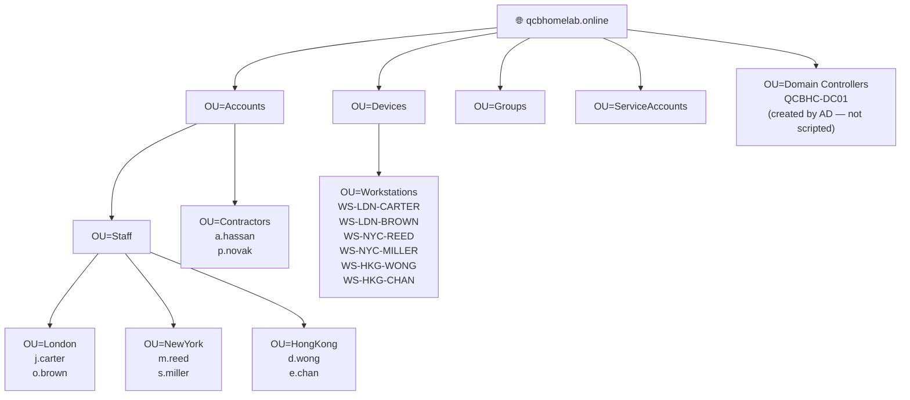
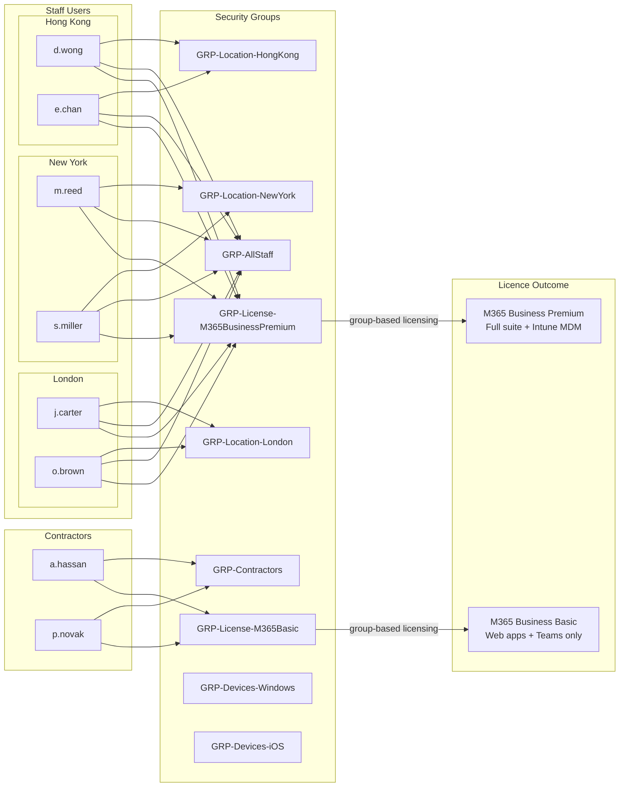

[← 01 — On-Premises Infrastructure](01-on-premises-dc.md) &nbsp;|&nbsp; [🏠 README](../README.md) &nbsp;|&nbsp; [03 — Azure Resource Setup →](03-azure-setup.md)

---

# 02 — Active Directory Provisioning Scripts

## Overview — What This Document Covers

Once the directory service is installed, it is completely empty. Before the organisation can use it, it needs to be populated — user accounts, groups, organisational units, and computer objects all have to be created. In a small organisation, this might be done by hand. In any environment of real scale, it is automated.

This document covers the PowerShell scripts that build the complete Active Directory structure from scratch: the folder structure that organises users and devices, all user accounts, all security groups, and the workstation records. Running these scripts produces a realistic, fully populated directory that mirrors what you would find in a working business environment.

The scripts are also designed to be idempotent — a technical way of saying they can be run more than once without causing problems. If something goes wrong halfway through, you can run them again without creating duplicates or errors.

---

## Introduction

Once Active Directory is installed, it is an empty directory with only the built-in default objects. In a real environment, populating it manually would take hours and be error-prone. In a lab, doing it manually would also miss the point — the goal is to demonstrate that you can automate the work a senior engineer would be expected to script.

This document covers the PowerShell scripts that build the complete Active Directory structure for QCB Homelab Consultants: Organisational Units (OUs), user accounts, security groups, and workstation objects. Running these scripts produces a realistic, populated directory that can then be synchronised to Microsoft Entra ID.

All scripts are idempotent — they can be run more than once without creating duplicates or throwing errors.

---

## Design Decisions

### OU Hierarchy

The OU structure follows modern hybrid identity best practice — OUs are used where they provide value (GPO scoping for user accounts, clean object separation) and kept flat where Intune and Entra ID handle policy targeting through group membership instead.

**`OU=Accounts`** is the parent for all human identity objects. The name avoids the `CN=Users` built-in container conflict that exists in every AD domain, and cleanly separates people from devices and infrastructure.

**`OU=Staff`** with location sub-OUs allows location-specific GPOs to be applied — useful for office-specific drive mappings or printer deployment. Staff are permanent employees with corporate-managed devices.

**`OU=Contractors`** is a flat OU with no location sub-OUs. Contractors are remote by nature, work from personal devices, and their policy differences are handled entirely through group membership in Intune and Entra ID — not through GPO.

**`OU=Devices`** groups all managed device objects. The `OU=Workstations` child OU is intentionally flat — Intune targets devices by group membership, not by OU, so location sub-OUs for devices add no value in a hybrid environment.

**`OU=Groups`** and **`OU=ServiceAccounts`** sit at the root level alongside `OU=Accounts` and `OU=Devices`. Keeping them separate maintains clean delegation boundaries — rights granted to manage accounts do not inadvertently extend to groups or service accounts.

### Server Objects

`QCBHC-DC01` is automatically placed in `OU=Domain Controllers` by Active Directory during domain promotion. In this lab it also serves as the file server. No separate server computer object is created — the DC's existing object in `OU=Domain Controllers` is the authoritative record.

---

## What We Are Building

- OU hierarchy separating accounts, devices, groups, and service accounts
- 6 staff accounts across three office locations
- 2 contractor accounts with a reduced licence, managed separately
- 10 security groups covering location, membership, licensing, and device targeting
- 6 workstation objects for staff — one per user, flat under `OU=Workstations`
- No workstation objects for contractors — they are BYOD, managed via MAM only

---

## Directory Structure

### OU Tree



> `OU=Domain Controllers` and its contents are created automatically by Active Directory. `QCBHC-DC01` lives there and is not touched by these scripts.

### Group Membership & Licence Assignment



> `GRP-Location-Home` is removed. Contractors are targeted through `GRP-Contractors` directly — a location group for remote workers adds no policy value in this environment.

---

## Implementation Steps

Run all scripts in order from an elevated PowerShell session on QCBHC-DC01.

---

### Step 1 — Create the OU Structure

Save the following as `01-Create-OUs.ps1`.

```powershell
# 01-Create-OUs.ps1
# Creates the full OU structure for QCB Homelab Consultants
# Idempotent — safe to run multiple times

Import-Module ActiveDirectory
$domain = "DC=qcbhomelab,DC=online"

$ous = @(
    # Root-level OUs
    @{ Name = "Accounts";        Path = $domain },
    @{ Name = "Devices";         Path = $domain },
    @{ Name = "Groups";          Path = $domain },
    @{ Name = "ServiceAccounts"; Path = $domain },

    # Accounts sub-OUs
    @{ Name = "Staff";       Path = "OU=Accounts,$domain" },
    @{ Name = "Contractors"; Path = "OU=Accounts,$domain" },

    # Staff location sub-OUs
    @{ Name = "London";   Path = "OU=Staff,OU=Accounts,$domain" },
    @{ Name = "NewYork";  Path = "OU=Staff,OU=Accounts,$domain" },
    @{ Name = "HongKong"; Path = "OU=Staff,OU=Accounts,$domain" },

    # Devices sub-OUs
    @{ Name = "Workstations"; Path = "OU=Devices,$domain" }
)

foreach ($ou in $ous) {
    $ouDN = "OU=$($ou.Name),$($ou.Path)"
    try {
        Get-ADOrganizationalUnit -Identity $ouDN -ErrorAction Stop | Out-Null
        Write-Host "EXISTS:   $ouDN" -ForegroundColor Yellow
    }
    catch {
        try {
            New-ADOrganizationalUnit -Name $ou.Name -Path $ou.Path -ProtectedFromAccidentalDeletion $true
            Write-Host "CREATED:  $ouDN" -ForegroundColor Green
        }
        catch {
            Write-Host "FAILED:   $ouDN — $($_.Exception.Message)" -ForegroundColor Red
        }
    }
}

Write-Host "`nOU structure complete." -ForegroundColor Cyan
```

#### Verification

```powershell
Get-ADOrganizationalUnit -Filter * |
    Select-Object Name, DistinguishedName |
    Sort-Object DistinguishedName
```

#### Expected Output

```
Name               DistinguishedName
----               -----------------
Domain Controllers OU=Domain Controllers,DC=qcbhomelab,DC=online
Accounts           OU=Accounts,DC=qcbhomelab,DC=online
Devices            OU=Devices,DC=qcbhomelab,DC=online
Groups             OU=Groups,DC=qcbhomelab,DC=online
ServiceAccounts    OU=ServiceAccounts,DC=qcbhomelab,DC=online
Contractors        OU=Contractors,OU=Accounts,DC=qcbhomelab,DC=online
Staff              OU=Staff,OU=Accounts,DC=qcbhomelab,DC=online
HongKong           OU=HongKong,OU=Staff,OU=Accounts,DC=qcbhomelab,DC=online
London             OU=London,OU=Staff,OU=Accounts,DC=qcbhomelab,DC=online
NewYork            OU=NewYork,OU=Staff,OU=Accounts,DC=qcbhomelab,DC=online
Workstations       OU=Workstations,OU=Devices,DC=qcbhomelab,DC=online
```

---

### Step 2 — Create User Accounts

Staff accounts are placed in their office location OU under `OU=Staff`. Contractor accounts are placed flat in `OU=Contractors`. All accounts require a password change on first logon.

Save the following as `02-Create-Users.ps1`.

```powershell
# 02-Create-Users.ps1
# Creates all staff and contractor accounts for QCB Homelab Consultants
# Idempotent — safe to run multiple times

Import-Module ActiveDirectory
$domain     = "DC=qcbhomelab,DC=online"
$upnSuffix  = "@qcbhomelab.online"
$defaultPwd = ConvertTo-SecureString "Welcome2024!" -AsPlainText -Force

$users = @(
    # Staff — placed in their office location OU under OU=Staff
    @{ First="James";  Last="Carter"; Office="London";    OU="OU=London,OU=Staff,OU=Accounts,$domain";   Dept="Consulting" },
    @{ First="Olivia"; Last="Brown";  Office="London";    OU="OU=London,OU=Staff,OU=Accounts,$domain";   Dept="Consulting" },
    @{ First="Michael";Last="Reed";   Office="New York";  OU="OU=NewYork,OU=Staff,OU=Accounts,$domain";  Dept="Consulting" },
    @{ First="Sophia"; Last="Miller"; Office="New York";  OU="OU=NewYork,OU=Staff,OU=Accounts,$domain";  Dept="Consulting" },
    @{ First="Daniel"; Last="Wong";   Office="Hong Kong"; OU="OU=HongKong,OU=Staff,OU=Accounts,$domain"; Dept="Consulting" },
    @{ First="Emily";  Last="Chan";   Office="Hong Kong"; OU="OU=HongKong,OU=Staff,OU=Accounts,$domain"; Dept="Consulting" },

    # Contractors — flat in OU=Contractors, no location sub-OU
    @{ First="Amir";  Last="Hassan"; Office="Remote"; OU="OU=Contractors,OU=Accounts,$domain"; Dept="Contractor" },
    @{ First="Petra"; Last="Novak";  Office="Remote"; OU="OU=Contractors,OU=Accounts,$domain"; Dept="Contractor" }
)

foreach ($u in $users) {
    $sam     = ($u.First[0] + "." + $u.Last).ToLower()
    $upn     = $sam + $upnSuffix
    $display = "$($u.First) $($u.Last)"

    if (Get-ADUser -Filter "SamAccountName -eq '$sam'" -ErrorAction SilentlyContinue) {
        Write-Host "EXISTS:   $sam" -ForegroundColor Yellow
        continue
    }

    New-ADUser `
        -GivenName             $u.First `
        -Surname               $u.Last `
        -Name                  $display `
        -DisplayName           $display `
        -SamAccountName        $sam `
        -UserPrincipalName     $upn `
        -Path                  $u.OU `
        -Department            $u.Dept `
        -Office                $u.Office `
        -AccountPassword       $defaultPwd `
        -Enabled               $true `
        -ChangePasswordAtLogon $true

    Write-Host "CREATED:  $upn [$($u.Dept)]" -ForegroundColor Green
}

Write-Host "`nUser accounts complete." -ForegroundColor Cyan
```

#### Verification

```powershell
Get-ADUser -Filter * -SearchBase "OU=Accounts,DC=qcbhomelab,DC=online" `
    -Properties Department, Office |
    Select-Object Name, SamAccountName, Department, Office |
    Sort-Object Department, Name
```

#### Expected Output

```
Name          SamAccountName  Department   Office
----          --------------  ----------   ------
Amir Hassan   a.hassan        Contractor   Remote
Petra Novak   p.novak         Contractor   Remote
Daniel Wong   d.wong          Consulting   Hong Kong
Emily Chan    e.chan          Consulting   Hong Kong
James Carter  j.carter        Consulting   London
Michael Reed  m.reed          Consulting   New York
Olivia Brown  o.brown         Consulting   London
Sophia Miller s.miller        Consulting   New York
```

---

### Step 3 — Create Security Groups

Save the following as `03-Create-Groups.ps1`.

```powershell
# 03-Create-Groups.ps1
# Creates all security groups for QCB Homelab Consultants
# Idempotent — safe to run multiple times

Import-Module ActiveDirectory
$domain  = "DC=qcbhomelab,DC=online"
$groupOU = "OU=Groups,$domain"

$groups = @(
    # Location groups — GPO and Intune policy targeting for staff
    "GRP-Location-London",
    "GRP-Location-NewYork",
    "GRP-Location-HongKong",

    # Membership groups
    "GRP-AllStaff",
    "GRP-Contractors",

    # Licensing groups — drive group-based licence assignment in Entra ID
    "GRP-License-M365BusinessPremium",
    "GRP-License-M365Basic",

    # Device platform groups — Intune policy targeting
    "GRP-Devices-Windows",
    "GRP-Devices-iOS"
)

foreach ($g in $groups) {
    if (Get-ADGroup -Filter "Name -eq '$g'" -ErrorAction SilentlyContinue) {
        Write-Host "EXISTS:   $g" -ForegroundColor Yellow
        continue
    }
    New-ADGroup -Name $g -GroupScope Global -GroupCategory Security -Path $groupOU
    Write-Host "CREATED:  $g" -ForegroundColor Green
}

Write-Host "`nSecurity groups complete." -ForegroundColor Cyan
```

#### Verification

```powershell
Get-ADGroup -Filter * -SearchBase "OU=Groups,DC=qcbhomelab,DC=online" |
    Select-Object Name |
    Sort-Object Name
```

#### Expected Output

```
Name
----
GRP-AllStaff
GRP-Contractors
GRP-Devices-iOS
GRP-Devices-Windows
GRP-License-M365Basic
GRP-License-M365BusinessPremium
GRP-Location-HongKong
GRP-Location-London
GRP-Location-NewYork
```

---

### Step 4 — Add Users to Groups

Contractors are assigned to `GRP-Contractors` and `GRP-License-M365Basic` only. They are deliberately excluded from `GRP-AllStaff` and `GRP-License-M365BusinessPremium`.

Save the following as `04-Add-GroupMembers.ps1`.

```powershell
# 04-Add-GroupMembers.ps1
# Assigns users to location, membership, and licensing groups
# Idempotent — safe to run multiple times

Import-Module ActiveDirectory

$members = @(
    # Staff location groups
    @{ Group = "GRP-Location-London";             Users = @("j.carter","o.brown") },
    @{ Group = "GRP-Location-NewYork";            Users = @("m.reed","s.miller") },
    @{ Group = "GRP-Location-HongKong";           Users = @("d.wong","e.chan") },

    # Staff membership and licensing
    @{ Group = "GRP-AllStaff";                    Users = @("j.carter","o.brown","m.reed","s.miller","d.wong","e.chan") },
    @{ Group = "GRP-License-M365BusinessPremium"; Users = @("j.carter","o.brown","m.reed","s.miller","d.wong","e.chan") },

    # Contractor membership and licensing
    @{ Group = "GRP-Contractors";                 Users = @("a.hassan","p.novak") },
    @{ Group = "GRP-License-M365Basic";           Users = @("a.hassan","p.novak") }
)

foreach ($entry in $members) {
    foreach ($user in $entry.Users) {
        try {
            Add-ADGroupMember -Identity $entry.Group -Members $user -ErrorAction Stop
            Write-Host "ADDED:    $user → $($entry.Group)" -ForegroundColor Green
        }
        catch [Microsoft.ActiveDirectory.Management.ADException] {
            Write-Host "EXISTS:   $user in $($entry.Group)" -ForegroundColor Yellow
        }
    }
}

Write-Host "`nGroup membership complete." -ForegroundColor Cyan
```

#### Verification

```powershell
Get-ADGroup -Filter "Name -like 'GRP-*'" |
    Select-Object Name, @{ N="Members"; E={ (Get-ADGroupMember $_).Count } } |
    Sort-Object Name
```

#### Expected Output

```
Name                            Members
----                            -------
GRP-AllStaff                    6
GRP-Contractors                 2
GRP-Devices-iOS                 0   (populated when devices enrol)
GRP-Devices-Windows             0   (populated when devices enrol)
GRP-License-M365Basic           2
GRP-License-M365BusinessPremium 6
GRP-Location-HongKong           2
GRP-Location-London             2
GRP-Location-NewYork            2
```

---

### Step 5 — Create Workstation Objects

Workstation objects are created for staff users only, placed flat in `OU=Workstations` under `OU=Devices`. Intune targets devices by group membership, not by OU, so no location sub-OUs are needed. Contractors use personal devices managed via MAM — no computer objects are created for them.

Save the following as `05-Create-ComputerObjects.ps1`.

```powershell
# 05-Create-ComputerObjects.ps1
# Creates workstation objects for staff users
# No objects for contractors — BYOD/MAM only
# QCBHC-DC01 lives in OU=Domain Controllers — not touched here
# Idempotent — safe to run multiple times

Import-Module ActiveDirectory
$domain = "DC=qcbhomelab,DC=online"
$wsOU   = "OU=Workstations,OU=Devices,$domain"

$workstations = @(
    "WS-LDN-CARTER",
    "WS-LDN-BROWN",
    "WS-NYC-REED",
    "WS-NYC-MILLER",
    "WS-HKG-WONG",
    "WS-HKG-CHAN"
)

foreach ($name in $workstations) {
    if (Get-ADComputer -Filter "Name -eq '$name'" -ErrorAction SilentlyContinue) {
        Write-Host "EXISTS:   $name" -ForegroundColor Yellow
        continue
    }
    New-ADComputer -Name $name -SamAccountName $name -Path $wsOU -Enabled $true
    Write-Host "CREATED:  $name" -ForegroundColor Green
}

Write-Host "`nWorkstation objects complete." -ForegroundColor Cyan
```

#### Verification

```powershell
Get-ADComputer -Filter * -SearchBase "OU=Devices,DC=qcbhomelab,DC=online" |
    Select-Object Name, DistinguishedName |
    Sort-Object Name
```

#### Expected Output

```
Name          DistinguishedName
----          -----------------
WS-HKG-CHAN   CN=WS-HKG-CHAN,OU=Workstations,OU=Devices,DC=qcbhomelab,DC=online
WS-HKG-WONG   CN=WS-HKG-WONG,OU=Workstations,OU=Devices,DC=qcbhomelab,DC=online
WS-LDN-BROWN  CN=WS-LDN-BROWN,OU=Workstations,OU=Devices,DC=qcbhomelab,DC=online
WS-LDN-CARTER CN=WS-LDN-CARTER,OU=Workstations,OU=Devices,DC=qcbhomelab,DC=online
WS-NYC-MILLER CN=WS-NYC-MILLER,OU=Workstations,OU=Devices,DC=qcbhomelab,DC=online
WS-NYC-REED   CN=WS-NYC-REED,OU=Workstations,OU=Devices,DC=qcbhomelab,DC=online
```

---

### Step 6 — Final Verification

Run this after all five scripts to confirm the complete structure is in place.

```powershell
Write-Host "=== OUs ===" -ForegroundColor Cyan
Get-ADOrganizationalUnit -Filter * |
    Select-Object Name, DistinguishedName |
    Sort-Object DistinguishedName

Write-Host "`n=== Users ===" -ForegroundColor Cyan
Get-ADUser -Filter * -SearchBase "OU=Accounts,DC=qcbhomelab,DC=online" `
    -Properties Department, Office |
    Select-Object Name, SamAccountName, Department, Office |
    Sort-Object Department, Name

Write-Host "`n=== Groups & Member Counts ===" -ForegroundColor Cyan
Get-ADGroup -Filter "Name -like 'GRP-*'" |
    Select-Object Name, @{ N="Members"; E={ (Get-ADGroupMember $_).Count } } |
    Sort-Object Name

Write-Host "`n=== Workstations ===" -ForegroundColor Cyan
Get-ADComputer -Filter * -SearchBase "OU=Devices,DC=qcbhomelab,DC=online" |
    Select-Object Name, DistinguishedName |
    Sort-Object Name
```

---

The directory is now ready for synchronisation to Microsoft Entra ID, covered in document 04.

---

## Common Questions & Troubleshooting

**Q1: A script fails with "Access is denied" even though I am running PowerShell as Administrator. What is the issue?**

Running PowerShell as the local Administrator is not the same as running it as a Domain Administrator. On a domain controller, you need to be signed in as a domain admin account (e.g. `QCBHOMELAB\Administrator`) and run PowerShell elevated from that session. If you are remoting in, ensure your PowerShell remoting session is using domain credentials, not local ones.

**Q2: The user creation script throws "The object already exists" for some users but not others. How do I handle this cleanly?**

This happens when the script is run a second time without idempotency checks. The scripts in this document use `Get-ADUser -Filter` to check for existing accounts before creating them. If you are adapting these scripts, always include a pre-creation check and use `Write-Host` to log skipped accounts rather than letting the script fail. Running with `-ErrorAction SilentlyContinue` hides errors but also hides real problems — use conditional logic instead.

**Q3: Groups are created successfully but `Add-ADGroupMember` fails with "Cannot find an object with identity". What is happening?**

This usually means the user account referenced does not yet exist in AD at the time the group membership script runs. If you are running scripts in sequence, add a short `Start-Sleep` between user creation and group assignment, or restructure the script to verify each account exists before attempting to add it. In a slow or loaded environment, AD replication can introduce a brief delay between object creation and availability.

**Q4: The OU structure looks correct in Active Directory Users and Computers but the user accounts are appearing in the wrong OU. What should I check?**

The `New-ADUser -Path` parameter must match the DistinguishedName of the target OU exactly, including capitalisation and spacing. A common mistake is referencing `OU=Staff` when the actual OU is `OU=Accounts`. Use `Get-ADOrganizationalUnit -Filter *` to list all OUs and their exact DistinguishedNames before running user creation scripts, and copy the path directly rather than typing it.

**Q5: I need to reset all user accounts back to a clean state and re-run the scripts. What is the safest way to do this in a lab?**

In a lab environment, the cleanest approach is to remove all objects from the custom OUs and let the scripts recreate them. Use `Get-ADUser -Filter * -SearchBase "OU=Accounts,DC=qcbhomelab,DC=online" | Remove-ADUser -Confirm:$false` to clear users, and similarly for groups and OUs. Never use broad `Remove-ADObject` commands without a specific `-SearchBase` filter — you risk removing built-in objects that are difficult to restore. In a production environment, always take an AD backup before any bulk changes.

---
