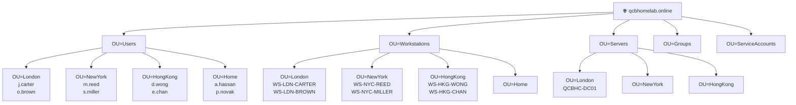
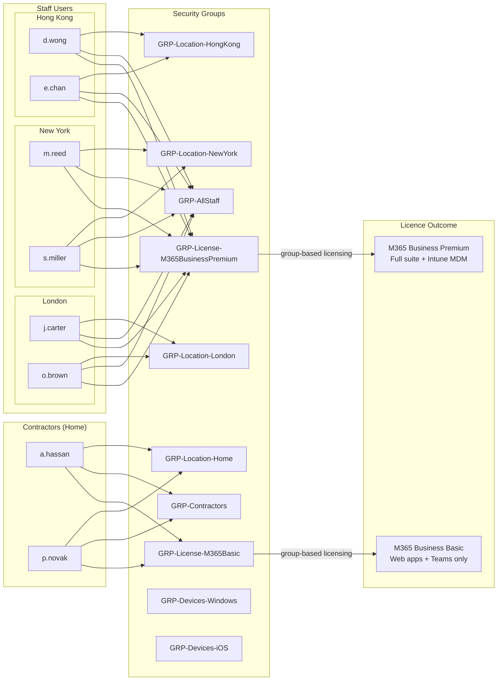

[← 01 — On-Premises Infrastructure](01-on-premises-dc.md) &nbsp;|&nbsp; [🏠 README](../README.md) &nbsp;|&nbsp; [03 — Azure Resource Setup →](03-azure-setup.md)

---

# 02 — Active Directory Provisioning Scripts

## Introduction

Once Active Directory is installed, it is an empty directory with only the built-in default objects. In a real environment, populating it manually would take hours and be error-prone. In a lab, doing it manually would also miss the point — the goal is to demonstrate that you can automate the work a senior engineer would be expected to script.

This document covers the PowerShell scripts that build the complete Active Directory structure for QCB Homelab Consultants: Organisational Units (OUs), user accounts, security groups, workstation objects, and server objects. Running these scripts produces a realistic, populated directory that can then be synchronised to Microsoft Entra ID.

All scripts are idempotent — they can be run more than once without creating duplicates or throwing errors.

---

## What We Are Building

- OU structure reflecting the organisation's locations and object types
- 6 staff user accounts across three offices
- 2 contractor accounts under the Home OU with a reduced licence
- Location-based, function-based, and contractor security groups
- Placeholder workstation objects for each staff user
- Placeholder server objects

---

## Directory Structure

The diagrams below show the full Active Directory layout that the scripts produce — the OU tree, user accounts, and how security groups connect to licences and access control.

### OU Tree



> Contractors (`a.hassan`, `p.novak`) sit in `OU=Home` under `OU=Users`. They use their own devices so no workstation objects are created for them. They receive a reduced M365 licence and are deliberately excluded from `GRP-AllStaff` to allow separate policy targeting.

### Group Membership & Licence Assignment



---

## Implementation Steps

Run all scripts in order from an elevated PowerShell session on QCBHC-DC01.

---

### Step 1 — Create the OU Structure

Save the following as `01-Create-OUs.ps1` and run it on QCBHC-DC01 as a Domain Admin.

```powershell
# 01-Create-OUs.ps1
# Creates the full OU structure for QCB Homelab Consultants
# Idempotent — safe to run multiple times

Import-Module ActiveDirectory
$domain = "DC=qcbhomelab,DC=online"

$ous = @(
    # Top-level OUs
    @{ Name = "Users";           Path = $domain },
    @{ Name = "Workstations";    Path = $domain },
    @{ Name = "Servers";         Path = $domain },
    @{ Name = "Groups";          Path = $domain },
    @{ Name = "ServiceAccounts"; Path = $domain },

    # Users sub-OUs (4 locations)
    @{ Name = "London";   Path = "OU=Users,$domain" },
    @{ Name = "NewYork";  Path = "OU=Users,$domain" },
    @{ Name = "HongKong"; Path = "OU=Users,$domain" },
    @{ Name = "Home";     Path = "OU=Users,$domain" },

    # Workstations sub-OUs (4 locations)
    @{ Name = "London";   Path = "OU=Workstations,$domain" },
    @{ Name = "NewYork";  Path = "OU=Workstations,$domain" },
    @{ Name = "HongKong"; Path = "OU=Workstations,$domain" },
    @{ Name = "Home";     Path = "OU=Workstations,$domain" },

    # Servers sub-OUs (no Home — servers are always office-based)
    @{ Name = "London";   Path = "OU=Servers,$domain" },
    @{ Name = "NewYork";  Path = "OU=Servers,$domain" },
    @{ Name = "HongKong"; Path = "OU=Servers,$domain" }
)

foreach ($ou in $ous) {
    $ouDN = "OU=$($ou.Name),$($ou.Path)"
    try {
        Get-ADOrganizationalUnit -Identity $ouDN -ErrorAction Stop | Out-Null
        Write-Host "EXISTS: $ouDN" -ForegroundColor Yellow
    }
    catch {
        try {
            New-ADOrganizationalUnit -Name $ou.Name -Path $ou.Path -ProtectedFromAccidentalDeletion $true
            Write-Host "CREATED: $ouDN" -ForegroundColor Green
        }
        catch {
            Write-Host "FAILED: $ouDN — $($_.Exception.Message)" -ForegroundColor Red
        }
    }
}

Write-Host "`nOU structure complete." -ForegroundColor Cyan
```

#### Verification

```powershell
# Full list sorted by distinguished name
Get-ADOrganizationalUnit -Filter * |
    Select-Object Name, DistinguishedName |
    Sort-Object DistinguishedName

# Confirm protection is enabled on all OUs
Get-ADOrganizationalUnit -Filter * |
    Where-Object ProtectedFromAccidentalDeletion -eq $true |
    Measure-Object
```

---

### Step 2 — Create User Accounts

Staff accounts go into their office location OUs. Contractor accounts go into `OU=Home`. All accounts require a password change on first logon.

Save the following as `02-Create-Users.ps1`.

```powershell
# 02-Create-Users.ps1
# Creates all staff and contractor accounts for QCB Homelab Consultants
# Idempotent — safe to run multiple times

Import-Module ActiveDirectory
$domain     = "DC=qcbhomelab,DC=online"
$upnSuffix  = "@qcbhomelab.online"
$defaultPwd = ConvertTo-SecureString "Welcome2024!" -AsPlainText -Force

$users = @(
    # Staff — placed in their office location OU
    @{ First="James";  Last="Carter"; Office="London";    OU="OU=London,OU=Users,$domain";   Dept="Consulting" },
    @{ First="Olivia"; Last="Brown";  Office="London";    OU="OU=London,OU=Users,$domain";   Dept="Consulting" },
    @{ First="Michael";Last="Reed";   Office="New York";  OU="OU=NewYork,OU=Users,$domain";  Dept="Consulting" },
    @{ First="Sophia"; Last="Miller"; Office="New York";  OU="OU=NewYork,OU=Users,$domain";  Dept="Consulting" },
    @{ First="Daniel"; Last="Wong";   Office="Hong Kong"; OU="OU=HongKong,OU=Users,$domain"; Dept="Consulting" },
    @{ First="Emily";  Last="Chan";   Office="Hong Kong"; OU="OU=HongKong,OU=Users,$domain"; Dept="Consulting" },

    # Contractors — placed in Home OU, separate department for policy targeting
    @{ First="Amir";  Last="Hassan"; Office="Remote"; OU="OU=Home,OU=Users,$domain"; Dept="Contractor" },
    @{ First="Petra"; Last="Novak";  Office="Remote"; OU="OU=Home,OU=Users,$domain"; Dept="Contractor" }
)

foreach ($u in $users) {
    $sam     = ($u.First[0] + "." + $u.Last).ToLower()
    $upn     = $sam + $upnSuffix
    $display = "$($u.First) $($u.Last)"

    if (Get-ADUser -Filter "SamAccountName -eq '$sam'" -ErrorAction SilentlyContinue) {
        Write-Host "EXISTS: $sam" -ForegroundColor Yellow
        continue
    }

    New-ADUser `
        -GivenName             $u.First `
        -Surname               $u.Last `
        -Name                  $display `
        -DisplayName           $display `
        -SamAccountName        $sam `
        -UserPrincipalName     $upn `
        -Path                  $u.OU `
        -Department            $u.Dept `
        -Office                $u.Office `
        -AccountPassword       $defaultPwd `
        -Enabled               $true `
        -ChangePasswordAtLogon $true

    Write-Host "CREATED: $upn [$($u.Dept)]" -ForegroundColor Green
}

Write-Host "`nUser accounts complete." -ForegroundColor Cyan
```

#### Verification

```powershell
# All users with department and office
Get-ADUser -Filter * -SearchBase "OU=Users,DC=qcbhomelab,DC=online" `
    -Properties Department, Office |
    Select-Object Name, SamAccountName, Department, Office |
    Sort-Object Department, Name

# Contractors only
Get-ADUser -Filter "Department -eq 'Contractor'" `
    -SearchBase "OU=Users,DC=qcbhomelab,DC=online" |
    Select-Object Name, SamAccountName, DistinguishedName
```

#### Expected Output

```
Name          SamAccountName  Department   Office
----          --------------  ----------   ------
Amir Hassan   a.hassan        Contractor   Remote
Petra Novak   p.novak         Contractor   Remote
Daniel Wong   d.wong          Consulting   Hong Kong
Emily Chan    e.chan          Consulting   Hong Kong
James Carter  j.carter        Consulting   London
Michael Reed  m.reed          Consulting   New York
Olivia Brown  o.brown         Consulting   London
Sophia Miller s.miller        Consulting   New York
```

---

### Step 3 — Create Security Groups

Save the following as `03-Create-Groups.ps1`.

```powershell
# 03-Create-Groups.ps1
# Creates all security groups for QCB Homelab Consultants
# Idempotent — safe to run multiple times

Import-Module ActiveDirectory
$domain  = "DC=qcbhomelab,DC=online"
$groupOU = "OU=Groups,$domain"

$groups = @(
    # Location groups — used for GPO and Intune policy targeting
    "GRP-Location-London",
    "GRP-Location-NewYork",
    "GRP-Location-HongKong",
    "GRP-Location-Home",

    # Staff and contractor membership groups
    "GRP-AllStaff",
    "GRP-Contractors",

    # Licensing groups — drive group-based licence assignment in Entra ID
    "GRP-License-M365BusinessPremium",
    "GRP-License-M365Basic",

    # Device platform groups — used for Intune policy targeting
    "GRP-Devices-Windows",
    "GRP-Devices-iOS"
)

foreach ($g in $groups) {
    if (Get-ADGroup -Filter "Name -eq '$g'" -ErrorAction SilentlyContinue) {
        Write-Host "EXISTS: $g" -ForegroundColor Yellow
        continue
    }
    New-ADGroup -Name $g -GroupScope Global -GroupCategory Security -Path $groupOU
    Write-Host "CREATED: $g" -ForegroundColor Green
}

Write-Host "`nSecurity groups complete." -ForegroundColor Cyan
```

#### Verification

```powershell
Get-ADGroup -Filter * -SearchBase "OU=Groups,DC=qcbhomelab,DC=online" |
    Select-Object Name |
    Sort-Object Name
```

#### Expected Output

```
GRP-AllStaff
GRP-Contractors
GRP-Devices-iOS
GRP-Devices-Windows
GRP-License-M365Basic
GRP-License-M365BusinessPremium
GRP-Location-HongKong
GRP-Location-Home
GRP-Location-London
GRP-Location-NewYork
```

---

### Step 4 — Add Users to Groups

Contractors are assigned to `GRP-Location-Home`, `GRP-Contractors`, and `GRP-License-M365Basic` only. They are deliberately excluded from `GRP-AllStaff` and `GRP-License-M365BusinessPremium`.

Save the following as `04-Add-GroupMembers.ps1`.

```powershell
# 04-Add-GroupMembers.ps1
# Assigns users to location, membership, and licensing groups
# Idempotent — safe to run multiple times

Import-Module ActiveDirectory

$members = @(
    # Location groups
    @{ Group = "GRP-Location-London";             Users = @("j.carter","o.brown") },
    @{ Group = "GRP-Location-NewYork";            Users = @("m.reed","s.miller") },
    @{ Group = "GRP-Location-HongKong";           Users = @("d.wong","e.chan") },
    @{ Group = "GRP-Location-Home";               Users = @("a.hassan","p.novak") },

    # Staff membership and licensing (6 users — no contractors)
    @{ Group = "GRP-AllStaff";                    Users = @("j.carter","o.brown","m.reed","s.miller","d.wong","e.chan") },
    @{ Group = "GRP-License-M365BusinessPremium"; Users = @("j.carter","o.brown","m.reed","s.miller","d.wong","e.chan") },

    # Contractor membership and licensing (2 users only)
    @{ Group = "GRP-Contractors";                 Users = @("a.hassan","p.novak") },
    @{ Group = "GRP-License-M365Basic";           Users = @("a.hassan","p.novak") }
)

foreach ($entry in $members) {
    foreach ($user in $entry.Users) {
        try {
            Add-ADGroupMember -Identity $entry.Group -Members $user -ErrorAction Stop
            Write-Host "ADDED: $user → $($entry.Group)" -ForegroundColor Green
        }
        catch [Microsoft.ActiveDirectory.Management.ADException] {
            Write-Host "EXISTS: $user in $($entry.Group)" -ForegroundColor Yellow
        }
    }
}

Write-Host "`nGroup membership complete." -ForegroundColor Cyan
```

#### Verification

```powershell
# All GRP- groups with member counts
Get-ADGroup -Filter "Name -like 'GRP-*'" |
    Select-Object Name, @{ N="Members"; E={ (Get-ADGroupMember $_).Count } } |
    Sort-Object Name
```

#### Expected Output

```
Group                           Members
-----                           -------
GRP-AllStaff                    6
GRP-Contractors                 2
GRP-Devices-iOS                 0  (populated when devices enrol)
GRP-Devices-Windows             0  (populated when devices enrol)
GRP-License-M365Basic           2
GRP-License-M365BusinessPremium 6
GRP-Location-HongKong           2
GRP-Location-Home               2
GRP-Location-London             2
GRP-Location-NewYork            2
```

---

### Step 5 — Create Workstation and Server Objects

Workstation objects are created only for staff users. Contractors use their own personal devices and are managed via MAM only — no corporate device objects are created for them.

Save the following as `05-Create-ComputerObjects.ps1`.

```powershell
# 05-Create-ComputerObjects.ps1
# Creates placeholder workstation objects for staff and a member server
# No workstation objects for contractors — they are BYOD/MAM only
# Idempotent — safe to run multiple times

Import-Module ActiveDirectory
$domain = "DC=qcbhomelab,DC=online"

$computers = @(
    # Staff workstations — one per user, in their location OU
    @{ Name = "WS-LDN-CARTER";  OU = "OU=London,OU=Workstations,$domain" },
    @{ Name = "WS-LDN-BROWN";   OU = "OU=London,OU=Workstations,$domain" },
    @{ Name = "WS-NYC-REED";    OU = "OU=NewYork,OU=Workstations,$domain" },
    @{ Name = "WS-NYC-MILLER";  OU = "OU=NewYork,OU=Workstations,$domain" },
    @{ Name = "WS-HKG-WONG";    OU = "OU=HongKong,OU=Workstations,$domain" },
    @{ Name = "WS-HKG-CHAN";    OU = "OU=HongKong,OU=Workstations,$domain" },

    # Member server
    @{ Name = "SRV-LDN-FILE01"; OU = "OU=London,OU=Servers,$domain" }
)

foreach ($c in $computers) {
    if (Get-ADComputer -Filter "Name -eq '$($c.Name)'" -ErrorAction SilentlyContinue) {
        Write-Host "EXISTS: $($c.Name)" -ForegroundColor Yellow
        continue
    }
    New-ADComputer -Name $c.Name -SamAccountName $c.Name -Path $c.OU -Enabled $true
    Write-Host "CREATED: $($c.Name) → $($c.OU)" -ForegroundColor Green
}

Write-Host "`nComputer objects complete." -ForegroundColor Cyan
```

#### Verification

```powershell
Get-ADComputer -Filter "Name -like 'WS-*' -or Name -like 'SRV-*'" |
    Select-Object Name, DistinguishedName |
    Sort-Object Name
```

#### Expected Output

```
Name            DistinguishedName
----            -----------------
SRV-LDN-FILE01  CN=SRV-LDN-FILE01,OU=London,OU=Servers,DC=qcbhomelab,DC=online
WS-HKG-CHAN     CN=WS-HKG-CHAN,OU=HongKong,OU=Workstations,DC=qcbhomelab,DC=online
WS-HKG-WONG     CN=WS-HKG-WONG,OU=HongKong,OU=Workstations,DC=qcbhomelab,DC=online
WS-LDN-BROWN    CN=WS-LDN-BROWN,OU=London,OU=Workstations,DC=qcbhomelab,DC=online
WS-LDN-CARTER   CN=WS-LDN-CARTER,OU=London,OU=Workstations,DC=qcbhomelab,DC=online
WS-NYC-MILLER   CN=WS-NYC-MILLER,OU=NewYork,OU=Workstations,DC=qcbhomelab,DC=online
WS-NYC-REED     CN=WS-NYC-REED,OU=NewYork,OU=Workstations,DC=qcbhomelab,DC=online
```

---

### Step 6 — Final Verification

Run this after all five scripts to confirm the complete structure is in place.

```powershell
Write-Host "=== OUs ===" -ForegroundColor Cyan
Get-ADOrganizationalUnit -Filter * |
    Select-Object Name, DistinguishedName |
    Sort-Object DistinguishedName

Write-Host "`n=== Users ===" -ForegroundColor Cyan
Get-ADUser -Filter * -SearchBase "OU=Users,DC=qcbhomelab,DC=online" `
    -Properties Department |
    Select-Object Name, SamAccountName, Department |
    Sort-Object Department, Name

Write-Host "`n=== Groups & Member Counts ===" -ForegroundColor Cyan
Get-ADGroup -Filter "Name -like 'GRP-*'" |
    Select-Object Name, @{ N="Members"; E={ (Get-ADGroupMember $_).Count } } |
    Sort-Object Name

Write-Host "`n=== Computers ===" -ForegroundColor Cyan
Get-ADComputer -Filter "Name -like 'WS-*' -or Name -like 'SRV-*'" |
    Select-Object Name, DistinguishedName |
    Sort-Object Name
```

---

The directory is now ready for synchronisation to Microsoft Entra ID, covered in document 04.

---

[← 01 — On-Premises Infrastructure](01-on-premises-dc.md) &nbsp;|&nbsp; [🏠 README](../README.md) &nbsp;|&nbsp; [03 — Azure Resource Setup →](03-azure-setup.md)
