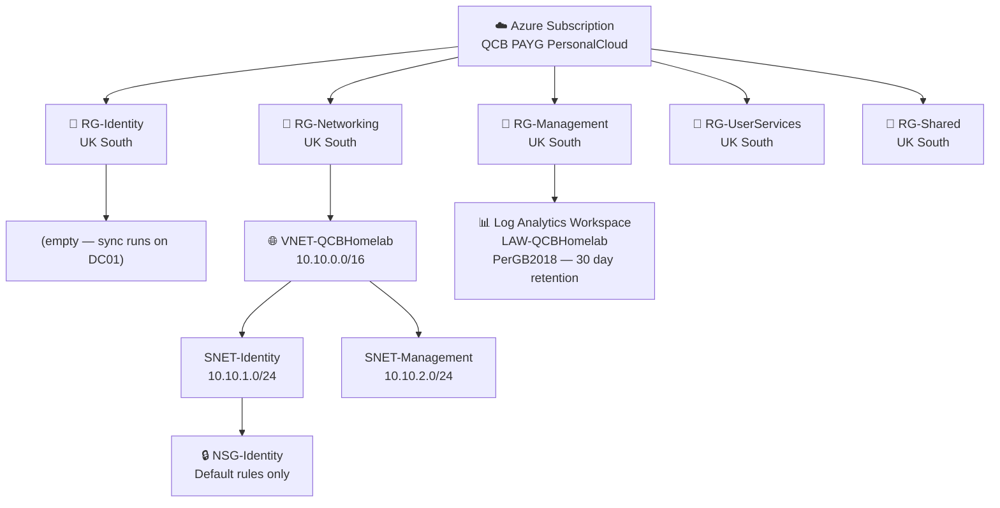

[← 02 — AD Provisioning Scripts](02-ad-scripts.md) &nbsp;|&nbsp; [🏠 README](../README.md) &nbsp;|&nbsp; [04 — Hybrid Identity →](04-hybrid-identity.md)

---

# 03 — Azure Resource Setup

## Introduction

Microsoft Azure is Microsoft's cloud platform — a global network of data centres where you can run virtual machines, store data, manage identities, and much more, paying only for what you use. Where Microsoft 365 handles the productivity layer (email, Teams, SharePoint), Azure handles the infrastructure layer.

In this project, Azure serves two purposes. First, it provides the networking foundation that would support cloud-hosted infrastructure in a production environment. Second, it gives us a structured, governed place to manage cloud resources using resource groups — logical containers that keep everything organised and easy to clean up.

A resource group is simply a folder in Azure. Everything inside it — virtual machines, storage accounts, network components — is grouped together so you can manage, monitor, and delete them as a unit. Good resource group design is a hallmark of a well-run Azure environment.

> **Note on scope:** The original design for this document included an Azure VM to run Entra Connect Sync. After reviewing the project requirements, that VM is not needed — Entra Connect Sync runs directly on QCBHC-DC01 (the on-premises domain controller), which is the recommended approach for a lab of this size. The networking foundation is still built here to reflect production-standard architecture, and the resources will be used when Defender telemetry is connected to Log Analytics in document 11.

---

## What We Are Building

| Resource Group | Purpose |
|---|---|
| RG-Identity | Reserved for hybrid identity resources — empty in this lab |
| RG-Networking | Virtual network, subnets, and network security groups |
| RG-Management | Log Analytics workspace for monitoring and security telemetry |
| RG-UserServices | Migration staging and user-facing Azure services |
| RG-Shared | Automation accounts and shared resources |

All resources are deployed to the **UK South** region, which is the closest Azure region for this project.

---

## Before You Start — Check for IP Range Conflicts

The Azure virtual network uses the `10.10.0.0/16` address range. Before creating it, confirm this does not conflict with any existing networks in your environment.

On an OpenWrt router, run:

```bash
ip addr | grep inet
```

In this lab, the local networks are:

- `192.168.1.0/24` — main LAN
- `10.20.0.0/24` — VLAN 20 (DMZ)

The Azure range `10.10.0.0/16` does not overlap with either of these, so there is no conflict. If your local network uses `10.10.x.x`, choose a different address space for the VNet.

---

## Before You Start — Set Your Default Region

Azure CLI has a configurable default location. Check what yours is set to before running any commands:

```bash
az configure --list-defaults
```

If the output shows `eastus` or any region other than `uksouth`, update it:

```bash
az configure --defaults location=uksouth
```

This ensures all commands default to the correct region without needing `--location uksouth` specified every time. Mixing regions in a single project creates unnecessary complexity and can introduce latency between resources.

> Changing your default location does not affect costs or free tier availability. Free tier allowances are tied to your subscription, not to any specific region.

---

## Azure Resource Hierarchy

The diagram below shows the full resource hierarchy — from subscription down to individual components — and how the networking layer is structured.



### Network Layout

```
VNET-QCBHomelab (10.10.0.0/16)
├── SNET-Identity    10.10.1.0/24  ← Would host sync VM in production
└── SNET-Management  10.10.2.0/24  ← Management and monitoring resources
```

The `/16` address space gives 65,536 addresses — far more than needed for this lab, but it leaves room to carve out additional subnets without planning conflicts. The `10.10.x.x` range is chosen specifically to avoid overlap with common home network ranges (`192.168.x.x`) and the lab DMZ (`10.20.x.x`).

---

## Implementation Steps

### Step 1 — Log in to Azure

**Azure CLI:**
```bash
az login
az account set --subscription "QCB PAYG PersonalCloud"
```

**PowerShell:**
```powershell
Connect-AzAccount
Set-AzContext -SubscriptionName "QCB PAYG PersonalCloud"
```

Confirm the correct subscription is active:

```bash
az account show --output table
```

Expected output:

```
EnvironmentName    Name                    State    TenantDefaultDomain
-----------------  ----------------------  -------  ---------------------
AzureCloud         QCB PAYG PersonalCloud  Enabled  qcbhomelab.online
```

### Step 2 — Create the Resource Groups

```bash
az group create --name RG-Identity     --location uksouth
az group create --name RG-Networking   --location uksouth
az group create --name RG-Management   --location uksouth
az group create --name RG-UserServices --location uksouth
az group create --name RG-Shared       --location uksouth
```

Verify all five were created:

```bash
az group list --output table
```

Expected output:

```
Name              Location    Status
----------------  ----------  ---------
RG-Identity       uksouth     Succeeded
RG-Networking     uksouth     Succeeded
RG-Management     uksouth     Succeeded
RG-UserServices   uksouth     Succeeded
RG-Shared         uksouth     Succeeded
```

> You may also see `NetworkWatcherRG` in the list — this is created automatically by Azure when you interact with networking resources. It is a system-managed resource group and costs nothing. It can be safely ignored.

### Step 3 — Create the Virtual Network

The virtual network provides private IP connectivity for any Azure-hosted resources. It is built now to reflect production-standard architecture, and would host the Entra Connect Sync VM in a real deployment.

```bash
az network vnet create \
  --name VNET-QCBHomelab \
  --resource-group RG-Networking \
  --location uksouth \
  --address-prefix 10.10.0.0/16 \
  --subnet-name SNET-Identity \
  --subnet-prefix 10.10.1.0/24
```

This creates the VNet and the first subnet in a single command. Then add the management subnet:

```bash
az network vnet subnet create \
  --name SNET-Management \
  --resource-group RG-Networking \
  --vnet-name VNET-QCBHomelab \
  --address-prefix 10.10.2.0/24
```

**Why two subnets?**

Subnets allow you to separate different types of resources and apply different security rules to each. The Identity subnet is where compute resources related to identity would sit. The Management subnet is for monitoring and administrative resources. Keeping them separate means a compromise in one subnet does not automatically give access to resources in the other.

### Step 4 — Create a Network Security Group

A Network Security Group (NSG) is a basic firewall that controls what traffic is allowed in and out of a subnet.

```bash
az network nsg create \
  --name NSG-Identity \
  --resource-group RG-Networking \
  --location uksouth
```

The NSG is created with the following default rules already in place — no additional rules are needed for this lab since there is no VM to administer:

**Inbound defaults:**

| Rule | Action | Description |
|---|---|---|
| AllowVnetInBound | Allow | Traffic from within the VNet |
| AllowAzureLoadBalancerInBound | Allow | Azure platform health probes |
| DenyAllInBound | Deny | Everything else |

**Outbound defaults:**

| Rule | Action | Description |
|---|---|---|
| AllowVnetOutBound | Allow | Traffic to other VMs in the VNet |
| AllowInternetOutBound | Allow | Outbound internet traffic |
| DenyAllOutBound | Deny | Everything else |

The outbound internet rule is important — it allows the Entra Connect Sync service on DC01 to reach Entra ID over HTTPS, and it allows Defender telemetry to reach Azure Monitor.

> **Production note:** In a real deployment with a VM in this subnet, you would add an inbound RDP rule restricted to your specific public IP address. Azure Bastion is the more secure alternative, but it incurs cost and is out of scope for this lab.

Then associate the NSG with the Identity subnet:

```bash
az network vnet subnet update \
  --name SNET-Identity \
  --resource-group RG-Networking \
  --vnet-name VNET-QCBHomelab \
  --network-security-group NSG-Identity
```

### Step 5 — Create a Log Analytics Workspace

Log Analytics is where Azure sends monitoring data, security alerts, and diagnostic logs. In this project, Defender for Business (document 11) will send endpoint telemetry here, providing a single place to search and analyse security events across all managed devices.

```bash
az monitor log-analytics workspace create \
  --workspace-name LAW-QCBHomelab \
  --resource-group RG-Management \
  --location uksouth \
  --sku PerGB2018
```

The `PerGB2018` SKU means you pay only for data ingested beyond the free allowance — approximately 5 GB per month. A lab environment with a handful of devices will not come close to this limit.

Key settings in the output to note:

| Field | Value | Meaning |
|---|---|---|
| retentionInDays | 30 | Logs kept for 30 days by default |
| dailyQuotaGb | -1.0 | No cap set — lab data will not exceed free tier |
| customerId | (unique ID) | Workspace ID used when connecting Defender in doc 11 |

### Step 6 — Verify the Setup

```bash
az resource list --output table
```

Expected output:

```
Name                    ResourceGroup     Location    Type                                      Status
----------------------  ----------------  ----------  ----------------------------------------  ---------
VNET-QCBHomelab         RG-Networking     uksouth     Microsoft.Network/virtualNetworks         Succeeded
NSG-Identity            RG-Networking     uksouth     Microsoft.Network/networkSecurityGroups   Succeeded
LAW-QCBHomelab          RG-Management     uksouth     Microsoft.OperationalInsights/workspaces  Succeeded
NetworkWatcher_uksouth  NetworkWatcherRG  uksouth     Microsoft.Network/networkWatchers         Succeeded
```

All resources should show `uksouth` and `Succeeded`. The `NetworkWatcher_uksouth` entry is expected and system-managed.

---

## Cost Confirmation

Every resource created in this document is free:

| Resource | Why It Is Free |
|---|---|
| Resource groups (×5) | Always free — logical containers only |
| Virtual network | Always free — up to 50 VNets included |
| Subnets (×2) | Always free — part of the VNet |
| Network security group | Always free |
| Log Analytics workspace | Free up to ~5 GB ingestion/month — lab data is well within this |
| NetworkWatcherRG | System-managed, always free |

No virtual machines are created in this document. The free tier B1s VM allowance (750 hours/month) is preserved for use in document 04 if needed.

---

## What to Expect

After completing these steps, the Azure foundation for the project is in place. The resource groups provide a clean, governed structure for all subsequent resources. The virtual network is ready to host compute resources if needed. The Log Analytics workspace is ready to receive telemetry from Defender for Business in document 11.

The empty resource groups (RG-Identity, RG-UserServices, RG-Shared) are intentional — they exist to show considered architecture rather than ad-hoc resource placement. In a production environment, they would be populated as the environment grows.

---

[← 02 — AD Provisioning Scripts](02-ad-scripts.md) &nbsp;|&nbsp; [🏠 README](../README.md) &nbsp;|&nbsp; [04 — Hybrid Identity →](04-hybrid-identity.md)
