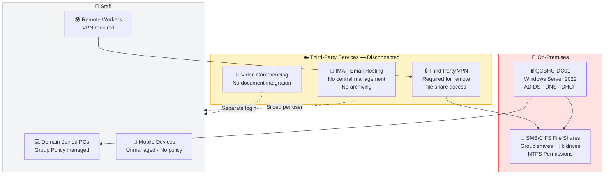
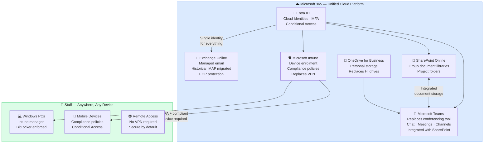

# Microsoft 365 Business Premium Migration — SME Blueprint

> *A complete end-to-end Microsoft 365 Business Premium migration blueprint — from on-premises Windows Server infrastructure to a fully cloud-based, security-hardened platform. Includes implementation guide, decision rationale, and working lab evidence.*

---

## About This Project

This project documents the full migration of a small business from ageing on-premises infrastructure to Microsoft 365 Business Premium. It is designed to serve three purposes simultaneously:

- **A how-to guide** — follow this documentation to plan and deliver the same migration for a real client
- **A project management blueprint** — the workstream sequence, dependencies, and decision rationale reflect real consulting practice
- **A portfolio evidence base** — every step is demonstrated with working lab screenshots, not theoretical description

> **The scenario uses QCB Homelab Consultants — a fictional company created specifically for this project. It does not represent a real organisation. All staff, data, and infrastructure are simulated.**

The lab environment is built on a Proxmox homelab running Windows Server 2022 Evaluation as a domain controller. Every component — Active Directory, SMB file shares, NTFS permissions, user accounts — was purpose-built to reflect what you would genuinely find in a real SME engagement.

---

## The Scenario

**QCB Homelab Consultants** is a fictional 15-person IT consultancy. Staff work primarily from client sites and home. Their infrastructure at the point of engagement:

- Windows Server running Active Directory, DNS, DHCP, and SMB file shares
- Company documents and project files on mapped network drives
- Personal files on mapped `H:` drives — no offsite backup
- Email on a third-party IMAP hosting provider — no central management, no archiving
- Video conferencing via a third-party tool — disconnected from documents and calendar
- Remote file access dependent on a third-party VPN
- No device management, no MFA, no centralised security policy

The business objective: eliminate on-premises hardware entirely and move to a single, managed cloud platform accessible from anywhere, on any device.

---

## Migration at a Glance

| Source — On-Premises | | Target — Microsoft 365 | Method |
|---|---|---|---|
| Active Directory (apex.local) | → | Entra ID — synced via Entra Connect | Microsoft Entra Connect |
| Third-party IMAP email | → | Exchange Online | IMAP migration via Exchange Admin Center |
| Third-party video conferencing | → | Microsoft Teams | Decommission + Teams rollout |
| SMB/CIFS group file shares | → | SharePoint Online document libraries | SharePoint Migration Tool (SPMT) |
| Personal home folders (H: drives) | → | OneDrive for Business | SPMT |
| Third-party VPN (remote access) | → | Intune + Conditional Access | Intune enrolment + compliance policies |

---

## Before & After Architecture

### Before — On-Premises Infrastructure

**Key problems:** Single point of failure. No offsite backup. VPN dependency for remote access. Unmanaged devices. No MFA. Three separate vendor relationships with no integration between them.

---

### After — Microsoft 365 Business Premium

**Outcome:** No on-premises infrastructure. No VPN. No separate conferencing tool. Single identity for every service. All devices managed and compliant. MFA enforced from day one.

---

## Technology Summary

| Workstream | Technology | Purpose |
|---|---|---|
| **Identity** | Microsoft Entra ID | Cloud identities, MFA, Conditional Access |
| **Email** | Exchange Online | Hosted email, EOP protection, historical IMAP migration |
| **Collaboration** | Microsoft Teams | Replaces third-party conferencing — chat, video, channels |
| **Group File Storage** | SharePoint Online | Company documents, project folders, technical library |
| **Personal Storage** | OneDrive for Business | Replaces mapped H: drives |
| **Device Management** | Microsoft Intune | Enrolment, compliance policies, replaces VPN dependency |
| **File Migration** | SharePoint Migration Tool (SPMT) | SMB shares → SharePoint; H: drives → OneDrive |
| **Security** | Conditional Access + EOP | Zero Trust access control, anti-spam, anti-phishing |
| **Automation** | PowerShell | User provisioning, bulk operations, validation |
| **Source: Directory** | Windows Server 2022 + AD DS | On-premises domain — migrated and decommissioned |

---

## Project Phases

The migration is delivered in the following sequence. Each phase has documented dependencies — the order matters.

| Phase | Workstream | Dependencies |
|---|---|---|
| **0 — Discovery** | Infrastructure audit, licensing decision, risk assessment | Client access |
| **1 — Identity** | Entra Connect sync, MFA enforcement, admin account separation | M365 tenant active, domain verified |
| **2 — Email** | Exchange Online setup, IMAP migration, MX cutover | Identity complete |
| **3 — File Shares** | SharePoint information architecture, SPMT group share migration | Identity complete |
| **4 — Home Folders** | OneDrive provisioning, H: drive migration via SPMT | SharePoint complete |
| **5 — Teams** | Team and channel structure, SharePoint integration, user adoption | File migration complete |
| **6 — Intune** | Device enrolment, compliance policies, Conditional Access | Identity complete |
| **7 — Security** | EOP hardening, Conditional Access validation, backup gap review | All workstreams complete |
| **8 — Decommission** | Server retirement, DNS cleanup, third-party contract cancellation, sign-off | UAT signed off |

---

## Project Index — Workstream Documentation

### Foundation

| # | Workstream | Description |
|---|---|---|
| [00](./docs/00-discovery-and-planning.md) | **Discovery & Planning** | Infrastructure audit, licensing decision, risk assessment, success criteria |

### Identity

| # | Workstream | Description |
|---|---|---|
| [01](./docs/01-identity-overview.md) | **Identity — Overview** | What identity means in M365 and what the end state looks like |
| [01a](./docs/01a-entra-connect-installation.md) | **Entra Connect — Installation** | Installing and configuring Microsoft Entra Connect on the DC |
| [01b](./docs/01b-entra-connect-sync-verification.md) | **Entra Connect — Sync Verification** | Verifying all users synced correctly into Entra ID |
| [01c](./docs/01c-user-provisioning-methods.md) | **User Provisioning Methods** | Three methods compared — Entra Connect, PowerShell, Admin Center |
| [01d](./docs/01d-group-creation-and-licensing.md) | **Group Creation & Licensing** | Security groups in Entra ID, group-based licence assignment |
| [01e](./docs/01e-admin-account-separation.md) | **Admin Account Separation** | Break-glass account, working admin account, least privilege |
| [01f](./docs/01f-mfa-and-security-defaults.md) | **MFA & Security Defaults** | Enforcing MFA via Conditional Access, disabling security defaults |

### Email

| # | Workstream | Description |
|---|---|---|
| [02](./docs/02-email-migration.md) | **Email Migration** | Exchange Online setup, IMAP migration, MX cutover |

### File Migration

| # | Workstream | Description |
|---|---|---|
| [03](./docs/03-file-share-migration.md) | **File Share Migration** | NTFS audit, SPMT migration of group shares to SharePoint |
| [04](./docs/04-onedrive-home-folders.md) | **OneDrive & Home Folders** | H: drive migration to OneDrive via SPMT |

### SharePoint & Collaboration

| # | Workstream | Description |
|---|---|---|
| [05](./docs/05-sharepoint-design-and-pitfalls.md) | **SharePoint Design & Pitfalls** | Information architecture, platform limits, real-world migration pitfalls |
| [06](./docs/06-teams-setup.md) | **Microsoft Teams** | Team and channel structure, SharePoint integration, user adoption |

### Security & Devices

| # | Workstream | Description |
|---|---|---|
| [07](./docs/07-intune-device-management.md) | **Intune Device Management** | Device enrolment, compliance policies, GPO-to-Intune mapping |
| [08](./docs/08-security.md) | **Security** | Zero Trust design, Conditional Access, EOP, backup gap |

### Closeout

| # | Workstream | Description |
|---|---|---|
| [09](./docs/09-decommission.md) | **Decommission** | Server retirement, DNS cleanup, third-party cancellations, sign-off |
| [10](./docs/10-lessons-learned.md) | **Lessons Learned** | What worked, what to do differently, lab vs production |

### Runbooks

| Runbook | Description |
|---|---|
| [DNS & MX Record Reference](./runbooks/mx-record-cutover.md) | DNS records added automatically via Cloudflare Domain Connect — this runbook documents what was added and why |
| [User Onboarding Runbook](./runbooks/user-onboarding.md) | Step-by-step guide for onboarding a new user post-migration |

---

## Key Outcomes & Business Benefits

| Outcome | Detail |
|---|---|
| **Infrastructure eliminated** | Windows Server, SMB shares, and on-premises dependencies fully decommissioned |
| **Vendor consolidation** | Three separate vendor relationships — email, conferencing, VPN — replaced by a single Microsoft 365 platform |
| **Remote access secured** | Staff access all resources from any location, any device — no VPN required |
| **Email centralised** | All mailboxes on Exchange Online with full historical email migrated |
| **H: drives replaced** | Personal home folders migrated to OneDrive — accessible on any device |
| **Data protected** | SharePoint version history, recycle bin, and audit logging replace unreliable local backups |
| **Devices managed** | Intune compliance policies enforce BitLocker, screen lock, and minimum OS version |
| **Security posture** | MFA enforced · Conditional Access · Legacy authentication blocked · EOP enabled |
| **Predictable cost** | Per-seat model replaces unpredictable server hardware lifecycle and multiple vendor contracts |

---

## What This Demonstrates

**End-to-end delivery capability.** This project covers the full consulting lifecycle — discovery, planning, licensing decision, migration execution, security hardening, and formal decommission. Every decision is documented and justified, not just executed.

**Consulting maturity.** Every technology decision is accompanied by a business justification. Microsoft 365 Business Premium is recommended over cheaper SKUs for specific, documented reasons. The SharePoint information architecture is designed before a single file is migrated. The backup gap in Microsoft 365 is documented rather than ignored.

**Vendor consolidation thinking.** This migration is approached as a platform consolidation — replacing three separate vendor relationships with a single integrated platform. That distinction — between a file migration and a platform strategy — is the difference between a technician and a consultant.

**Security-first design.** MFA, Conditional Access, legacy authentication blocking, and Zero Trust principles are built into the design from Phase 1 — not added at the end.

**Repeatable process.** The documentation is written as a blueprint — someone could follow this guide to deliver the same migration for a real client. That is intentional.

---

## Lab vs Production — Honest Disclosure

This project is built in a homelab environment. The following differences from a production engagement are documented throughout:

| Area | Lab Approach | Production Approach |
|---|---|---|
| **AD Sync** | Entra Connect installed on DC — syncing apex.local to Entra ID | Entra Connect Sync or Cloud Sync — same approach |
| **Licensing** | Microsoft 365 Business Premium trial | Purchased via CSP partner or Microsoft direct |
| **Custom domain** | `qcbhomelab.online` — owned by portfolio author | Client's own registered domain |
| **M365 tenant** | Personal lab tenant | Dedicated client tenant |
| **DNS records** | Added automatically via Cloudflare Domain Connect | Same — or manually added if DNS not on Cloudflare |
| **Internal AD domain** | `apex.local` with `@qcbhomelab.online` UPN suffix | Client's public domain throughout |
| **NetBIOS domain** | `APEX\` — set at domain creation, not changed | Inherited from client environment |
| **Email source** | Simulated IMAP accounts | Live third-party IMAP with DNS cutover coordination |
| **Devices** | Single test device enrolled in Intune | Full fleet enrolment, potentially with Windows Autopilot |
| **H: drive migration** | Process documented with SPMT screenshots | Production run against live mapped drives |
| **Backup** | Not implemented — gap explicitly documented | Third-party backup solution required |
| **Company** | QCB Homelab Consultants — **fictional** | Real client — confidential |

---

*All documentation in this project represents genuine hands-on work. No real client data, credentials, or confidential information is included anywhere in this repository.*
