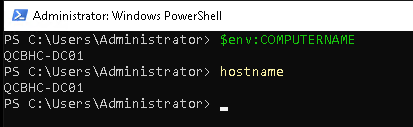
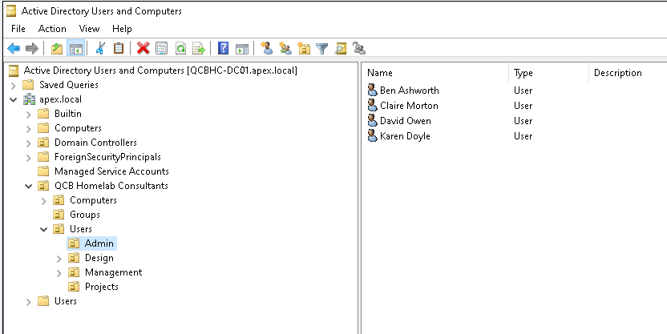
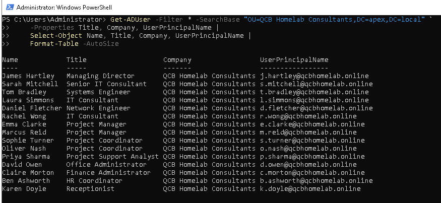
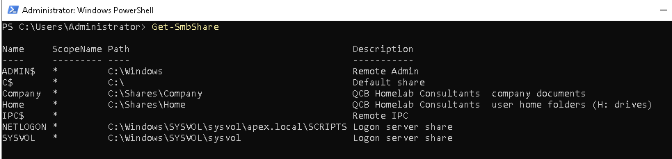
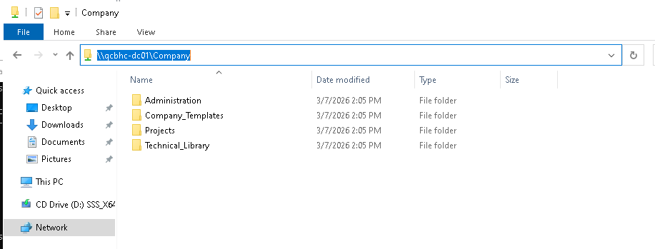
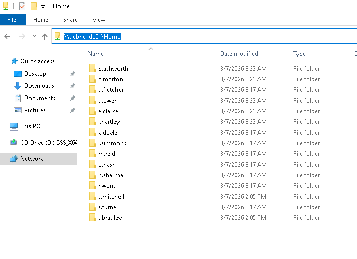

# 00 — Discovery & Planning

## In Plain English

Before moving anything to the cloud, we need to understand exactly what we are working with.
This phase is about taking stock — documenting every user account, every shared folder, every
email mailbox, and every piece of infrastructure that needs to move. Think of it like a
professional removal company surveying your house before moving day. They walk every room,
note every item, and plan the lorry accordingly. Nobody wants surprises on the day.

This discovery work also protects the consultant. If something is missed or breaks during
migration, the discovery documentation proves what the environment looked like before work
began — and what decisions were made and why.

---

## Why This Matters

Skipping or rushing discovery is the single most common cause of migration problems.
Undocumented shares, users with data in unexpected locations, stale accounts that create
security gaps, and permission structures that do not map cleanly to SharePoint all surface
during migration if they were not identified beforehand.

Discovery answers four questions before any work begins:

- What exists?
- What needs to move?
- What are the risks?
- What does success look like?

---

## Prerequisites

- Physical or remote access to the on-premises domain controller
- Domain Administrator credentials
- Microsoft Graph PowerShell module installed
- The target Microsoft 365 tenant provisioned

---

> ## ⚠️ Lab Simulation Notice
>
> **QCB Homelab Consultants is a fictional company created specifically for this portfolio.**
>
> The environment does not represent a real organisation. It was purpose-built in a homelab
> to provide genuine, screenshot-evidenced infrastructure rather than describing the migration
> process theoretically.
>
> | Detail | Value |
> |---|---|
> | **Lab platform** | Proxmox homelab — two nodes |
> | **Domain controller** | Windows Server 2022 Evaluation VM |
> | **Internal AD domain** | `apex.local` |
> | **UPN / email domain** | `qcbhomelab.online` — registered domain |
> | **M365 tenant** | Personal lab tenant — `[tenant].onmicrosoft.com` |
> | **NetBIOS domain** | `APEX\` — set at domain creation, not modified |
> | **Company** | QCB Homelab Consultants — fictional |
> | **Staff** | 15 fictional accounts — not real people |
>
> From this point forward the documentation is written as a real engagement. Lab differences
> from production are called out where relevant.

---

## Lab vs Production

| Component | Lab | Production |
|---|---|---|
| Windows Server | Server 2022 Standard Evaluation | Licensed Windows Server |
| Active Directory | Purpose-built, clean structure | Years of accumulated users, GPOs, legacy objects |
| UPN suffix | `@qcbhomelab.online` | Client's own registered domain |
| File share data | Realistic dummy documents | Real client files — confidential |
| Email | Simulated IMAP accounts | Live mailboxes on third-party hosting |
| Network | DHCP reservation | Static IP, internal DNS zone |
| M365 tenant | Personal lab tenant | Dedicated client tenant |

---

## The Client Scenario

**QCB Homelab Consultants** is a fictional 15-person IT consultancy. Staff work primarily
from client sites and home. They produce project reports, network diagrams, technical
documentation, and client correspondence.

Their infrastructure at the point of engagement:

- A single Windows Server running Active Directory, DNS, DHCP, and SMB file shares
- Company documents and project files on mapped network drives (`\\QCBHC-DC01\Company`)
- Personal files on mapped `H:` drives (`\\QCBHC-DC01\Home`) — no offsite backup
- Email on a third-party IMAP provider — no central management, no archiving
- Video conferencing via a third-party tool — no integration with documents or calendar
- Remote file access requiring a third-party VPN
- No device management policy
- No MFA anywhere

**The business objective:** eliminate on-premises hardware entirely and consolidate onto a
single managed cloud platform accessible from anywhere, on any device, without VPN or server
maintenance overhead.

---

## Infrastructure Discovery

### Domain Controller

The first step is confirming the hostname and verifying the server is the domain controller
we expect. In a real engagement this catches situations where there are multiple DCs, or
where the environment differs from what was described in the initial brief.

```powershell
$env:COMPUTERNAME
```


*Domain controller hostname confirmed — QCBHC-DC01*

---

### Active Directory Domain

Key checks: domain functional level, single vs multi-domain structure, trust relationships,
and whether any legacy functional level baggage exists from older domain promotions.

```powershell
Get-ADDomain
```

| Property | Value |
|---|---|
| Domain Name | apex.local |
| NetBIOS Name | APEX |
| Forest | apex.local |
| Domain Mode | Windows2016Domain |
| PDC Emulator | QCBHC-DC01.apex.local |
| Infrastructure Master | QCBHC-DC01.apex.local |

Clean result: single domain, single DC, Windows 2016 functional level. No trusts, no RODC,
no legacy baggage.


*apex.local domain confirmed — single DC, clean structure*

---

### Organisational Unit Structure

The OU structure determines how users, computers, and groups are organised and how Group
Policy is applied. A clean OU structure makes Entra Connect sync significantly easier.

Best practice: users should be in department OUs, not the default `CN=Users` container.

```
apex.local
└── QCB Homelab Consultants (OU)
    ├── Computers
    ├── Groups
    └── Users
        ├── Admin
        ├── Design
        ├── Management
        └── Projects
```


*Active Directory Users and Computers — QCB Homelab Consultants OU with department sub-OUs*

---

### User Accounts

15 user accounts across four departments. All accounts enabled, assigned to department OUs,
with UPNs matching the registered domain used for Microsoft 365.

> **Production note:** In a real engagement, expect stale accounts, shared mailboxes, service
> accounts, and accounts in the default Users container. A full audit should identify all of
> these before Entra Connect sync begins.

| Department | Users | Count |
|---|---|---|
| Management | James Hartley | 1 |
| Design | Sarah Mitchell, Tom Bradley, Laura Simmons, Daniel Fletcher, Rachel Wong | 5 |
| Projects | Emma Clarke, Marcus Reid, Sophie Turner, Oliver Nash, Priya Sharma | 5 |
| Admin | David Owen, Claire Morton, Ben Ashworth, Karen Doyle | 4 |
| **Total** | | **15** |

The UPN suffix `@qcbhomelab.online` is added to the AD forest and applied to all user
accounts. This ensures the on-premises UPN matches the domain verified in Microsoft 365 —
a requirement for Entra Connect to match identities correctly.

```powershell
# Add the custom domain as a UPN suffix
Get-ADForest | Set-ADForest -UPNSuffixes @{Add="qcbhomelab.online"}

# Apply to all users
Get-ADUser -Filter * -SearchBase "OU=QCB Homelab Consultants,DC=apex,DC=local" |
  ForEach-Object {
    Set-ADUser $_ -UserPrincipalName ($_.SamAccountName + "@qcbhomelab.online")
  }

# Verify
Get-ADUser -Filter * -SearchBase "OU=QCB Homelab Consultants,DC=apex,DC=local" `
    -Properties Title, Company, UserPrincipalName |
    Select-Object Name, Title, Company, UserPrincipalName |
    Format-Table -AutoSize
```


*All 15 users confirmed — correct titles, company attribute, and @qcbhomelab.online UPNs*

---

### Security Groups

Security groups are the permission mechanism for SMB share access. The same group structure
informs the SharePoint permission design in the target environment.

| Group | Purpose |
|---|---|
| GRP-AllStaff | Company-wide access to shared resources |
| GRP-Management | Management department |
| GRP-Design | Design team |
| GRP-Projects | Project managers and coordinators |
| GRP-Admin | Administration — office, finance, HR |
| GRP-CADUsers | Technical library access — Design team only |

> **Design decision:** `GRP-CADUsers` is separate from `GRP-Design`. This allows non-Design
> staff to be granted Technical Library access without being added to the Design department
> group — a common real-world requirement.

---

### File Share Audit

Two SMB shares on `\\QCBHC-DC01`:

| Share | Path | Purpose |
|---|---|---|
| `Company` | `C:\Shares\Company` | Group documents — all staff |
| `Home` | `C:\Shares\Home` | Personal home folders — H: drives |

```powershell
Get-SmbShare | Where-Object {$_.Name -in @("Company","Home")} |
    Format-Table Name, Path, Description -AutoSize
```


*Company and Home shares confirmed via Get-SmbShare*

**Company share structure:**

```
\\QCBHC-DC01\Company
├── Projects
│   ├── PROJ001_Network_Infrastructure
│   │   ├── Diagrams
│   │   ├── Correspondence
│   │   └── Reports
│   └── PROJ002_Cloud_Migration
│       ├── Diagrams
│       ├── Correspondence
│       └── Reports
├── Technical_Library
│   ├── Standard_Configs
│   └── Templates
├── Company_Templates
└── Administration
    ├── HR
    └── Finance
```


*\\QCBHC-DC01\Company — group file share root*

**NTFS permission matrix:**

| Folder | GRP-AllStaff | GRP-Design | GRP-Projects | GRP-Admin | GRP-CADUsers |
|---|---|---|---|---|---|
| Company (root) | Read | — | — | — | — |
| Projects | Read | Modify | Modify | — | — |
| Technical_Library | Read | — | — | — | Modify |
| Company_Templates | Read | — | — | — | — |
| Administration | ❌ | ❌ | ❌ | Modify | — |

**Key permission decisions:**

**Administration breaks inheritance.** HR and Finance data is confidential. Inheritance is
explicitly broken and access denied to all non-Admin groups. This is least privilege by design.

**Share permissions vs NTFS permissions.** Share-level permissions grant `Authenticated Users`
Change access. NTFS is the enforcement layer. This is standard SMB best practice.

**Home folders:**

Each user has an individual home folder with inheritance broken. Only the user and Domain
Admins have access. The `H:` drive is mapped via AD user attributes (`homeDirectory` +
`homeDrive`).


*\\QCBHC-DC01\Home — all 15 user H: drive folders*

---

## Risk Assessment

| Risk | Likelihood | Impact | Mitigation |
|---|---|---|---|
| Data loss during file migration | Low | High | SPMT pre-migration scan — validate file counts before and after |
| Email loss during MX cutover | Low | High | Migrate historical email before cutover — keep IMAP live for two weeks post-cutover |
| User disruption — unfamiliar platform | Medium | Medium | User guides prepared before cutover — phased rollout where possible |
| H: drive paths broken post-migration | Low | Medium | OneDrive sync client briefed to users — mapped drive GPOs updated |
| NTFS permissions not mapping to SharePoint | Medium | Medium | Review SPMT permission report post-migration — validate against matrix |
| Single DC — no redundancy | High | High | Existing risk — mitigated by migration, DC decommissioned |
| Stale accounts creating security gaps | Medium | Medium | Full AD audit before sync — disable stale accounts before migration |

---

## Licensing Decision

Three Microsoft 365 SKUs are relevant for an SME of this size. The decision should be driven
by security and device management requirements — not just cost.

| Feature | Business Basic | Business Standard | **Business Premium** |
|---|---|---|---|
| Exchange Online | ✅ | ✅ | ✅ |
| SharePoint Online | ✅ | ✅ | ✅ |
| Microsoft Teams | ✅ | ✅ | ✅ |
| Office Apps (desktop) | ❌ | ✅ | ✅ |
| Intune device management | ❌ | ❌ | ✅ |
| Entra ID P1 (Conditional Access) | ❌ | ❌ | ✅ |
| Defender for Business | ❌ | ❌ | ✅ |

**Recommendation: Microsoft 365 Business Premium**

**1 — Intune is not optional.** Without device management there is no way to enforce security
policy on devices connecting to company data.

**2 — Conditional Access requires Entra ID P1.** Per-user MFA is a blunt instrument.
Conditional Access enforces MFA plus compliant device as a combined requirement and blocks
legacy authentication protocols entirely.

**3 — Defender for Business is included.** Endpoint protection at no additional cost removes
the need for a separate endpoint security product.

> The cost difference between Business Standard and Business Premium is marginal against the
> cost of a single security incident or a separate endpoint protection product.

---

## Project Phases

| Phase | Workstream | Dependencies |
|---|---|---|
| **0 — Discovery** | Infrastructure audit, licensing, risk assessment | Client access |
| **1 — Identity** | Entra Connect sync, MFA, admin separation | M365 tenant active |
| **2 — Email** | Exchange Online, IMAP migration, MX cutover | Identity complete |
| **3 — File Shares** | SharePoint architecture, SPMT migration | Identity complete |
| **4 — Home Folders** | OneDrive, H: drive migration | SharePoint complete |
| **5 — Teams** | Team structure, SharePoint integration | File migration complete |
| **6 — Intune** | Device enrolment, compliance, Conditional Access | Identity complete |
| **7 — Security** | EOP hardening, Conditional Access validation | All workstreams complete |
| **8 — Decommission** | Server retirement, DNS cleanup, sign-off | UAT signed off |

---

## Success Criteria

- [ ] All users can sign in to Microsoft 365 with MFA enforced
- [ ] All mailboxes live on Exchange Online with historical email accessible
- [ ] All Company share content migrated to SharePoint with permissions validated
- [ ] All H: drive content migrated to individual OneDrive accounts
- [ ] At least one device enrolled in Intune and showing compliant
- [ ] Conditional Access policy enforcing MFA and compliant device
- [ ] Legacy authentication blocked
- [ ] Domain controller powered off with no user-reported impact
- [ ] Third-party email, conferencing, and VPN contracts cancelled

---

## Communication Plan

| Audience | Message | Channel |
|---|---|---|
| All staff | What is changing, why, and what to expect | Email and team briefing |
| All staff | How to install and use the OneDrive sync client | Email with guide |
| All staff | New email settings and Teams setup | Email sent from old system on cutover day |
| Management | Progress updates at each phase completion | Direct |
| Individual users | H: drive migration confirmation | Email post-migration |

---

## Summary

At the end of discovery the following are documented and confirmed:

- Single domain controller — `QCBHC-DC01` running `apex.local`
- 15 user accounts across four department OUs
- UPN suffix `@qcbhomelab.online` applied to all users
- Six security groups with correct membership
- Two SMB shares — Company and Home — with NTFS permission matrix documented
- Risk assessment completed
- Business Premium licensing decision confirmed
- Success criteria defined

The environment is fully understood. Migration planning can proceed.

---

*Next: [01 — Identity Overview →](./01-identity-overview.md)*
