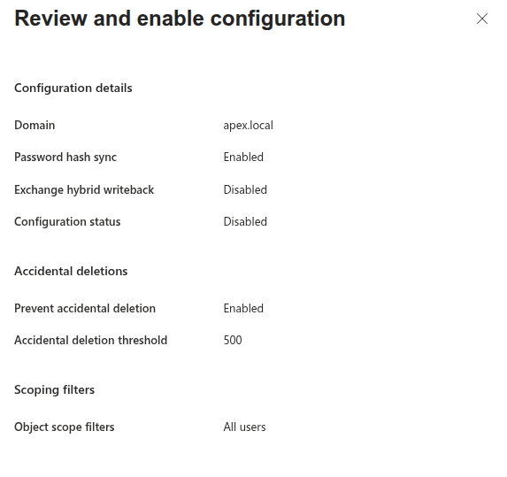

# 01a — Entra Cloud Sync Installation

## In Plain English

Entra Cloud Sync is a lightweight agent installed on the on-premises server that bridges the local Active Directory and Microsoft 365. Once running, every user account in Active Directory is automatically mirrored into the cloud — staff can log in to Microsoft 365 with the same username and password they already use at work. Without this, every account would need to be created in the cloud by hand, one at a time.

## Why This Matters

QCB Homelab Consultants has 15 user accounts already defined in Active Directory on QCBHC-DC01. Recreating them manually in Entra ID would introduce inconsistencies, waste time, and leave no repeatable process for future starters. Cloud Sync solves all three problems: it reads the existing accounts from `apex.local`, creates matching cloud identities in the `qcbhomelab.online` tenant, and keeps them in sync automatically thereafter. This is the foundation on which every subsequent workstream — email, file migration, device management, and security policy — depends.

## Prerequisites

| Requirement | Status |
|---|---|
| QCBHC-DC01 running Windows Server 2022 | ✅ Confirmed |
| Active Directory domain: `apex.local` | ✅ Confirmed |
| 15 user accounts with UPN suffix `@qcbhomelab.online` | ✅ Confirmed |
| M365 tenant `qcbhomelab.online` verified as default domain | ✅ Confirmed |
| Working admin account: `m365admin@qcbhomelab.online` | ✅ Confirmed |
| Access to Microsoft Entra admin centre to download agent | ✅ Required before starting |
| Domain Controller not running AD FS or existing sync tool | ✅ Confirmed — clean install |

> **Note:** The provisioning agent must be installed on a domain-joined machine with line-of-sight to a Domain Controller. In this lab, it is installed directly on QCBHC-DC01.

---

## Key Decision: Cloud Sync vs Connect Sync

Microsoft offers two synchronisation paths. This decision is worth documenting for any real engagement.

### Connect Sync

The original on-premises sync tool. Installs a full application on the domain controller, including a local SQL Express database. Suited to complex topologies — multiple forests, hybrid Exchange deployments, AD FS federation, or custom attribute filtering. Microsoft has stopped releasing new versions to the Download Centre; updates are now available only via the Entra portal. It is in maintenance rather than active development.

### Cloud Sync

The next-generation synchronisation tool. Installs a lightweight provisioning agent on the domain controller; all configuration is managed from the Entra admin centre rather than a local wizard. No local SQL dependency. Designed for organisations reducing their on-premises footprint and building cloud-first.

### Decision for This Deployment

**Cloud Sync was selected.** Microsoft's own guidance describes Connect Sync as the solution for organisations that "rely on their on-premises infrastructure to manage their business" — the opposite of what this project is doing. Cloud Sync is described as the right choice for organisations pursuing a "cloud first strategy" looking to "reduce the on-premises footprint." That is precisely the brief.

QCB Homelab Consultants has a single forest (`apex.local`), a single domain, no hybrid Exchange, no AD FS, and no complex topology. There is no justification for the additional overhead of Connect Sync. Cloud Sync is the current, actively developed solution and the correct choice for any SME engagement starting today.

> For engagements with multiple forests, hybrid Exchange, or AD FS requirements, revisit this decision. Those scenarios may still require Connect Sync.

---

## Installation Procedure

### Step 1 — Launch the Installer

Run `AADConnectProvisioningAgentSetup.exe` on QCBHC-DC01.

Accept the licence agreement to proceed.

> **Screenshot:**
>
> 
>
> Installer launch screen with licence agreement

---

### Step 2 — Provisioning Agent Configuration Wizard

The installer launches the provisioning agent configuration wizard.

This wizard handles all remaining installation steps.

> **Screenshot:**
>
> 
>
> Provisioning agent configuration wizard welcome screen

---

### Step 3 — Connect to Microsoft Entra ID

Enter the Entra ID Global Administrator credentials to register the agent against the tenant.

- **Username:** `m365admin@qcbhomelab.online`
- **Password:** *(credentials not recorded in documentation)*

> **Screenshot:**
>
> 
>
> Entra ID credential entry and authentication

---

### Step 4 — Configure Service Account

Enter domain administrator credentials.

The wizard uses these to create a Group Managed Service Account (gMSA) in Active Directory that the provisioning agent will use to read the directory. This account (`pGMSA_xxxxxxxx$`) is created automatically — you do not need to create it manually.

- **Account:** `APEX\Administrator`
- **Password:** *(credentials not recorded in documentation)*

> **Screenshot:**
>
> 
>
> Service account configuration with domain admin credentials

---

### Step 5 — Connect Active Directory

The wizard presents the detected Active Directory domains.

Select `apex.local` to confirm it as the directory to synchronise.

> **Screenshot:**
>
> 
>
> Active Directory domain selection showing apex.local

---

### Step 6 — Installation Complete

The wizard confirms the agent is installed, registered, and running.

> **Screenshot:**
>
> 
>
> Installation complete confirmation screen

---

## Post-Installation Configuration

Installing the agent does not start synchronisation. The sync scope — which OUs to sync, which attributes to include — is configured from the Entra portal, not the server. This is a deliberate design difference from Connect Sync.

### Step 7 — Configure a Sync Configuration in the Entra Portal

Return to the Entra admin centre:

**Search for Microsoft Entra Connect → Select Cloud Sync in the left pane**

The newly registered agent will appear under **Agents** in the left pane.

Confirm it shows as **Healthy** before proceeding.

> **Screenshot:**
>
> 
>
> Entra portal showing provisioning agent as Healthy

Select **New configuration** and choose **Microsoft Entra ID sync (formerly Azure Active Directory)**.

---

### Step 8 — Define the Sync Scope

We want to configure AD → Entra ID (sync users up to the cloud).

The 15 users live on-prem and you're creating their cloud identities.

> **Note:** The second option (Microsoft Entra ID to AD sync) runs in the opposite direction — do not select this.

#### 8.1 — New Configuration

Click **Configurations** in the left pane → **New configuration** → **AD to Microsoft Entra sync**.

Configure the sync scope for the `apex.local` domain:

- **Domain:** `apex.local`
- **Scope:** All users — no OU filtering required for this deployment (all 15 users are in scope)
- **Attribute mapping:** Accept defaults

#### 8.2 — Test Before Enabling (Recommended)

Run the built-in test before enabling sync. It performs a dry run against `apex.local` and flags any problems — UPN mismatches, unsupported characters in names, accounts that will not sync cleanly — before anything is written to Entra ID.

> **Screenshot:**
>
> 

> **Screenshot:**
>
> 
>
> Sync scope configuration showing apex.local in scope

---

### Step 9 — Enable and Start Sync

Review the configuration summary and select **Enable**. Cloud Sync will begin its initial synchronisation cycle immediately.

> **Screenshot:**
>
> 
>
> Configuration enabled confirmation in Entra portal

---

## ✅ If Sync Is Working — Confirm and Move On

If the agent shows as **Healthy** and users appear in Entra ID within 5–10 minutes, run the following validation checks and proceed to [01b — Entra Connect Sync Verification](./01b-entra-connect-sync-verification.md).

### Confirm Agent Health in the Portal

| Item | Expected State |
|---|---|
| Provisioning agent | Healthy |
| Last sync | Completed without errors |
| Sync status | Active |

> **Screenshot:**
>
> 
>
> Portal showing healthy agent and completed initial sync

### Confirm Service Running on QCBHC-DC01

```powershell
Get-Service -Name "AADConnectProvisioningAgent"
```

Expected output: `Status: Running`

> **Screenshot:**
>
> 
>
> Services console showing agent as Running

---

## ⚠️ Troubleshooting — Provisioning Quarantine

In this lab environment, the agent entered a **quarantine** state immediately after installation. This section documents the investigation and findings. This is real-world troubleshooting that any consultant may encounter.

### What Is Quarantine?

Entra ID places a provisioning configuration into quarantine when it detects a persistent error that prevents sync from running reliably. The agent may show as **Active** in the agents panel while the provisioning configuration is simultaneously quarantined — these are two separate status indicators.

Clearing quarantine without fixing the underlying cause will result in it re-entering quarantine within minutes.

---

### Diagnostic Tests

Run these tests to establish baseline connectivity from the domain controller.

#### Test 1 — Confirm the Agent Is Running

```powershell
Get-Service -Name "AADConnectProvisioningAgent"
```

#### Test 2 — Test Required Endpoint Connectivity

Cloud Sync requires outbound access to the following endpoints:

```powershell
Test-NetConnection servicebus.windows.net -Port 443
Test-NetConnection servicebus.windows.net -Port 5671
Test-NetConnection login.microsoftonline.com -Port 443
Test-NetConnection management.azure.com -Port 443
```

| Endpoint | Port | Purpose |
|---|---|---|
| `servicebus.windows.net` | 443 | WebSocket signalling channel (primary) |
| `servicebus.windows.net` | 5671 | AMQP signalling channel (fallback) |
| `login.microsoftonline.com` | 443 | Authentication |
| `management.azure.com` | 443 | Azure management plane |

> **In this lab:** `login.microsoftonline.com` and `management.azure.com` passed immediately. Both ports on `servicebus.windows.net` failed — the IP `65.55.54.16` was unreachable.

#### Test 3 — Read the Agent Log

The provisioning agent writes detailed logs to:

```
C:\ProgramData\Microsoft\Azure AD Connect Provisioning Agent\Trace\
```

Find and read the most recently written log:

```powershell
$latestLog = Get-ChildItem "C:\ProgramData\Microsoft\Azure AD Connect Provisioning Agent\Trace\AzureADConnectProvisioningAgent_*.log" | 
    Sort-Object LastWriteTime -Descending | 
    Select-Object -First 1

Write-Host "Reading: $($latestLog.Name)"
Get-Content $latestLog.FullName -Tail 50
```

> **In this lab:** The log showed repeated `ServiceBusClientWebSocket was expecting more bytes` and `connection was forcibly closed by the remote host` errors — confirming the ServiceBus endpoint was the specific point of failure.

---

### Fix 1 — Configure WebSocket Mode (Port 443 Only)

By default, the agent uses AMQP on port 5671 for its ServiceBus connection. If port 5671 is blocked, the agent can be configured to use AMQP-over-WebSockets on port 443 instead.

Add the following key to the agent config file:

```powershell
$configPath = "C:\Program Files\Microsoft Azure AD Connect Provisioning Agent\AADConnectProvisioningAgent.exe.config"

$xml = [xml](Get-Content $configPath)
$appSettings = $xml.configuration.appSettings

$newKey = $xml.CreateElement("add")
$newKey.SetAttribute("key", "ServiceBusConnectionMode")
$newKey.SetAttribute("value", "WebSocket")
$appSettings.AppendChild($newKey)

$xml.Save($configPath)
```

Restart the agent:

```powershell
Restart-Service -Name "AADConnectProvisioningAgent"
Start-Sleep -Seconds 10
Get-Service -Name "AADConnectProvisioningAgent"
```

> **In this lab:** This change was made successfully and survived a subsequent re-registration of the agent. However, quarantine continued — further investigation revealed the root cause was deeper than the port.

---

### Root Cause — ISP-Level Block on `servicebus.windows.net`

Further investigation using `tracert` identified that traffic to `65.55.54.16` (the only IP published for `servicebus.windows.net`) was being dropped at the ISP's upstream router — not at the local firewall or the domain controller.

```powershell
tracert 65.55.54.16
```

Traffic died consistently at hop 7, regardless of VPN exit node used. DNS queries to both `8.8.8.8` and `1.1.1.1` confirmed that `servicebus.windows.net` resolves to a single IP globally — there is no alternative address to route to.

```powershell
Resolve-DnsName servicebus.windows.net -Server 8.8.8.8
Resolve-DnsName servicebus.windows.net -Server 1.1.1.1
```

TLS verification confirmed Microsoft was rejecting the connection at the handshake level for all tested VPN exit nodes in the Netherlands and United States:

```powershell
$tc = New-Object System.Net.Sockets.TcpClient("servicebus.windows.net", 443)
$ssl = New-Object System.Net.Security.SslStream($tc.GetStream())
$ssl.AuthenticateAsClient("servicebus.windows.net")
Write-Host "Issuer: $($ssl.RemoteCertificate.Issuer)"
$ssl.Close()
$tc.Close()
```

For comparison, TLS to `outlook.office365.com` succeeded cleanly through the same VPN, confirming the block is specific to the ServiceBus IP range and not a general Microsoft connectivity issue.

---

### Options for Resolution

The table below summarises the available paths forward depending on the environment.

| Option | Description | Suitable For |
|---|---|---|
| **Fix ISP routing** | Contact the ISP and request that the `65.55.54.16` IP range is unblocked | Production environments — the correct long-term fix |
| **Use a different internet connection** | Test on a mobile hotspot or alternative ISP to confirm sync works correctly outside the blocked network | Validation and lab testing |
| **Use a VPN with clean exit IPs** | A paid VPN service with IP ranges not blocked by Microsoft | Lab environments where ISP cannot be changed |
| **Proceed without sync** | Create Entra ID accounts via CSV bulk import or PowerShell using Graph API | Lab and portfolio use — documented in 01c |

> **In this lab:** The ISP block could not be resolved within the lab environment. The project proceeded using direct account creation in Entra ID. This is documented in [01c — Manual Identity Import](./01c-manual-identity-import.md). The Cloud Sync configuration remains installed and correctly configured — it will function correctly on a network without this restriction.

---

### Additional Notes for Real Engagements

- Always run `Test-NetConnection servicebus.windows.net -Port 443` before beginning a Cloud Sync deployment. If this fails, resolve connectivity before installing the agent.
- The gMSA account created during installation (`pGMSA_xxxxxxxx$`) is normal and expected. Do not delete it.
- The `AADConnectProvisioningAgent.exe.config` file is overwritten during agent upgrades. Re-apply the `ServiceBusConnectionMode` key if upgrading.
- Quarantine status in the provisioning configuration and agent health status in the agents panel are independent. Always check both.
- DNS on the domain controller should point to itself (`127.0.0.1`) as the primary DNS server, not an external resolver. External DNS as primary will cause intermittent AD lookup failures.

```powershell
# Correct DNS configuration for a DC
Set-DnsClientServerAddress -InterfaceAlias "Ethernet" -ServerAddresses "127.0.0.1","8.8.8.8"
```

---

## Summary

The Microsoft Entra Cloud Sync provisioning agent was successfully installed on QCBHC-DC01 and registered against the `qcbhomelab.online` tenant. A sync configuration was created for the `apex.local` domain covering all 15 users.

Cloud Sync was selected over Connect Sync deliberately. This is a cloud-first migration project for an SME with a single forest and single domain. Cloud Sync is Microsoft's actively developed, forward-looking solution and the correct choice for any new deployment at this scale.

**In this lab environment**, an ISP-level block on `servicebus.windows.net` prevented the sync agent from maintaining its required WebSocket connection to Entra ID, causing the provisioning configuration to enter quarantine persistently. The agent configuration is correct and would function on a network without this restriction.

The project proceeds by creating Entra ID identities directly, which is a supported and documented path for migrations where sync cannot be established immediately.

**This enables:** Group creation and licence assignment (01d), and all downstream workstreams that require cloud identities to exist before proceeding.

**Next:** [01b — Sync Verification (if Cloud Sync is working)](./01b-entra-connect-sync-verification.md) | [01c — Manual Identity Import (lab workaround)](./01c-manual-identity-import.md)
