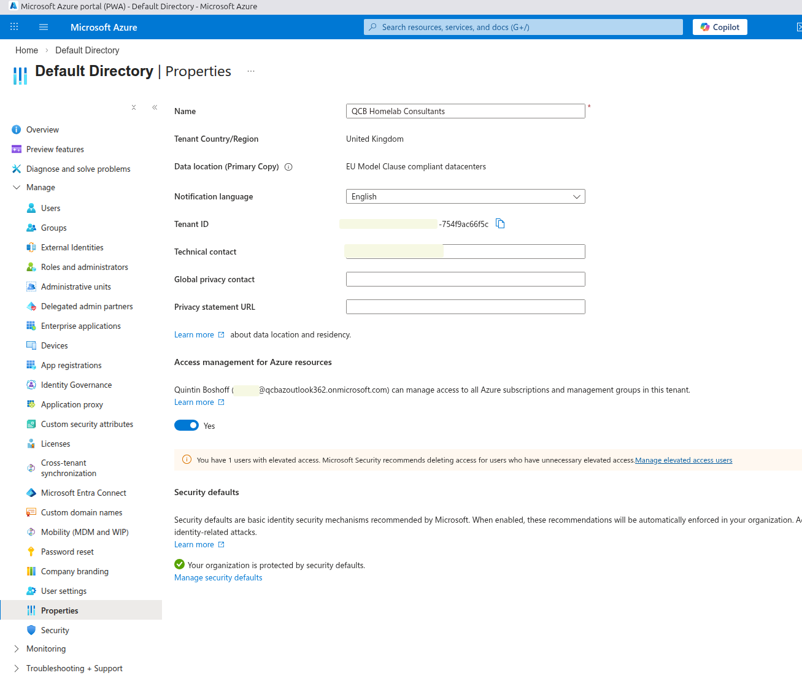
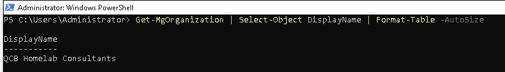
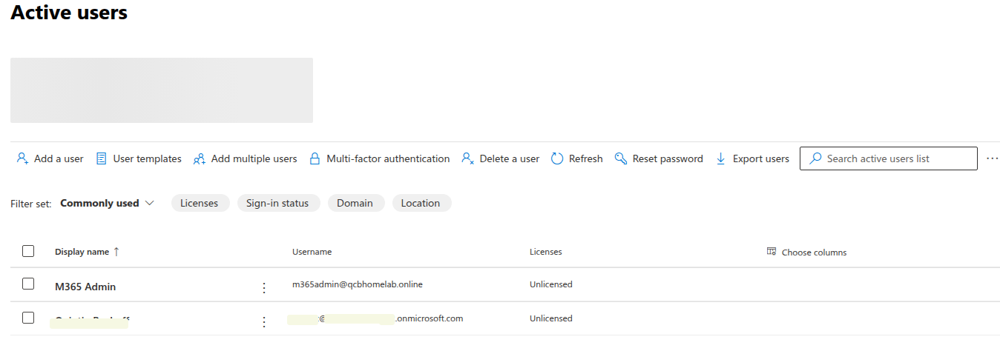
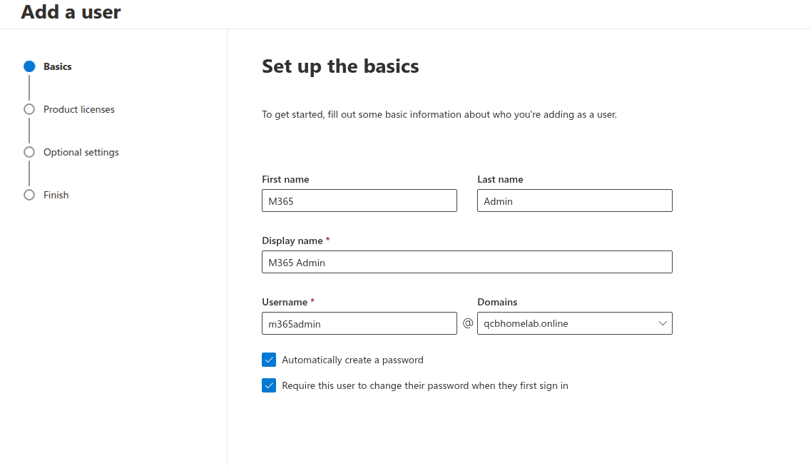
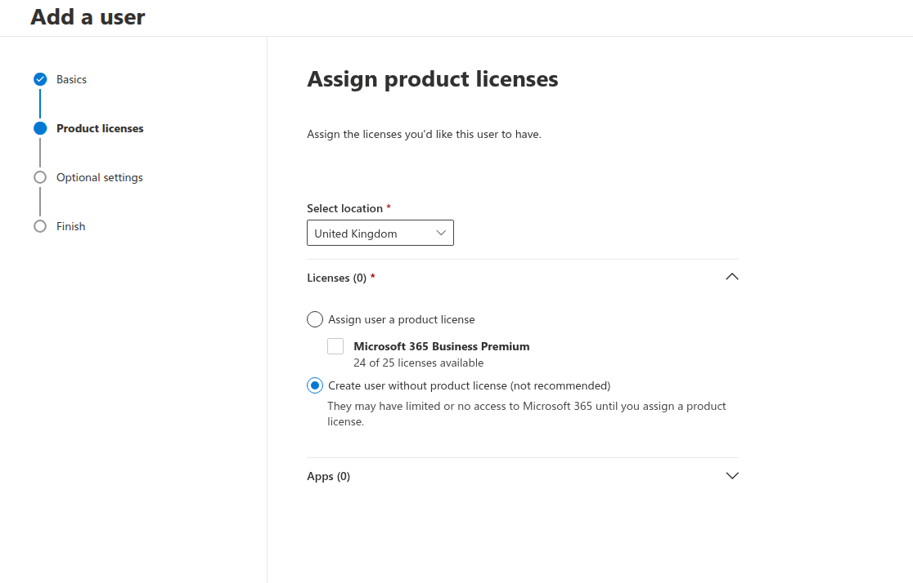
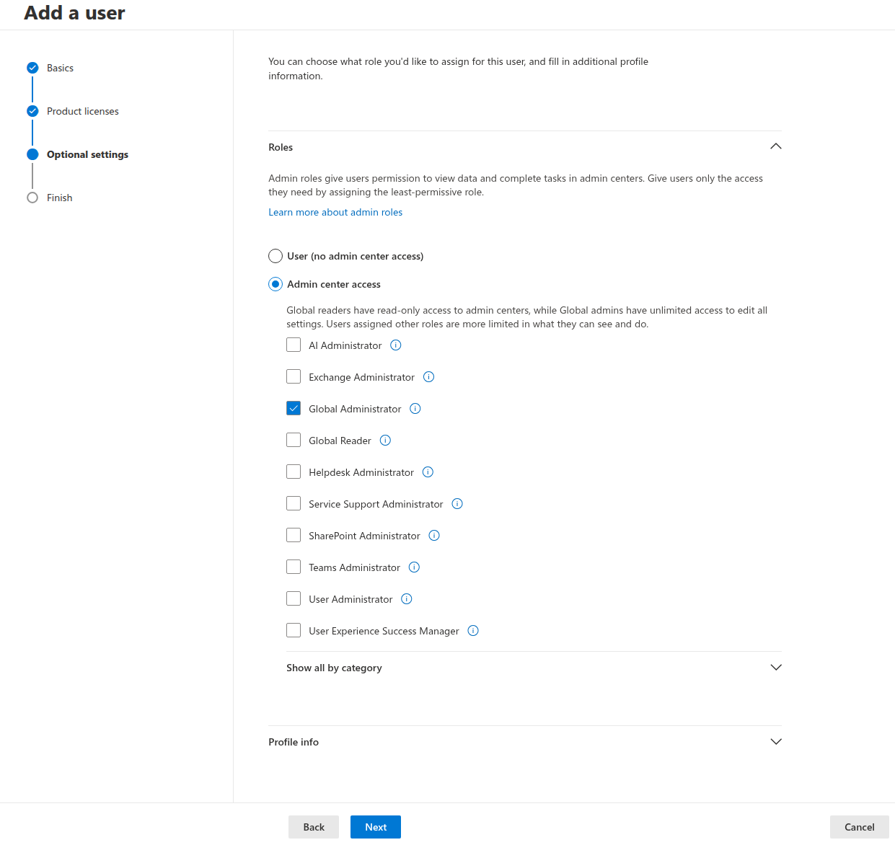
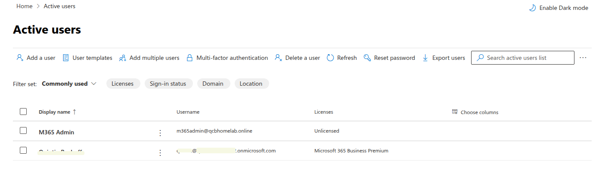

# 01e — Admin Account Separation

## In Plain English

When you move into a new house, you keep a spare key somewhere safe — not on your keyring,
not in your wallet, but somewhere you can get to it if you ever lock yourself out. You hope
you never need it, but you'd be in serious trouble without it.

Admin account separation works on the same principle. The account used for day-to-day
administration is separate from the emergency access account kept in reserve. If the working
admin account is ever compromised, locked out, or misconfigured, the emergency account
provides a way back in.

In Microsoft 365, this means maintaining two dedicated admin accounts with no Microsoft 365
licence assigned to either — one for daily use, one locked away for emergencies only.

---

## Why This Matters

Using a personal named account for administration is one of the most common security mistakes
in small business Microsoft 365 deployments. It creates several problems:

- If the account is compromised, the attacker has Global Administrator access to everything
- If the user leaves the organisation, their admin access must be carefully transferred
- Personal accounts accumulate email, files, and Teams activity — mixing user data with admin
  access in a single account
- Named accounts are more likely to be targeted by phishing because their UPN is known

A dedicated admin account has no mailbox, no OneDrive, no Teams presence. It exists solely
to perform administrative tasks. It is harder to target and easier to monitor.

---

## Prerequisites

- Microsoft 365 tenant active
- Global Administrator access to the tenant
- `qcbhomelab.online` verified as the default domain

---

## Admin Account Design

Two accounts are created for this deployment:

| Account | Domain | Role | Purpose | Licence |
|---|---|---|---|---|
| `qcb-az@[tenant].onmicrosoft.com` | onmicrosoft.com | Global Administrator | Break-glass emergency access | None |
| `m365admin@qcbhomelab.online` | qcbhomelab.online | Global Administrator | Day-to-day administration | None |

Neither account holds a Microsoft 365 licence. Admin roles do not require a licence —
licences grant access to services like Exchange Online, SharePoint, and Teams. An account
used purely for administration needs neither.

Keeping both accounts unlicensed means all 25 Business Premium licences remain available
for the 15 staff users, with 10 in reserve.

---

## Why the Break-Glass Account Stays on onmicrosoft.com

The `onmicrosoft.com` domain is Microsoft's initial domain for every tenant. It is permanent
— it cannot be removed, and it does not depend on any external DNS configuration.

The custom domain `qcbhomelab.online` is a registered domain managed via Cloudflare DNS. If
that domain ever experiences a DNS failure, expires, or is misconfigured, accounts on
`@qcbhomelab.online` could become temporarily inaccessible.

The break-glass account on `@[tenant].onmicrosoft.com` is immune to this — it will always
work regardless of what happens to the custom domain. This is why it must never be moved to
the custom domain, regardless of how tidy it might look.

> **Production note:** In a real engagement the break-glass account password should be complex,
> stored securely offline (a physical document in a safe, or a password manager accessible
> independently of Microsoft 365), and its sign-in activity should be monitored via Entra ID
> audit logs. Any sign-in from the break-glass account should trigger an immediate alert —
> it should never be used in normal operation.

---

## Implementation

### Step 1 — Tenant Renamed

Before creating any accounts, the tenant display name was updated from `Default Directory`
to `QCB Homelab Consultants` via the Azure Portal.

```
portal.azure.com → Microsoft Entra ID → Properties → Name
```


*Tenant display name updated to QCB Homelab Consultants*

Confirmed via PowerShell:

```powershell
Get-MgOrganization | Select-Object DisplayName | Format-Table -AutoSize
```


*QCB Homelab Consultants confirmed as tenant display name*

---

### Step 2 — Break-Glass Account (`qcb-az`)

The break-glass account already existed as the initial tenant admin account created during
Microsoft 365 signup. No changes were made to its UPN — it remains on `onmicrosoft.com`
deliberately.

The Microsoft 365 Business Premium licence that was temporarily assigned during setup was
removed — the account requires no licence.


*Break-glass account confirmed unlicensed — Global Administrator role retained*

---

### Step 3 — Working Admin Account (`m365admin`)

The working admin account is created via the Microsoft 365 Admin Center:

```
admin.microsoft.com → Users → Active users → Add a user
```

| Field | Value |
|---|---|
| First name | M365 |
| Last name | Admin |
| Display name | M365 Admin |
| Username | m365admin@qcbhomelab.online |
| Location | United Kingdom |
| Licence | None — create without product licence |
| Role | Global Administrator |


*m365admin account — correct UPN on qcbhomelab.online domain*


*Account created without product licence — correct for an admin-only account*


*Global Administrator role assigned — no workload-specific roles needed*

---

### Step 4 — Verify Both Accounts


*Active users — M365 Admin on qcbhomelab.online, break-glass on onmicrosoft.com, both unlicensed*

---

## A Note on Workload-Specific Roles

Microsoft 365 offers a range of workload-specific admin roles — Exchange Administrator,
SharePoint Administrator, Teams Administrator, Intune Administrator, and others. These exist
for a specific purpose: delegated administration.

In a larger organisation, a helpdesk technician might need to manage mailboxes but should
have no access to Intune or SharePoint administration. Assigning Exchange Administrator
rather than Global Administrator enforces that boundary.

For this deployment — a 15-person SME with a single IT consultant — both admin accounts
hold Global Administrator. There is no team to delegate to. Workload-specific roles would
add complexity without adding security benefit at this scale.

> **Production note:** In any organisation with more than one person performing administration,
> workload-specific roles should be used wherever possible. Global Administrator should be
> reserved for accounts that genuinely need full platform access. The principle of least
> privilege applies to administrators as much as it does to end users.

---

## Least Privilege Principle

Least privilege means giving every account — user or administrator — only the access
required to perform its function, and nothing more.

Applied to this deployment:

| Account | Access Required | Access Granted |
|---|---|---|
| Break-glass | Emergency tenant recovery | Global Administrator — no licence |
| M365 Admin | Full platform administration | Global Administrator — no licence |
| Staff users | Email, files, Teams, OneDrive | Business Premium licence — User role |

No staff user account holds an admin role. No admin account holds a staff user licence.
The boundaries are clean and deliberate.

---

## Summary

| Item | State |
|---|---|
| Tenant display name | QCB Homelab Consultants |
| Break-glass account | `qcb-az@[tenant].onmicrosoft.com` — Global Admin, unlicensed |
| Working admin account | `m365admin@qcbhomelab.online` — Global Admin, unlicensed |
| Staff licences available | 25 of 25 |

Admin account separation is complete. All subsequent administration is performed as
`m365admin@qcbhomelab.online`. The break-glass account is stored securely and not used
in normal operation.

---

*Previous: [01d — Group Creation and Licensing →](./01d-group-creation-and-licensing.md)*
*Next: [01f — MFA and Security Defaults →](./01f-mfa-and-security-defaults.md)*
