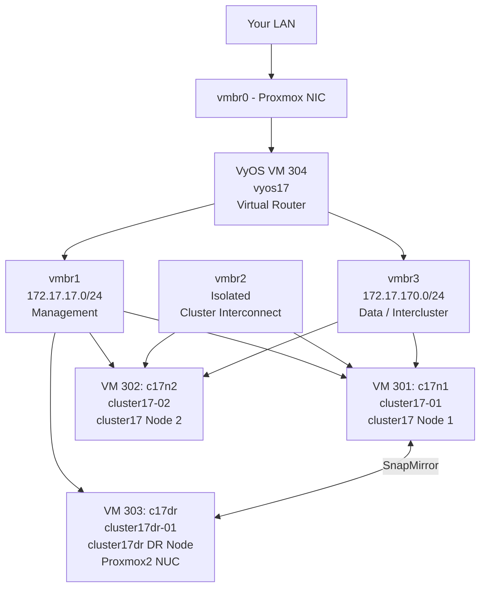

# Building a Self-Hosted NetApp Lab on Proxmox VE

A complete guide to deploying NetApp ONTAP simulators on self-hosted Proxmox VE. Covers a two-node HA cluster with SnapMirror DR replication to a single-node cluster, with support for nearly all ONTAP features including SVMs, NFS, CIFS, iSCSI, FlexClone, SnapVault and more.

---

## Why This Exists

I set up a self-hosted NetApp simulator lab on my Proxmox homelab to practice ONTAP. The official guides focus on VMware Workstation or Player, which works well on a PC or laptop, but these options are resource-intensive and require the host machine to remain powered on.

Proxmox allows the lab to run 24/7 on dedicated hardware, so the NetApp lab is always ready to connect. At the time, no complete Proxmox guide existed. Forum posts covered bits for specific ONTAP versions, but they skipped the full process and common issues.

This guide covers what worked, step by step, including the errors, fixes, and decisions along the way.

---

## What You Will Build



### The Lab Components

| VMID | Proxmox VM Name | ONTAP Node Name | ONTAP Cluster | Role | Host |
|------|-----------------|-----------------|---------------|------|------|
| 304 | vyos17 | — | — | Virtual router / gateway | Proxmox1 |
| 301 | c17n1 | cluster17-01 | cluster17 | Primary node | Proxmox1 |
| 302 | c17n2 | cluster17-02 | cluster17 | HA partner | Proxmox1 |
| 303 | c17dr | cluster17dr-01 | cluster17dr | DR target | Proxmox2 (NUC) |

> **Proxmox VM names vs ONTAP node names:** The Proxmox VM name (c17n1, c17n2, c17dr) is just a label in the hypervisor. ONTAP auto-generates its own internal node name from the cluster name during the setup wizard — `cluster17-01`, `cluster17-02`, `cluster17dr-01`. These are different things. Commands in this guide use the ONTAP node names where required.

### What You Can Do With This Lab

Once complete, this lab lets you practice:

- **Core ONTAP** — aggregates, volumes, SVMs, qtrees
- **NFS** — export policies, client mounts, permissions
- **CIFS/SMB** — shares, ACLs, Active Directory integration
- **iSCSI** — LUN creation, igroups, initiator connections
- **Snapshots** — manual and scheduled, restore, clone from snapshot
- **FlexClone** — instant writable volume clones
- **SnapMirror** — async replication, DR failover and failback
- **SnapVault** — disk-to-disk backup policies
- **Cluster peering** — connecting two clusters
- **Storage failover** — HA takeover and giveback between nodes
- **ONTAP CLI** — full command-line administration
- **System Manager** — web-based GUI administration
- **Licensing** — feature license management
- **Certification study** — NS0-161, NS0-162 and related exams

---

## IP Reference

### Network Bridges (Proxmox1)

| Bridge | Subnet | Purpose |
|--------|--------|---------|
| vmbr0 | Your LAN | Proxmox host uplink only |
| vmbr1 | 172.17.17.0/24 | Lab management network |
| vmbr2 | isolated | ONTAP cluster interconnect (e0a/e0b) |
| vmbr3 | 172.17.170.0/24 | Data and intercluster replication |

### IP Addresses

| Host | Interface | IP | Purpose |
|------|-----------|-----|---------|
| Proxmox1 host | vmbr1 | 172.17.17.254 | Lab network presence on Proxmox |
| vyos17 | eth0 | DHCP | LAN uplink |
| vyos17 | eth1 | 172.17.17.1 | Management network gateway |
| vyos17 | eth2 | 172.17.170.1 | Data/intercluster gateway |
| cluster17 mgmt | e0c | 172.17.17.10 | Cluster management LIF |
| cluster17-01 node mgmt | e0c | 172.17.17.11 | Node 1 management LIF |
| cluster17-02 node mgmt | e0c | 172.17.17.12 | Node 2 management LIF |
| cluster17dr mgmt | e0c | 172.17.17.20 | DR cluster management LIF |
| cluster17dr-01 node mgmt | e0c | 172.17.17.21 | DR node management LIF |
| cluster17-01 data | e0d | 172.17.170.11 | Node 1 data/intercluster LIF |
| cluster17-02 data | e0d | 172.17.170.12 | Node 2 data/intercluster LIF |
| cluster17dr-01 data | e0d | 172.17.170.21 | DR node data/intercluster LIF |

### Cluster Interconnect (e0a / e0b)

The cluster interconnect uses auto-assigned link-local `169.254.x.x` addresses negotiated automatically by ONTAP over the isolated vmbr2 bridge. No configuration is needed and no routing is involved. MTU must be set to **1500** to match Proxmox bridge capability — the default of 9000 causes cluster join to hang silently.

---

## Naming Conventions

| Component | Proxmox VM Name | ONTAP Node Name | ONTAP Cluster |
|-----------|-----------------|-----------------|---------------|
| Production node 1 | c17n1 | cluster17-01 | cluster17 |
| Production node 2 | c17n2 | cluster17-02 | cluster17 |
| DR node | c17dr | cluster17dr-01 | cluster17dr |
| Router | vyos17 | — | — |

Root aggregates follow the pattern `aggr0_<clustername>_<nn>`:

| Node | Root Aggregate |
|------|---------------|
| cluster17-01 | aggr0_cluster17_01 |
| cluster17-02 | aggr0_cluster17_02 |
| cluster17dr-01 | aggr0_cluster17dr_01 |

---

## Hardware Requirements

### Proxmox1 (Main Lab Host)

| Resource | Minimum | Recommended | Notes |
|----------|---------|-------------|-------|
| RAM | 16 GB | 32 GB | Two ONTAP nodes at 5.1 GB each + VyOS + Proxmox overhead |
| CPU | 4 cores, VT-x | 6+ cores | ONTAP is single-threaded heavy at boot |
| Disk | 100 GB free | 200 GB | ~40 GB per ONTAP node, thin provisioned |
| Proxmox VE | 7.x | 9.x | Tested on 9.1.5 |

### Proxmox2 (DR Host — NUC or similar)

| Resource | Minimum | Notes |
|----------|---------|-------|
| RAM | 8 GB | Tight but workable — single ONTAP node only |
| CPU | 2 cores, VT-x 64-bit | Bay Trail (N2820) works but is slow |
| Disk | 50 GB free | Single node only |

### Memory Reality Check

NetApp's official spec is **5.1 GB per node** (5222 MB). On a 16 GB Proxmox host with two nodes:

| VM | RAM |
|----|-----|
| cluster17-01 | 5222 MB |
| cluster17-02 | 5222 MB |
| vyos17 | 1536 MB |
| Proxmox overhead | ~2 GB |
| **Total** | **~14 GB** |

---

## Simulator Limitations

- **No HA failover (CFO/SFO)** — the simulator does not support storage failover
- **No Fibre Channel** — iSCSI is supported, FC is not
- **No more than two simulator instances simultaneously** — NetApp's limit
- **NVRAM is not persistent** — always shut down cleanly; power loss can corrupt the simulator
- **Maximum 56 disks per node** — 4 shelves × 14 drives
- **Maximum 9 GB per simulated drive**
- **Not for performance testing** — for learning features only

---

## Guide Structure

| Guide | Description |
|-------|-------------|
| [Part 1 — VyOS Router](part1-vyos.md) | Add lab bridges to Proxmox, build and configure the VyOS virtual router |
| [Part 2 — First ONTAP Node](part2-cluster17-01.md) | Build cluster17-01, create cluster17, fix vol0, add licenses, prepare cluster interconnect |
| [Part 3 — Second ONTAP Node](part3-cluster17-02.md) | Build cluster17-02, set unique System ID, join cluster17 |
| [Part 4 — DR Cluster](part4-cluster17dr-01.md) | Build cluster17dr-01 on Proxmox2, create cluster17dr |
| [Part 5 — SnapMirror Replication](part5-snapmirror.md) | Peer clusters, configure SnapMirror, test DR failover |

---

## Lab Startup and Shutdown

### Daily Startup Sequence

Always start in this order. ONTAP nodes need VyOS running before they boot — without a gateway their management LIFs cannot come online properly.

```
1. Start vyos17        →  qm start 304
2. Wait for VyOS to be fully up (ping 172.17.17.1)
3. Start c17n1         →  qm start 301
4. Wait for cluster17-01 to be fully up (ssh admin@172.17.17.11)
5. Start c17n2         →  qm start 302
6. Verify cluster      →  cluster show (both nodes healthy)
```

For the DR node on Proxmox2 (if needed):
```
7. Start c17dr         →  qm start 303  (on Proxmox2)
```

### Daily Shutdown Sequence

Always halt ONTAP nodes cleanly from the CLI before stopping VMs. Never hard-stop a running ONTAP node.

**Step 1 — Halt cluster17-02 first:**
```
cluster17::> system node halt -node cluster17-02 -skip-lif-migration true
```
Answer `y`. Wait for the SSH connection to drop.

**Step 2 — Halt cluster17-01:**
```
cluster17::> system node halt -node cluster17-01 -skip-lif-migration true -ignore-quorum-warnings true
```
Answer `y`. Wait for the SSH connection to drop.

**Step 3 — Stop VMs from Proxmox:**
```bash
qm stop 302
qm stop 301
qm stop 304
```

**For the DR node (if running):**
```
cluster17dr::> system node halt -node cluster17dr-01 -skip-lif-migration true
```
Then `qm stop 303` on Proxmox2.

> **Why halt node 2 first?** cluster17-01 is the cluster authority. Halting node 2 first leaves node 1 in quorum. Halting node 1 first immediately triggers the `-ignore-quorum-warnings` flag because node 2 is still up and the cluster has lost its authority node.

> **Never hibernate Proxmox with ONTAP running.** Proxmox hibernation gives ONTAP no signal that the hypervisor is going down. Clustered ONTAP assumes the worst when it loses contact with its peer without warning — this triggers panic and potential WAFL corruption. Always halt ONTAP cleanly first.

> **VyOS and hibernation.** VyOS does not support `qm suspend --todisk`. Always stop and start VyOS cold.

---

## Quick Reference — Common Commands

```bash
# Start a VM
qm start 301

# Safe shutdown — always halt from ONTAP CLI first
# From ONTAP:
cluster17::> system node halt -node cluster17-01 -skip-lif-migration true
# Then from Proxmox:
qm stop 301

# SSH to cluster17
ssh admin@172.17.17.10

# SSH to cluster17dr
ssh admin@172.17.17.20

# Take a snapshot (VM must be stopped)
qm stop 301
qm snapshot 301 <name> --description "<description>"

# List snapshots
qm listsnapshot 301

# Rollback to snapshot
qm rollback 301 <name>
```

---

## Things That Will Catch You Out

**The cluster interconnect MTU defaults to 9000.** Proxmox bridges pass a maximum of 1500. This mismatch causes the cluster join to hang silently during DB sync. Always set the Cluster broadcast domain MTU to 1500 before node 2 attempts to join.

**ONTAP does not configure cluster interconnect ports for a single-node cluster.** After setting up node 1, you must manually move e0a/e0b into the Cluster IPspace, fix the MTU, and create cluster LIFs before node 2 can join. This is covered in Part 2.

**Node and aggregate names are auto-generated.** ONTAP derives the node name and root aggregate name from the cluster name — you cannot choose them during the wizard. A cluster named `cluster17` produces node `cluster17-01` and aggregate `aggr0_cluster17_01`.

**VLOADER is only needed for node 2 and beyond.** Node 1 (the cluster creator) does not need VLOADER intervention. Only nodes joining an existing cluster need a unique System ID set at VLOADER.

**dd wipe of disk4 is only needed for cloned or snapshot-restored VMs.** Fresh VMDKs imported directly from the OVA do not need wiping. If you build each node from the original VMDK files, skip the dd step.

**Machine type must be `pc` (i440fx), not `q35`.** q35 causes ONTAP boot failures.

**CPU type must be `SandyBridge`.** Other CPU types cause boot failures.

**RAM must be at least 5222 MB.** 5120 MB is 100 MB short of NetApp's minimum.

**Balloon driver must be disabled.** Set `--balloon 0`.

**vol0 snapshots will fill up your root volume.** Disable automatic snapshots and set autodelete immediately after cluster setup.

**The cluster management LIF ends up on the wrong port.** After the setup wizard, `cluster_mgmt` is placed on e0a which connects to the isolated cluster interconnect bridge. Move it to e0c immediately after setup.

**VyOS must start before ONTAP nodes.** Without a gateway the management LIFs cannot come online properly.

**Never snapshot a running ONTAP VM.** Always halt from the ONTAP CLI first.

---

## About

Built from real experience setting up the ONTAP simulator on a Proxmox homelab. The official NetApp guide only covers VMware. Getting it working on Proxmox required trial and error and produced enough undocumented issues to make writing this up worthwhile.

Sources used:
- NetApp *Simulate ONTAP 9.6 Installation and Setup Guide* (official)
- Neil Anderson's VMware lab guide at [flackbox.com](https://www.flackbox.com)
- Proxmox VE documentation
- Trial and error

---

*Tested on: Proxmox VE 9.1.5 | ONTAP Simulator 9.6 | 2026*
