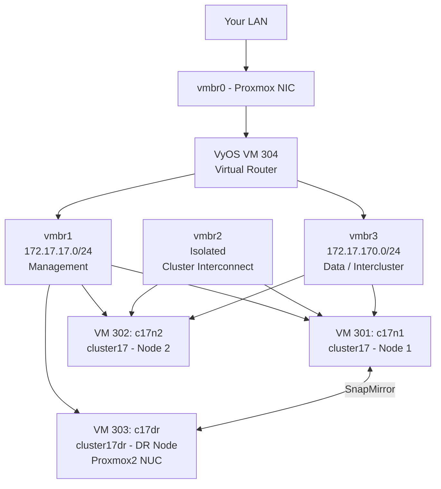

# NetApp ONTAP Simulator on Proxmox VE

A complete, battle-tested guide for running the NetApp ONTAP 9.6 simulator on Proxmox VE — from a bare Proxmox host to a two-node HA cluster with a single-node DR target and SnapMirror replication.

---

## Why This Exists

Learning NetApp ONTAP properly requires hands-on time. The official NetApp simulator (vSim) is the standard way to do this without physical hardware, but NetApp only documents it for VMware Workstation and VMware Player.

VMware on a laptop works, but it means the lab only runs when the laptop is open. A homelab Proxmox server runs 24/7, which is far more useful for learning — you can leave long-running tests overnight, come back to a running cluster, and always have something to connect a client to.

The problem is that no end-to-end Proxmox guide existed. There were forum posts, short write-ups for different ONTAP versions, and partial answers scattered across threads — but nothing that covered the full process including all the things that go wrong.

This guide documents exactly what worked, including every panic, every gotcha, and every decision made along the way. The goal is that someone following it gets a working lab in a few hours rather than a few days.

---

## What You Will Build



### The Lab Components

| VM | ID | Name | Role | Host |
|----|-----|------|------|------|
| VyOS | 304 | vyos17 | Virtual router / gateway | Proxmox1 |
| ONTAP Node 1 | 301 | c17n1 | cluster17 — primary node | Proxmox1 |
| ONTAP Node 2 | 302 | c17n2 | cluster17 — HA partner | Proxmox1 |
| ONTAP DR Node | 303 | c17dr | cluster17dr — DR target | Proxmox2 (NUC) |

### What You Can Do With This Lab

Once complete, this lab lets you practice:

- **Core ONTAP** — aggregates, volumes, SVMs, qtrees
- **NFS** — export policies, client mounts, permissions
- **CIFS/SMB** — shares, ACLs, Active Directory integration
- **iSCSI** — LUN creation, igroups, initiator connections
- **Snapshots** — manual and scheduled, restore, clone from snapshot
- **FlexClone** — instant writable volume clones
- **SnapMirror** — async replication, DR failover and failback
- **SnapVault** — disk-to-disk backup policies
- **Cluster peering** — connecting two clusters
- **Storage failover** — HA takeover and giveback between nodes
- **ONTAP CLI** — full command-line administration
- **System Manager** — web-based GUI administration
- **Licensing** — feature license management
- **Certification study** — NS0-161, NS0-162 and related exams

---

## IP Reference

### Network Bridges (Proxmox1)

| Bridge | Subnet | Purpose |
|--------|--------|---------|
| vmbr0 | Your LAN | Proxmox host uplink only |
| vmbr1 | 172.17.17.0/24 | Lab management network |
| vmbr2 | isolated | ONTAP cluster interconnect (e0a/e0b) |
| vmbr3 | 172.17.170.0/24 | Data and intercluster replication |

### IP Addresses

| Host | Interface | IP | Purpose |
|------|-----------|-----|---------|
| Proxmox1 host | vmbr1 | 172.17.17.254 | Lab network presence on Proxmox |
| vyos17 | eth0 | DHCP | LAN uplink |
| vyos17 | eth1 | 172.17.17.1 | Management network gateway |
| vyos17 | eth2 | 172.17.170.1 | Data/intercluster gateway |
| cluster17 mgmt | e0c | 172.17.17.10 | Cluster management LIF |
| c17n1 node mgmt | e0c | 172.17.17.11 | Node 1 management LIF |
| c17n2 node mgmt | e0c | 172.17.17.12 | Node 2 management LIF |
| cluster17dr mgmt | e0c | 172.17.17.20 | DR cluster management LIF |
| c17dr node mgmt | e0c | 172.17.17.21 | DR node management LIF |
| c17n1 data | e0d | 172.17.170.11 | Node 1 data/intercluster LIF |
| c17n2 data | e0d | 172.17.170.12 | Node 2 data/intercluster LIF |
| c17dr data | e0d | 172.17.170.21 | DR node data/intercluster LIF |

### Cluster Interconnect (e0a / e0b)

The cluster interconnect uses auto-assigned link-local `169.254.x.x` addresses. These are negotiated automatically by ONTAP over the isolated vmbr2 bridge — no configuration needed and no routing involved.

---

## Naming Conventions

| Component | Name | Notes |
|-----------|------|-------|
| Production cluster | `cluster17` | Two-node HA pair |
| Production node 1 | `c17n1` | Primary node |
| Production node 2 | `c17n2` | HA partner |
| DR cluster | `cluster17dr` | Single node, separate Proxmox host |
| DR node | `c17dr` | SnapMirror replication target |
| Router | `vyos17` | VyOS virtual router |
| Admin password | Your choice | Use something you will remember |

---

## Hardware Requirements

### Proxmox1 (Main Lab Host)

| Resource | Minimum | Recommended | Notes |
|----------|---------|-------------|-------|
| RAM | 16 GB | 32 GB | Two ONTAP nodes at 5.1 GB each + VyOS + Proxmox overhead |
| CPU | 4 cores, VT-x | 6+ cores | ONTAP is single-threaded heavy at boot |
| Disk | 100 GB free | 200 GB | ~40 GB per ONTAP node, thin provisioned |
| Proxmox VE | 7.x | 9.x | Tested on 9.1.5 |

### Proxmox2 (DR Host — NUC or similar)

| Resource | Minimum | Notes |
|----------|---------|-------|
| RAM | 8 GB | Tight but workable — single ONTAP node only |
| CPU | 2 cores, VT-x 64-bit | Bay Trail (N2820) works but is slow |
| Disk | 50 GB free | Single node only |

### Memory Reality Check

NetApp's official spec is **5.1 GB per node** (10.2 GB for two nodes simultaneously). On a 16 GB Proxmox host this is workable but tight:

| VM | RAM |
|----|-----|
| c17n1 | 5222 MB |
| c17n2 | 5222 MB |
| vyos17 | 1536 MB |
| Proxmox overhead | ~2 GB |
| **Total** | **~14 GB** |

> **Important:** During the node join process both nodes spike memory simultaneously. Temporarily boosting each node to 7168 MB during setup is recommended if your host has enough RAM. Drop back to 5222 MB after the cluster is stable.

> **Swap:** Configure at least 8 GB swap on the Proxmox host. It acts as a safety net during memory spikes and prevents the OOM killer from terminating KVM processes.

---

## Simulator Limitations

These are limitations of the NetApp simulator itself — not of this guide or Proxmox:

- **No HA failover (CFO/SFO)** — the simulator does not support storage failover. You can build a two-node cluster and learn cluster administration, but actual takeover/giveback will not work as it would on real hardware.
- **No Fibre Channel or SAN** — iSCSI is supported, FC is not.
- **No more than two nodes simultaneously** — NetApp's limit.
- **NVRAM is not persistent** — always shut down cleanly. Power loss or hard stop can corrupt the simulator.
- **Maximum 56 disks per node** — 4 shelves × 14 drives.
- **Maximum 9 GB per simulated drive.**
- **Not for performance testing** — the simulator is for learning features, not benchmarking.

---

## Guide Structure

| Guide | Description |
|-------|-------------|
| [Part 1 — VyOS Router](part1-vyos.md) | Add lab bridges to Proxmox, build and configure the VyOS virtual router. This is the network foundation everything else depends on. |
| [Part 2 — First ONTAP Node](part2-c17n1.md) | Build c17n1 from the OVA VMDKs, navigate VLOADER, run the cluster setup wizard, fix vol0, add licenses. Produces a working single-node cluster17. |
| [Part 3 — Second ONTAP Node](part3-c17n2.md) | Build c17n2, set a unique System ID, join it to cluster17. Produces a two-node cluster. |
| [Part 4 — DR Cluster](part4-c17dr.md) | Build c17dr on Proxmox2, create the standalone cluster17dr on the same management network. |
| [Part 5 — SnapMirror Replication](part5-snapmirror.md) | Peer cluster17 and cluster17dr, create a SnapMirror relationship, test replication and DR failover. |

---

## Quick Reference — Common Commands

```bash
# Start a VM
qm start 301

# Hibernate to disk (frees RAM, resumes in seconds)
qm suspend 301 --todisk 1

# Resume from hibernate
qm resume 301

# Safe shutdown — always halt from ONTAP CLI first
# From ONTAP:
system node halt -node c17n1 -skip-lif-migration true
# Then from Proxmox:
qm stop 301

# SSH to cluster17
ssh admin@172.17.17.10

# SSH to cluster17dr
ssh admin@172.17.17.20

# Take a snapshot (VM must be stopped)
qm stop 301
qm snapshot 301 <name> --description "<description>"

# List snapshots
qm listsnapshot 301

# Rollback to snapshot
qm rollback 301 <name>
```

### Lab Startup Order

Always start in this order to avoid ONTAP panicking on missing network connectivity:

```
1. vyos17 (qm start 304)
2. c17n1  (qm start 301)
3. c17n2  (qm start 302)
4. c17dr  (qm start 303) — on Proxmox2
```

### Lab Shutdown Order

Reverse order, always halt ONTAP nodes from the CLI before stopping VMs:

```
1. Halt c17n2 from ONTAP CLI, then qm stop 302
2. Halt c17n1 from ONTAP CLI, then qm stop 301
3. Halt c17dr from ONTAP CLI, then qm stop 303 (on Proxmox2)
4. qm stop 304 (VyOS — clean shutdown, no CLI needed)
```

---

## Things That Will Catch You Out

These are documented in detail in the relevant parts. Listed here as a heads-up.

**The OVA disk filenames are not what other guides say.** Extracted VMDKs are named `vsim-netapp-DOT9.6-cm-disk1.vmdk`, not `vsim-NetAppDOT-simulate-disk1.vmdk`.

**local-lvm does not support qcow2.** Always use `--format raw` when importing disks.

**Machine type must be `pc` (i440fx), not `q35`.** q35 causes ONTAP boot failures.

**CPU type must be `SandyBridge`.** Other CPU types cause boot failures. Not documented by NetApp.

**RAM must be at least 5222 MB.** 5120 MB is 100 MB short of NetApp's minimum spec. 4096 MB panics during disk initialisation.

**Balloon driver must be disabled.** ONTAP does not support QEMU balloon. Set `--balloon 0`.

**disk4 must be wiped before first boot.** The OVA contains pre-existing cluster config on the disk shelf image. ONTAP panics immediately without clearing it.

**VLOADER timing is tricky.** Press Ctrl-C too early and you land at `boot:` instead of `VLOADER>`. Wait until all four BIOS drive lines appear.

**vol0 snapshots will fill up your root volume.** Disable automatic snapshots and set autodelete immediately after cluster setup. If vol0 fills up, ONTAP subsystems start crashing.

**VyOS needs at least 1536 MB RAM.** 1024 MB causes OOM kills of python3 processes on boot. Do not suspend VyOS to disk — always stop and start cold.

**Both nodes spike memory during the join process.** It is not just the joining node — the existing node works just as hard accepting the join. Both need headroom simultaneously.

**The cluster management LIF ends up on the wrong port.** After the setup wizard, `cluster_mgmt` is on `e0a` which connects to the isolated cluster interconnect bridge. Move it to `e0c`.

**Never snapshot a running ONTAP VM.** It corrupts the internal WAFL database. Always halt from the ONTAP CLI first.

---

## About

Built from real experience setting up the ONTAP simulator on a Proxmox homelab. The official NetApp guide only covers VMware. Getting it working on Proxmox required trial and error and produced enough undocumented issues to make writing this up worthwhile.

Sources used:
- NetApp *Simulate ONTAP 9.6 Installation and Setup Guide* (official)
- Neil Anderson's VMware lab guide at [flackbox.com](https://www.flackbox.com) — excellent VMware reference, adapted for Proxmox
- Proxmox VE documentation
- Hard-won experience from a morning of memory panics, vol0 explosions, and failed joins

Pull requests welcome if something is wrong or out of date.

---

*Tested on: Proxmox VE 9.1.5 | ONTAP Simulator 9.6 | 2026*
