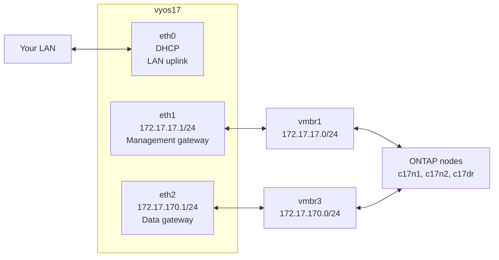

# Part 1 — VyOS Virtual Router

[← README](README.md) | [Part 2 — First ONTAP Node →](part2-c17n1.md)

Build the network foundation before touching any ONTAP nodes. VyOS is the gateway for all lab subnets, provides NAT to the internet, and routes traffic between management and data networks. Everything else in this guide depends on it being up first.

---

## Table of Contents

1. [Overview](#overview)
2. [Add Lab Bridges to Proxmox](#add-lab-bridges-to-proxmox)
3. [Download VyOS](#download-vyos)
4. [Create the VyOS VM](#create-the-vyos-vm)
5. [Install VyOS](#install-vyos)
6. [Configure VyOS](#configure-vyos)
7. [Verify Routing](#verify-routing)
8. [Snapshot and Startup Notes](#snapshot-and-startup-notes)
9. [Troubleshooting](#troubleshooting)

---

## Overview

VyOS is a Linux-based network operating system. In this lab it plays the role that a physical router or layer-3 switch would play in a real datacenter — it connects all the lab subnets together and provides a default gateway for each one.



**Without VyOS:**
- ONTAP nodes have no default gateway
- You cannot SSH to the cluster from your workstation
- SnapMirror cannot route between clusters
- Data LIFs have no way out of the lab network

**With VyOS:**
- All subnets are routed
- NAT provides internet access for NTP and AutoSupport
- Your workstation can reach all lab IPs via a single static route

---

## Add Lab Bridges to Proxmox

Run these commands on the **Proxmox1 host** as root.

Three bridges are needed. vmbr1 and vmbr2 may already exist from earlier work — check first:

```bash
ip link show vmbr1
ip link show vmbr2
ip link show vmbr3
```

Add any that are missing:

```bash
cat >> /etc/network/interfaces << 'EOF'

auto vmbr1
iface vmbr1 inet static
    address 172.17.17.254/24
    bridge-ports none
    bridge-stp off
    bridge-fd 0
    # Lab management network

auto vmbr2
iface vmbr2 inet manual
    bridge-ports none
    bridge-stp off
    bridge-fd 0
    # ONTAP cluster interconnect — isolated, no IP

auto vmbr3
iface vmbr3 inet manual
    bridge-ports none
    bridge-stp off
    bridge-fd 0
    # Data and intercluster replication network
EOF

ifreload -a
```

Verify all three are up:

```bash
ip link show vmbr1 && ip link show vmbr2 && ip link show vmbr3
```

Expected output for each:
```
N: vmbr1: <BROADCAST,MULTICAST,UP,LOWER_UP> mtu 1500 ... state UNKNOWN
```

**Bridge summary:**

| Bridge | IP on Proxmox host | Purpose |
|--------|--------------------|---------|
| vmbr1 | 172.17.17.254/24 | Management network — Proxmox can reach ONTAP directly |
| vmbr2 | none | ONTAP cluster interconnect — completely isolated |
| vmbr3 | none | Data and intercluster traffic — routed by VyOS |

> **Why does vmbr1 have a Proxmox IP but vmbr3 does not?**
> vmbr1 gives the Proxmox host itself an address on the management network so you can SSH to ONTAP directly from the host without needing VyOS running. vmbr3 is data-only — Proxmox has no reason to have an address there.

---

## Download VyOS

VyOS releases two streams:

- **Stable (LTS)** — requires a subscription for ISO downloads
- **Rolling** — free, updated frequently, suitable for a lab

Download the latest rolling release ISO from:
```
https://vyos.net/get/nightly-builds/
```

Download the `amd64` ISO. Filename will be similar to:
```
vyos-1.5-rolling-20260101-amd64.iso
```

Upload it to Proxmox local storage:

```bash
# Enable ISO content type on local storage if needed
pvesm set local --content iso,vztmpl,backup,snippets

# Upload via scp from your workstation
scp vyos-*.iso root@<proxmox-ip>:/var/lib/vz/template/iso/
```

Or upload via the Proxmox web UI: local storage → ISO Images → Upload.

---

## Create the VyOS VM

Run on the **Proxmox1 host**:

```bash
qm create 304 \
    --name vyos17 \
    --machine q35 \
    --bios seabios \
    --cores 2 \
    --memory 1536 \
    --balloon 0 \
    --net0 e1000,bridge=vmbr0 \
    --net1 e1000,bridge=vmbr1 \
    --net2 e1000,bridge=vmbr3 \
    --onboot 1 \
    --boot order='scsi0;ide2'

qm set 304 --scsi0 local-lvm:8,format=raw
qm set 304 --ide2 local:iso/<your-vyos-iso-filename>,media=cdrom
```

Replace `<your-vyos-iso-filename>` with the actual filename of the ISO you uploaded.

**NIC assignment:**

| VM NIC | Bridge | VyOS interface | Purpose |
|--------|--------|----------------|---------|
| net0 | vmbr0 | eth0 | LAN uplink — DHCP from your router |
| net1 | vmbr1 | eth1 | Management network gateway |
| net2 | vmbr3 | eth2 | Data/intercluster gateway |

> **Memory note:** VyOS requires a minimum of **1536 MB**. 1024 MB causes OOM kills of python3 processes during boot and VyOS will not start reliably. Do not go below 1536 MB.

---

## Install VyOS

Start the VM and open the Proxmox console:

```bash
qm start 304
```

In the Proxmox web UI, open the console for VM 304. VyOS will boot from the ISO into a live environment.

Login with:
```
Username: vyos
Password: vyos
```

Install VyOS to the virtual disk:

```bash
install image
```

Work through the installer — accept all defaults:
- `Proceed with installation? [yes]` → **yes**
- `Would you like to try to partition a disk automatically? [yes]` → **yes**
- `Install the image on? [sda]` → **Enter**
- `Continue? [No]` → **yes**
- `How big a root partition? [...]` → **Enter** (use full disk)
- `Image name? [...]` → **Enter**
- `Copy config? [yes]` → **Enter**
- Set a password for the `vyos` user when prompted

When installation completes:

```bash
poweroff
```

After the VM shuts down, remove the CD-ROM so it boots from disk:

```bash
qm set 304 --ide2 none,media=cdrom
```

Start it again:

```bash
qm start 304
```

---

## Configure VyOS

Login on the console (username `vyos`, password you set during install).

First, enable SSH so you can configure from a proper terminal:

```bash
configure
set service ssh port 22
set interfaces ethernet eth0 address dhcp
commit
save
exit
```

Find the DHCP address assigned to eth0:

```bash
show interfaces ethernet eth0
```

Note the IP address shown. SSH in from your workstation or from the Proxmox host:

```bash
ssh vyos@<eth0-ip>
```

Now apply the full configuration:

```bash
configure
```

```
# WAN uplink
set interfaces ethernet eth0 address dhcp
set interfaces ethernet eth0 description 'LAN-uplink'

# Management network gateway
set interfaces ethernet eth1 address '172.17.17.1/24'
set interfaces ethernet eth1 description 'lab-mgmt'

# Data and intercluster gateway
set interfaces ethernet eth2 address '172.17.170.1/24'
set interfaces ethernet eth2 description 'lab-data'

# NAT — both lab subnets out through the LAN interface
set nat source rule 10 outbound-interface name 'eth0'
set nat source rule 10 source address '172.17.17.0/24'
set nat source rule 10 translation address masquerade

set nat source rule 20 outbound-interface name 'eth0'
set nat source rule 20 source address '172.17.170.0/24'
set nat source rule 20 translation address masquerade

# Default route to your LAN gateway
set protocols static route 0.0.0.0/0 next-hop <your-LAN-gateway>

commit
save
```

Replace `<your-LAN-gateway>` with your actual router IP (e.g. `192.168.1.1`).

---

## Verify Routing

From the VyOS CLI:

```bash
show interfaces
```

Expected:
```
Interface    IP Address         S/L  Description
---------    ----------         ---  -----------
eth0         192.168.x.y/24     u/u  LAN-uplink
eth1         172.17.17.1/24     u/u  lab-mgmt
eth2         172.17.170.1/24    u/u  lab-data
lo           127.0.0.1/8        u/u
```

Test connectivity:

```bash
# Can VyOS reach Proxmox on the management bridge?
ping 172.17.17.254 count 3

# Can VyOS reach the internet?
ping 8.8.8.8 count 3
```

Both pings should succeed.

### Verify from your workstation

Add a static route on your workstation so you can reach all lab subnets:

**Linux:**
```bash
sudo ip route add 172.17.0.0/16 via <vyos-eth0-ip>
```

**macOS:**
```bash
sudo route add -net 172.17.0.0/16 <vyos-eth0-ip>
```

**Windows (run as Administrator):**
```bash
route add 172.17.0.0 mask 255.255.0.0 <vyos-eth0-ip> -p
```

Once this is in place, you can SSH directly to any lab IP from your workstation without a jump host.

---

## Snapshot and Startup Notes

Take a snapshot of the clean VyOS configuration:

```bash
# VyOS does not need to be stopped for a snapshot — it is a standard Linux VM
# But stop it cleanly anyway for consistency
qm stop 304
qm snapshot 304 vyos-configured --description "VyOS fully configured, routing and NAT working"
qm start 304
```

### Important — VyOS Does Not Support Suspend to Disk

```bash
# DO NOT do this with VyOS
qm suspend 304 --todisk 1   # ← causes OOM on resume
```

VyOS uses python3 processes during startup that are killed by the OOM handler when resuming from a memory snapshot on a tight host. Always stop and start VyOS cold:

```bash
# Correct way to stop VyOS
qm stop 304

# Correct way to start VyOS
qm start 304
```

### Startup Order

VyOS must be started **before** any ONTAP nodes. If ONTAP boots without a gateway it will have no management connectivity and the setup wizard cannot verify network reachability.

```
Start order: vyos17 → c17n1 → c17n2 → c17dr
```

---

## Troubleshooting

### VyOS OOM on boot — python3 killed

**Symptom:** Boot log shows `Out of memory: Killed process XXX (python3)`

**Cause:** VyOS has less than 1536 MB RAM.

**Fix:**
```bash
qm stop 304
qm set 304 --memory 1536
qm start 304
```

### VyOS OOM after resume from suspend

**Cause:** `qm suspend --todisk` was used. VyOS does not support this.

**Fix:** Stop and start cold. Never use suspend to disk with VyOS.

### eth1 or eth2 shows no IP after reboot

**Cause:** Configuration was not saved before reboot.

**Fix:** Re-apply the configuration and make sure to run `save` after `commit`.

### Ping from ONTAP to gateway fails

**Cause:** VyOS is not running, or eth1/eth2 are down.

**Fix:**
```bash
# Check VyOS is running
qm status 304

# Check interfaces from VyOS CLI
show interfaces
```

### Cannot reach lab from workstation

**Cause:** Static route not added to workstation, or VyOS eth0 IP changed (DHCP).

**Fix:** Re-check the VyOS eth0 IP and update the static route on your workstation. Consider assigning a DHCP reservation for VyOS in your router.

---

[← README](README.md) | [Part 2 — First ONTAP Node →](part2-c17n1.md)

*Tested on: Proxmox VE 9.1.5 | VyOS rolling 2026 | 2026*
