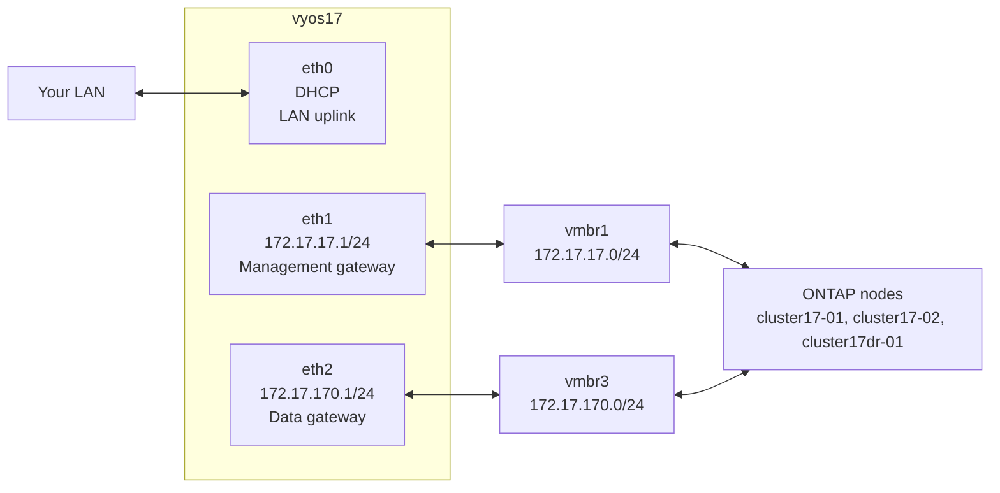

# Part 1 — VyOS Virtual Router

[← README](README.md) | [Part 2 — First ONTAP Node →](part2-cluster17-01.md)

Build the network foundation before touching any ONTAP nodes. VyOS is the gateway for all lab subnets, provides NAT to the internet, and routes traffic between management and data networks. Everything else in this guide depends on it being up first.

---

## Table of Contents

1. [Overview](#overview)
2. [Add Lab Bridges to Proxmox](#add-lab-bridges-to-proxmox)
3. [Download VyOS](#download-vyos)
4. [Create the VyOS VM](#create-the-vyos-vm)
5. [Install VyOS](#install-vyos)
6. [Configure VyOS](#configure-vyos)
7. [Verify Routing](#verify-routing)
8. [Workstation Static Route](#workstation-static-route)
9. [Snapshot and Startup Notes](#snapshot-and-startup-notes)
10. [Troubleshooting](#troubleshooting)

---

## Overview

VyOS is a Linux-based network operating system. In this lab it plays the role that a physical router or layer-3 switch would play in a real datacenter — connecting all the lab subnets together and providing a default gateway for each one.



**Without VyOS:**
- ONTAP nodes have no default gateway
- You cannot SSH to the cluster from your workstation
- SnapMirror cannot route between clusters
- Data LIFs have no way out of the lab network

**With VyOS:**
- All subnets are routed
- NAT provides internet access for NTP
- Your workstation can reach all lab IPs via a single static route

---

## Add Lab Bridges to Proxmox

Run these commands on the **Proxmox1 host** as root. Check what already exists first:

```bash
ip link show vmbr1
ip link show vmbr2
ip link show vmbr3
```

Add any that are missing to `/etc/network/interfaces`:

```bash
cat >> /etc/network/interfaces << 'EOF'

auto vmbr1
iface vmbr1 inet static
    address 172.17.17.254/24
    bridge-ports none
    bridge-stp off
    bridge-fd 0
    # Lab management network

auto vmbr2
iface vmbr2 inet manual
    bridge-ports none
    bridge-stp off
    bridge-fd 0
    # ONTAP cluster interconnect — isolated, no IP

auto vmbr3
iface vmbr3 inet manual
    bridge-ports none
    bridge-stp off
    bridge-fd 0
    # Data and intercluster replication network
EOF

ifreload -a
```

Verify all three are up:

```bash
ip link show vmbr1 && ip link show vmbr2 && ip link show vmbr3
```

**Bridge summary:**

| Bridge | IP on Proxmox host | Purpose |
|--------|--------------------|---------|
| vmbr1 | 172.17.17.254/24 | Management network — Proxmox can reach ONTAP directly |
| vmbr2 | none | ONTAP cluster interconnect — completely isolated |
| vmbr3 | none | Data and intercluster traffic — routed by VyOS |

> vmbr1 gives the Proxmox host an address on the management network so you can SSH to ONTAP directly from the host without needing VyOS running. vmbr3 is data-only — Proxmox has no reason to have an address there.

---

## Download VyOS

VyOS releases two streams:

- **Stable (LTS)** — requires a subscription for ISO downloads
- **Rolling** — free, updated frequently, suitable for a lab

Download the latest rolling release ISO from:
```
https://vyos.net/get/nightly-builds/
```

Download the `amd64` ISO. Filename will be similar to:
```
vyos-1.5-rolling-202601010000-amd64.iso
```

Upload it to Proxmox local storage:

```bash
scp vyos-*.iso root@<proxmox-ip>:/var/lib/vz/template/iso/
```

Or upload via the Proxmox web UI: local storage → ISO Images → Upload.

---

## Create the VyOS VM

Run on the **Proxmox1 host**:

```bash
qm create 304 \
    --name vyos17 \
    --machine q35 \
    --bios seabios \
    --cores 2 \
    --memory 1536 \
    --balloon 0 \
    --net0 e1000,bridge=vmbr0 \
    --net1 e1000,bridge=vmbr1 \
    --net2 e1000,bridge=vmbr3 \
    --onboot 1 \
    --boot order='scsi0;ide2'

qm set 304 --scsi0 local-lvm:8,format=raw
qm set 304 --ide2 local:iso/<your-vyos-iso-filename>,media=cdrom
```

Replace `<your-vyos-iso-filename>` with the actual filename of the ISO you uploaded.

**NIC assignment:**

| VM NIC | Bridge | VyOS interface | Purpose |
|--------|--------|----------------|---------|
| net0 | vmbr0 | eth0 | LAN uplink — DHCP from your router |
| net1 | vmbr1 | eth1 | Management network gateway |
| net2 | vmbr3 | eth2 | Data/intercluster gateway |

> **Memory note:** VyOS requires a minimum of **1536 MB**. 1024 MB causes OOM kills of python3 processes during boot. Do not go below 1536 MB.

---

## Install VyOS

Start the VM and open the Proxmox console:

```bash
qm start 304
```

VyOS boots from the ISO into a live environment. Login with:
```
Username: vyos
Password: vyos
```

Install VyOS to the virtual disk:

```bash
install image
```

Work through the installer — accept all defaults. Set a password for the `vyos` user when prompted.

When installation completes:

```bash
poweroff
```

After the VM shuts down, remove the CD-ROM:

```bash
qm set 304 --ide2 none,media=cdrom
```

Start it again:

```bash
qm start 304
```

---

## Configure VyOS

Login on the console, then enable SSH first so you can configure from a proper terminal:

```bash
configure
set service ssh port 22
set interfaces ethernet eth0 address dhcp
commit
save
exit
```

Find the DHCP address assigned to eth0:

```bash
show interfaces ethernet eth0
```

SSH in from your workstation:

```bash
ssh vyos@<eth0-ip>
```

Now apply the full configuration. Replace `<your-LAN-gateway>` with your actual router IP (e.g. `192.168.1.1`):

```bash
configure

# WAN uplink
set interfaces ethernet eth0 address dhcp
set interfaces ethernet eth0 description 'LAN-uplink'

# Management network gateway
set interfaces ethernet eth1 address '172.17.17.1/24'
set interfaces ethernet eth1 description 'lab-mgmt'

# Data and intercluster gateway
set interfaces ethernet eth2 address '172.17.170.1/24'
set interfaces ethernet eth2 description 'lab-data'

# NAT — both lab subnets out through the LAN interface
set nat source rule 10 outbound-interface name 'eth0'
set nat source rule 10 source address '172.17.17.0/24'
set nat source rule 10 translation address masquerade

set nat source rule 20 outbound-interface name 'eth0'
set nat source rule 20 source address '172.17.170.0/24'
set nat source rule 20 translation address masquerade

# Default route to your LAN gateway
set protocols static route 0.0.0.0/0 next-hop <your-LAN-gateway>

commit
save
exit
```

> **Tip:** Assign a DHCP reservation for VyOS in your router using its MAC address. This prevents the eth0 IP from changing after a reboot and breaking your workstation static route.

---

## Verify Routing

From the VyOS CLI:

```bash
show interfaces
```

Expected:
```
Interface    IP Address          S/L  Description
-----------  ------------------  ---  -----------
eth0         192.168.x.y/24      u/u  LAN-uplink
eth1         172.17.17.1/24      u/u  lab-mgmt
eth2         172.17.170.1/24     u/u  lab-data
lo           127.0.0.1/8         u/u
```

```bash
show ip route
```

You should see the static default route `S>*` via your LAN gateway, and connected routes for both lab subnets.

Test connectivity:

```bash
ping 172.17.17.254 count 3   # Proxmox management bridge
ping 8.8.8.8 count 3          # Internet — confirms NAT is working
```

---

## Workstation Static Route

Add a static route on your workstation so you can reach all lab subnets directly. The `/16` covers both `172.17.17.0/24` and `172.17.170.0/24` and any future subnets.

**Linux (persistent via NetworkManager):**
```bash
# Find your connection name
nmcli connection show

# Add the route (replace 'sandtiger' with your connection name)
nmcli connection modify 'sandtiger' +ipv4.routes '172.17.0.0/16 <vyos-eth0-ip>'
nmcli connection up 'sandtiger'
```

**Linux (temporary, lost on reboot):**
```bash
sudo ip route add 172.17.0.0/16 via <vyos-eth0-ip>
```

**macOS:**
```bash
sudo route add -net 172.17.0.0/16 <vyos-eth0-ip>
```

**Windows (run as Administrator):**
```bash
route add 172.17.0.0 mask 255.255.0.0 <vyos-eth0-ip> -p
```

Verify:
```bash
ping 172.17.17.1    # VyOS management interface
ping 172.17.17.254  # Proxmox management bridge
```

---

## Snapshot and Startup Notes

Take a snapshot of the clean VyOS configuration:

```bash
qm stop 304
qm snapshot 304 vyos-configured --description "VyOS fully configured, routing and NAT working"
qm start 304
```

### VyOS Does Not Support Suspend to Disk

```bash
# DO NOT do this with VyOS
qm suspend 304 --todisk 1   # causes OOM on resume
```

VyOS uses python3 processes during startup that are killed by the OOM handler when resuming from a memory snapshot. Always stop and start VyOS cold:

```bash
qm stop 304
qm start 304
```

### Startup Order

VyOS must be started **before** any ONTAP nodes. ONTAP nodes need the management gateway to be available when their LIFs come online.

```
Start order: vyos17 → cluster17-01 → cluster17-02 → cluster17dr-01
```

Wait for each component to be fully up before starting the next.

---

## Troubleshooting

### VyOS OOM on boot — python3 killed

**Symptom:** Boot log shows `Out of memory: Killed process XXX (python3)`

**Cause:** VyOS has less than 1536 MB RAM.

**Fix:**
```bash
qm stop 304
qm set 304 --memory 1536
qm start 304
```

### VyOS OOM after resume from suspend

**Cause:** `qm suspend --todisk` was used. VyOS does not support this.

**Fix:** Stop and start cold. Never use suspend to disk with VyOS.

### eth1 or eth2 shows no IP after reboot

**Cause:** Configuration was not saved before reboot.

**Fix:** Re-apply the configuration and run `save` after `commit`.

### Cannot reach lab from workstation

**Cause:** Static route not added to workstation, or VyOS eth0 IP changed after reboot.

**Fix:** Re-check the VyOS eth0 IP and update the static route. Assign a DHCP reservation for VyOS in your router to prevent IP changes.

### ONTAP cannot ping its gateway after boot

**Cause:** VyOS is not running, or started after the ONTAP node.

**Fix:** Start VyOS first, wait for it to be fully up, then start ONTAP nodes.

---

[← README](README.md) | [Part 2 — First ONTAP Node →](part2-cluster17-01.md)

*Tested on: Proxmox VE 9.1.5 | VyOS rolling 2026 | 2026*
