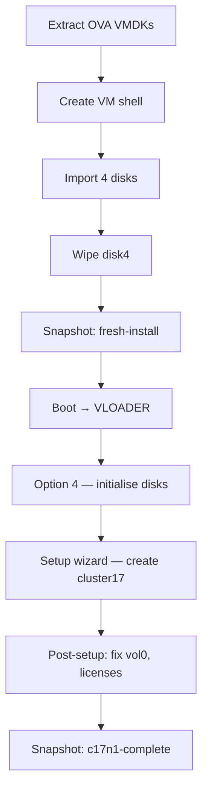

# Part 2 — First ONTAP Node (c17n1)

[← Part 1 — VyOS Router](part1-vyos.md) | [Part 3 — Second ONTAP Node →](part3-c17n2.md)

Build the first ONTAP node and create cluster17. By the end of this part you will have a fully working single-node cluster, licensed and accessible via SSH and System Manager.

---

## Table of Contents

1. [Overview](#overview)
2. [Prerequisites](#prerequisites)
3. [Getting the Files onto Proxmox](#getting-the-files-onto-proxmox)
4. [Create the VM](#create-the-vm)
5. [Pre-Boot Disk Preparation](#pre-boot-disk-preparation)
6. [Take the fresh-install Snapshot](#take-the-fresh-install-snapshot)
7. [First Boot — Navigating VLOADER](#first-boot--navigating-vloader)
8. [Disk Initialisation — Option 4](#disk-initialisation--option-4)
9. [Cluster Setup Wizard](#cluster-setup-wizard)
10. [Post-Setup Tasks](#post-setup-tasks)
11. [Fix vol0 — Critical Step](#fix-vol0--critical-step)
12. [Add Licenses](#add-licenses)
13. [Verify and Snapshot](#verify-and-snapshot)
14. [Accessing the Cluster](#accessing-the-cluster)
15. [Hibernate and Shutdown](#hibernate-and-shutdown)
16. [Troubleshooting](#troubleshooting)

---

## Overview

The ONTAP simulator is distributed as a VMware OVA file. Proxmox cannot import OVA files directly, so the process is:

1. Extract the OVA to get four VMDK disk images
2. Create a Proxmox VM manually with the correct settings
3. Import the VMDKs as raw disks
4. Wipe disk4 to remove pre-existing cluster config
5. Boot, intercept at VLOADER, run option 4 to initialise
6. Work through the cluster setup wizard



---

## Prerequisites

- Part 1 complete — VyOS running, vmbr1/vmbr2/vmbr3 up
- NetApp Support Site account (free) to download the simulator
- The following files downloaded from [mysupport.netapp.com](https://mysupport.netapp.com/site/tools/tool-eula/simulate-ontap):

| File | Description |
|------|-------------|
| `vsim-netapp-DOT9.6-cm_nodar.ova` | ONTAP simulator OVA |
| `CMode_licenses_9.6.txt` | License keys for all features |

---

## Getting the Files onto Proxmox

### Extract the OVA

The OVA is a tar archive. Extract it to get the VMDKs:

```bash
mkdir -p /tmp/ontap-staging
cd /tmp/ontap-staging

# If the OVA is already on the Proxmox host
tar -xvf /path/to/vsim-netapp-DOT9.6-cm_nodar.ova

# Or copy from your workstation first
scp vsim-netapp-DOT9.6-cm_nodar.ova root@<proxmox-ip>:/tmp/ontap-staging/
tar -xvf vsim-netapp-DOT9.6-cm_nodar.ova
```

Verify the extracted files:

```bash
ls -lh /tmp/ontap-staging/*.vmdk
```

You should see exactly these four files:

```
vsim-netapp-DOT9.6-cm-disk1.vmdk   ~414 MB   boot disk
vsim-netapp-DOT9.6-cm-disk2.vmdk   ~70 KB    sparse
vsim-netapp-DOT9.6-cm-disk3.vmdk   ~70 KB    sparse
vsim-netapp-DOT9.6-cm-disk4.vmdk   ~100 KB   disk shelf image
```

> **Filename note:** Some older guides refer to `vsim-NetAppDOT-simulate-disk1.vmdk`. That is wrong for the 9.6 simulator. The correct names are `vsim-netapp-DOT9.6-cm-disk*.vmdk`.

Also copy the license file:

```bash
scp CMode_licenses_9.6.txt root@<proxmox-ip>:/tmp/ontap-staging/
```

---

## Create the VM

### Critical Settings

These settings are not optional. Any deviation will cause ONTAP to fail to boot:

| Setting | Value | Why |
|---------|-------|-----|
| Machine type | `pc` (i440fx) | q35 causes ONTAP boot failure |
| BIOS | SeaBIOS | UEFI is not supported |
| CPU type | `SandyBridge` | Other types cause boot failure — undocumented by NetApp |
| Disk bus | IDE | SCSI and VirtIO are not recognised by ONTAP |
| Disk format | `raw` | local-lvm does not support qcow2 |
| NIC model | `e1000` | Required for ONTAP to recognise the interface |
| RAM | 5222 MB | NetApp's minimum is 5.1 GB. 5120 MB (5.0 GB) is 100 MB short |
| Balloon | disabled | ONTAP does not support the QEMU balloon driver |

### NIC to Bridge Mapping

| ONTAP port | VM NIC | Bridge | Purpose |
|------------|--------|--------|---------|
| e0a | net0 | vmbr2 | Cluster interconnect |
| e0b | net1 | vmbr2 | Cluster interconnect |
| e0c | net2 | vmbr1 | Management |
| e0d | net3 | vmbr3 | Data / intercluster |

### Create the VM Shell

```bash
VMID=301
STORAGE=local-lvm   # Change if your storage pool has a different name
VMDK_DIR=/tmp/ontap-staging

qm create ${VMID} \
    --name c17n1 \
    --machine pc \
    --bios seabios \
    --cores 2 \
    --cpu SandyBridge \
    --memory 5222 \
    --balloon 0 \
    --net0 e1000,bridge=vmbr2 \
    --net1 e1000,bridge=vmbr2 \
    --net2 e1000,bridge=vmbr1 \
    --net3 e1000,bridge=vmbr3 \
    --onboot 0
```

### Import the Four Disks

Import in order — disk1 must become ide0, disk4 must become ide3:

```bash
qm importdisk ${VMID} ${VMDK_DIR}/vsim-netapp-DOT9.6-cm-disk1.vmdk ${STORAGE} --format raw
qm importdisk ${VMID} ${VMDK_DIR}/vsim-netapp-DOT9.6-cm-disk2.vmdk ${STORAGE} --format raw
qm importdisk ${VMID} ${VMDK_DIR}/vsim-netapp-DOT9.6-cm-disk3.vmdk ${STORAGE} --format raw
qm importdisk ${VMID} ${VMDK_DIR}/vsim-netapp-DOT9.6-cm-disk4.vmdk ${STORAGE} --format raw
```

Attach as IDE devices:

```bash
qm set ${VMID} --ide0 ${STORAGE}:vm-${VMID}-disk-0
qm set ${VMID} --ide1 ${STORAGE}:vm-${VMID}-disk-1
qm set ${VMID} --ide2 ${STORAGE}:vm-${VMID}-disk-2
qm set ${VMID} --ide3 ${STORAGE}:vm-${VMID}-disk-3
qm set ${VMID} --boot order=ide0
```

---

## Pre-Boot Disk Preparation

### Why disk4 Must Be Wiped

disk4 is the simulated disk shelf image. The OVA ships with pre-existing cluster configuration baked into this image — the previous builder's WWN reservations, disk shelf identity, and cluster config remnants. If you boot without clearing this, ONTAP panics immediately:

```
PANIC: Can't find device with WWN 0x... Remove '/sim/dev/,disks/,reservations' and restart.
```

Wipe disk4 now, before the VM has ever been started:

```bash
dd if=/dev/zero of=/dev/pve/vm-${VMID}-disk-3 bs=1M count=1024 status=progress
```

> **Why only disk4?** disk1 contains the ONTAP boot image and filesystem. disk2 and disk3 contain essential ONTAP data. Only disk4 (the disk shelf) needs wiping.

> **Thin-provisioned storage note:** On LVM thin pools, `dd` writes zeroes but may not release already-allocated extents. If the wipe completes instantly (under 1 second) and you later see the WWN panic, use `blkdiscard` instead:
> ```bash
> blkdiscard /dev/pve/vm-${VMID}-disk-3
> ```

---

## Take the fresh-install Snapshot

Take a snapshot **now**, before the VM has ever been booted. This gives you a clean rollback point and — importantly — a base image you can use to build c17n2 later.

```bash
qm snapshot ${VMID} fresh-install --description "c17n1 - clean VMDKs, disk4 wiped, never booted"
qm listsnapshot ${VMID}
```

> **Why before first boot?** Once ONTAP has run option 4 it writes identity data (WWNs, system ID) to the disks. A snapshot taken after that point cannot safely be cloned to produce a second node — the clone will carry the original node's disk identity and ONTAP will panic when two nodes try to own the same disks. The only safe cloning point is before any boot.

---

## First Boot — Navigating VLOADER

Open the **Proxmox console** for VM 301 before starting it — you need to see the screen from the very beginning.

```bash
qm start 301
```

Watch the console. You will see four BIOS drive lines appear:

```
BIOS drive C: is disk0
BIOS drive D: is disk1
BIOS drive E: is disk2
BIOS drive F: is disk3
```

**Wait until all four lines have appeared**, then press **Ctrl-C**.

> **Timing matters:** Press Ctrl-C too early (before all 4 drive lines) and you land at the `boot:` prompt instead of `VLOADER>`. If that happens, type `boot` and try again on the next cycle.

You should see:

```
VLOADER>
```

Set the boot menu variable so ONTAP shows the initialisation menu on boot:

```
VLOADER> setenv bootarg.init.bootmenu 1
VLOADER> printenv bootarg.init.bootmenu
1
VLOADER> boot
```

> **Why `bootarg.init.bootmenu 1`?** After disk4 has been wiped, ONTAP cannot find the disk shelf structure and would normally panic before giving you a chance to do anything. This variable forces the boot menu to appear, giving you control.

---

## Disk Initialisation — Option 4

After the FIPS self-tests complete, the boot menu appears:

```
Please choose one of the following:
(1) Normal Boot.
(2) Boot without /etc/rc.
(3) Change password.
(4) Clean configuration and initialize all disks.
(5) Maintenance mode boot.
...
Selection (1-9)?
```

Enter **4** and confirm both prompts:

```
Selection (1-9)? 4
Zero disks, reset config and install a new file system?: y
This will erase all the data on the disks, are you sure?: y
```

ONTAP will now wipe and reinitialise the disk shelf. This takes **10–20 minutes**. Do not interrupt it. The VM reboots automatically when done and drops into the cluster setup wizard.

---

## Cluster Setup Wizard

The wizard runs automatically after option 4 completes. Work through it with these values:

### AutoSupport

```
Type yes to confirm and continue {yes}: yes
```

### Node Management Interface

```
Enter the node management interface port [e0c]: e0c
Enter the node management interface IP address: 172.17.17.11
Enter the node management interface netmask: 255.255.255.0
Enter the node management interface default gateway: 172.17.17.1
```

Press **Enter** when prompted for the web UI — skip it and use the CLI.

### Create or Join

```
Do you want to create a new cluster or join an existing cluster? {create, join}: create
```

### Cluster Interconnect

```
Do you want to use these defaults? {yes, no} [yes]: yes
```

Accept the default — ONTAP will auto-assign `169.254.x.x` link-local addresses to e0a/e0b.

### Cluster Name and Password

```
Enter the cluster name: cluster17
Enter the cluster admin password: <your-password>
Confirm the cluster admin password: <your-password>
```

### Cluster Base License

Enter the cluster base license key from `CMode_licenses_9.6.txt`. Skip feature licenses for now — you will add them after setup.

### Cluster Management Interface

```
Enter the cluster management interface port [e0d]: e0c
Enter the cluster management interface IP address: 172.17.17.10
Enter the cluster management interface netmask: 255.255.255.0
Enter the cluster management interface default gateway: 172.17.17.1
```

### DNS and Location

```
Enter the DNS domain names: (press Enter to skip)
Where is the controller located: proxmox-lab
```

Setup completes. You will see:

```
cluster17::>
```

---

## Post-Setup Tasks

### Fix the Cluster Management LIF

The wizard assigns `cluster_mgmt` to `e0a` by default, which is on the isolated cluster interconnect bridge (vmbr2). You cannot reach it from there. Move it to e0c:

```bash
ssh admin@172.17.17.10
```

If SSH fails, use the console. Check where cluster_mgmt is:

```
cluster17::> network interface show -vserver cluster17
```

If `cluster_mgmt` shows `e0a` as the home port:

```
cluster17::> network interface modify -vserver cluster17 -lif cluster_mgmt -home-port e0c -home-node c17n1
cluster17::> network interface revert -vserver cluster17 -lif cluster_mgmt
```

Verify:

```
cluster17::> network interface show -vserver cluster17
```

`cluster_mgmt` should now show `e0c` and `Is Home: true`.

### Assign Disks

```
cluster17::> storage disk assign -all true -node c17n1
```

### Verify Cluster Health

```
cluster17::> cluster show
cluster17::> aggr status
cluster17::> storage disk show
```

Expected: 1 node healthy, aggr0 online, 28 disks visible.

---

## Fix vol0 — Critical Step

This is the most important post-setup task and the one most often skipped. The root volume vol0 sits in aggr0 which is only ~855 MB. It fills up quickly with log files and snapshots. When it fills completely, ONTAP subsystems start crashing.

Do all of this from the node shell. Enter it with:

```
cluster17::> system node run -node c17n1
```

### Step 1 — Delete Existing Snapshots

```
c17n1% snap delete -a -f vol0
```

### Step 2 — Disable Automatic Snapshots

```
c17n1% snap sched vol0 0 0 0
```

### Step 3 — Enable Snapshot Autodelete

```
c17n1% snap autodelete vol0 on
c17n1% snap autodelete vol0 target_free_space 35
```

This ensures ONTAP automatically deletes old snapshots if free space drops below 35%. It is a safety net.

### Step 4 — Set Snapshot Reserve to Zero

```
c17n1% snap reserve vol0 0
```

By default 20% of vol0 is reserved for snapshots. Since we are managing this manually, reclaim that space.

### Step 5 — Exit the Node Shell

```
c17n1% exit
```

### Step 6 — Expand aggr0

Add a disk to the root aggregate to give vol0 room to grow:

```
cluster17::> storage aggregate add-disks -aggregate aggr0_c17n1_01 -diskcount 1
```

Answer `y` to both prompts.

### Step 7 — Expand vol0

Check the maximum volume size:

```
cluster17::> vol modify -vserver c17n1 -volume vol0 -size +1g
```

This will fail with an error showing the actual maximum — something like `maximum volume growth is +889MB`. Use that value:

```
cluster17::> vol modify -vserver c17n1 -volume vol0 -size +889MB
```

Verify the new size:

```
cluster17::> volume show -volume vol0
```

> **Why is this necessary?** The simulator ships with a minimal root aggregate. Without expanding vol0, the simulator will fill up its root volume during normal operation — especially during cluster join operations — and start crashing subsystems. This is documented in the official NetApp guide and confirmed from hard experience.

---

## Add Licenses

Open `CMode_licenses_9.6.txt`. It has three sections:
- Cluster base license (already added during wizard)
- Node 1 licenses
- Node 2 licenses (save these for Part 3)

Add each Node 1 license:

```
cluster17::> license add -license-code <key>
```

Repeat for each key, then verify:

```
cluster17::> license show
```

You should see licenses for: NFS, CIFS, iSCSI, FCP, SnapRestore, SnapMirror, FlexClone, SnapVault, SnapLock, SnapManagerSuite, SnapProtectApps.

### Disable AutoSupport

```
cluster17::> autosupport modify -support disable
```

---

## Verify and Snapshot

Run a final health check:

```
cluster17::> cluster show
cluster17::> network interface show
cluster17::> storage disk show
cluster17::> license show
cluster17::> system node run -node c17n1 df -h
```

The `df -h` output should show vol0 with comfortable free space:

```
Filesystem        total   used  avail capacity  Mounted on
/vol/vol0/        1.6GB   500MB  1.1GB      30%  /vol/vol0/
```

Now take the completion snapshot:

```bash
# From ONTAP — halt cleanly
cluster17::> system node halt -node c17n1 -skip-lif-migration true
# Answer: y

# From Proxmox — stop and snapshot
qm stop 301
qm snapshot 301 c17n1-complete --description "cluster17 single node, licensed, vol0 fixed"
qm listsnapshot 301
```

---

## Accessing the Cluster

### From the Proxmox Host

The Proxmox host has `172.17.17.254` on vmbr1 and can reach the cluster directly:

```bash
ssh admin@172.17.17.10
```

### From Your Workstation

If you added the static route in Part 1, you can SSH directly:

```bash
ssh admin@172.17.17.10
```

Or via Proxmox as a jump host:

```bash
ssh -J root@<proxmox-ip> admin@172.17.17.10
```

### System Manager Web UI

```
https://172.17.17.10
```

Login with `admin` and your cluster password. Accept the self-signed certificate warning.

---

## Hibernate and Shutdown

### Hibernate — Recommended for Day-to-Day Use

Hibernate frees all RAM immediately and resumes in seconds:

```bash
# Proxmox web UI: Shutdown dropdown → Hibernate
# Or CLI:
qm suspend 301 --todisk 1

# Resume:
qm resume 301
```

Single node hibernate works reliably. No special considerations.

### Safe Shutdown

Never hard-stop the VM. Always halt from the ONTAP CLI first:

```bash
# Step 1 — from ONTAP CLI
cluster17::> system node halt -node c17n1 -skip-lif-migration true
# Answer: y

# Step 2 — from Proxmox (after SSH drops)
qm stop 301
```

> **Why halt first?** ONTAP simulates NVRAM which is not actually persistent. A hard stop mid-operation can corrupt WAFL (the ONTAP filesystem) and may require full reinitialisation from the `fresh-install` snapshot.

---

## Troubleshooting

### PANIC: Can't find device with WWN

```
PANIC: Can't find device with WWN 0x... Remove '/sim/dev/,disks/,reservations' and restart.
```

**Cause:** Old reservation data on disk4 was not wiped.

**Fix:**
```bash
qm stop 301
dd if=/dev/zero of=/dev/pve/vm-301-disk-3 bs=1M count=1024 status=progress
# Or on thin storage:
blkdiscard /dev/pve/vm-301-disk-3
```

Then boot and run option 4.

### PANIC: out of memory

```
PANIC: sk_allocate_memory: out of memory
```

**Cause:** RAM below NetApp's minimum of 5.1 GB (5222 MB).

**Fix:**
```bash
qm stop 301
qm set 301 --memory 5222
qm start 301
```

### PANIC: /sim/dev/,disks directory not found

**Cause:** disk4 is blank. This is expected after a correct wipe.

**Fix:** At VLOADER, set `bootarg.init.bootmenu 1` and boot. Select option 4.

### Landed at `boot:` instead of `VLOADER>`

**Cause:** Ctrl-C pressed before all 4 BIOS drive lines appeared.

**Fix:** Type `boot` at the `boot:` prompt. On the next cycle wait for all 4 drive lines before pressing Ctrl-C.

### cluster_mgmt unreachable after setup

**Cause:** Wizard assigned `cluster_mgmt` to e0a (cluster interconnect bridge, vmbr2 — isolated).

**Fix:** Move the LIF to e0c as described in Post-Setup Tasks.

### vol0 fills up — subsystems crashing

**Symptom:** VifMgr aborting repeatedly, `rootvolrec.low.space: EMERGENCY` messages.

**Cause:** vol0 snapshot accumulation from crashes or restarts. The fix-vol0 step was skipped.

**Fix:**
```
cluster17::> system node run -node c17n1 snap delete -a -f vol0
cluster17::> system node run -node c17n1 snap sched vol0 0 0 0
```

Then follow the full fix-vol0 procedure above.

### Cannot snapshot — lock timeout

**Cause:** VM still in transitional state.

**Fix:**
```bash
qm stop 301
qm snapshot 301 <name>
```

---

[← Part 1 — VyOS Router](part1-vyos.md) | [Part 3 — Second ONTAP Node →](part3-c17n2.md)

*Tested on: Proxmox VE 9.1.5 | ONTAP Simulator 9.6 | 2026*
