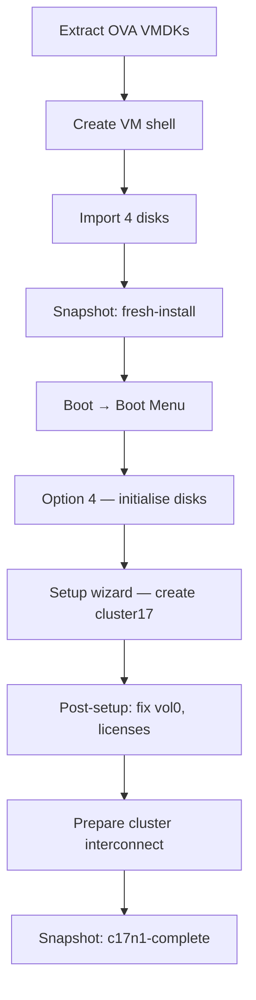

# Part 2 — First ONTAP Node (c17n1)

[← Part 1 — VyOS Router](part1-vyos.md) | [Part 3 — Second ONTAP Node →](part3-cluster17-02.md)

Build the first ONTAP node and create cluster17. By the end of this part you will have a fully working single-node cluster, licensed and accessible via SSH and System Manager. If you plan to add a second node, there are additional steps at the end of this part to prepare the cluster interconnect before node 2 can join.

---

## Table of Contents

1. [Overview](#overview)
2. [Prerequisites](#prerequisites)
3. [Getting the Files onto Proxmox](#getting-the-files-onto-proxmox)
4. [Create the VM](#create-the-vm)
5. [Take the fresh-install Snapshot](#take-the-fresh-install-snapshot)
6. [First Boot — Boot Menu](#first-boot--boot-menu)
7. [Disk Initialisation — Option 4](#disk-initialisation--option-4)
8. [Cluster Setup Wizard](#cluster-setup-wizard)
9. [Post-Setup Tasks](#post-setup-tasks)
10. [Fix vol0 — Critical Step](#fix-vol0--critical-step)
11. [Add Licenses](#add-licenses)
12. [Prepare Cluster Interconnect for Node 2](#prepare-cluster-interconnect-for-node-2)
13. [Verify and Snapshot](#verify-and-snapshot)
14. [Accessing the Cluster](#accessing-the-cluster)
15. [Hibernate and Shutdown](#hibernate-and-shutdown)
16. [Troubleshooting](#troubleshooting)

---

## Overview

The ONTAP simulator is distributed as a VMware OVA file. Proxmox cannot import OVA files directly, so the process is:

1. Extract the OVA on your workstation to get four VMDK disk images
2. Copy the VMDKs to Proxmox (or access them from a USB drive)
3. Create a Proxmox VM manually with the correct settings
4. Import the VMDKs as raw disks
5. Take a snapshot before first boot
6. Boot, select option 4 to initialise disks
7. Work through the cluster setup wizard



> **Node and aggregate naming:** ONTAP auto-generates node and aggregate names from the cluster name. If you name the cluster `cluster17`, the node will be `cluster17-01` and the root aggregate will be `aggr0_cluster17_01`. You cannot choose these names during the wizard — they are derived automatically. All commands in this guide use the actual names as they will appear.

---

## Prerequisites

- Part 1 complete — VyOS running, vmbr1/vmbr2/vmbr3 up
- NetApp Support Site account (free) to download the simulator
- The following files downloaded from [mysupport.netapp.com](https://mysupport.netapp.com/site/tools/tool-eula/simulate-ontap):

| File | Description |
|------|-------------|
| `vsim-netapp-DOT9.6-cm_nodar.ova` | ONTAP simulator OVA |
| `CMode_licenses_9.6.txt` | License keys for all features |

---

## Getting the Files onto Proxmox

### Extract the OVA

The OVA is a tar archive. Extract it on your workstation to get the four VMDKs:

```bash
tar -xvf vsim-netapp-DOT9.6-cm_nodar.ova
```

You should see exactly these four files:

```
vsim-netapp-DOT9.6-cm-disk1.vmdk   ~414 MB   boot disk
vsim-netapp-DOT9.6-cm-disk2.vmdk   ~70 KB    sparse
vsim-netapp-DOT9.6-cm-disk3.vmdk   ~70 KB    sparse
vsim-netapp-DOT9.6-cm-disk4.vmdk   ~100 KB   disk shelf image
```

### Copy to Proxmox

Copy the four VMDKs and the license file to Proxmox. The easiest method is a USB drive or SCP:

```bash
scp vsim-netapp-DOT9.6-cm-disk*.vmdk CMode_licenses_9.6.txt root@<proxmox-ip>:/tmp/ontap-staging/
```

In this guide the files are at `/mnt/usbdrive/ontap-staging/`. Adjust the `VMDK_DIR` variable below to match your actual path.

---

## Create the VM

### Critical Settings

These settings are not optional. Any deviation will cause ONTAP to fail to boot:

| Setting | Value | Why |
|---------|-------|-----|
| Machine type | `pc` (i440fx) | q35 causes ONTAP boot failure |
| BIOS | SeaBIOS | UEFI is not supported |
| CPU type | `SandyBridge` | Other types cause boot failure |
| Disk bus | IDE | SCSI and VirtIO are not recognised by ONTAP |
| Disk format | `raw` | local-lvm does not support qcow2 |
| NIC model | `e1000` | Required for ONTAP to recognise the interface |
| RAM | 5222 MB | NetApp's minimum is 5.1 GB — 5120 MB is 100 MB short |
| Balloon | disabled | ONTAP does not support the QEMU balloon driver |

### NIC to Bridge Mapping

| ONTAP port | VM NIC | Bridge | Purpose |
|------------|--------|--------|---------|
| e0a | net0 | vmbr2 | Cluster interconnect |
| e0b | net1 | vmbr2 | Cluster interconnect |
| e0c | net2 | vmbr1 | Management |
| e0d | net3 | vmbr3 | Data / intercluster |

### Create the VM Shell

```bash
VMID=301
STORAGE=local-lvm
VMDK_DIR=/mnt/usbdrive/ontap-staging

qm create ${VMID} \
    --name c17n1 \
    --machine pc \
    --bios seabios \
    --cores 2 \
    --cpu SandyBridge \
    --memory 5222 \
    --balloon 0 \
    --net0 e1000,bridge=vmbr2 \
    --net1 e1000,bridge=vmbr2 \
    --net2 e1000,bridge=vmbr1 \
    --net3 e1000,bridge=vmbr3 \
    --onboot 0
```

### Import the Four Disks

Import in order — disk1 must become ide0, disk4 must become ide3:

```bash
qm importdisk ${VMID} ${VMDK_DIR}/vsim-netapp-DOT9.6-cm-disk1.vmdk ${STORAGE} --format raw
qm importdisk ${VMID} ${VMDK_DIR}/vsim-netapp-DOT9.6-cm-disk2.vmdk ${STORAGE} --format raw
qm importdisk ${VMID} ${VMDK_DIR}/vsim-netapp-DOT9.6-cm-disk3.vmdk ${STORAGE} --format raw
qm importdisk ${VMID} ${VMDK_DIR}/vsim-netapp-DOT9.6-cm-disk4.vmdk ${STORAGE} --format raw
```

Attach as IDE devices:

```bash
qm set ${VMID} --ide0 ${STORAGE}:vm-${VMID}-disk-0
qm set ${VMID} --ide1 ${STORAGE}:vm-${VMID}-disk-1
qm set ${VMID} --ide2 ${STORAGE}:vm-${VMID}-disk-2
qm set ${VMID} --ide3 ${STORAGE}:vm-${VMID}-disk-3
qm set ${VMID} --boot order=ide0
```

> **Note on disk sizes:** disk4 will import as ~230 GB even though the source VMDK is ~100 KB. This is normal — it is a sparse VMDK that expands to its full virtual size on import. The actual space used on thin-provisioned storage remains minimal.

---

## Take the fresh-install Snapshot

Take a snapshot **now**, before the VM has ever been booted:

```bash
qm snapshot ${VMID} fresh-install --description "c17n1 - clean VMDKs, never booted"
qm listsnapshot ${VMID}
```

This gives you a clean rollback point if anything goes wrong during first boot.

---

## First Boot — Boot Menu

Open the **Proxmox console** for VM 301 before starting it — you need to see the screen from the very beginning.

```bash
qm start 301
```

Watch the console. You will see the BTX loader start and four BIOS drive lines appear:

```
BIOS drive C: is disk1
BIOS drive D: is disk2
BIOS drive E: is disk3
BIOS drive F: is disk4
```

**Wait until all four lines have appeared**, then immediately press **Ctrl-C**.

> **Timing matters:** Press Ctrl-C too early (before all 4 drive lines) and you land in VLOADER instead of proceeding to the boot menu. If you land at a `VLOADER>` prompt by mistake, type `boot` and let it proceed normally to the `Press Ctrl-C for Boot Menu` message on the next cycle.

After the FIPS self-tests complete you will see:

```
Press Ctrl-C for Boot Menu.
```

Press **Ctrl-C** here to get the boot menu.

---

## Disk Initialisation — Option 4

The boot menu appears:

```
Please choose one of the following:
(1) Normal Boot.
(2) Boot without /etc/rc.
(3) Change password.
(4) Clean configuration and initialize all disks.
(5) Maintenance mode boot.
...
Selection (1-9)?
```

Enter **4** and confirm both prompts:

```
Selection (1-9)? 4
Zero disks, reset config and install a new file system?: yes
This will erase all the data on the disks, are you sure?: yes
```

You will see:

```
Rebooting to finish wipeconfig request.
```

The VM reboots and begins the actual disk initialisation. After the reboot you will see:

```
Wipe filer procedure requested.
```

This is the disk zeroing phase. Wait for it to complete — it takes a few minutes. The VM reboots again automatically and drops directly into the cluster setup wizard.

> **Do not interrupt this process.** If you stop the VM mid-wipe, the simulator disks may be corrupted and you will need to roll back to the `fresh-install` snapshot and start again.

---

## Cluster Setup Wizard

The wizard runs automatically after option 4 completes.

### AutoSupport

```
Type yes to confirm and continue {yes}: yes
```

### Node Management Interface

```
Enter the node management interface port [e0c]: e0c
Enter the node management interface IP address: 172.17.17.11
Enter the node management interface netmask: 255.255.255.0
Enter the node management interface default gateway: 172.17.17.1
```

Press **Enter** to complete cluster setup using the command line interface.

### Create or Join

```
Do you want to create a new cluster or join an existing cluster? {create, join}: create
```

### Accept System Defaults

```
Do you want to use these defaults? {yes, no} [yes]: yes
```

ONTAP creates the cluster interfaces. This takes a minute.

### Cluster Name and Password

```
Enter the cluster name: cluster17
```

Enter a strong admin password when prompted. Write it down.

### Cluster Base License

Enter the cluster base license key from `CMode_licenses_9.6.txt`:

```
Enter the cluster base license key: <base license key>
```

### Cluster Management Interface

The wizard will try to put `cluster_mgmt` on e0d by default. Change it to e0c:

```
Enter the cluster management interface port [e0d]: e0c
Enter the cluster management interface IP address: 172.17.17.10
Enter the cluster management interface netmask: 255.255.255.0
Enter the cluster management interface default gateway: 172.17.17.1
```

Press **Enter** to skip DNS. Enter a location if prompted (e.g. `lab`).

### Node Management Interface (Second Prompt)

```
Enter the node management interface port [e0c]: e0c
Enter the node management interface IP address: 172.17.17.11
Enter the node management interface netmask: 255.255.255.0
Enter the node management interface default gateway: 172.17.17.1
```

Cluster setup is now complete. You will be dropped to the `cluster17::>` prompt.

---

## Post-Setup Tasks

### Assign Disks

```
cluster17::> storage disk assign -all true -node cluster17-01
```

### Move cluster_mgmt to e0c

The wizard may have placed `cluster_mgmt` on e0a (the isolated cluster interconnect bridge). Check and fix it:

```
cluster17::> network interface show
```

If `cluster_mgmt` shows e0a as its current port:

```
cluster17::> network interface modify -vserver cluster17 -lif cluster_mgmt -home-port e0c -home-node cluster17-01
cluster17::> network interface revert -lif cluster_mgmt -vserver cluster17
```

Verify both LIFs are on e0c:

```
cluster17::> network interface show
```

Test connectivity from your workstation:

```bash
ping 172.17.17.10   # cluster_mgmt
ping 172.17.17.11   # node mgmt
```

---

## Fix vol0 — Critical Step

The root volume vol0 sits in aggr0 which starts at ~855 MB. It fills up quickly with log files and snapshots causing subsystem crashes. Do this before anything else.

Enter the node shell:

```
cluster17::> system node run -node cluster17-01
```

### Delete Existing Snapshots

```
cluster17-01> snap delete -a -f vol0
```

### Disable Automatic Snapshots

```
cluster17-01> snap sched vol0 0 0 0
```

### Enable Snapshot Autodelete

```
cluster17-01> snap autodelete vol0 on
cluster17-01> snap autodelete vol0 target_free_space 35
```

### Set Snapshot Reserve to Zero

```
cluster17-01> snap reserve vol0 0
```

### Exit the Node Shell

```
cluster17-01> exit
```

### Expand aggr0

Add a disk to the root aggregate:

```
cluster17::> storage aggregate add-disks -aggregate aggr0_cluster17_01 -diskcount 1
```

Answer `y` to both prompts.

### Expand vol0

Try adding 1g — this will fail with an error showing the actual maximum:

```
cluster17::> vol modify -vserver cluster17-01 -volume vol0 -size +1g
```

Use the maximum value shown in the error (typically around +889MB):

```
cluster17::> vol modify -vserver cluster17-01 -volume vol0 -size +889MB
```

Verify:

```
cluster17::> volume show -volume vol0
```

vol0 should now be ~1.66 GB with at least 1 GB free.

---

## Add Licenses

Open `CMode_licenses_9.6.txt`. Add each Node 1 license key:

```
cluster17::> license add <key>
```

Repeat for each key. The license file uses `license add` without `-license-code` — both forms work. Verify:

```
cluster17::> license show
```

You should see licenses for: NFS, CIFS, iSCSI, FCP, SnapRestore, SnapMirror, FlexClone, SnapVault, SnapLock, SnapManagerSuite, SnapProtectApps, Insight_Balance.

### Disable AutoSupport

```
cluster17::> autosupport modify -support disable
```

---

## Prepare Cluster Interconnect for Node 2

**Skip this section if you are running a single-node cluster only.**

When ONTAP creates a single-node cluster, it does not configure the cluster interconnect ports (e0a/e0b). Before node 2 can join, you must manually move these ports into the Cluster IPspace and create cluster LIFs on them.

### Step 1 — Remove e0a and e0b from the Default broadcast domain

```
cluster17::> network port broadcast-domain remove-ports -ipspace Default -broadcast-domain Default -ports cluster17-01:e0a,cluster17-01:e0b
```

### Step 2 — Add them to the Cluster broadcast domain

```
cluster17::> network port broadcast-domain add-ports -ipspace Cluster -broadcast-domain Cluster -ports cluster17-01:e0a,cluster17-01:e0b
```

### Step 3 — Fix the MTU

The Cluster broadcast domain defaults to MTU 9000. Proxmox bridges pass a maximum of 1500. This mismatch causes the cluster join to hang silently during DB sync. Set it to 1500:

```
cluster17::> network port broadcast-domain modify -ipspace Cluster -broadcast-domain Cluster -mtu 1500
```

Answer `y` to the warning.

### Step 4 — Create cluster LIFs

```
cluster17::> network interface create -vserver Cluster -lif cluster17-01_clus1 -home-node cluster17-01 -home-port e0a -address 169.254.1.1 -netmask 255.255.0.0
cluster17::> network interface create -vserver Cluster -lif cluster17-01_clus2 -home-node cluster17-01 -home-port e0b -address 169.254.1.2 -netmask 255.255.0.0
```

### Step 5 — Verify

```
cluster17::> network interface show -vserver Cluster
```

Both LIFs should show `up/up` on e0a and e0b. The cluster is now ready for node 2 to join.

```
cluster17::> network port show
```

e0a and e0b should show IPspace `Cluster`, MTU `1500`.

---

## Verify and Snapshot

Run a final health check:

```
cluster17::> cluster show
cluster17::> network interface show
cluster17::> storage disk show
cluster17::> license show
cluster17::> system node run -node cluster17-01 df -h
```

Expected vol0 output:

```
Filesystem    total    used   avail capacity  Mounted on
/vol/vol0/   1696MB   330MB  1365MB      19%  /vol/vol0/
```

Now take the completion snapshot. Halt ONTAP cleanly first:

```
cluster17::> system node halt -node cluster17-01 -skip-lif-migration true
```

Answer `y`. Wait for the SSH connection to drop, then from Proxmox:

```bash
qm stop 301
qm snapshot 301 c17n1-complete --description "cluster17 single node, licensed, vol0 fixed"
qm listsnapshot 301
```

---

## Accessing the Cluster

### SSH

```bash
ssh admin@172.17.17.10   # cluster management LIF
ssh admin@172.17.17.11   # node management LIF
```

### System Manager Web UI

```
https://172.17.17.10
```

Login with `admin` and your cluster password. Accept the self-signed certificate warning.

---

## Hibernate and Shutdown

### Hibernate — Recommended for Day-to-Day Use

Hibernate frees all RAM immediately and resumes in seconds:

```bash
qm suspend 301 --todisk 1

# Resume:
qm resume 301
```

### Safe Shutdown

Never hard-stop the VM. Always halt from the ONTAP CLI first:

```
cluster17::> system node halt -node cluster17-01 -skip-lif-migration true
```

Answer `y`, wait for SSH to drop, then:

```bash
qm stop 301
```

> **Why halt first?** ONTAP simulates NVRAM which is not persistent. A hard stop mid-operation can corrupt WAFL and require full reinitialisation from the `fresh-install` snapshot.

---

## Troubleshooting

### Boot loops — option 4 reboots back to the menu repeatedly

**Cause:** The `bootarg.init.bootmenu 1` VLOADER variable was set. This forces the boot menu on every reboot, causing option 4 to loop indefinitely.

**Fix:** Do not set `bootarg.init.bootmenu 1` for node 1. This variable is only needed for node 2. If you have already set it, boot the VM, intercept at VLOADER, and unset it:

```
VLOADER> unsetenv bootarg.init.bootmenu
VLOADER> boot
```

Then select option 1 (Normal Boot) at the menu.

### PANIC: Can't find device with WWN

```
PANIC: Can't find device with WWN 0x... Remove '/sim/dev/,disks/,reservations' and restart.
```

**Cause:** Old reservation data on disk4. This only occurs when restoring from a post-boot snapshot or cloning. Fresh VMDKs imported directly from the OVA do not trigger this.

**Fix:**

```bash
qm stop 301
blkdiscard /dev/pve/vm-301-disk-3
# or if blkdiscard is not available:
dd if=/dev/zero of=/dev/pve/vm-301-disk-3 bs=1M count=1024 status=progress
```

Then boot and run option 4.

### PANIC: out of memory

```
PANIC: sk_allocate_memory: out of memory
```

**Cause:** RAM below NetApp's minimum of 5.1 GB.

**Fix:**

```bash
qm stop 301
qm set 301 --memory 5222
qm start 301
```

### cluster_mgmt unreachable after setup

**Cause:** Wizard placed `cluster_mgmt` on e0a (the isolated cluster interconnect bridge vmbr2).

**Fix:** Move the LIF to e0c as described in Post-Setup Tasks above.

### vol0 fills up — subsystems crashing

**Symptom:** VifMgr aborting repeatedly, `rootvolrec.low.space: EMERGENCY` messages.

**Cause:** vol0 snapshot accumulation. The fix-vol0 step was skipped.

**Fix:**

```
cluster17::> system node run -node cluster17-01
cluster17-01> snap delete -a -f vol0
cluster17-01> snap sched vol0 0 0 0
cluster17-01> exit
```

Then follow the full fix-vol0 procedure above.

### Landed at `VLOADER>` instead of the boot menu

**Cause:** Ctrl-C pressed too early, before all 4 BIOS drive lines appeared.

**Fix:** Type `boot` at the VLOADER prompt and let ONTAP boot normally. Watch for `Press Ctrl-C for Boot Menu` and press Ctrl-C at that point instead.

---

[← Part 1 — VyOS Router](part1-vyos.md) | [Part 3 — Second ONTAP Node →](part3-cluster17-02.md)

*Tested on: Proxmox VE 8.x | ONTAP Simulator 9.6 | 2026*
