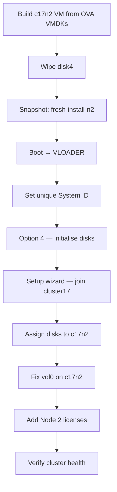

# Part 3 — Second ONTAP Node (c17n2)

[← Part 2 — First ONTAP Node](part2-c17n1.md) | [Part 4 — DR Cluster →](part4-c17dr.md)

Build the second node and join it to cluster17. By the end of this part you will have a two-node cluster.

---

## Table of Contents

1. [Overview](#overview)
2. [Before You Start](#before-you-start)
3. [Create the c17n2 VM](#create-the-c17n2-vm)
4. [Pre-Boot Disk Preparation](#pre-boot-disk-preparation)
5. [Set a Unique System ID at VLOADER](#set-a-unique-system-id-at-vloader)
6. [Disk Initialisation — Option 4](#disk-initialisation--option-4)
7. [Cluster Setup Wizard — Join](#cluster-setup-wizard--join)
8. [Post-Join Tasks](#post-join-tasks)
9. [Fix vol0 on c17n2](#fix-vol0-on-c17n2)
10. [Verify the Cluster](#verify-the-cluster)
11. [Snapshot](#snapshot)
12. [Troubleshooting](#troubleshooting)

---

## Overview

Adding a second node to an existing cluster requires a few extra steps compared to creating the first node. The key difference is that each ONTAP node must have a **unique System ID** — it is hardcoded in the OVA image, so every node built from the same OVA starts with the same ID. You must change it before running option 4.



### Why Not Clone c17n1?

Cloning an ONTAP VM does not work regardless of when the snapshot was taken. A clone carries the source node's WWN addresses and disk shelf identity at a level deeper than the VLOADER System ID override can fix. The cloned node panics before ONTAP gets far enough to run option 4.

Each node must be built from the original OVA VMDKs. The process takes the same time as building c17n1.

---

## Before You Start

### Memory — Both Nodes Need Headroom Simultaneously

The join process is the most memory-intensive operation in this entire guide. When c17n2 joins, **both nodes work hard at the same time** — c17n2 syncing the cluster database, c17n1 accepting it. If either node runs out of memory, the join fails and c17n2 reboots to retry.

Temporarily boost both nodes before starting:

```bash
# Halt c17n1 cleanly first
ssh admin@172.17.17.10
cluster17::> system node halt -node c17n1 -skip-lif-migration true

# Then from Proxmox
qm stop 301
qm set 301 --memory 7168
qm set 302 --memory 7168   # set this before creating 302 if you haven't yet
qm start 301
```

Wait for c17n1 to fully boot and be reachable at `172.17.17.10` before proceeding.

### Check vol0 Before Joining

A full vol0 on c17n1 will cause the join to fail mid-way. Verify it has space:

```bash
ssh admin@172.17.17.10
cluster17::> system node run -node c17n1 df -h
```

vol0 should have at least 200 MB free. If not, run the fix-vol0 procedure from Part 2 before proceeding.

---

## Create the c17n2 VM

The VM settings are identical to c17n1 — same CPU, same memory, same NIC layout. The VMID and name are different.

```bash
VMID=302
STORAGE=local-lvm
VMDK_DIR=/tmp/ontap-staging   # same VMDKs as used for c17n1

qm create ${VMID} \
    --name c17n2 \
    --machine pc \
    --bios seabios \
    --cores 2 \
    --cpu SandyBridge \
    --memory 7168 \
    --balloon 0 \
    --net0 e1000,bridge=vmbr2 \
    --net1 e1000,bridge=vmbr2 \
    --net2 e1000,bridge=vmbr1 \
    --net3 e1000,bridge=vmbr3 \
    --onboot 0
```

Import the four disks:

```bash
qm importdisk ${VMID} ${VMDK_DIR}/vsim-netapp-DOT9.6-cm-disk1.vmdk ${STORAGE} --format raw
qm importdisk ${VMID} ${VMDK_DIR}/vsim-netapp-DOT9.6-cm-disk2.vmdk ${STORAGE} --format raw
qm importdisk ${VMID} ${VMDK_DIR}/vsim-netapp-DOT9.6-cm-disk3.vmdk ${STORAGE} --format raw
qm importdisk ${VMID} ${VMDK_DIR}/vsim-netapp-DOT9.6-cm-disk4.vmdk ${STORAGE} --format raw

qm set ${VMID} --ide0 ${STORAGE}:vm-${VMID}-disk-0
qm set ${VMID} --ide1 ${STORAGE}:vm-${VMID}-disk-1
qm set ${VMID} --ide2 ${STORAGE}:vm-${VMID}-disk-2
qm set ${VMID} --ide3 ${STORAGE}:vm-${VMID}-disk-3
qm set ${VMID} --boot order=ide0
```

---

## Pre-Boot Disk Preparation

Wipe disk4 before the VM has ever been booted:

```bash
dd if=/dev/zero of=/dev/pve/vm-${VMID}-disk-3 bs=1M count=1024 status=progress
```

On thin-provisioned storage, use `blkdiscard` if `dd` completes instantly:

```bash
blkdiscard /dev/pve/vm-${VMID}-disk-3
```

Take the pre-build snapshot:

```bash
qm snapshot ${VMID} fresh-install --description "c17n2 - clean VMDKs, disk4 wiped, never booted"
```

---

## Set a Unique System ID at VLOADER

Every ONTAP node in a cluster must have a unique System ID. The OVA ships with the same hardcoded ID for every copy. You must change it before running option 4 — if two nodes share an ID, disk ownership conflicts will occur when c17n2 tries to join.

### Find c17n1's System ID

```bash
ssh admin@172.17.17.10
cluster17::> node show -fields system-id
```

Note the value — it will be something like `4082368507`.

c17n2 should use the next sequential ID: `4082368508`.

### Boot c17n2 and Intercept at VLOADER

Open the Proxmox console for VM 302 **before** starting it:

```bash
qm start 302
```

Watch for all four BIOS drive lines:

```
BIOS drive C: is disk0
BIOS drive D: is disk1
BIOS drive E: is disk2
BIOS drive F: is disk3
```

After all four appear, press **Ctrl-C**. At the `VLOADER>` prompt:

```
VLOADER> setenv SYS_SERIAL_NUM 4034389-06-2
VLOADER> setenv bootarg.nvram.sysid 4082368508
VLOADER> setenv bootarg.init.bootmenu 1
VLOADER> printenv bootarg.nvram.sysid
4082368508
VLOADER> boot
```

The `printenv` confirms the value was set correctly before booting.

### System ID Override Prompt

After the FIPS self-tests you may see:

```
WARNING: System ID mismatch. This usually occurs when replacing a boot device or NVRAM cards!
Override system ID? {y|n}
```

Type **y**. This is expected — ONTAP noticed a difference between the VLOADER value and what it found on disk. Answering yes accepts the new ID.

> If you built c17n2 from truly fresh OVA VMDKs that have never been booted, you may not see this prompt at all. Both behaviours are normal.

---

## Disk Initialisation — Option 4

At the boot menu:

```
Selection (1-9)? 4
Zero disks, reset config and install a new file system?: y
This will erase all the data on the disks, are you sure?: y
```

Wait 10–20 minutes. The VM reboots automatically into the setup wizard.

---

## Cluster Setup Wizard — Join

When the wizard appears on c17n2, the process is different from c17n1 — you join the existing cluster rather than creating a new one.

### AutoSupport

```
Type yes to confirm and continue {yes}: yes
```

### Node Management Interface

```
Enter the node management interface port [e0c]: e0c
Enter the node management interface IP address: 172.17.17.12
Enter the node management interface netmask: 255.255.255.0
Enter the node management interface default gateway: 172.17.17.1
```

Press **Enter** to use the CLI.

### Join the Cluster

```
Do you want to create a new cluster or join an existing cluster? {create, join}: join
```

### Cluster Interconnect

```
Do you want to use these defaults? {yes, no} [yes]: yes
```

ONTAP will auto-assign `169.254.x.x` addresses to e0a/e0b and display them:

```
Existing cluster interface configuration found:
Port    MTU    IP                 Netmask
e0a     1500   169.254.x.x        255.255.0.0
e0b     1500   169.254.x.x        255.255.0.0

Do you want to use this configuration? {yes, no} [yes]: yes
```

### Enter the Cluster Interface IP

```
Enter the IP address of an interface on the private cluster network
from the cluster you want to join:
```

You need c17n1's cluster interconnect IP here. Get it from c17n1:

```bash
ssh admin@172.17.17.10
cluster17::> network interface show -role cluster
```

Note the IP of `c17n1_clus1` (will be a `169.254.x.x` address). Enter it at the c17n2 prompt.

c17n2 will contact c17n1 and begin joining. This takes several minutes and both nodes will use significant memory during this time.

```
Joining cluster at address 169.254.x.x ...
System checks ...
Step 2 of 3: ...
Step 3 of 3: ...
```

When complete you will see:

```
cluster17::>
```

---

## Post-Join Tasks

### Assign Disks to c17n2

```
cluster17::> storage disk assign -all true -node c17n2
```

### Add Node 2 Licenses

From `CMode_licenses_9.6.txt`, add the Node 2 license keys:

```
cluster17::> license add -license-code <key>
```

Repeat for each Node 2 key.

---

## Fix vol0 on c17n2

Repeat the same vol0 procedure performed on c17n1. Enter the c17n2 node shell:

```
cluster17::> system node run -node c17n2
```

```
c17n2% snap delete -a -f vol0
c17n2% snap sched vol0 0 0 0
c17n2% snap autodelete vol0 on
c17n2% snap autodelete vol0 target_free_space 35
c17n2% snap reserve vol0 0
c17n2% exit
```

Expand aggr0 on c17n2:

```
cluster17::> storage aggregate add-disks -aggregate aggr0_c17n2_01 -diskcount 1
```

Expand vol0 on c17n2:

```
cluster17::> vol modify -vserver c17n2 -volume vol0 -size +1g
```

Use the maximum value shown in the error message.

---

## Verify the Cluster

```
cluster17::> cluster show
```

Expected:

```
Node      Health  Eligibility
--------- ------- -----------
c17n1     true    true
c17n2     true    true
```

```
cluster17::> network interface show
cluster17::> storage disk show
cluster17::> aggr status
```

Both nodes should be healthy, all aggregates online, disks assigned.

### After the Join — Drop Memory Back to Normal

Once the cluster is verified stable, drop both nodes back to the standard allocation:

```bash
# Halt both nodes cleanly first
cluster17::> system node halt -node c17n1 -skip-lif-migration true
cluster17::> system node halt -node c17n2 -skip-lif-migration true

qm stop 301
qm stop 302
qm set 301 --memory 5222
qm set 302 --memory 5222
qm start 301
qm start 302
```

---

## Snapshot

Take a completion snapshot of both nodes. Both must be stopped first:

```bash
qm stop 301
qm stop 302

qm snapshot 301 cluster17-complete --description "cluster17 two-node, c17n1, licensed, vol0 fixed"
qm snapshot 302 cluster17-complete --description "cluster17 two-node, c17n2, licensed, vol0 fixed"

qm listsnapshot 301
qm listsnapshot 302
```

---

## Troubleshooting

### Join fails — "Trying to join cluster again as previous attempt failed"

**Cause:** Usually memory pressure on c17n1 (the existing node) during the join. The joining node is not the only one under pressure — c17n1 works just as hard accepting the join.

**Fix:**
1. Check vol0 free space on c17n1 (`system node run -node c17n1 df -h`)
2. If vol0 is full, clear snapshots: `system node run -node c17n1 snap delete -a -f vol0`
3. Boost both nodes to 7168 MB temporarily
4. Ensure VyOS is running

### c17n2 cannot see cluster interconnect IPs (169.254.x.x not shown)

**Cause:** c17n1 is not running or its cluster interfaces are not up.

**Fix:** Ensure c17n1 is fully booted and the cluster prompt is responsive before starting c17n2.

### vol0 fills up during join — VifMgr crashing on c17n1

**Symptom:** c17n1 console shows `spm.vifmgr.process.exit:EMERGENCY` repeatedly, `rootvolrec.low.space:EMERGENCY`.

**Cause:** Join process generated log files that filled vol0.

**Fix:**
```
cluster17::> system node run -node c17n1 snap delete -a -f vol0
cluster17::> system node run -node c17n1 snap sched vol0 0 0 0
```

Reboot c17n1 after clearing. Then retry the join.

### Wrong aggregate name in vol modify command

**Cause:** The guide uses `aggr0_c17n2_01` but your aggregate may have a different name.

**Fix:**
```
cluster17::> aggr show
```

Use the actual aggregate name shown.

---

[← Part 2 — First ONTAP Node](part2-c17n1.md) | [Part 4 — DR Cluster →](part4-c17dr.md)

*Tested on: Proxmox VE 9.1.5 | ONTAP Simulator 9.6 | 2026*
