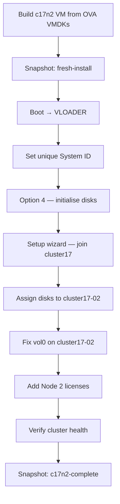

# Part 3 — Second ONTAP Node (c17n2)

[← Part 2 — First ONTAP Node](part2-cluster17-01.md) | [Part 4 — DR Cluster →](part4-cluster17dr-01.md)

Build the second node and join it to cluster17. By the end of this part you will have a two-node cluster with both nodes healthy and eligible.

---

## Table of Contents

1. [Overview](#overview)
2. [Before You Start](#before-you-start)
3. [Create the c17n2 VM](#create-the-c17n2-vm)
4. [Take the fresh-install Snapshot](#take-the-fresh-install-snapshot)
5. [Set a Unique System ID at VLOADER](#set-a-unique-system-id-at-vloader)
6. [Disk Initialisation — Option 4](#disk-initialisation--option-4)
7. [Cluster Setup Wizard — Join](#cluster-setup-wizard--join)
8. [Post-Join Tasks](#post-join-tasks)
9. [Fix vol0 on c17n2](#fix-vol0-on-c17n2)
10. [Add Node 2 Licenses](#add-node-2-licenses)
11. [Verify the Cluster](#verify-the-cluster)
12. [Snapshot](#snapshot)
13. [Troubleshooting](#troubleshooting)

---

## Overview

Adding a second node requires the same VM build process as node 1, with two important differences:

1. **Each node must have a unique System ID.** The OVA ships with a hardcoded ID. You must change it at VLOADER before running option 4, otherwise disk ownership conflicts will occur.
2. **Node 1 must have its cluster interconnect configured before node 2 can join.** This is covered at the end of Part 2. If you skipped that section, go back and complete it now.



> **Node and aggregate naming:** Just as with node 1, ONTAP auto-generates the node name and aggregate name from the cluster name. Node 2 will be named `cluster17-02` and its root aggregate `aggr0_cluster17_02`. These cannot be chosen during the wizard.

> **Build from scratch, not from a clone:** Each node must be built from the original OVA VMDKs. Do not clone node 1's VM — clones carry disk identity at a level that causes panics. The build process is identical to node 1 and takes the same amount of time.

---

## Before You Start

### Verify cluster interconnect is ready on node 1

Before starting node 2, confirm node 1 has its cluster LIFs configured:

```
cluster17::> network interface show -vserver Cluster
```

You should see two LIFs — `cluster17-01_clus1` and `cluster17-01_clus2` — both up/up on e0a and e0b. If this shows no entries, go back to the **Prepare Cluster Interconnect for Node 2** section in Part 2 and complete it first.

Also confirm the Cluster broadcast domain MTU is 1500:

```
cluster17::> network port broadcast-domain show -ipspace Cluster
```

MTU must be **1500**, not 9000. A 9000 MTU mismatch causes the join to hang silently during cluster DB sync — the most common join failure in this lab.

### Check vol0 on node 1

A full vol0 on node 1 will cause the join to fail mid-way. Verify it has space:

```
cluster17::> system node run -node cluster17-01 df -h
```

vol0 should have at least 200 MB free. If not, run the fix-vol0 procedure from Part 2 before proceeding.

---

## Create the c17n2 VM

The VM settings are identical to c17n1. Build it from the original OVA VMDKs — the same files used for node 1.

```bash
VMID=302
STORAGE=local-lvm
VMDK_DIR=/mnt/usbdrive/ontap-staging

qm create ${VMID} \
    --name c17n2 \
    --machine pc \
    --bios seabios \
    --cores 2 \
    --cpu SandyBridge \
    --memory 5222 \
    --balloon 0 \
    --net0 e1000,bridge=vmbr2 \
    --net1 e1000,bridge=vmbr2 \
    --net2 e1000,bridge=vmbr1 \
    --net3 e1000,bridge=vmbr3 \
    --onboot 0
```

Import the four disks:

```bash
qm importdisk ${VMID} ${VMDK_DIR}/vsim-netapp-DOT9.6-cm-disk1.vmdk ${STORAGE} --format raw
qm importdisk ${VMID} ${VMDK_DIR}/vsim-netapp-DOT9.6-cm-disk2.vmdk ${STORAGE} --format raw
qm importdisk ${VMID} ${VMDK_DIR}/vsim-netapp-DOT9.6-cm-disk3.vmdk ${STORAGE} --format raw
qm importdisk ${VMID} ${VMDK_DIR}/vsim-netapp-DOT9.6-cm-disk4.vmdk ${STORAGE} --format raw

qm set ${VMID} --ide0 ${STORAGE}:vm-${VMID}-disk-0
qm set ${VMID} --ide1 ${STORAGE}:vm-${VMID}-disk-1
qm set ${VMID} --ide2 ${STORAGE}:vm-${VMID}-disk-2
qm set ${VMID} --ide3 ${STORAGE}:vm-${VMID}-disk-3
qm set ${VMID} --boot order=ide0
```

---

## Take the fresh-install Snapshot

Take a snapshot before first boot:

```bash
qm snapshot ${VMID} fresh-install --description "c17n2 - clean VMDKs, never booted"
qm listsnapshot ${VMID}
```

---

## Set a Unique System ID at VLOADER

Every ONTAP node in a cluster must have a unique System ID. The OVA ships with the same hardcoded ID for every copy. You must change it before running option 4.

### Boot c17n2 and Intercept at VLOADER

Open the **Proxmox console** for VM 302 before starting it:

```bash
qm start 302
```

Watch the console. You will see the BTX loader and four BIOS drive lines:

```
BIOS drive C: is disk1
BIOS drive D: is disk2
BIOS drive E: is disk3
BIOS drive F: is disk4
```

**Wait until all four lines have appeared**, then immediately press **Ctrl-C**. You will land at the VLOADER prompt:

```
Hit [Enter] to boot immediately, or any other key for command prompt.
Type '?' for a list of commands, 'help' for more detailed help.
VLOADER>
```

### Set the System ID

```
VLOADER> setenv SYS_SERIAL_NUM 4034389-06-2
VLOADER> setenv bootarg.nvram.sysid 4034389062
VLOADER> printenv SYS_SERIAL_NUM
4034389-06-2
VLOADER> printenv bootarg.nvram.sysid
4034389062
VLOADER> boot
```

The `printenv` commands confirm the values were set correctly before booting.

---

## Disk Initialisation — Option 4

After the FIPS self-tests complete, press **Ctrl-C** when you see `Press Ctrl-C for Boot Menu`. The boot menu appears:

```
Please choose one of the following:
(1) Normal Boot.
(2) Boot without /etc/rc.
(3) Change password.
(4) Clean configuration and initialize all disks.
(5) Maintenance mode boot.
...
Selection (1-9)?
```

Enter **4** and confirm both prompts:

```
Selection (1-9)? 4
Zero disks, reset config and install a new file system?: yes
This will erase all the data on the disks, are you sure?: yes
```

You will see:

```
Rebooting to finish wipeconfig request.
```

After the reboot:

```
Wipe filer procedure requested.
```

Leave it completely alone. The VM reboots automatically when done and drops into the cluster setup wizard.

---

## Cluster Setup Wizard — Join

### AutoSupport

```
Type yes to confirm and continue {yes}: yes
```

### Node Management Interface

```
Enter the node management interface port [e0c]: e0c
Enter the node management interface IP address: 172.17.17.12
Enter the node management interface netmask: 255.255.255.0
Enter the node management interface default gateway: 172.17.17.1
```

The wizard confirms the interface and offers browser-based setup. Press **Enter** to use the CLI instead.

### Create or Join

```
Do you want to create a new cluster or join an existing cluster? {create, join}: join
```

### Accept Cluster Interconnect Defaults

ONTAP detects the existing cluster interfaces and assigns auto-generated `169.254.x.x` addresses to e0a and e0b:

```
Existing cluster interface configuration found:
Port    MTU    IP                  Netmask
e0a     1500   169.254.x.x         255.255.0.0
e0b     1500   169.254.x.x         255.255.0.0

Do you want to use this configuration? {yes, no} [yes]: yes
```

### Enter the Cluster Interconnect IP

```
Enter the IP address of an interface on the private cluster network
from the cluster you want to join:
```

Enter node 1's cluster LIF IP — `169.254.1.1`:

```
169.254.1.1
```

You will see:

```
Joining cluster at address 169.254.1.1
Joining cluster ...
```

This takes a few minutes. Both nodes work simultaneously during the join — node 2 syncing the cluster database, node 1 accepting it. When complete you will see:

```
This node has been joined to cluster "cluster17".
Step 3 of 3: Set Up the Node
...
cluster17::>
```

---

## Post-Join Tasks

### Assign Disks to Node 2

```
cluster17::> storage disk assign -all true -node cluster17-02
```

Verify all NET-2.x disks are now assigned:

```
cluster17::> storage disk show
```

---

## Fix vol0 on c17n2

Repeat the same vol0 procedure as node 1. Enter the node 2 shell:

```
cluster17::> system node run -node cluster17-02
```

```
cluster17-02> snap delete -a -f vol0
cluster17-02> snap sched vol0 0 0 0
cluster17-02> snap autodelete vol0 on
cluster17-02> snap autodelete vol0 target_free_space 35
cluster17-02> snap reserve vol0 0
cluster17-02> exit
```

Expand aggr0 on node 2:

```
cluster17::> storage aggregate add-disks -aggregate aggr0_cluster17_02 -diskcount 1
```

Answer `y` to both prompts.

Expand vol0 — try 1g first to get the actual maximum from the error:

```
cluster17::> vol modify -vserver cluster17-02 -volume vol0 -size +1g
```

Use the maximum value shown (typically around +892MB):

```
cluster17::> vol modify -vserver cluster17-02 -volume vol0 -size +892MB
```

Verify:

```
cluster17::> volume show -volume vol0
```

---

## Add Node 2 Licenses

Open `CMode_licenses_9.6.txt` and add the Node 2 license keys (the second set of keys in the file):

```
cluster17::> license add <key>
```

Repeat for each Node 2 key. Verify:

```
cluster17::> license show
```

You should now see two serial numbers — one for cluster17-01 and one for cluster17-02 — each with a full set of feature licenses.

---

## Verify the Cluster

```
cluster17::> cluster show
```

Expected:

```
Node                  Health  Eligibility
--------------------- ------- ------------
cluster17-01          true    true
cluster17-02          true    true
```

```
cluster17::> network interface show
cluster17::> storage disk show
cluster17::> aggr status
```

Both nodes should be healthy, all aggregates online, all 56 disks assigned (28 per node).

---

## Snapshot

Halt both nodes cleanly before snapshotting:

```
cluster17::> system node halt -node cluster17-01 -skip-lif-migration true
```

Answer `y`. Wait for the SSH connection to drop. Then from the node 2 console or a separate SSH session to node 2:

```
cluster17::> system node halt -node cluster17-02 -skip-lif-migration true
```

Answer `y`. Then from Proxmox:

```bash
qm stop 301
qm stop 302

qm snapshot 301 c17n2-complete --description "cluster17 two-node, node1, licensed, vol0 fixed"
qm snapshot 302 c17n2-complete --description "cluster17 two-node, node2, licensed, vol0 fixed"

qm listsnapshot 301
qm listsnapshot 302
```

---

## Troubleshooting

### Join hangs indefinitely at "Joining cluster..."

**Cause:** MTU mismatch between the Cluster broadcast domain and Proxmox. The Cluster broadcast domain defaults to MTU 9000. Proxmox bridges pass a maximum of 1500. Large cluster DB sync frames are silently dropped causing the join to stall.

**Fix:** On node 1:

```
cluster17::> network port broadcast-domain modify -ipspace Cluster -broadcast-domain Cluster -mtu 1500
```

Answer `y`. Then retry the join on node 2.

### "Internal error: Cluster network RPC communication test failed"

**Cause:** The management IP (`172.17.17.x`) was entered instead of the cluster interconnect IP (`169.254.x.x`).

**Fix:** Enter the cluster interconnect IP — `169.254.1.1` — not the management IP.

### Node 2 cannot find any cluster interfaces

**Cause:** Node 1's cluster LIFs are not configured.

**Fix:** On node 1, run:

```
cluster17::> network interface show -vserver Cluster
```

If no entries, go back to the **Prepare Cluster Interconnect for Node 2** section in Part 2 and complete it before retrying.

### PANIC: Can't find device with WWN

**Cause:** Old reservation data on disk4. This occurs when building from a snapshot of a previously booted node.

**Fix:**

```bash
qm stop 302
blkdiscard /dev/pve/vm-302-disk-3
```

Then boot and run option 4.

### vol0 fills up on node 1 during join — VifMgr crashing

**Symptom:** Node 1 console shows `spm.vifmgr.process.exit:EMERGENCY` and `rootvolrec.low.space:EMERGENCY`.

**Cause:** The join process generated log files that filled vol0 on node 1. The fix-vol0 step in Part 2 was not done or was insufficient.

**Fix:**

```
cluster17::> system node run -node cluster17-01
cluster17-01> snap delete -a -f vol0
cluster17-01> snap sched vol0 0 0 0
cluster17-01> exit
```

Reboot node 1, then retry the join.

### Wrong aggregate name

**Cause:** The guide uses `aggr0_cluster17_02` but your aggregate may be named differently depending on the cluster name used.

**Fix:**

```
cluster17::> aggr show
```

Use the actual aggregate name shown for node 2.

---

[← Part 2 — First ONTAP Node](part2-cluster17-01.md) | [Part 4 — DR Cluster →](part4-cluster17dr-01.md)

*Tested on: Proxmox VE 8.x | ONTAP Simulator 9.6 | 2026*
