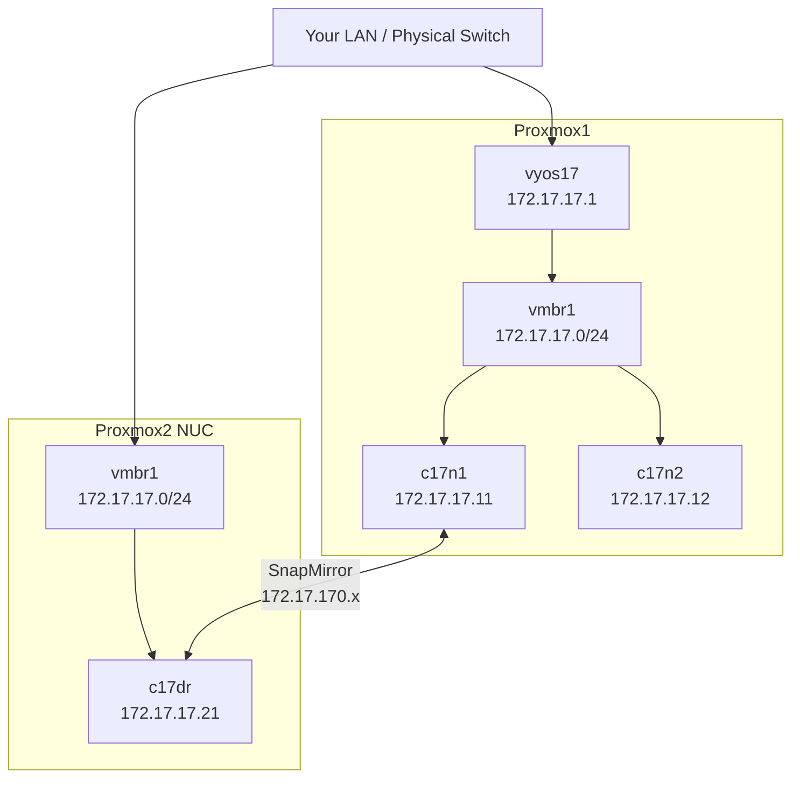

# Part 4 — DR Cluster (c17dr)

[← Part 3 — Second ONTAP Node](part3-c17n2.md) | [Part 5 — SnapMirror Replication →](part5-snapmirror.md)

Build the DR cluster on Proxmox2. This is a single-node cluster that lives on the same management network as cluster17, keeping the setup simple while still demonstrating real-world DR concepts.

---

## Table of Contents

1. [Overview](#overview)
2. [Design Decisions](#design-decisions)
3. [Proxmox2 Preparation](#proxmox2-preparation)
4. [Transfer the OVA VMDKs to Proxmox2](#transfer-the-ova-vmdks-to-proxmox2)
5. [Create the c17dr VM](#create-the-c17dr-vm)
6. [Pre-Boot Disk Preparation](#pre-boot-disk-preparation)
7. [First Boot — VLOADER](#first-boot--vloader)
8. [Disk Initialisation — Option 4](#disk-initialisation--option-4)
9. [Cluster Setup Wizard — Create cluster17dr](#cluster-setup-wizard--create-cluster17dr)
10. [Post-Setup Tasks](#post-setup-tasks)
11. [Fix vol0](#fix-vol0)
12. [Verify and Snapshot](#verify-and-snapshot)
13. [Troubleshooting](#troubleshooting)

---

## Overview

cluster17dr is a single-node cluster running on Proxmox2 (the NUC). It sits on the same `172.17.17.0/24` management network as cluster17, using VyOS on Proxmox1 as its gateway. This means no additional router is needed on Proxmox2.



Both Proxmox hosts connect to your physical LAN. VyOS on Proxmox1 provides the gateway for `172.17.17.0/24`. Both ONTAP clusters use VyOS as their default gateway, and SnapMirror traffic routes through it.

---

## Design Decisions

### Why the Same Management Network?

A more realistic DR design would use separate networks for each site with a router connecting them. On constrained homelab hardware, that adds a VyOS instance on Proxmox2 which consumes ~1.5 GB RAM. The NUC is already tight at 8 GB with a single ONTAP node at 5.1 GB.

Using the same management network:
- Eliminates the need for a second VyOS
- Keeps Proxmox2 RAM available for ONTAP
- Is fully functional for SnapMirror and cluster peering
- Slightly less realistic but demonstrates all the same concepts

### Why a Separate Cluster?

SnapMirror replication in ONTAP always goes between two different clusters. You cannot mirror from a cluster to itself. cluster17dr must be an entirely separate cluster with its own name, management IP, and admin credentials.

---

## Proxmox2 Preparation

All commands in this section run on the **Proxmox2 host** as root.

### Add the Lab Bridge

Proxmox2 needs vmbr1 on the same subnet as Proxmox1's vmbr1. Check if it already exists:

```bash
ip link show vmbr1
```

If not, add it:

```bash
cat >> /etc/network/interfaces << 'EOF'

auto vmbr1
iface vmbr1 inet manual
    bridge-ports none
    bridge-stp off
    bridge-fd 0
    # Lab management network — same subnet as Proxmox1 vmbr1
EOF

ifreload -a
ip link show vmbr1
```

> **Note:** Proxmox2's vmbr1 does not need an IP address — it is just a bridge. Traffic flows via your physical LAN to VyOS on Proxmox1 for routing. Proxmox2 does not need to be the gateway for this subnet.

### Add vmbr2 for Cluster Interconnect

Even though cluster17dr is a single node, ONTAP still expects cluster interconnect ports to exist:

```bash
cat >> /etc/network/interfaces << 'EOF'

auto vmbr2
iface vmbr2 inet manual
    bridge-ports none
    bridge-stp off
    bridge-fd 0
    # ONTAP cluster interconnect — isolated
EOF

ifreload -a
```

### Add a Data Bridge (Optional)

If you want SnapMirror to use a dedicated data network rather than management, add vmbr3:

```bash
cat >> /etc/network/interfaces << 'EOF'

auto vmbr3
iface vmbr3 inet manual
    bridge-ports none
    bridge-stp off
    bridge-fd 0
    # Data / intercluster network
EOF

ifreload -a
```

### Configure Swap

The NUC has 8 GB RAM. With ONTAP needing 5.1 GB and Proxmox needing ~1.5 GB, there is very little headroom. Ensure swap is configured:

```bash
swapon --show
```

If no swap is shown, add it:

```bash
# Create an 8 GB swap file
dd if=/dev/zero of=/swapfile bs=1G count=8 status=progress
chmod 600 /swapfile
mkswap /swapfile
swapon /swapfile

# Make permanent
echo '/swapfile none swap sw 0 0' >> /etc/fstab
```

---

## Transfer the OVA VMDKs to Proxmox2

The same four VMDKs used for Proxmox1 are needed here. Copy them from Proxmox1 or from your workstation:

```bash
# From Proxmox1 to Proxmox2
ssh root@proxmox1 "cd /tmp/ontap-staging && tar -czf - *.vmdk" | ssh root@proxmox2 "mkdir -p /tmp/ontap-staging && cd /tmp/ontap-staging && tar -xzf -"

# Or copy from your workstation
scp vsim-netapp-DOT9.6-cm-disk*.vmdk root@<proxmox2-ip>:/tmp/ontap-staging/
scp CMode_licenses_9.6.txt root@<proxmox2-ip>:/tmp/ontap-staging/
```

---

## Create the c17dr VM

Run on **Proxmox2**:

```bash
VMID=303
STORAGE=local-lvm
VMDK_DIR=/tmp/ontap-staging

qm create ${VMID} \
    --name c17dr \
    --machine pc \
    --bios seabios \
    --cores 2 \
    --cpu SandyBridge \
    --memory 5222 \
    --balloon 0 \
    --net0 e1000,bridge=vmbr2 \
    --net1 e1000,bridge=vmbr2 \
    --net2 e1000,bridge=vmbr1 \
    --net3 e1000,bridge=vmbr1 \
    --onboot 0
```

> **Note:** If you added vmbr3 for a dedicated data network, add `--net3 e1000,bridge=vmbr3` and remove one of the vmbr1 NICs.

Import the four disks:

```bash
qm importdisk ${VMID} ${VMDK_DIR}/vsim-netapp-DOT9.6-cm-disk1.vmdk ${STORAGE} --format raw
qm importdisk ${VMID} ${VMDK_DIR}/vsim-netapp-DOT9.6-cm-disk2.vmdk ${STORAGE} --format raw
qm importdisk ${VMID} ${VMDK_DIR}/vsim-netapp-DOT9.6-cm-disk3.vmdk ${STORAGE} --format raw
qm importdisk ${VMID} ${VMDK_DIR}/vsim-netapp-DOT9.6-cm-disk4.vmdk ${STORAGE} --format raw

qm set ${VMID} --ide0 ${STORAGE}:vm-${VMID}-disk-0
qm set ${VMID} --ide1 ${STORAGE}:vm-${VMID}-disk-1
qm set ${VMID} --ide2 ${STORAGE}:vm-${VMID}-disk-2
qm set ${VMID} --ide3 ${STORAGE}:vm-${VMID}-disk-3
qm set ${VMID} --boot order=ide0
```

---

## Pre-Boot Disk Preparation

Wipe disk4 before first boot:

```bash
dd if=/dev/zero of=/dev/pve/vm-${VMID}-disk-3 bs=1M count=1024 status=progress
# Or on thin storage:
blkdiscard /dev/pve/vm-${VMID}-disk-3
```

Take the pre-build snapshot:

```bash
qm snapshot ${VMID} fresh-install --description "c17dr - clean VMDKs, disk4 wiped, never booted"
```

---

## First Boot — VLOADER

> **Note:** c17dr is a single-node cluster so there is no System ID conflict with cluster17. There is no need to change the System ID at VLOADER. The default System ID from the OVA is fine for a separate cluster.

Open the Proxmox2 console for VM 303 before starting it:

```bash
qm start 303
```

Wait for all four BIOS drive lines, then press **Ctrl-C**:

```
VLOADER> setenv bootarg.init.bootmenu 1
VLOADER> boot
```

---

## Disk Initialisation — Option 4

```
Selection (1-9)? 4
Zero disks, reset config and install a new file system?: y
This will erase all the data on the disks, are you sure?: y
```

Wait 10–20 minutes. On the NUC's slower CPU this may take longer than on Proxmox1. The VM reboots automatically when done.

---

## Cluster Setup Wizard — Create cluster17dr

### AutoSupport

```
Type yes to confirm and continue {yes}: yes
```

### Node Management Interface

```
Enter the node management interface port [e0c]: e0c
Enter the node management interface IP address: 172.17.17.21
Enter the node management interface netmask: 255.255.255.0
Enter the node management interface default gateway: 172.17.17.1
```

Press **Enter** to use the CLI.

### Create New Cluster

```
Do you want to create a new cluster or join an existing cluster? {create, join}: create
```

### Cluster Interconnect

```
Do you want to use these defaults? {yes, no} [yes]: yes
```

### Cluster Name and Password

```
Enter the cluster name: cluster17dr
Enter the cluster admin password: <your-password>
Confirm the cluster admin password: <your-password>
```

### Cluster Base License

Enter the cluster base license from `CMode_licenses_9.6.txt`.

### Cluster Management Interface

```
Enter the cluster management interface port [e0d]: e0c
Enter the cluster management interface IP address: 172.17.17.20
Enter the cluster management interface netmask: 255.255.255.0
Enter the cluster management interface default gateway: 172.17.17.1
```

### DNS and Location

```
Enter the DNS domain names: (press Enter to skip)
Where is the controller located: proxmox2-lab
```

When complete you will see:

```
cluster17dr::>
```

---

## Post-Setup Tasks

### Fix the Cluster Management LIF

Check where `cluster_mgmt` landed:

```bash
ssh admin@172.17.17.20
cluster17dr::> network interface show -vserver cluster17dr
```

If `cluster_mgmt` is on e0a, move it to e0c:

```
cluster17dr::> network interface modify -vserver cluster17dr -lif cluster_mgmt -home-port e0c -home-node c17dr
cluster17dr::> network interface revert -vserver cluster17dr -lif cluster_mgmt
```

### Assign Disks

```
cluster17dr::> storage disk assign -all true -node c17dr
```

### Disable AutoSupport

```
cluster17dr::> autosupport modify -support disable
```

---

## Fix vol0

Same procedure as Part 2. Enter the node shell:

```
cluster17dr::> system node run -node c17dr
```

```
c17dr% snap delete -a -f vol0
c17dr% snap sched vol0 0 0 0
c17dr% snap autodelete vol0 on
c17dr% snap autodelete vol0 target_free_space 35
c17dr% snap reserve vol0 0
c17dr% exit
```

Expand aggr0:

```
cluster17dr::> storage aggregate add-disks -aggregate aggr0_c17dr_01 -diskcount 1
```

Expand vol0:

```
cluster17dr::> vol modify -vserver c17dr -volume vol0 -size +1g
```

Use the maximum value from the error message.

---

## Verify and Snapshot

```
cluster17dr::> cluster show
cluster17dr::> network interface show
cluster17dr::> storage disk show
cluster17dr::> system node run -node c17dr df -h
```

Expected: 1 node healthy, vol0 with comfortable free space, disks assigned.

Take the completion snapshot:

```bash
# Halt from ONTAP
cluster17dr::> system node halt -node c17dr -skip-lif-migration true

# From Proxmox2
qm stop 303
qm snapshot 303 c17dr-complete --description "cluster17dr single node, licensed, vol0 fixed"
qm listsnapshot 303
```

---

## Connectivity Check

At this point both clusters should be reachable from your workstation and from each other via VyOS.

From your workstation:

```bash
# Should reach cluster17 on Proxmox1
ssh admin@172.17.17.10

# Should reach cluster17dr on Proxmox2
ssh admin@172.17.17.20
```

From cluster17, ping cluster17dr:

```
cluster17::> network ping -lif cluster_mgmt -destination 172.17.17.20
```

If pings fail, check:
1. VyOS is running on Proxmox1
2. Both Proxmox hosts are on the same physical LAN
3. No firewall rules blocking 172.17.17.0/24 traffic on either host

---

## Troubleshooting

### NUC is very slow during option 4

**Cause:** The N2820 Celeron is a low-power CPU. Option 4 disk initialisation just takes longer.

**Fix:** Wait. It will complete — just give it 20–30 minutes rather than 10–15.

### Cannot reach 172.17.17.20 from Proxmox1

**Cause:** vmbr1 on Proxmox2 is not connected to the same physical network as vmbr1 on Proxmox1.

**Fix:** Verify both Proxmox hosts are on the same LAN and that vmbr1 on Proxmox2 either has a physical NIC attached or the traffic is routed via your switch. Both hosts need L2 connectivity on the 172.17.17.0/24 subnet.

### Memory pressure on the NUC during option 4

**Cause:** 8 GB is tight for a single ONTAP node plus Proxmox.

**Fix:** Ensure swap is configured (8 GB recommended). Do not run any other VMs on Proxmox2 during this process.

### vol0 aggregate name not found

**Fix:**
```
cluster17dr::> aggr show
```

Use the actual name shown.

---

[← Part 3 — Second ONTAP Node](part3-c17n2.md) | [Part 5 — SnapMirror Replication →](part5-snapmirror.md)

*Tested on: Proxmox VE 9.1.5 | ONTAP Simulator 9.6 | 2026*
