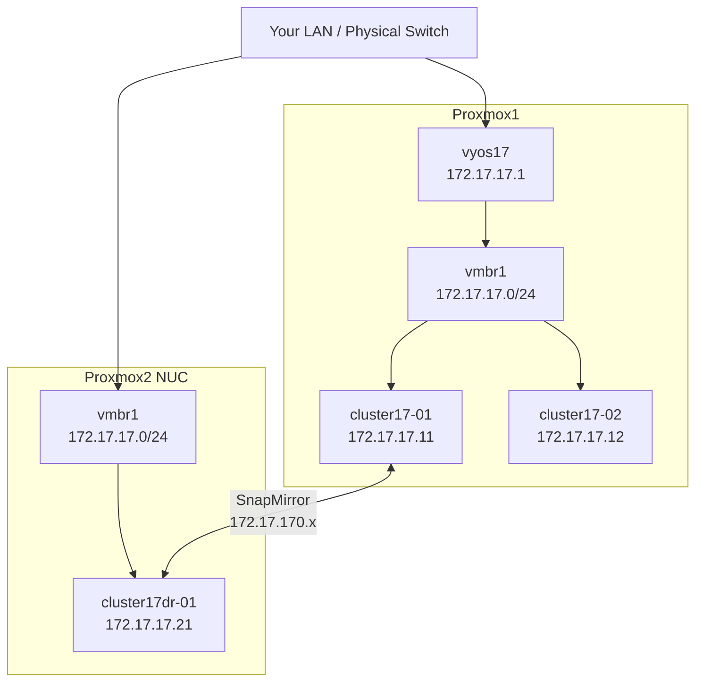

# Part 4 — DR Cluster (cluster17dr-01)

[← Part 3 — Second ONTAP Node](part3-cluster17-02.md) | [Part 5 — SnapMirror Replication →](part5-snapmirror.md)

Build the DR cluster on Proxmox2. This is a single-node cluster that lives on the same management network as cluster17, keeping the setup simple while still demonstrating real-world DR concepts.

---

## Table of Contents

1. [Overview](#overview)
2. [Design Decisions](#design-decisions)
3. [Proxmox2 Preparation](#proxmox2-preparation)
4. [Transfer the OVA VMDKs to Proxmox2](#transfer-the-ova-vmdks-to-proxmox2)
5. [Create the c17dr VM](#create-the-c17dr-vm)
6. [Take the fresh-install Snapshot](#take-the-fresh-install-snapshot)
7. [First Boot — Boot Menu](#first-boot--boot-menu)
8. [Disk Initialisation — Option 4](#disk-initialisation--option-4)
9. [Cluster Setup Wizard — Create cluster17dr](#cluster-setup-wizard--create-cluster17dr)
10. [Post-Setup Tasks](#post-setup-tasks)
11. [Fix vol0 — Critical Step](#fix-vol0--critical-step)
12. [Add Licenses](#add-licenses)
13. [DNS and NTP](#dns-and-ntp)
14. [Verify and Snapshot](#verify-and-snapshot)
15. [Shutdown and Startup](#shutdown-and-startup)
16. [Troubleshooting](#troubleshooting)

---

## Overview

cluster17dr is a single-node cluster running on Proxmox2 (the NUC). It sits on the same `172.17.17.0/24` management network as cluster17, using VyOS on Proxmox1 as its gateway. No additional router is needed on Proxmox2.



Both Proxmox hosts connect to your physical LAN. VyOS on Proxmox1 provides the gateway for both clusters. SnapMirror traffic routes through VyOS over the data network.

> **Node naming:** ONTAP auto-generates the node name from the cluster name. A cluster named `cluster17dr` produces node `cluster17dr-01` and root aggregate `aggr0_cluster17dr_01`. You cannot choose these names during the wizard.

---

## Design Decisions

### Why the Same Management Network?

A more realistic DR design uses separate networks for each site. On constrained homelab hardware, a second VyOS instance on Proxmox2 consumes ~1.5 GB RAM that the NUC can't spare with a single ONTAP node at 5.1 GB. Using the same management network eliminates the second VyOS while still demonstrating all SnapMirror and cluster peering concepts.

### Why a Separate Cluster?

SnapMirror replication in ONTAP always goes between two different clusters. You cannot mirror from a cluster to itself. cluster17dr must be an entirely separate cluster with its own name, management IP, and admin credentials.

---

## Proxmox2 Preparation

All commands in this section run on the **Proxmox2 host** as root.

### Add the Lab Bridges

Check what already exists:

```bash
ip link show vmbr1
ip link show vmbr2
ip link show vmbr3
```

Add any that are missing:

```bash
cat >> /etc/network/interfaces << 'EOF'

auto vmbr1
iface vmbr1 inet manual
    bridge-ports none
    bridge-stp off
    bridge-fd 0
    # Lab management network — same subnet as Proxmox1 vmbr1

auto vmbr2
iface vmbr2 inet manual
    bridge-ports none
    bridge-stp off
    bridge-fd 0
    # ONTAP cluster interconnect — isolated

auto vmbr3
iface vmbr3 inet manual
    bridge-ports none
    bridge-stp off
    bridge-fd 0
    # Data / intercluster network
EOF

ifreload -a
```

> Proxmox2's vmbr1 does not need an IP address — it is just a bridge. Traffic flows via your physical LAN to VyOS on Proxmox1 for routing.

### Configure Swap

The NUC has 8 GB RAM. With ONTAP needing 5.1 GB and Proxmox needing ~1.5 GB, ensure swap is configured:

```bash
swapon --show
```

If no swap is shown:

```bash
dd if=/dev/zero of=/swapfile bs=1G count=8 status=progress
chmod 600 /swapfile
mkswap /swapfile
swapon /swapfile
echo '/swapfile none swap sw 0 0' >> /etc/fstab
```

---

## Transfer the OVA VMDKs to Proxmox2

The same four VMDKs used for Proxmox1 are needed here. Copy from your workstation or USB drive:

```bash
scp vsim-netapp-DOT9.6-cm-disk*.vmdk CMode_licenses_9.6.txt root@<proxmox2-ip>:/tmp/ontap-staging/
```

Or copy from Proxmox1 if the files are still there:

```bash
ssh root@proxmox1 "cd /mnt/usbdrive/ontap-staging && tar -czf - *.vmdk CMode_licenses_9.6.txt" | \
    ssh root@proxmox2 "mkdir -p /tmp/ontap-staging && cd /tmp/ontap-staging && tar -xzf -"
```

---

## Create the c17dr VM

Run on **Proxmox2**. The settings are identical to cluster17-01 and cluster17-02 — same CPU type, same memory, same NIC layout.

```bash
VMID=303
STORAGE=local-lvm
VMDK_DIR=/tmp/ontap-staging

qm create ${VMID} \
    --name c17dr \
    --machine pc \
    --bios seabios \
    --cores 2 \
    --cpu SandyBridge \
    --memory 5222 \
    --balloon 0 \
    --net0 e1000,bridge=vmbr2 \
    --net1 e1000,bridge=vmbr2 \
    --net2 e1000,bridge=vmbr1 \
    --net3 e1000,bridge=vmbr3 \
    --onboot 0
```

**NIC to bridge mapping:**

| ONTAP port | VM NIC | Bridge | Purpose |
|------------|--------|--------|---------|
| e0a | net0 | vmbr2 | Cluster interconnect |
| e0b | net1 | vmbr2 | Cluster interconnect |
| e0c | net2 | vmbr1 | Management |
| e0d | net3 | vmbr3 | Data / intercluster |

Import the four disks:

```bash
qm importdisk ${VMID} ${VMDK_DIR}/vsim-netapp-DOT9.6-cm-disk1.vmdk ${STORAGE} --format raw
qm importdisk ${VMID} ${VMDK_DIR}/vsim-netapp-DOT9.6-cm-disk2.vmdk ${STORAGE} --format raw
qm importdisk ${VMID} ${VMDK_DIR}/vsim-netapp-DOT9.6-cm-disk3.vmdk ${STORAGE} --format raw
qm importdisk ${VMID} ${VMDK_DIR}/vsim-netapp-DOT9.6-cm-disk4.vmdk ${STORAGE} --format raw

qm set ${VMID} --ide0 ${STORAGE}:vm-${VMID}-disk-0
qm set ${VMID} --ide1 ${STORAGE}:vm-${VMID}-disk-1
qm set ${VMID} --ide2 ${STORAGE}:vm-${VMID}-disk-2
qm set ${VMID} --ide3 ${STORAGE}:vm-${VMID}-disk-3
qm set ${VMID} --boot order=ide0
```

---

## Take the fresh-install Snapshot

Take a snapshot before first boot:

```bash
qm snapshot ${VMID} fresh-install --description "c17dr - clean VMDKs, never booted"
qm listsnapshot ${VMID}
```

---

## First Boot — Boot Menu

Open the **Proxmox2 console** for VM 303 before starting it:

```bash
qm start 303
```

Watch the console for the BTX loader and four BIOS drive lines:

```
BIOS drive C: is disk1
BIOS drive D: is disk2
BIOS drive E: is disk3
BIOS drive F: is disk4
```

**Wait until all four lines have appeared**, then immediately press **Ctrl-C**.

After the FIPS self-tests complete you will see:

```
Press Ctrl-C for Boot Menu.
```

Press **Ctrl-C** to get the boot menu.

> **No VLOADER needed for a new cluster.** cluster17dr-01 is the first and only node in its cluster — there is no System ID conflict. Do not set any VLOADER variables. This is the same approach used for cluster17-01 in Part 2.

---

## Disk Initialisation — Option 4

```
Please choose one of the following:
(1) Normal Boot.
...
(4) Clean configuration and initialize all disks.
...
Selection (1-9)? 4
Zero disks, reset config and install a new file system?: yes
This will erase all the data on the disks, are you sure?: yes
```

You will see:

```
Rebooting to finish wipeconfig request.
```

After the reboot:

```
Wipe filer procedure requested.
```

Leave it completely alone. The VM reboots automatically when done and drops into the cluster setup wizard. On the NUC's slower CPU this may take 20–30 minutes.

---

## Cluster Setup Wizard — Create cluster17dr

### AutoSupport

```
Type yes to confirm and continue {yes}: yes
```

### Node Management Interface

```
Enter the node management interface port [e0c]: e0c
Enter the node management interface IP address: 172.17.17.21
Enter the node management interface netmask: 255.255.255.0
Enter the node management interface default gateway: 172.17.17.1
```

Press **Enter** to use the CLI.

### Create New Cluster

```
Do you want to create a new cluster or join an existing cluster? {create, join}: create
```

### Accept System Defaults

```
Do you want to use these defaults? {yes, no} [yes]: yes
```

### Cluster Name and Password

```
Enter the cluster name: cluster17dr
```

Enter a strong admin password when prompted.

### Cluster Base License

Enter the cluster base license key from `CMode_licenses_9.6.txt`.

### Cluster Management Interface

The wizard may default to e0d. Change it to e0c:

```
Enter the cluster management interface port [e0d]: e0c
Enter the cluster management interface IP address: 172.17.17.20
Enter the cluster management interface netmask: 255.255.255.0
Enter the cluster management interface default gateway: 172.17.17.1
```

Skip DNS when prompted. Enter a location if asked (e.g. `proxmox2-lab`).

### Node Management Interface (Second Prompt)

```
Enter the node management interface port [e0c]: e0c
Enter the node management interface IP address: 172.17.17.21
Enter the node management interface netmask: 255.255.255.0
Enter the node management interface default gateway: 172.17.17.1
```

Cluster setup is now complete. You will be at the `cluster17dr::>` prompt.

---

## Post-Setup Tasks

### Assign Disks

```
cluster17dr::> storage disk assign -all true -node cluster17dr-01
```

### Move cluster_mgmt to e0c

Check where `cluster_mgmt` landed:

```
cluster17dr::> network interface show
```

If `cluster_mgmt` shows e0a as its current port, move it:

```
cluster17dr::> network interface modify -vserver cluster17dr -lif cluster_mgmt -home-port e0c -home-node cluster17dr-01
cluster17dr::> network interface revert -lif cluster_mgmt -vserver cluster17dr
```

Verify both LIFs are on e0c and test connectivity:

```
cluster17dr::> network interface show
```

```bash
ping 172.17.17.20   # cluster_mgmt
ping 172.17.17.21   # node mgmt
```

### Disable AutoSupport

```
cluster17dr::> autosupport modify -support disable
```

---

## Fix vol0 — Critical Step

Same procedure as cluster17-01. Enter the node shell:

```
cluster17dr::> system node run -node cluster17dr-01
```

```
cluster17dr-01> snap delete -a -f vol0
cluster17dr-01> snap sched vol0 0 0 0
cluster17dr-01> snap autodelete vol0 on
cluster17dr-01> snap autodelete vol0 target_free_space 35
cluster17dr-01> snap reserve vol0 0
cluster17dr-01> exit
```

Expand aggr0:

```
cluster17dr::> storage aggregate add-disks -aggregate aggr0_cluster17dr_01 -diskcount 1
```

Answer `y` to both prompts.

Expand vol0 — try 1g first to get the actual maximum from the error:

```
cluster17dr::> vol modify -vserver cluster17dr-01 -volume vol0 -size +1g
```

Use the maximum value shown (typically around +889MB):

```
cluster17dr::> vol modify -vserver cluster17dr-01 -volume vol0 -size +889MB
```

Verify:

```
cluster17dr::> volume show -volume vol0
```

vol0 should now be ~1.66 GB with comfortable free space.

---

## Add Licenses

Open `CMode_licenses_9.6.txt`. Add the Node 1 license keys (the DR node uses the same set as cluster17-01 since it is also a first node in its cluster):

```
cluster17dr::> license add <key>
```

Repeat for each key. Verify:

```
cluster17dr::> license show
```

---

## DNS and NTP

Configure DNS and NTP to keep time accurate after hibernation and to support features like CIFS:

```
cluster17dr::> dns create -vserver cluster17dr -domains lab.local -name-servers 8.8.8.8,8.8.4.4
cluster17dr::> ntp server create -server time.google.com
cluster17dr::> timezone -timezone Europe/London
```

Verify:

```
cluster17dr::> dns show
cluster17dr::> ntp server show
cluster17dr::> date
```

---

## Verify and Snapshot

Run a final health check:

```
cluster17dr::> cluster show
cluster17dr::> network interface show
cluster17dr::> storage disk show
cluster17dr::> license show
cluster17dr::> system node run -node cluster17dr-01 df -h
```

Expected vol0 output:

```
Filesystem    total    used   avail capacity  Mounted on
/vol/vol0/   1696MB   330MB  1365MB      19%  /vol/vol0/
```

Take the completion snapshot — halt ONTAP cleanly first:

```
cluster17dr::> system node halt -node cluster17dr-01 -skip-lif-migration true
```

Answer `y`. Wait for SSH to drop, then from Proxmox2:

```bash
qm stop 303
qm snapshot 303 c17dr-complete --description "cluster17dr single node, licensed, vol0 fixed"
qm listsnapshot 303
```

### Connectivity Check

From your workstation verify both clusters are reachable:

```bash
ssh admin@172.17.17.10   # cluster17
ssh admin@172.17.17.20   # cluster17dr
```

From cluster17, ping cluster17dr:

```
cluster17::> network ping -lif cluster_mgmt -destination 172.17.17.20
```

---

## Shutdown and Startup

### Shutdown

```
cluster17dr::> system node halt -node cluster17dr-01 -skip-lif-migration true
```

Answer `y`. Wait for SSH to drop, then from Proxmox2:

```bash
qm stop 303
```

### Startup

VyOS on Proxmox1 must be running before starting this node — it provides the gateway for `172.17.17.1`.

```bash
qm start 303
```

Wait for the node to fully boot before attempting SSH.

---

## Troubleshooting

### Option 4 loops — reboots back to boot menu repeatedly

**Cause:** `bootarg.init.bootmenu 1` was set at VLOADER. This is not needed for a new cluster — it causes the boot menu to appear on every reboot, making option 4 loop.

**Fix:** Intercept at VLOADER and unset the variable:

```
VLOADER> unsetenv bootarg.init.bootmenu
VLOADER> boot
```

Then select option 1 (Normal Boot).

### PANIC: Can't find device with WWN

**Cause:** Old reservation data on disk4 from a clone or snapshot restore.

**Fix:**

```bash
qm stop 303
blkdiscard /dev/pve/vm-303-disk-3
```

Then boot and run option 4.

### cluster_mgmt unreachable after setup

**Cause:** Wizard placed `cluster_mgmt` on e0a (isolated vmbr2 bridge).

**Fix:** Move the LIF to e0c as described in Post-Setup Tasks above.

### vol0 fills up — subsystems crashing

**Fix:**

```
cluster17dr::> system node run -node cluster17dr-01
cluster17dr-01> snap delete -a -f vol0
cluster17dr-01> snap sched vol0 0 0 0
cluster17dr-01> exit
```

Then follow the full fix-vol0 procedure above.

### Wrong aggregate name

**Fix:**

```
cluster17dr::> aggr show
```

Use the actual aggregate name shown — it will be `aggr0_cluster17dr_01`.

### Cannot reach cluster17dr from cluster17

**Cause:** Both Proxmox hosts need L2 connectivity on the same physical LAN for the 172.17.17.0/24 subnet to be reachable across hosts.

**Fix:** Verify both Proxmox hosts are on the same physical switch/LAN. Check VyOS is running and has `172.17.17.1` on eth1.

### NUC is slow during option 4

**Cause:** The NUC CPU is slower than a desktop Proxmox host.

**Fix:** Wait — give it 20-30 minutes rather than 10-15. It will complete.

---

[← Part 3 — Second ONTAP Node](part3-cluster17-02.md) | [Part 5 — SnapMirror Replication →](part5-snapmirror.md)

*Tested on: Proxmox VE 9.1.5 | ONTAP Simulator 9.6 | 2026*
