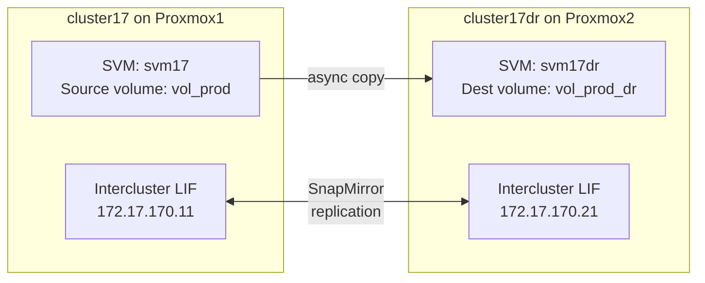

# Part 5 — SnapMirror Replication

[← Part 4 — DR Cluster](part4-cluster17dr-01.md) | [← README](README.md)

Configure SnapMirror replication from cluster17 to cluster17dr. By the end of this part you will have a working DR setup with live data replication between two clusters.

---

## Table of Contents

1. [Overview](#overview)
2. [Prerequisites](#prerequisites)
3. [Create SVMs and Volumes](#create-svms-and-volumes)
4. [Configure Intercluster LIFs](#configure-intercluster-lifs)
5. [Peer the Clusters](#peer-the-clusters)
6. [Peer the SVMs](#peer-the-svms)
7. [Create the SnapMirror Relationship](#create-the-snapmirror-relationship)
8. [Initialise Replication](#initialise-replication)
9. [Test Replication](#test-replication)
10. [DR Failover and Failback](#dr-failover-and-failback)
11. [SnapMirror Schedule](#snapmirror-schedule)
12. [Troubleshooting](#troubleshooting)

---

## Overview

SnapMirror is NetApp's asynchronous replication technology. It copies data from a source volume to a destination volume on a different cluster. The destination is read-only during normal operation and can be activated for DR access if the source becomes unavailable.



**Key concepts:**
- **Cluster peering** — the two clusters must trust each other before any replication can occur
- **SVM peering** — the source and destination SVMs must also be peered
- **Intercluster LIFs** — dedicated network interfaces used for replication traffic, separate from management and client data LIFs
- **SnapMirror relationship** — the configured link between a source volume and a destination volume

---

## Prerequisites

- Part 2 complete — cluster17 running with c17n1
- Part 4 complete — cluster17dr running with c17dr
- Both clusters reachable from each other via `172.17.17.x`
- VyOS running on Proxmox1

Test connectivity between clusters before starting:

```bash
# From cluster17, ping cluster17dr management IP
cluster17::> network ping -lif cluster_mgmt -destination 172.17.17.20

# From cluster17dr, ping cluster17 management IP
cluster17dr::> network ping -lif cluster_mgmt -destination 172.17.17.10
```

Both should succeed. If not, resolve network connectivity before proceeding.

---

## Create SVMs and Volumes

### On cluster17 — Source SVM and Volume

```bash
ssh admin@172.17.17.10
```

Create a source SVM:

```
cluster17::> vserver create -vserver svm17 -rootvolume svm17_root -aggregate aggr1 -rootvolume-security-style unix
```

> If aggr1 does not exist yet, create it first:
> ```
> cluster17::> storage aggregate create -aggregate aggr1 -node cluster17-01 -diskcount 6
> ```

Create a source volume to replicate:

```
cluster17::> volume create -vserver svm17 -volume vol_prod -aggregate aggr1 -size 1g -type RW -junction-path /vol_prod
```

Write some test data (optional but useful for verifying replication):

```
cluster17::> volume mount -vserver svm17 -volume vol_prod -junction-path /vol_prod
```

### On cluster17dr — Destination SVM

```bash
ssh admin@172.17.17.20
```

Create the destination SVM (no root volume junction needed for SnapMirror destination):

```
cluster17dr::> vserver create -vserver svm17dr -rootvolume svm17dr_root -aggregate aggr1 -rootvolume-security-style unix
```

> Create aggr1 on cluster17dr if it does not exist:
> ```
> cluster17dr::> storage aggregate create -aggregate aggr1 -node cluster17dr-01 -diskcount 6
> ```

Create the destination volume — must be type DP (Data Protection):

```
cluster17dr::> volume create -vserver svm17dr -volume vol_prod_dr -aggregate aggr1 -size 1g -type DP
```

---

## Configure Intercluster LIFs

Intercluster LIFs are dedicated interfaces used for replication traffic. Using dedicated LIFs keeps replication traffic separate from management and client traffic.

### On cluster17 — Intercluster LIF on c17n1

```bash
ssh admin@172.17.17.10
```

```
cluster17::> network interface create \
    -vserver cluster17 \
    -lif intercluster_c17n1 \
    -role intercluster \
    -home-node cluster17-01 \
    -home-port e0d \
    -address 172.17.170.11 \
    -netmask 255.255.255.0
```

Add a route for the intercluster network:

```
cluster17::> network route create -vserver cluster17 -destination 0.0.0.0/0 -gateway 172.17.170.1
```

### On cluster17dr — Intercluster LIF on c17dr

```bash
ssh admin@172.17.17.20
```

```
cluster17dr::> network interface create \
    -vserver cluster17dr \
    -lif intercluster_c17dr \
    -role intercluster \
    -home-node cluster17dr-01 \
    -home-port e0d \
    -address 172.17.170.21 \
    -netmask 255.255.255.0
```

Add route:

```
cluster17dr::> network route create -vserver cluster17dr -destination 0.0.0.0/0 -gateway 172.17.170.1
```

### Verify Intercluster Connectivity

From cluster17, ping cluster17dr's intercluster LIF:

```
cluster17::> network ping -lif intercluster_c17n1 -destination 172.17.170.21
```

From cluster17dr, ping cluster17's intercluster LIF:

```
cluster17dr::> network ping -lif intercluster_c17dr -destination 172.17.170.11
```

Both pings must succeed before proceeding.

---

## Peer the Clusters

Cluster peering establishes a trust relationship between the two clusters. Both sides must initiate and accept the peering.

### Generate a Passphrase on cluster17

```bash
ssh admin@172.17.17.10
```

```
cluster17::> cluster peer create -generate-passphrase -offer-expiration 24h -peer-addrs 172.17.170.21
```

Note the passphrase shown. You will need it on cluster17dr.

### Accept the Peering on cluster17dr

```bash
ssh admin@172.17.17.20
```

```
cluster17dr::> cluster peer create -peer-addrs 172.17.170.11
```

Enter the passphrase when prompted.

### Verify Cluster Peering

From either cluster:

```
cluster17::> cluster peer show
```

Expected:

```
Peer Cluster Name     Availability   Authentication
--------------------- -------------- ---------------
cluster17dr           Available      ok
```

---

## Peer the SVMs

SVM peering allows SnapMirror relationships to be created between SVMs on different clusters.

### Initiate SVM Peering from cluster17

```bash
ssh admin@172.17.17.10
```

```
cluster17::> vserver peer create -vserver svm17 -peer-vserver svm17dr -peer-cluster cluster17dr -applications snapmirror
```

### Accept SVM Peering on cluster17dr

```bash
ssh admin@172.17.17.20
```

```
cluster17dr::> vserver peer accept -vserver svm17dr -peer-vserver svm17
```

### Verify SVM Peering

```
cluster17::> vserver peer show
```

Expected:

```
Vserver   Peer Vserver  Peer Cluster  Peering State
--------- ------------- ------------- -------------
svm17     svm17dr       cluster17dr   peered
```

---

## Create the SnapMirror Relationship

This is done from the **destination** cluster (cluster17dr):

```bash
ssh admin@172.17.17.20
```

```
cluster17dr::> snapmirror create \
    -source-path svm17:vol_prod \
    -destination-path svm17dr:vol_prod_dr \
    -type DP \
    -policy MirrorAllSnapshots \
    -schedule hourly
```

Verify the relationship was created:

```
cluster17dr::> snapmirror show
```

---

## Initialise Replication

The first transfer (baseline) copies all data from source to destination. This can take time depending on volume size.

```
cluster17dr::> snapmirror initialize -destination-path svm17dr:vol_prod_dr
```

Monitor progress:

```
cluster17dr::> snapmirror show -destination-path svm17dr:vol_prod_dr
```

Watch the `Transfer Progress` and `Transfer State` fields. When `Status` shows `Idle` and `Health` shows `true`, the baseline is complete.

---

## Test Replication

### Write Data on Source

From cluster17, write some data to vol_prod:

```
cluster17::> volume file create -vserver svm17 -path /vol_prod/testfile.txt
```

### Trigger a Manual Update

```
cluster17dr::> snapmirror update -destination-path svm17dr:vol_prod_dr
```

Monitor until complete:

```
cluster17dr::> snapmirror show -destination-path svm17dr:vol_prod_dr
```

### Verify Data on Destination

The destination volume is read-only (DP type). You can inspect it:

```
cluster17dr::> volume show -vserver svm17dr -volume vol_prod_dr
cluster17dr::> snapmirror show -destination-path svm17dr:vol_prod_dr -fields newest-snapshot
```

---

## DR Failover and Failback

In a real DR scenario, if cluster17 becomes unavailable you break the mirror and bring up the destination volume for read-write access.

### DR Failover — Break the Mirror

On cluster17dr:

```
cluster17dr::> snapmirror break -destination-path svm17dr:vol_prod_dr
```

The destination volume is now read-write. You can mount it and serve data.

Verify:

```
cluster17dr::> volume show -vserver svm17dr -volume vol_prod_dr
```

Type should now show `RW`.

### DR Failback — Resync After Recovery

When cluster17 is recovered, resync replication in reverse to catch up:

First, resync from the original destination back to the source (this makes cluster17 the new destination temporarily):

```
cluster17::> snapmirror resync -source-path svm17dr:vol_prod_dr -destination-path svm17:vol_prod
```

Once synchronised, reverse the relationship back to the original direction:

```
cluster17::> snapmirror break -destination-path svm17:vol_prod
cluster17dr::> snapmirror resync -destination-path svm17dr:vol_prod_dr
```

---

## SnapMirror Schedule

The relationship was created with `-schedule hourly`. This means ONTAP will automatically replicate every hour.

To change the schedule:

```
cluster17dr::> snapmirror modify -destination-path svm17dr:vol_prod_dr -schedule 6hours
```

To view available schedules:

```
cluster17::> job schedule show
```

To create a custom schedule (e.g. every 15 minutes):

```
cluster17::> job schedule interval create -name every15min -minutes 15
```

---

## Troubleshooting

### Cluster peer shows Unavailable

**Cause:** Intercluster LIFs cannot reach each other.

**Fix:**
1. Verify VyOS is running and has `172.17.170.1` on eth2
2. Test: `network ping -lif intercluster_c17n1 -destination 172.17.170.21`
3. Check intercluster LIF is up: `network interface show -role intercluster`

### snapmirror initialize stuck at Transferring

**Cause:** Network issue or insufficient resources.

**Fix:** Check `snapmirror show` for error details. Common causes are routing problems or the destination volume being the wrong type (must be DP).

### snapmirror show — Health: false, Reason: destination volume not writable

**Cause:** The destination volume was broken (made RW) and the relationship needs resync.

**Fix:**
```
cluster17dr::> snapmirror resync -destination-path svm17dr:vol_prod_dr
```

### SVM peer stuck in initiated state

**Cause:** The accept command was not run on the destination cluster.

**Fix:** Run `vserver peer accept` on cluster17dr as shown above.

### Cannot create intercluster LIF — port e0d not found

**Cause:** e0d may be named differently on your node, or the vmbr3 bridge is not attached.

**Fix:**
```
cluster17::> network port show
```

Use the actual port name shown. If no port is connected to vmbr3, add the NIC to the VM:

```bash
qm set 301 --net3 e1000,bridge=vmbr3
```

Then reboot the node.

---

[← Part 4 — DR Cluster](part4-cluster17dr-01.md) | [← README](README.md)

*Tested on: Proxmox VE 9.1.5 | ONTAP Simulator 9.6 | 2026*
