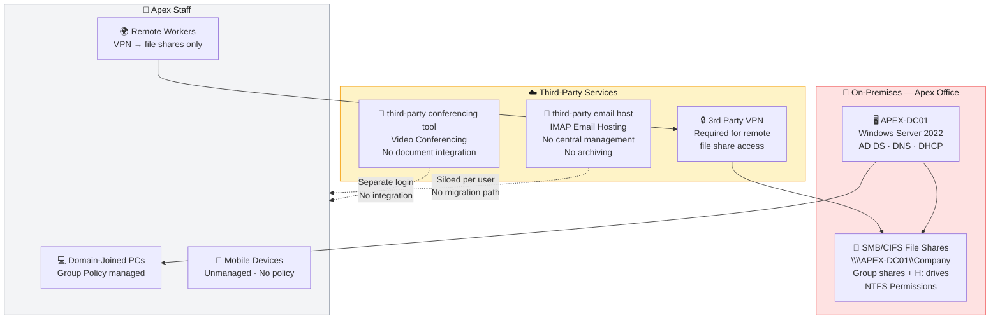
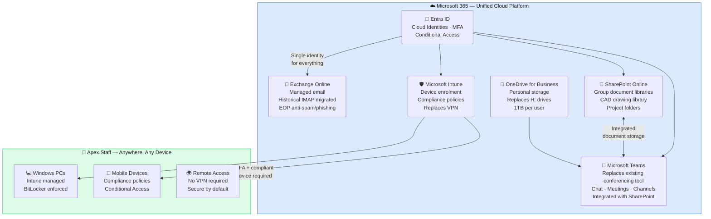

# Project 1 — SME Cloud Migration: Apex Drafting & Design

> *Taking a 15-person architectural consultancy off ageing on-premises servers and into Microsoft 365 — with zero data loss, minimal disruption, and a security posture that holds up under scrutiny.*

---

## Project Overview

Apex Drafting & Design Ltd is a UK-based architectural consultancy with 15 staff, most working remotely from client sites. Their infrastructure had reached end of life: an ageing Windows Server running Active Directory and SMB file shares, personal home folders mapped as `H:` drives with no offsite backup, IMAP email hosted through a third-party provider with no central management, and third-party conferencing tool for video conferencing with no integration into their document workflow.

The director wanted to eliminate on-premises hardware entirely and consolidate onto a single, managed cloud platform — accessible from anywhere, on any device, without VPN or server maintenance overhead.

I planned and delivered a full end-to-end Microsoft 365 Business Premium migration — sole consultant, from initial discovery through to infrastructure decommission. This page is the project index. Every workstream has its own dedicated documentation page linked below.

---

## Migration at a Glance

| Source (On-Premises) | → | Target (Microsoft 365) | Method |
|---|---|---|---|
| Active Directory (apex.local) | → | Entra ID — cloud-only identities | PowerShell / Admin Portal |
| Third-party IMAP email hosting | → | Exchange Online | IMAP migration via Exchange Admin Center |
| Third-party video conferencing | → | Microsoft Teams | Decommission + Teams rollout |
| SMB/CIFS group file shares | → | SharePoint Online document libraries | SharePoint Migration Tool (SPMT) |
| Personal home folders (mapped `H:` drives) | → | OneDrive for Business | SPMT (OneDrive mode) |
| CAD drawings (DWG/DXF on SMB shares) | → | SharePoint Online — CAD Library | SPMT |
| 3rd party VPN (remote device access) | → | Intune + Conditional Access | Intune enrolment + compliance policies |

---

## Before & After Architecture

### Before — On-Premises Infrastructure

**Pain points:** Single point of failure on APEX-DC01. No offsite backup. VPN dependency for all remote file access. Unmanaged mobile devices. No MFA anywhere. Email siloed per user with no central archive. Video conferencing and email were entirely disconnected from documents and workflow.

---

### After — Microsoft 365 Business Premium

**Outcome:** No on-premises infrastructure. No VPN. No separate conferencing tool. Single identity for every service. All devices managed and compliant. MFA enforced from day one. All data in SharePoint/OneDrive with version history, recycle bin, and audit logging.

---

## Technology Summary

| Workstream | Technology | Purpose |
|---|---|---|
| **Identity** | Microsoft Entra ID | Cloud identities, MFA, Conditional Access |
| **Email** | Exchange Online | Hosted email, EOP protection, historical IMAP migration |
| **Conferencing** | Microsoft Teams | Replaces existing conferencing tool — chat, video, channel collaboration |
| **Group File Storage** | SharePoint Online | Company documents, project folders, CAD libraries |
| **Personal Storage** | OneDrive for Business | Replaces mapped H: drives — 1TB per user |
| **Device Management** | Microsoft Intune | Enrolment, compliance policies, replaces VPN dependency |
| **File Migration** | SPMT (SharePoint Migration Tool) | SMB shares → SharePoint; H: drives → OneDrive |
| **Security** | Conditional Access + EOP | Zero Trust access control, anti-spam, anti-phishing |
| **Scripting** | PowerShell | User provisioning, bulk operations, validation |
| **Source: Directory** | Windows Server 2022 + AD DS | On-premises domain — migrated and decommissioned |
| **Source: Email** | Third-party IMAP | Historical email migrated to Exchange Online |
| **Source: Conferencing** | Third-party conferencing tool | Replaced by Microsoft Teams |

---

## Project Phases & Timeline

| Phase | Workstream | Duration |
|---|---|---|
| **Phase 0** | Discovery, audit, licensing decision | Week 1 |
| **Phase 1** | Identity — Entra ID users, MFA, admin separation | Week 1–2 |
| **Phase 2** | Email — Exchange Online, IMAP migration from third-party IMAP host, MX cutover | Week 2 |
| **Phase 3** | File shares — SharePoint architecture, SPMT migration of group shares | Week 2–3 |
| **Phase 4** | Home folders — SPMT migration of H: drives to OneDrive | Week 3 |
| **Phase 5** | Teams — setup, third-party conferencing tool decommission, SharePoint integration | Week 3 |
| **Phase 6** | Intune — device enrolment, compliance policies, Conditional Access | Week 3–4 |
| **Phase 7** | Security hardening, validation, user acceptance testing | Week 4 |
| **Phase 8** | Server decommission, DNS cleanup, third-party email and conferencing cancellation, sign-off | Week 4–5 |

---

## Project Index — Workstream Documentation

| # | Workstream | Description |
|---|---|---|
| [00](./docs/00-discovery-and-planning.md) | **Discovery & Planning** | Infrastructure audit, licensing decision, risk assessment, project plan |
| [01](./docs/01-identity-migration.md) | **Identity Migration** | AD export, Entra ID provisioning, MFA enforcement, admin separation |
| [02](./docs/02-email-migration.md) | **Email Migration** | Third-party IMAP prep, Exchange Online, historical migration, MX cutover |
| [03](./docs/03-file-share-migration.md) | **File Share Migration** | NTFS audit, SPMT migration of group shares to SharePoint |
| [04](./docs/04-onedrive-home-folders.md) | **OneDrive & Home Folders** | H: drive migration to OneDrive via SPMT |
| [05](./docs/05-sharepoint-libraries.md) | **SharePoint Libraries** | Document library design, metadata, versioning, CAD file handling |
| [06](./docs/06-teams-setup.md) | **Microsoft Teams** | Replaces existing conferencing tool — team/channel structure, SharePoint integration, user adoption |
| [07](./docs/07-intune-device-management.md) | **Intune Device Management** | Enrolment, compliance policies, GPO-to-Intune mapping, replaces VPN |
| [08](./docs/08-security.md) | **Security** | Zero Trust design, Conditional Access, EOP, backup gap |
| [09](./docs/09-decommission.md) | **Decommission** | Server retirement, DNS cleanup, third-party email and conferencing cancellation, sign-off |
| [10](./docs/10-lessons-learned.md) | **Lessons Learned** | What worked, what I'd do differently, honest lab limitations |

**Runbooks:**
- [MX Record Cutover Runbook](./runbooks/mx-record-cutover.md)
- [User Onboarding Runbook](./runbooks/user-onboarding.md)

---

## Key Outcomes & Business Benefits

| Outcome | Detail |
|---|---|
| **Infrastructure eliminated** | Windows Server, SMB shares, and on-premises dependencies fully decommissioned |
| **Three vendors replaced by one** | Third-party email hosting, video conferencing, and VPN consolidated into Microsoft 365 |
| **Remote access secured** | Staff work from any location, any device — no VPN, no server dependency |
| **Email centralised** | All 15 mailboxes on Exchange Online with full historical email migrated from third-party email host |
| **H: drives replaced** | Personal home folders migrated to OneDrive — accessible on any device, 1TB per user |
| **Data protected** | SharePoint version history, recycle bin, and audit logging replace unreliable local backups |
| **Devices managed** | Intune compliance policies enforce BitLocker, screen lock, and minimum OS version |
| **Security posture** | MFA enforced day one · Conditional Access · Legacy authentication blocked · EOP enabled |
| **Predictable cost** | Per-seat SaaS model replaces unpredictable server hardware lifecycle and multiple vendor contracts |

---

## What This Demonstrates

*Written for hiring managers and technical interviewers.*

**End-to-end delivery ownership.** This project covers the full consulting lifecycle — discovery, planning, licensing decision, migration execution, security hardening, and formal decommission. Nothing is handed off. Every decision is documented and justified.

**Consulting maturity, not just technical execution.** Every technology decision is accompanied by a business justification. I chose Microsoft 365 Business Premium over cheaper SKUs for specific reasons. I designed the SharePoint information architecture before migrating a single file. I documented the backup gap in Microsoft 365 rather than pretending it doesn't exist.

**Real infrastructure experience.** This migration mirrors exactly what I've delivered for real SME clients. The scenario, the source environment, the challenges, and the decisions are drawn from genuine production experience. The lab environment is documented honestly where it differs.

**Vendor consolidation thinking.** Rather than treating this as a file migration, I approached it as a platform consolidation — replacing three separate vendor relationships (email hosting, video conferencing, and VPN) with a single, integrated Microsoft 365 platform. That's how a consultant thinks, not a technician.

**Security-first design.** MFA, Conditional Access, legacy authentication blocking, and Zero Trust principles are built into the design from Phase 1 — not bolted on at the end.

**Honest documentation.** Lab limitations are flagged clearly throughout. Where production would differ, I explain what I'd do in a real engagement and why.

---

## Lab vs Production — Honest Disclosure

| Area | Lab Approach | Production Approach |
|---|---|---|
| **AD Sync** | Cloud-only Entra ID users | Entra Connect Sync or Cloud Sync with on-premises AD during transition |
| **Licensing** | Microsoft 365 Business Premium trial | Purchased via CSP partner or Microsoft direct |
| **Custom domain** | `qcbhomelab.online` — registered domain owned by portfolio author | Client's own domain (e.g. `apexdd.co.uk`) |
| **M365 tenant** | `qcbazoutlook362.onmicrosoft.com` | Dedicated client tenant |
| **Email source** | IMAP simulation | Live third-party IMAP migration with DNS cutover coordination |
| **Internal domain** | `apex.local` with `@qcbhomelab.online` UPN suffix | Public registered domain throughout |
| **Devices** | Single test device enrolled in Intune | Full fleet enrolment, potentially with Windows Autopilot |
| **SPMT H: drive migration** | Process documented with SPMT UI screenshots | Production run against live mapped drives with pre-migration cleanup |
| **Backup** | Not implemented — gap explicitly documented | Third-party M365 backup solution (e.g. Veeam, Dropsuite, Acronis) |
| **Company** | Apex Drafting & Design Ltd — **fictional** | Real client — confidential |

---

*All documentation in this project represents genuine hands-on work. No credentials, client data, or confidential information is included anywhere in this repository.*
