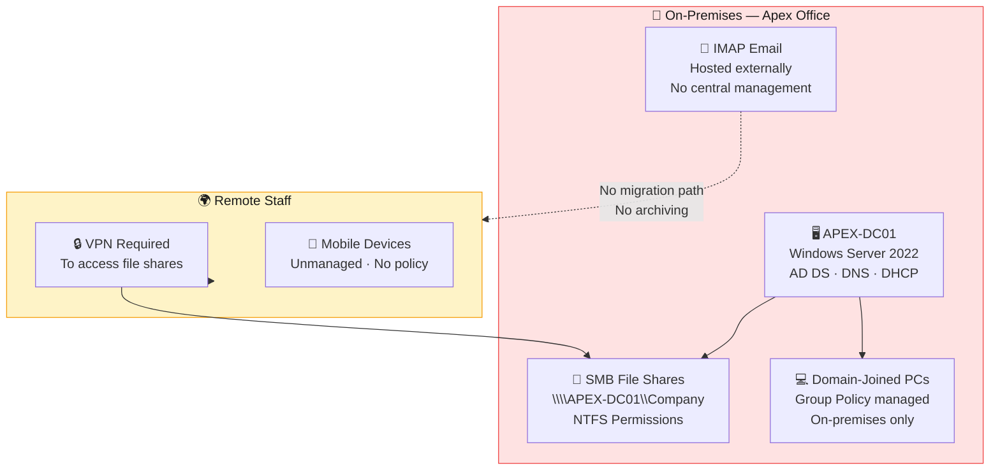
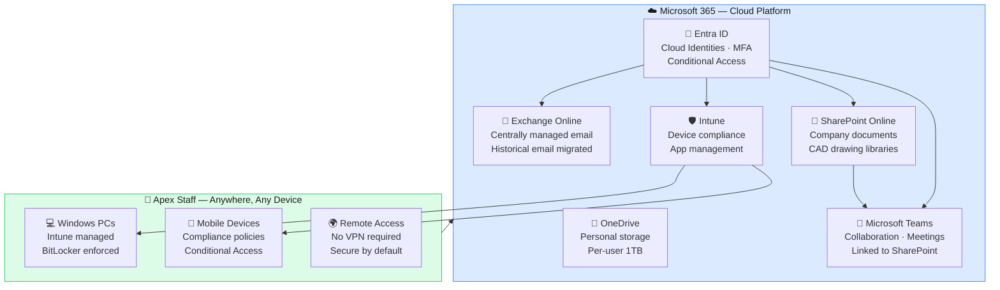

# Project 1 — SME Cloud Migration: Apex Drafting & Design

> *Taking a 15-person architectural consultancy off ageing on-premises servers and into Microsoft 365 — with zero data loss, minimal disruption, and a security posture that holds up under scrutiny.*

---

## Project Overview

Apex Drafting & Design Ltd is a UK-based architectural consultancy with 15 staff, most working remotely from client sites. Their infrastructure had reached end of life: an ageing Windows Server, local SMB file shares with no offsite backup, and IMAP email with no central management. The director wanted to eliminate on-premises hardware entirely and move to a fully cloud-based platform that staff could access from anywhere, on any device, without needing a VPN or IT support to maintain servers.

I planned and delivered a full end-to-end Microsoft 365 Business Premium migration — sole consultant, from initial discovery through to infrastructure decommission. This page is the project index. Every workstream has its own dedicated documentation page linked below.

---

## Before & After Architecture

### Before — On-Premises Infrastructure

**Pain points:** Single point of failure. No offsite backup. VPN dependency for remote access. Unmanaged devices. No MFA. IMAP email siloed per user with no central archive.

---

### After — Microsoft 365 Business Premium

**Outcome:** No on-premises infrastructure. No VPN. All devices managed and compliant. MFA enforced from day one. All data in SharePoint with version history and audit logs.

---

## Technology Summary

| Workstream | Technology | Purpose |
|---|---|---|
| **Identity** | Microsoft Entra ID | Cloud identities, MFA, Conditional Access |
| **Email** | Exchange Online | Hosted email, spam/phishing protection, historical migration |
| **File Storage** | SharePoint Online | Company documents, CAD libraries, project folders |
| **Personal Storage** | OneDrive for Business | Per-user 1TB cloud storage |
| **Collaboration** | Microsoft Teams | Chat, video meetings, channel-based collaboration |
| **Device Management** | Microsoft Intune | Device enrolment, compliance policies, app deployment |
| **Migration Tool** | SPMT (SharePoint Migration Tool) | SMB file share to SharePoint migration |
| **Security** | Conditional Access + EOP | Zero Trust access, anti-spam, anti-phishing |
| **Scripting** | PowerShell | User provisioning, bulk operations, validation |
| **Source Platform** | Windows Server 2022 + AD DS | On-premises domain, SMB shares — migrated and decommissioned |

---

## Project Phases & Timeline

| Phase | Workstream | Duration |
|---|---|---|
| **Phase 0** | Discovery, audit, licensing decision | Week 1 |
| **Phase 1** | Identity — Entra ID users, MFA, admin separation | Week 1–2 |
| **Phase 2** | Email — Exchange Online, IMAP migration, MX cutover | Week 2 |
| **Phase 3** | File shares — SharePoint architecture, SPMT migration | Week 2–3 |
| **Phase 4** | Teams setup, SharePoint library configuration | Week 3 |
| **Phase 5** | Intune enrolment, compliance policies, Conditional Access | Week 3–4 |
| **Phase 6** | Security hardening, validation, user acceptance | Week 4 |
| **Phase 7** | Server decommission, DNS cleanup, sign-off | Week 4–5 |

---

## Project Index — Workstream Documentation

| # | Workstream | Description |
|---|---|---|
| [00](./docs/00-discovery-and-planning.md) | **Discovery & Planning** | Infrastructure audit, licensing decision, risk assessment, project plan |
| [01](./docs/01-identity-migration.md) | **Identity Migration** | AD export, Entra ID provisioning, MFA enforcement, admin separation |
| [02](./docs/02-email-migration.md) | **Email Migration** | IMAP source prep, Exchange Online, historical migration, MX cutover |
| [03](./docs/03-file-share-migration.md) | **File Share Migration** | NTFS audit, SPMT migration, OneDrive, validation |
| [04](./docs/04-sharepoint-libraries.md) | **SharePoint Libraries** | Document library design, metadata, versioning, CAD handling |
| [05](./docs/05-teams-setup.md) | **Microsoft Teams** | Team/channel structure, SharePoint integration, user adoption |
| [06](./docs/06-intune-device-management.md) | **Intune Device Management** | Enrolment, compliance policies, GPO-to-Intune mapping |
| [07](./docs/07-security.md) | **Security** | Zero Trust design, Conditional Access, EOP, backup gap |
| [08](./docs/08-decommission.md) | **Decommission** | Server retirement, DNS cleanup, sign-off |
| [09](./docs/09-lessons-learned.md) | **Lessons Learned** | What worked, what I'd do differently, honest lab limitations |

**Runbooks:**
- [MX Record Cutover Runbook](./runbooks/mx-record-cutover.md)
- [User Onboarding Runbook](./runbooks/user-onboarding.md)

---

## Key Outcomes & Business Benefits

| Outcome | Detail |
|---|---|
| **Infrastructure eliminated** | Windows Server, local file shares, and on-premises dependencies fully decommissioned |
| **Remote access secured** | Staff can work from any location, any device — no VPN, no server dependency |
| **Email centralised** | All 15 mailboxes on Exchange Online with full historical email migrated |
| **Data protected** | SharePoint version history, recycle bin, and audit logging replace unreliable local backups |
| **Devices managed** | Intune compliance policies enforce BitLocker, screen lock, and minimum OS version |
| **Security posture** | MFA enforced day one · Conditional Access · Legacy authentication blocked |
| **Ongoing cost** | Predictable per-seat SaaS cost replaces unpredictable server hardware lifecycle |
| **IT overhead** | No server to patch, back up, or maintain — admin tasks handled via Microsoft 365 admin portals |

---

## What This Demonstrates

*Written for hiring managers and technical interviewers.*

**End-to-end delivery ownership.** This project covers the full consulting lifecycle — discovery, planning, licensing decision, migration execution, security hardening, and formal decommission. Nothing is handed off. Every decision is documented and justified.

**Consulting maturity, not just technical execution.** Every technology decision in this project is accompanied by a business justification. I chose Microsoft 365 Business Premium over cheaper SKUs for specific reasons. I designed the SharePoint architecture before migrating a single file. I documented the backup gap in Microsoft 365 rather than pretending it doesn't exist.

**Real infrastructure experience.** This migration mirrors exactly what I've delivered for real SME clients — the scenario, the source environment, the challenges, and the decisions are drawn from genuine production experience. The lab environment is documented honestly where it differs.

**Security-first thinking.** MFA, Conditional Access, legacy authentication blocking, and Zero Trust principles are not afterthoughts — they're built into the design from Phase 1. The security workstream explains the reasoning, not just the configuration.

**Honest documentation.** Lab limitations are flagged clearly throughout. Where production would differ (e.g., Entra Connect Sync vs cloud-only identities), I explain what I'd do in a real engagement and why.

---

## Lab vs Production — Honest Disclosure

This project is built in a homelab environment. The following differences from a production engagement are documented throughout:

| Area | Lab Approach | Production Approach |
|---|---|---|
| **AD Sync** | Cloud-only Entra ID users | Entra Connect Sync (or Cloud Sync) with on-premises AD |
| **Licensing** | Microsoft 365 Business Premium trial | Purchased licensing with CSP partner or direct |
| **Email source** | IMAP via Gmail accounts | Live IMAP/Exchange on-premises migration |
| **Domain** | apex.local internal domain | Public registered domain (e.g., apexdd.co.uk) |
| **Devices** | Single test device enrolled | Full fleet enrolment with Autopilot |
| **Backup** | Not implemented — gap documented | Third-party M365 backup (Veeam, Acronis, Dropsuite) |

---

*All documentation in this project represents genuine hands-on work. No credentials, client data, or confidential information is included anywhere in this repository.*
