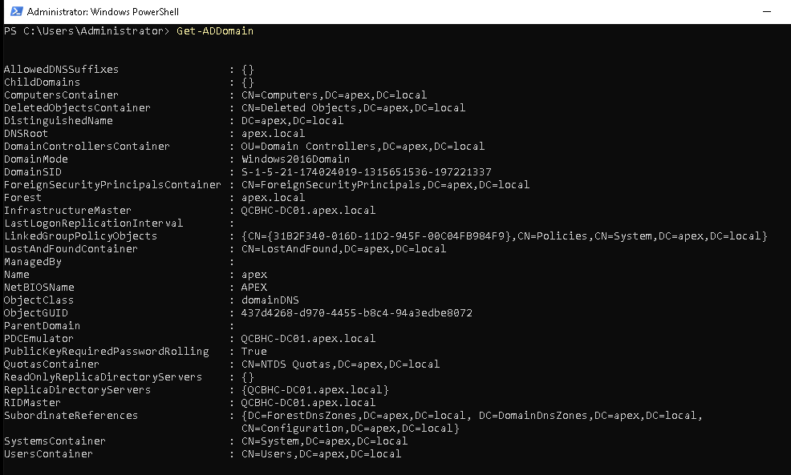
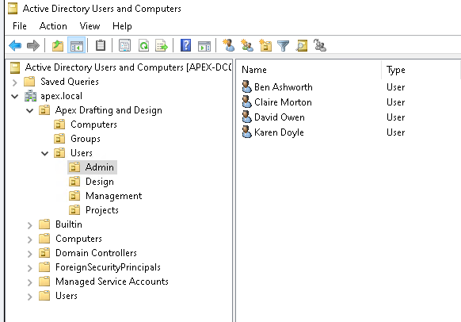
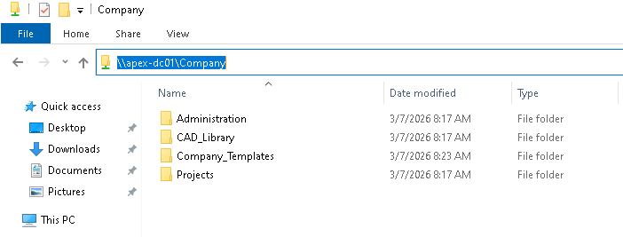
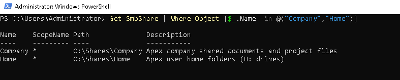

# 00 — Discovery & Planning

## What We Did and Why

Before touching a single Microsoft 365 setting, we documented the existing environment in full. In a real engagement this is where you find the surprises — the undocumented shares, the user who has files nowhere else, the DNS record nobody remembers creating. Getting this right protects the client and protects you as the consultant.

---

> ## ⚠️ Lab Simulation Notice
>
> **The Apex Drafting & Design on-premises environment is a purpose-built homelab simulation.**
>
> It does not represent a live client. It was built specifically for this portfolio to provide real, demonstrable, screenshot-evidenced infrastructure — rather than describing a migration theoretically.
>
> The simulation runs on a two-node Proxmox homelab cluster. Windows Server 2022 Evaluation runs as a VM on Node 1 (HP ProDesk 400 G3, Intel i5-7500T, 16GB RAM). Every component — Active Directory, DNS, DHCP, SMB shares, NTFS permissions, user accounts — was built from scratch and configured to reflect what you would genuinely find in a real 15-person SME.
>
> **From this point forward, the documentation is written as a real engagement.** Lab differences from production are called out where they are relevant to technical decisions.

---

## Lab Environment — What Was Built vs What Production Looks Like

| Component | Lab Implementation | Production Equivalent |
|---|---|---|
| Server hardware | Proxmox VM on HP ProDesk 400 G3 (i5-7500T, 16GB RAM) | Physical or virtualised Windows Server on-premises |
| Windows Server | Server 2022 Standard Evaluation (180-day) | Licensed Windows Server 2022 |
| Active Directory | Fully functional AD DS — apex.local | Production domain with years of accumulated users/GPOs |
| File shares | SMB/CIFS with realistic NTFS permissions | Production shares with complex inherited permissions |
| Email | Simulated via placeholder accounts | Live IMAP mailboxes on third-party hosting |
| User data | Realistic dummy documents and CAD placeholders | Real client files — confidential, requires careful handling |
| Network | DHCP reservation at 192.168.1.10 | Static IP, DNS A record, internal DNS zone |

---

## The Client Scenario

**Apex Drafting & Design Ltd** is a 15-person architectural and engineering consultancy based in Birmingham. Staff work primarily from client sites and home, with occasional use of a small office. They produce CAD drawings, planning documents, and client reports.

Their infrastructure at the point of engagement:

- A single Windows Server 2022 running Active Directory, DNS, DHCP, and SMB file shares
- Company documents and project files stored on mapped network drives (`\\APEX-DC01\Company`)
- Personal files stored on mapped H: drives (`\\APEX-DC01\Home`)
- Email hosted by a third-party IMAP provider — no central management, no archiving
- Video conferencing via a third-party tool — no integration with documents or calendar
- Remote access via a third-party VPN — required for any file access outside the office
- No mobile device management
- No MFA anywhere

The director's brief was straightforward: *"I want to get rid of the server entirely. I want staff to be able to work from anywhere without needing IT support."*

---

## Infrastructure Discovery

### Server — APEX-DC01


*PowerShell confirming hostname APEX-DC01 — pre-configuration baseline*

### Active Directory

The domain `apex.local` was audited prior to migration planning. The structure was clean — a single domain, single site, single domain controller. No trusts, no RODC, no legacy 2003/2008 functional level baggage.

**Domain details confirmed via PowerShell:**

```powershell
Get-ADDomain
```

| Property | Value |
|---|---|
| Domain Name | apex.local |
| NetBIOS Name | APEX |
| Forest | apex.local |
| Domain Mode | Windows2016Domain |
| PDC Emulator | APEX-DC01.apex.local |
| Infrastructure Master | APEX-DC01.apex.local |


*APEX-DC01 confirmed as PDC Emulator and Infrastructure Master for apex.local*

---

### Organisational Unit Structure

Four department OUs under a single company OU — clean and logical. No legacy flat structure, no users sitting in the default CN=Users container.

```
apex.local
└── Apex Drafting and Design (OU)
    ├── Computers
    ├── Groups
    └── Users
        ├── Admin
        ├── Design
        ├── Management
        └── Projects
```


*apex.local — Apex Drafting and Design OU with department sub-OUs visible*

---

### User Accounts

15 user accounts across four departments. All accounts are enabled, have UPNs in the format `firstname.lastname@apex.local`, and are assigned to department OUs.

| Department | Users | Count |
|---|---|---|
| Management | James Hartley | 1 |
| Design | Sarah Mitchell, Tom Bradley, Laura Simmons, Daniel Fletcher, Rachel Wong | 5 |
| Projects | Emma Clarke, Marcus Reid, Sophie Turner, Oliver Nash, Priya Sharma | 5 |
| Admin | David Owen, Claire Morton, Ben Ashworth, Karen Doyle | 4 |
| **Total** | | **15** |

**Security groups in place:**

| Group | Purpose |
|---|---|
| GRP-AllStaff | Company-wide access to shared resources |
| GRP-Management | Management department |
| GRP-Design | Design team — architects and CAD technicians |
| GRP-Projects | Project managers and coordinators |
| GRP-Admin | Administration — office, finance, HR |
| GRP-CADUsers | CAD Library access — Design team only |

---

### File Share Audit

Two SMB shares identified on `\\APEX-DC01`:

| Share | Path | Purpose |
|---|---|---|
| `Company` | `C:\Shares\Company` | Group documents — all staff |
| `Home` | `C:\Shares\Home` | Personal home folders — H: drives |

**Company share structure:**

```
\\APEX-DC01\Company
├── Projects
│   ├── PROJ001_HighStreet_Renovation
│   │   ├── Drawings          (DWG/DXF files)
│   │   ├── Correspondence    (email threads, letters)
│   │   └── Reports           (feasibility, design statements)
│   └── PROJ002_Residential_Development
│       ├── Drawings
│       ├── Correspondence
│       └── Reports
├── CAD_Library
│   ├── Standard_Details      (reusable CAD details)
│   └── Templates             (drawing templates)
├── Company_Templates         (letterheads, report templates)
└── Administration
    ├── HR                    (confidential — HR group only)
    └── Finance               (confidential — Admin group only)
```


*\\\\apex-dc01\\Company — group file share root*

**NTFS permission summary:**

| Folder | GRP-AllStaff | GRP-Design | GRP-Projects | GRP-Admin | GRP-CADUsers |
|---|---|---|---|---|---|
| Company (root) | Read | — | — | — | — |
| Projects | Read | Modify | Modify | — | — |
| CAD_Library | Read | — | — | — | Modify |
| Company_Templates | Read | — | — | — | — |
| Administration | ❌ No access | ❌ | ❌ | Modify | — |
| Administration\HR | ❌ No access | ❌ | ❌ | Modify | — |
| Administration\Finance | ❌ No access | ❌ | ❌ | Modify | — |

**Key permission decisions:**
- Administration folder breaks inheritance — explicitly denies access to all non-Admin groups. This is intentional: HR and Finance data is confidential and must not be accessible to Design or Projects staff.
- CAD Library uses a dedicated `GRP-CADUsers` group rather than `GRP-Design` directly. This allows non-Design staff (e.g. a Project Manager reviewing drawings) to be granted CAD access without being added to the Design department group.
- Share-level permissions grant `Authenticated Users` Change access — NTFS is the enforcement layer, not the share. This is standard best practice for SMB shares.

**Home folders:**

```
\\APEX-DC01\Home
├── b.ashworth
├── c.morton
├── d.fletcher
├── d.owen
├── e.clarke
├── j.hartley
├── k.doyle
├── l.simmons
├── m.reid
├── o.nash
├── p.sharma
├── r.wong
├── s.mitchell
├── s.turner
└── t.bradley
```

Each home folder has inheritance broken. Only the individual user and Domain Admins have access. H: drive mapped via AD user account attribute (`homeDirectory` + `homeDrive`).


*\\\\apex-dc01\\Home — all 15 user H: drive folders*


*Get-SmbShare — Company and Home shares confirmed*

---

## Risk Assessment

| Risk | Likelihood | Impact | Mitigation |
|---|---|---|---|
| Data loss during file migration | Low | High | SPMT pre-migration scan, validate file counts before decommission |
| Email loss during MX cutover | Low | High | Migrate historical email before cutover, keep IMAP live for 2 weeks post-cutover |
| User disruption — unfamiliar platform | Medium | Medium | User guides prepared, phased rollout, IT available on cutover day |
| CAD files not rendering correctly in SharePoint | Medium | Low | DWG files stored and accessed as downloads — no browser rendering dependency |
| H: drive paths broken post-migration | Low | Medium | Communicate OneDrive sync client replaces H: drive, update any mapped drive GPOs |
| NTFS permissions not mapping cleanly to SharePoint | Medium | Medium | Manual permission review post-SPMT, validate against permission matrix |
| Single DC — no redundancy | High (existing) | High (existing) | Mitigated by migration — DC decommissioned, cloud platform has built-in redundancy |

---

## Licensing Decision

Three Microsoft 365 SKUs were evaluated for a 15-seat SME:

| Feature | Business Basic | Business Standard | **Business Premium** |
|---|---|---|---|
| Exchange Online | ✅ | ✅ | ✅ |
| SharePoint Online | ✅ | ✅ | ✅ |
| Microsoft Teams | ✅ | ✅ | ✅ |
| Office Apps (desktop) | ❌ | ✅ | ✅ |
| Intune device management | ❌ | ❌ | ✅ |
| Entra ID P1 (Conditional Access) | ❌ | ❌ | ✅ |
| Azure AD P1 (MFA per-user) | Basic only | Basic only | ✅ Full CA |
| Defender for Business | ❌ | ❌ | ✅ |
| **Price (approx)** | £4.90/user/mo | £10.30/user/mo | **£18.60/user/mo** |
| **Monthly cost (15 users)** | £73.50 | £154.50 | **£279.00** |

**Decision: Microsoft 365 Business Premium**

The premium cost is justified by three specific requirements:

1. **Intune** — Apex has no device management whatsoever. Staff use personal and company devices with no policy enforcement. Intune is not a nice-to-have; it's a security requirement given remote working across client sites.

2. **Conditional Access (Entra ID P1)** — Basic MFA is insufficient for a firm handling confidential client data and planning documents. Conditional Access allows us to enforce compliant device + MFA as a combined requirement, and to block legacy authentication protocols entirely.

3. **Defender for Business** — Included at no extra cost at Business Premium. Replaces the need for a separate endpoint protection product.

The difference between Standard and Premium is £8.30/user/month — £124.50/month for 15 users. Against the cost of a single security incident or the ongoing cost of managing separate endpoint protection, this is straightforward to justify to the client.

---

## Project Phases & Timeline

| Phase | Description | Duration | Dependencies |
|---|---|---|---|
| **0 — Discovery** | Infrastructure audit, licensing, planning | Week 1 | Client access |
| **1 — Identity** | Entra ID users, MFA, admin accounts | Week 1–2 | M365 tenant live |
| **2 — Email** | Exchange Online, IMAP migration, MX cutover | Week 2 | Identity complete |
| **3 — File Shares** | SharePoint architecture, SPMT migration | Week 2–3 | Identity complete |
| **4 — Home Folders** | OneDrive setup, H: drive migration via SPMT | Week 3 | SharePoint complete |
| **5 — Teams** | Team/channel structure, SharePoint integration | Week 3 | File migration complete |
| **6 — Intune** | Device enrolment, compliance policies, Conditional Access | Week 3–4 | Identity complete |
| **7 — Security** | Hardening, EOP, validation | Week 4 | All workstreams complete |
| **8 — Decommission** | Server retirement, DNS cleanup, sign-off | Week 4–5 | UAT signed off |

---

## Success Criteria

The migration will be considered complete when all of the following are confirmed:

- [ ] All 15 users can sign in to Microsoft 365 with MFA
- [ ] All mailboxes live on Exchange Online with historical email accessible
- [ ] All Company share content migrated to SharePoint with permissions validated
- [ ] All H: drive content migrated to individual OneDrive accounts
- [ ] At least one device enrolled in Intune and compliant
- [ ] Conditional Access policy enforcing MFA + compliant device
- [ ] Legacy authentication blocked
- [ ] APEX-DC01 powered off with no user impact
- [ ] Third-party email, conferencing, and VPN contracts cancelled or scheduled for cancellation

---

## Communication Plan

| Audience | Message | Timing | Channel |
|---|---|---|---|
| All staff | "We're moving to Microsoft 365 — what's changing and when" | 2 weeks before cutover | Email + team meeting |
| All staff | OneDrive sync client install guide | 1 week before cutover | Email |
| All staff | New email settings + Teams install guide | Cutover day | Email (sent from old system) |
| James Hartley (Director) | Progress updates | Weekly | Direct |
| Individual users | H: drive migration confirmation | Post-migration | Email |

---

*Next: [01 — Identity Migration →](./01-identity-migration.md)*
