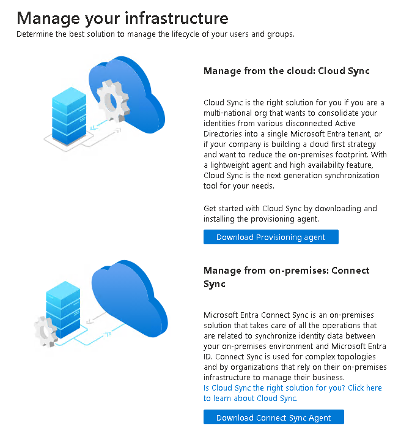
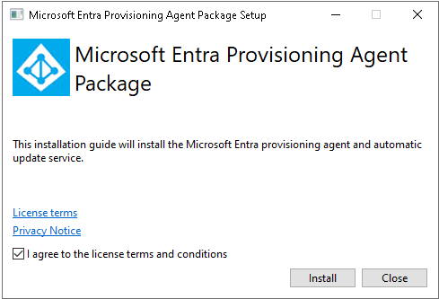
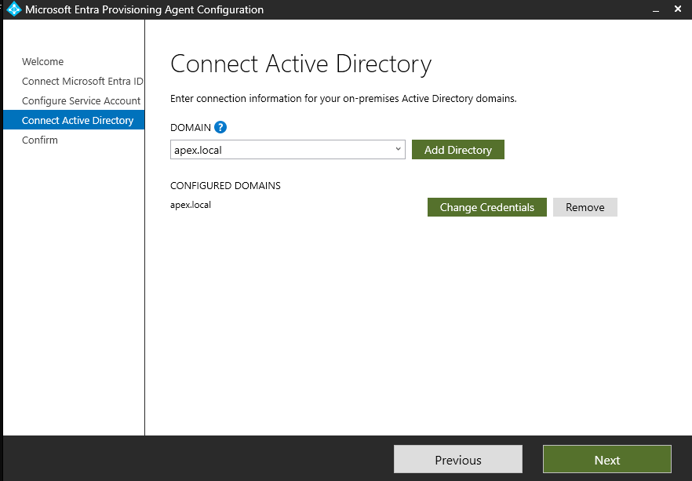
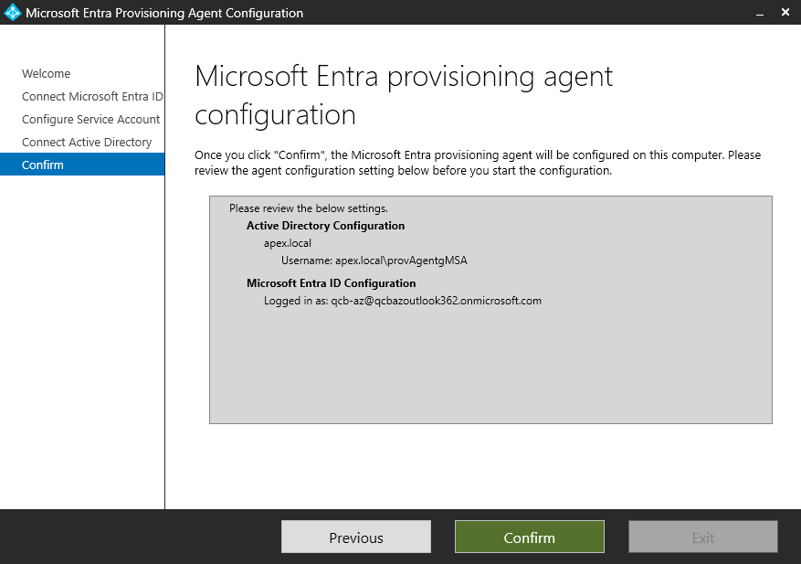
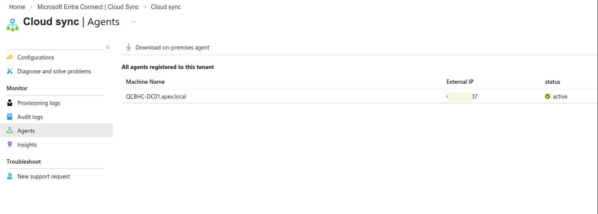
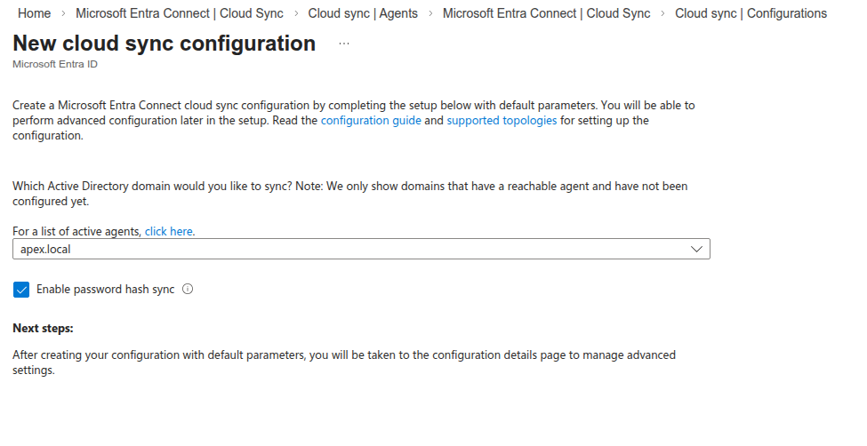
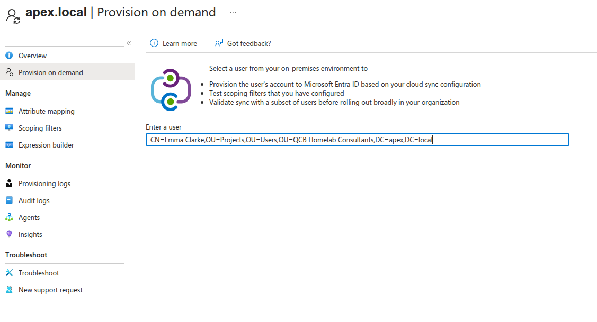

# 01a — Entra Cloud Sync

## In Plain English

Entra Cloud Sync is a lightweight agent installed on the on-premises server that bridges the local Active Directory and Microsoft 365. Once running, every user account in Active Directory is automatically mirrored into the cloud — staff can log in to Microsoft 365 with the same username and password they already use at work. Without this, every account would need to be created in the cloud by hand, one at a time.

## Why This Matters

QCB Homelab Consultants has 15 user accounts defined in Active Directory on QCBHC-DC01. Recreating them manually in Entra ID would introduce inconsistencies, waste time, and leave no repeatable process for future starters. Cloud Sync reads the existing accounts from `apex.local`, creates matching cloud identities in the `qcbhomelab.online` tenant, and keeps them in sync automatically. This is the foundation on which every subsequent workstream — email, file migration, device management, and security policy — depends.

---

## Key Decision: Cloud Sync vs Connect Sync

Microsoft offers two synchronisation paths. This decision is worth documenting for any real engagement.

**Connect Sync** is the original on-premises sync tool. It installs a full application including a local SQL Express database, suited to complex topologies — multiple forests, hybrid Exchange, AD FS, or custom attribute filtering. It is in maintenance rather than active development.

**Cloud Sync** is the next-generation tool. A lightweight provisioning agent is installed on the domain controller; all configuration is managed from the Entra admin centre. No local SQL dependency. Designed for organisations reducing their on-premises footprint.

**Cloud Sync was selected for this deployment.** QCB Homelab Consultants has a single forest, a single domain, no hybrid Exchange, no AD FS, and no complex topology. Cloud Sync is Microsoft's actively developed, forward-looking solution and the correct choice for any SME engagement starting today.

> For engagements with multiple forests, hybrid Exchange, or AD FS requirements, revisit this decision — those scenarios may still require Connect Sync.

---

## Prerequisites

| Requirement | Detail |
|---|---|
| Windows Server 2016 or later | This lab runs Server 2022 |
| Active Directory domain | `apex.local` |
| UPN suffix matching M365 tenant | `@qcbhomelab.online` |
| M365 tenant default domain verified | `qcbhomelab.online` |
| Global Admin account | `m365admin@qcbhomelab.online` |
| Installing account | Domain Admin or Enterprise Admin |
| Entra ID role | Hybrid Identity Administrator |
| No existing sync tool on the DC | Clean install confirmed |

> The provisioning agent must be installed on a domain-joined machine with line-of-sight to a Domain Controller. In this lab it is installed directly on QCBHC-DC01.

---

## Part 1 — Installation

### Step 1 — Download the Agent

From the Microsoft Entra portal ([https://entra.microsoft.com](https://entra.microsoft.com)), navigate to:

**Entra ID → Entra Connect → Cloud Sync → Agents**

Download the **Cloud Sync Agent** installer.

> 
>
> Entra portal — Cloud Sync agents blade

---

### Step 2 — Run the Installer

Run `AADConnectProvisioningAgentSetup.exe` on QCBHC-DC01 and accept the licence agreement.

> 
>
> Installer launch screen

---

### Step 3 — Provisioning Agent Configuration Wizard

The installer launches the provisioning agent configuration wizard, which handles all remaining setup steps.

> 
>
> Configuration wizard welcome screen

---

### Step 4 — Authenticate to Microsoft Entra ID

Enter the Entra ID Global Administrator credentials to register the agent against the tenant.

- **Username:** `m365admin@qcbhomelab.online`
- **Password:** *(not recorded)*

> 
>
> Entra ID authentication

---

### Step 5 — Configure the Service Account

Enter domain administrator credentials. The wizard uses these to create a **Group Managed Service Account (gMSA)** in Active Directory automatically. This account (`pGMSA_xxxxxxxx$`) is what the provisioning agent uses to read the directory — you do not create it manually.

- **Account:** `APEX\Administrator`
- **Password:** *(not recorded)*

> 
>
> Service account configuration

---

### Step 6 — Connect Active Directory

The wizard detects available Active Directory domains. Select `apex.local` to confirm it as the directory to synchronise.

> 
>
> Active Directory domain selection

---

### Step 7 — Installation Complete

The wizard confirms the agent is installed, registered, and running. Click **Exit**.

> 
>
> Installation complete

---

## Part 2 — Configuration

Installing the agent does not start synchronisation. Sync scope and attribute mapping are configured from the Entra portal — this is a deliberate design difference from Connect Sync.

### Step 8 — Confirm Agent Health in the Portal

Return to the Entra admin centre and navigate to **Entra Connect → Cloud Sync → Agents**.

Confirm the agent shows as **Healthy** before creating a configuration. If it shows as inactive, restart the `AADConnectProvisioningAgent` service on QCBHC-DC01 and wait 2 minutes.

> 
>
> Agent showing as Healthy in the portal

---

### Step 9 — Create a New Sync Configuration

Click **Configurations** in the left pane → **New configuration** → **AD to Microsoft Entra sync**.

> **Note:** The second option (Microsoft Entra ID to AD) runs in the opposite direction — do not select this.

> 
>
> New configuration — AD to Microsoft Entra sync

Configure the sync scope:

- **Domain:** `apex.local`
- **Scope:** All users — no OU filtering required (all 15 users are in scope)
- **Attribute mapping:** Accept defaults

> **Note:** If the domain does not appear in the list, restart the agent server and return to this step.

---

### Step 10 — Test Before Enabling (Recommended)

Before enabling full sync, use **Provision on demand** to do a dry run against a single user. This flags UPN mismatches, unsupported characters, or accounts that will not sync cleanly — before anything is written to Entra ID.

Enter the Distinguished Name of a test user, for example:

```
CN=Emma Clarke,OU=Projects,OU=Users,OU=QCB Homelab Consultants,DC=apex,DC=local
```

> 
>
> Provision on demand test

---

### Step 11 — Enable and Start Sync

Review the configuration summary and select **Enable**. Cloud Sync will begin its initial synchronisation cycle immediately.

> 
>
> Configuration enabled

---

### Validation

If the agent shows as **Healthy** and users appear in Entra ID within 5–10 minutes, the deployment is complete. Confirm the service is running on QCBHC-DC01:

```powershell
Get-Service -Name "AADConnectProvisioningAgent"
```

Expected: `Status: Running`

> 
>
> Sync confirmed in portal

---

### Troubleshooting — Provisioning Quarantine

In this lab environment, the agent entered quarantine immediately after installation. This section documents the investigation and findings.

### What Is Quarantine?

Entra ID quarantines a provisioning configuration when it detects a persistent error preventing sync from running reliably. The agent may show as **Active** in the agents panel while the provisioning configuration is simultaneously quarantined — these are two separate status indicators. Clearing quarantine without fixing the underlying cause will result in it re-entering quarantine within minutes.

---

### Diagnostic Tests

#### Check the Agent Is Running

```powershell
Get-Service -Name "AADConnectProvisioningAgent"
```

#### Test Required Endpoint Connectivity

```powershell
Test-NetConnection servicebus.windows.net -Port 443
Test-NetConnection servicebus.windows.net -Port 5671
Test-NetConnection login.microsoftonline.com -Port 443
Test-NetConnection management.azure.com -Port 443
```

| Endpoint | Port | Purpose |
|---|---|---|
| `servicebus.windows.net` | 443 | WebSocket signalling (primary) |
| `servicebus.windows.net` | 5671 | AMQP signalling (fallback) |
| `login.microsoftonline.com` | 443 | Authentication |
| `management.azure.com` | 443 | Azure management plane |

> **In this lab:** `login.microsoftonline.com` and `management.azure.com` passed. Both ports on `servicebus.windows.net` failed — the IP `65.55.54.16` was unreachable from the ISP.

#### Read the Agent Log

```powershell
$latestLog = Get-ChildItem "C:\ProgramData\Microsoft\Azure AD Connect Provisioning Agent\Trace\AzureADConnectProvisioningAgent_*.log" | 
    Sort-Object LastWriteTime -Descending | 
    Select-Object -First 1

Write-Host "Reading: $($latestLog.Name)"
Get-Content $latestLog.FullName -Tail 50
```

> **In this lab:** The log showed repeated `ServiceBusClientWebSocket was expecting more bytes` and `connection was forcibly closed by the remote host` errors, confirming ServiceBus as the specific failure point.

---

### Fix — Configure WebSocket Mode (Port 443 Only)

By default the agent uses AMQP on port 5671. If that port is blocked, configure the agent to use AMQP-over-WebSockets on port 443 instead:

```powershell
$configPath = "C:\Program Files\Microsoft Azure AD Connect Provisioning Agent\AADConnectProvisioningAgent.exe.config"

$xml = [xml](Get-Content $configPath)
$appSettings = $xml.configuration.appSettings
$newKey = $xml.CreateElement("add")
$newKey.SetAttribute("key", "ServiceBusConnectionMode")
$newKey.SetAttribute("value", "WebSocket")
$appSettings.AppendChild($newKey)
$xml.Save($configPath)

Restart-Service -Name "AADConnectProvisioningAgent"
Start-Sleep -Seconds 10
Get-Service -Name "AADConnectProvisioningAgent"
```

> **Note:** This setting survives agent re-registration but may need to be re-applied after a version upgrade.

> **In this lab:** The change was applied successfully but quarantine continued. Further investigation revealed an ISP-level block as the root cause.

---

### Root Cause — ISP-Level Block on `servicebus.windows.net`

`tracert` confirmed traffic to `65.55.54.16` was being dropped at the ISP's upstream router — not at the local firewall or domain controller:

```powershell
tracert 65.55.54.16
```

DNS queries to multiple resolvers confirmed `servicebus.windows.net` resolves to a single IP globally with no alternative:

```powershell
Resolve-DnsName servicebus.windows.net -Server 8.8.8.8
Resolve-DnsName servicebus.windows.net -Server 1.1.1.1
```

TLS verification confirmed the connection was being forcibly reset at the handshake level across multiple VPN exit nodes:

```powershell
$tc = New-Object System.Net.Sockets.TcpClient("servicebus.windows.net", 443)
$ssl = New-Object System.Net.Security.SslStream($tc.GetStream())
$ssl.AuthenticateAsClient("servicebus.windows.net")
Write-Host "Issuer: $($ssl.RemoteCertificate.Issuer)"
$ssl.Close()
$tc.Close()
```

For comparison, TLS to `outlook.office365.com` succeeded through the same VPN — confirming the block was specific to the ServiceBus IP range.

---

### Options for Resolution

| Option | Description | Suitable For |
|---|---|---|
| **Fix ISP routing** | Contact the ISP to unblock the `65.55.54.16` range | Production — the correct long-term fix |
| **Different internet connection** | Test on a mobile hotspot to confirm sync works outside the blocked network | Validation and lab testing |
| **VPN with clean exit IPs** | A paid VPN service on IP ranges not blocked by Microsoft | Lab environments where ISP cannot be changed |
| **Proceed without sync** | Create Entra ID accounts via CSV bulk import or PowerShell | Lab and portfolio use |

> **In this lab:** The ISP block could not be resolved. The project proceeded using direct account creation in Entra ID. The Cloud Sync configuration remains installed and correctly configured — it will function on a network without this restriction.

---

### Notes for Real Engagements

- Always run `Test-NetConnection servicebus.windows.net -Port 443` before beginning a Cloud Sync deployment. Resolve connectivity failures before installing the agent.
- The gMSA account (`pGMSA_xxxxxxxx$`) is created automatically during installation. Do not delete it.
- The `AADConnectProvisioningAgent.exe.config` WebSocket setting may need to be re-applied after agent upgrades.
- Quarantine status and agent health status are independent indicators — always check both in the portal.
- The DC's primary DNS should point to itself, not an external resolver:

```powershell
Set-DnsClientServerAddress -InterfaceAlias "Ethernet" -ServerAddresses "127.0.0.1","8.8.8.8"
```

---

## PowerShell Reference

Import the provisioning agent module:

```powershell
Import-Module "C:\Program Files\Microsoft Azure AD Connect Provisioning Agent\Microsoft.CloudSync.Powershell.dll"
Get-Command -Module Microsoft.CloudSync.Powershell
```

| Command | Description |
|---|---|
| `Get-AADCloudSyncADDomains` | Shows registered AD domains and service account details |
| `Add-AADCloudSyncADDomain` | Registers an additional AD domain |
| `Add-AADCloudSyncGMSA` | Configures or replaces the gMSA account |
| `Set-AADCloudSyncPermissions` | Sets required AD permissions for the gMSA |
| `Connect-AADCloudSyncAzureAD` | Authenticates to Entra ID |

---

## Summary

The Microsoft Entra Cloud Sync provisioning agent was installed on QCBHC-DC01 and registered against the `qcbhomelab.online` tenant. A sync configuration was created for `apex.local` covering all 15 users. Cloud Sync was selected over Connect Sync as the correct modern choice for a single-forest, cloud-first SME deployment.

In this lab environment, an ISP-level block on `servicebus.windows.net` prevented the agent from maintaining its WebSocket connection, causing persistent quarantine. The configuration is correct and will function on a network without this restriction. The project proceeds via direct identity creation in Entra ID.

---

[← Back to README](../README.md) &nbsp;|&nbsp; [Manual Identity Import →](/docs/01b-manual-identity-import.md)
