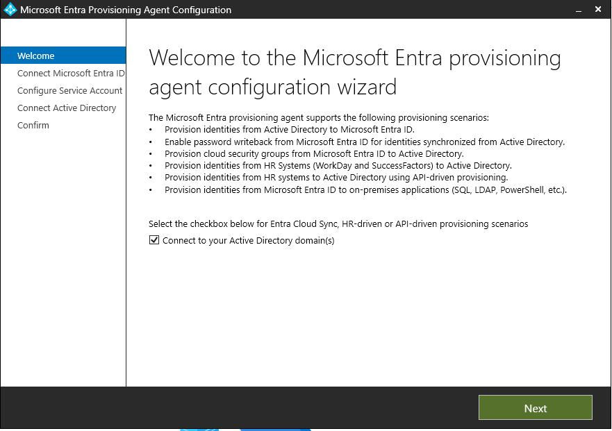
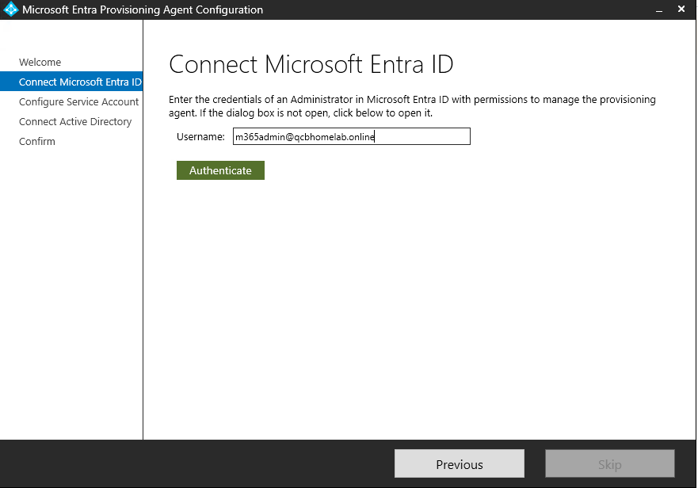
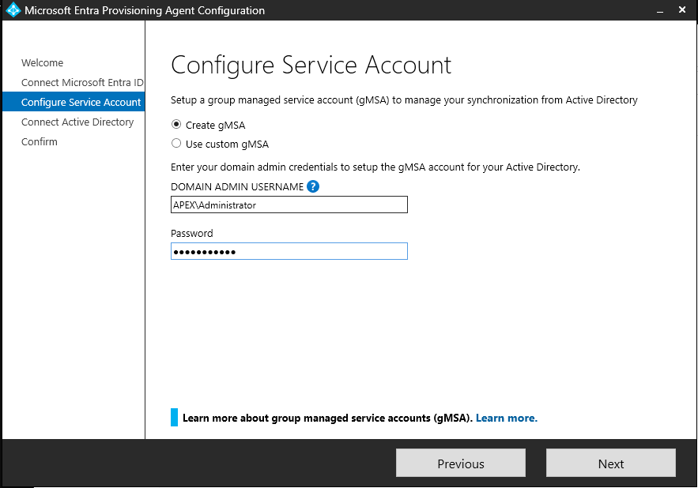
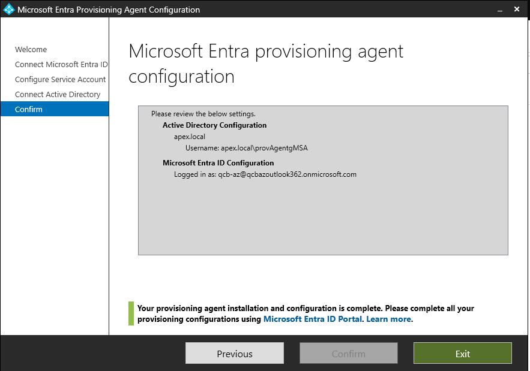
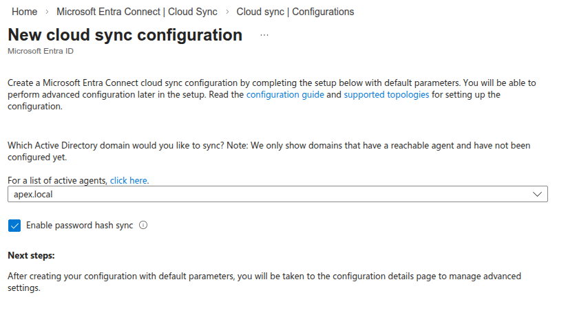

# 01a — Entra Cloud Sync Installation

## In Plain English

Entra Cloud Sync is a lightweight agent installed on the on-premises server that bridges the local Active Directory and Microsoft 365. Once running, every user account in Active Directory is automatically mirrored into the cloud — staff can log in to Microsoft 365 with the same username and password they already use at work. Without this, every account would need to be created in the cloud by hand, one at a time.

## Why This Matters

QCB Homelab Consultants has 15 user accounts already defined in Active Directory on QCBHC-DC01. Recreating them manually in Entra ID would introduce inconsistencies, waste time, and leave no repeatable process for future starters. Cloud Sync solves all three problems: it reads the existing accounts from `apex.local`, creates matching cloud identities in the `qcbhomelab.online` tenant, and keeps them in sync automatically thereafter. This is the foundation on which every subsequent workstream — email, file migration, device management, and security policy — depends.

## Prerequisites

| Requirement | Status |
|---|---|
| QCBHC-DC01 running Windows Server 2022 | ✅ Confirmed |
| Active Directory domain: `apex.local` | ✅ Confirmed |
| 15 user accounts with UPN suffix `@qcbhomelab.online` | ✅ Confirmed |
| M365 tenant `qcbhomelab.online` verified as default domain | ✅ Confirmed |
| Working admin account: `m365admin@qcbhomelab.online` | ✅ Confirmed |
| Access to Microsoft Entra admin centre to download agent | ✅ Required before starting |
| Domain Controller not running AD FS or existing sync tool | ✅ Confirmed — clean install |

> **Note:** The provisioning agent must be installed on a domain-joined machine with line-of-sight to a Domain Controller. In this lab, it is installed directly on QCBHC-DC01.

---

## Key Decision: Cloud Sync vs Connect Sync

Microsoft offers two synchronisation paths. This decision is worth documenting for any real engagement.

### Connect Sync

The original on-premises sync tool. Installs a full application on the domain controller, including a local SQL Express database. Suited to complex topologies — multiple forests, hybrid Exchange deployments, AD FS federation, or custom attribute filtering. Microsoft has stopped releasing new versions to the Download Centre; updates are now available only via the Entra portal. It is in maintenance rather than active development.

### Cloud Sync

The next-generation synchronisation tool. Installs a lightweight provisioning agent on the domain controller; all configuration is managed from the Entra admin centre rather than a local wizard. No local SQL dependency. Designed for organisations reducing their on-premises footprint and building cloud-first.

### Decision for This Deployment

**Cloud Sync was selected.** Microsoft's own guidance describes Connect Sync as the solution for organisations that "rely on their on-premises infrastructure to manage their business" — the opposite of what this project is doing. Cloud Sync is described as the right choice for organisations pursuing a "cloud first strategy" looking to "reduce the on-premises footprint." That is precisely the brief.

QCB Homelab Consultants has a single forest (`apex.local`), a single domain, no hybrid Exchange, no AD FS, and no complex topology. There is no justification for the additional overhead of Connect Sync. Cloud Sync is the current, actively developed solution and the correct choice for any SME engagement starting today.

> For engagements with multiple forests, hybrid Exchange, or AD FS requirements, revisit this decision. Those scenarios may still require Connect Sync.

---

## Installation Procedure

### Step 1 — Launch the Installer

Run `AADConnectProvisioningAgentSetup.exe` on QCBHC-DC01. 

Accept the licence agreement to proceed.

> **Screenshot:**
> 
> 
> 
> Installer launch screen with licence agreement

---

### Step 2 — Provisioning Agent Configuration Wizard

The installer launches the provisioning agent configuration wizard. 

This wizard handles all remaining installation steps.

> **Screenshot:** 
> 
> 
> 
> Provisioning agent configuration wizard welcome screen

---

### Step 3 — Connect to Microsoft Entra ID

Enter the Entra ID Global Administrator credentials to register the agent against the tenant.

- **Username:** `m365admin@qcbhomelab.online`
- **Password:** *(credentials not recorded in documentation)*

> **Screenshot:** 
> 


Entra ID credential entry and authentication

---

### Step 4 — Configure Service Account

Enter domain administrator credentials. 

The wizard uses these to create a service account in Active Directory that the provisioning agent will use to read the directory.

- **Account:** `APEX\Administrator`
- **Password:** *(credentials not recorded in documentation)*



Service account configuration with domain admin credentials

---

### Step 5 — Connect Active Directory

The wizard presents the detected Active Directory domains. 

Select `apex.local` to confirm it as the directory to synchronise.

> **Screenshot:**
> 
> 
> 
> Active Directory domain selection showing apex.local

---

### Step 6 — Installation Complete

The wizard confirms the agent is installed, registered, and running.

> **Screenshot:**
> 
> 
> 
>  — Installation complete confirmation screen
---

## Post-Installation Configuration

Installing the agent does not start synchronisation. The sync scope — which OUs to sync, which attributes to include — is configured from the Entra portal, not the server. This is a deliberate design difference from Connect Sync.

### Step 7 — Configure a Sync Configuration in the Entra Portal

Return to the Entra admin centre:

**Identity → Hybrid management → Microsoft Entra Connect → Cloud Sync**

The newly registered agent will appear under **Agents**. 

Confirm it shows as **Healthy** before proceeding.

> **Screenshot:**
> 
> 
> 
> Entra portal showing provisioning agent as Healthy

Select **New configuration** and choose **Microsoft Entra ID sync (formerly Azure Active Directory)**.

---

### Step 8 — Define the Sync Scope

Configure the sync scope for the `apex.local` domain:

- **Domain:** `apex.local`
- **Scope:** All users — no OU filtering required for this deployment (all 15 users are in scope)
- **Attribute mapping:** Accept defaults

> **Screenshot:**
> 
> 
> 
> Sync scope configuration showing apex.local in scope

---

### Step 9 — Enable and Start Sync

Review the configuration summary and select **Enable**. Cloud Sync will begin its initial synchronisation cycle immediately.

> **Screenshot:**
> 
> 
> 
> Configuration enabled confirmation in Entra portal

---

## Post-Installation Checks

### Confirm Agent Health

In the Entra admin centre under Cloud Sync, confirm:

| Item | Expected State |
|---|---|
| Provisioning agent | Healthy |
| Last sync | Completed without errors |
| Sync status | Active |

> **Screenshot:**
> 
> 
> 
> Portal showing healthy agent and completed initial sync

### Confirm Service Running on QCBHC-DC01

On the domain controller, open **Services** (`services.msc`) and confirm:

| Service | Expected State |
|---|---|
| Microsoft Azure AD Connect Provisioning Agent | Running |
```powershell
# PowerShell alternative
Get-Service -Name "AADConnectProvisioningAgent"
```

> **Screenshot:**
> 
> 
> 
> Services console showing agent as Running

---

## Validation

| Check | Expected Result |
|---|---|
| Provisioning agent installed on QCBHC-DC01 | ✅ Service status: Running |
| Agent registered and healthy in Entra portal | ✅ Shown as Healthy |
| Sync configuration created for apex.local | ✅ Configuration active |
| Initial sync cycle completed | ✅ No errors reported |
| UPN suffix `@qcbhomelab.online` resolved correctly | ✅ No UPN mismatch warnings |

---

## Summary

The Microsoft Entra Cloud Sync provisioning agent has been installed on QCBHC-DC01 and registered against the `qcbhomelab.online` tenant. A sync configuration has been created for the `apex.local` domain covering all 15 users. The initial synchronisation cycle has completed.

Cloud Sync was selected over Connect Sync deliberately. This is a cloud-first migration project for an SME with a single forest and single domain. Cloud Sync is Microsoft's actively developed, forward-looking solution and the correct choice for any new deployment at this scale. Connect Sync was evaluated and rejected as the legacy, higher-overhead option.

**This enables:** Sync verification (01b), group creation and licence assignment (01d), and all downstream workstreams that require cloud identities to exist before proceeding.

**Next page:** [01b — Entra Connect Sync Verification](./01b-entra-connect-sync-verification.md)