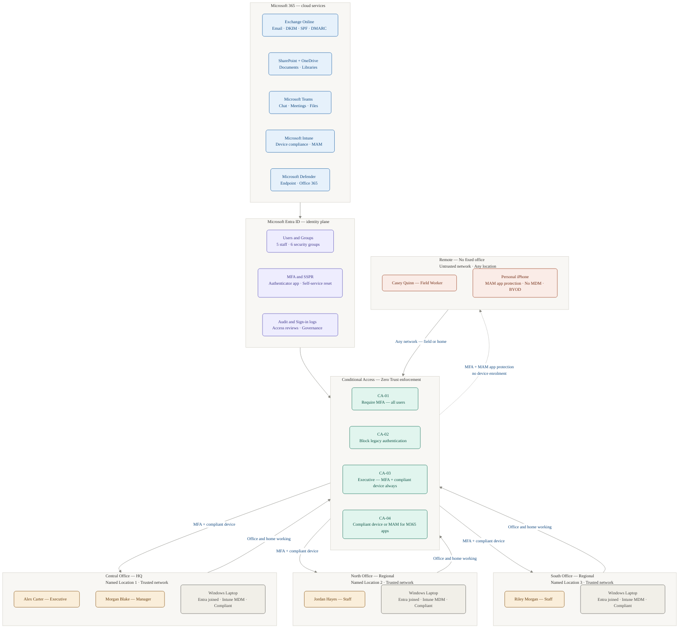

# QCB Homelab Consultants — Microsoft 365 Business Premium Deployment

## What This Project Is

This is a complete, end-to-end deployment of Microsoft 365 Business Premium for a fictional multi-sector consultancy called **QCB Homelab Consultants**. It was built as a hands-on technical project to demonstrate real-world skills in cloud identity, device management, security, and collaboration — using a live Microsoft 365 tenant, real physical devices, and genuine configuration decisions.

Every workstream in this project was implemented, tested, and documented from scratch. This is not a theoretical exercise — it is a working environment.

---

## Why This Project Exists

Modern organisations are moving away from on-premises infrastructure toward cloud-first models. The skills required to build, secure, and manage that environment — Microsoft Entra ID, Intune, Exchange Online, SharePoint, Teams, and Defender — are in high demand across every sector.

This project demonstrates the ability to:

- Design a cloud identity platform from first principles
- Implement security controls that protect a distributed, multi-site workforce
- Manage physical devices without on-premises infrastructure
- Configure collaboration tools that replace fragmented legacy systems
- Document every decision clearly enough for a colleague, client, or auditor to follow

Every section explains not just what was done, but why — what problem it solves, what would happen without it, and what trade-offs were made.

---

## The Company

**QCB Homelab Consultants** is a fictional multi-sector professional services firm operating across three office locations with a distributed workforce. The company has no on-premises server infrastructure — all services are delivered from the cloud. Staff work from their assigned office, from home, or from client sites, using a mix of corporate-managed laptops and personal mobile devices.

| Detail | Value |
|---|---|
| Company name | QCB Homelab Consultants |
| Domain | qcbhomelab.online |
| Infrastructure model | 100% cloud — no on-premises servers |
| Microsoft 365 licence | Business Premium (25 seats) |
| Locations | 3 offices + distributed remote workers |
| Staff | 5 users across 3 role types |
| Devices | Corporate Windows laptop + personal iPhone (BYOD) |

---

## Office Locations

| Location | Role | Conditional Access |
|---|---|---|
| Central Office | Headquarters | Named Location 1 — trusted |
| North Office | Regional office | Named Location 2 — trusted |
| South Office | Regional office | Named Location 3 — trusted |
| Remote | No fixed office — field worker | Untrusted — any network |

All staff can work from their assigned office **or from home**. Home working uses an untrusted network — MFA fires regardless of location. Named locations represent physical office networks only and are used for context, not to bypass security controls.

---

## The 5 Users

| Name | Role | Home Office | Device | Access Profile |
|---|---|---|---|---|
| Alex Carter | Executive | Central Office | Corporate Windows laptop | Strictest — MFA always, compliant device always, no location exceptions |
| Morgan Blake | Manager | Central Office | Corporate Windows laptop | Standard — MFA required, compliant device for M365 apps |
| Jordan Hayes | Staff | North Office | Corporate Windows laptop | Standard — MFA required, compliant device for M365 apps |
| Riley Morgan | Staff | South Office | Corporate Windows laptop | Standard — MFA required, compliant device for M365 apps |
| Casey Quinn | Field Worker | Remote — no fixed office | Personal iPhone (BYOD) | MAM app protection only — no full device enrolment |

---

## Architecture Overview



> **Reading the diagram:** Data flows top to bottom — from cloud services, through identity, through security enforcement, down to users and devices. Solid arrows represent standard managed access (MFA + compliant device). The dashed arrow represents BYOD access (MFA + MAM app protection, no device enrolment). The return arrows from each location back to Conditional Access represent every authentication request being evaluated in real time — whether the user is in the office or working from home.

---

## Key Design Decisions

**Cloud-only identity.** There is no on-premises Active Directory. All users exist natively in Microsoft Entra ID. This eliminates the complexity and maintenance overhead of hybrid identity and is the correct approach for a greenfield cloud deployment.

**Three named locations — context, not exemption.** Each office network is registered as a trusted named location in Conditional Access. This reflects the multi-site reality of the organisation. Importantly, being on a trusted network does not bypass MFA — named locations are used to provide context for access decisions, not to grant implicit trust.

**Home working is untrusted by design.** Staff can work from home freely. Home networks are not registered as trusted locations — they should not be, because a home broadband connection offers no security guarantees. MFA handles this correctly: the user proves their identity regardless of where they are connecting from.

**Conditional Access over Security Defaults.** Microsoft 365 ships with Security Defaults — a basic protection suitable for organisations with no IT resource. This project replaces them with Conditional Access policies, which provide precise, targetable, auditable control over every access decision.

**Zero Trust security model.** No user or device is trusted by default, regardless of location. Every access request is evaluated against identity (who are you?), device (is your device compliant?), and context (does this request make sense?).

**MAM without enrolment for personal devices.** The field worker uses a personal iPhone. MAM without enrolment protects corporate data inside Outlook and Teams without touching anything else on the device — the correct, proportionate approach to BYOD.

**DMARC at p=quarantine.** Emails failing authentication are quarantined rather than delivered — actively protecting the domain rather than just monitoring it.

---

## What Was Built

```
Microsoft 365 Business Premium Tenant
│
├── Identity & Access (Microsoft Entra ID)
│   ├── 5 staff users + 2 dedicated admin accounts
│   ├── 6 security groups per role type
│   ├── 4 Conditional Access policies
│   ├── 3 named locations (one per office)
│   ├── MFA enforced via Conditional Access
│   └── Self-Service Password Reset (SSPR)
│
├── Communication & Collaboration
│   ├── Exchange Online — mailboxes, shared mailbox, transport rules
│   ├── Email authentication — DKIM, SPF, DMARC (p=quarantine)
│   ├── SharePoint Online — team site, 4 document libraries
│   └── Microsoft Teams — department structure, SharePoint integration
│
├── Device Management (Microsoft Intune)
│   ├── Windows compliance policy — BitLocker, screen lock, OS version
│   ├── Security baseline profile — 150+ hardened settings
│   ├── Windows Update for Business — Pilot and Production rings
│   ├── Corporate Windows laptop — Entra joined, Intune managed
│   └── Personal iPhone — MAM app protection (BYOD, no MDM)
│
└── Security
    ├── Defender for Business — endpoint detection and response
    ├── Defender for Office 365 — Safe Links, Safe Attachments
    ├── Anti-phishing — executive impersonation protection
    ├── Access reviews — Executives group, monthly
    └── Audit log and sign-in log monitoring
```

---

## Document Index

| # | Document | What It Covers |
|---|---|---|
| 00 | [Company & Design](./docs/00-company-and-design.md) | Scenario, locations, users, groups, naming conventions, design decisions |
| 01 | [Identity & Entra ID](./docs/01-identity-and-entra-id.md) | Tenant setup, admin accounts, users, licences, security groups |
| 02 | [Conditional Access](./docs/02-conditional-access.md) | 4 CA policies, 3 named locations, MFA enforcement |
| 03 | [MFA & SSPR](./docs/03-mfa-and-sspr.md) | MFA via CA, Self-Service Password Reset, authentication methods |
| 04 | [Exchange Online](./docs/04-exchange-online.md) | Mailboxes, shared mailbox, transport rules, DKIM, SPF, DMARC |
| 05 | [SharePoint & OneDrive](./docs/05-sharepoint-and-onedrive.md) | Team site, document libraries, permissions, external sharing |
| 06 | [Microsoft Teams](./docs/06-microsoft-teams.md) | Team structure, channels, SharePoint tabs, policies |
| 07 | [Intune — Windows](./docs/07-intune-windows.md) | Compliance policy, security baseline, update rings, device enrolment |
| 08 | [Intune — iOS MAM](./docs/08-intune-ios-mam.md) | App protection policy, BYOD, MAM without enrolment |
| 09 | [Defender for Business](./docs/09-defender-for-business.md) | Endpoint protection, onboarding, ASR rules, threat dashboard |
| 10 | [Defender for Office 365](./docs/10-defender-for-office365.md) | Safe Links, Safe Attachments, anti-phishing |
| 11 | [Security Posture](./docs/11-security-posture-summary.md) | Zero Trust summary, before/after, remaining gaps |
| 12 | [Access Governance](./docs/12-access-governance.md) | Access reviews, audit logs, sign-in monitoring |
| 13 | [Lessons Learned](./docs/13-lessons-learned.md) | Reflection, lab vs production, what comes next |
| — | [Runbook: Onboarding](./runbooks/runbook-user-onboarding.md) | Step-by-step new starter procedure |
| — | [Runbook: Offboarding](./runbooks/runbook-user-offboarding.md) | Step-by-step leaver procedure |

---

## Technologies Used

| Technology | Purpose |
|---|---|
| Microsoft Entra ID | Cloud identity — users, groups, authentication, access governance |
| Microsoft Intune | Device management — compliance, configuration, app protection |
| Exchange Online | Business email with enterprise-grade security |
| SharePoint Online | Document management and team collaboration |
| Microsoft Teams | Communication, meetings, and file collaboration |
| Microsoft Defender for Business | Endpoint detection and response |
| Microsoft Defender for Office 365 | Email and link protection |
| Microsoft Purview (Audit) | Compliance logging and monitoring |
| Cloudflare DNS | External DNS — MX, SPF, DKIM, DMARC, Intune CNAMEs |

---

## How to Follow This Project

This project is designed to be followed by anyone with a Microsoft 365 Business Premium tenant. Each workstream document follows the same structure:

1. **In plain English** — what this technology does, without jargon
2. **Why it matters** — the business problem it solves
3. **Prerequisites** — what must be in place before starting
4. **Implementation** — step-by-step configuration with decision reasoning
5. **Validation** — how to confirm everything is working
6. **Summary** — what was delivered and what comes next

Start at `00-company-and-design.md` and work through in order. The sequence is deliberate — identity must come before licensing, licensing before Conditional Access, device compliance before enforcing CA-04.

---

*Built on Microsoft 365 Business Premium. Domain: qcbhomelab.online.*
*All users, company names, and scenarios are fictional and designed to be universally applicable.*
